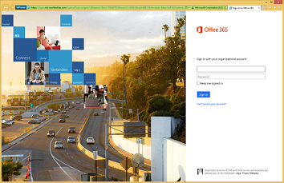

# 步驟 5：簡化使用者的存取權Step 5: Simplify access for users

## 簡化密碼更新Simplify password updates

*此為混合式環境的選用步驟，且同時適用於 Microsoft 365 企業版 E3 和 E5 版本**This step is optional for hybrid environments and applies to both the E3 and E5 versions of Microsoft 365 Enterprise*

在這一節中，您會允許使用者透過 Azure Active Directory (Azure AD) 重設其密碼，然後複製到本機 Active Directory 網域服務 (AD DS)。In this section, you'll allow users to reset their passwords through Azure Active Directory (Azure AD), which is then replicated to your local Active Directory Domain Services (AD DS). 這個程序也稱為密碼回寫。This process is known as password writeback. 使用密碼回寫，使用者不需要透過使用者帳戶與其屬性儲存在其中的內部部署 Active Directory Domain Services (AD DS) 來更新其密碼。With password writeback, users don’t need to update their passwords through the on-premises Active Directory Domain Services (AD DS) where user accounts and their attributes are stored. 對於沒有內部部署網路遠端存取連線的漫遊或遠端使用者而言，這非常有用。This is valuable to roaming or remote users who do not have a remote access connection to the on-premises network.

為了充分利用 Identity Protection 功能 (例如當偵測到高風險的帳戶洩露時，要求使用者變更其內部部署密碼)，需要密碼回寫。Password writeback is required to fully utilize Identity Protection feature capabilities, such as requiring users to change their on-premises passwords when there has been a high risk of account compromise detected.

如需詳細資訊和設定指示，請參閱 [Azure AD SSPR 密碼回寫](https://docs.microsoft.com/azure/active-directory/active-directory-passwords-writeback)。For additional information and configuration instructions, see [Azure AD SSPR with password writeback](https://docs.microsoft.com/azure/active-directory/active-directory-passwords-writeback).

>[!Note]
>升級至最新版的 Azure AD Connect，以確保在新版本發行後能夠使用新功能並獲得最佳體驗。如需詳細資訊，請參閱 [Azure AD Connect 的自訂安裝](https://docs.microsoft.com/azure/active-directory/connect/active-directory-aadconnect-get-started-custom)。Upgrade to the latest version of Azure AD Connect to ensure the best possible experience and new features as they are released. For more information, see [Custom installation of Azure AD Connect](https://docs.microsoft.com/azure/active-directory/connect/active-directory-aadconnect-get-started-custom).
>

|||
|:-------|:-----|
|| [測試實驗室指南：密碼回寫Test Lab Guide: Password reset](password-writeback-m365-ent-test-environment.md) |
|||

作為過渡期的檢查點，您可以看到這一節的[允出準則](identity-exit-criteria.md#crit-identity-pw-writeback)。As an interim checkpoint, you can see the [exit criteria](identity-exit-criteria.md#crit-identity-pw-writeback) for this step.

## 簡化密碼重設Simplify password resets

*此為選用步驟，且同時適用於 Microsoft 365 企業版 E3 和 E5 版本**This step is optional and applies to both the E3 and E5 versions of Microsoft 365 Enterprise*

在這一節中，您會啟用自助密碼重設 (SSPR)，允許使用者重設或解除鎖定其密碼或帳戶。In this section, you'll enable self-service password reset (SSPR) to allow users to reset or unlock their passwords or accounts. 您可以使用詳細的報告來追蹤使用者何時存取系統，以及使用通知來警示誤用或濫用。In this step, you'll enable self-service password reset (SSPR) to allow users to reset or unlock their passwords or accounts. To alert you to misuse or abuse, you can use the detailed reporting that tracks when users access the system, along with notifications. 您必須先啟用密碼回寫，才可以部署密碼重設。You must enable password writeback before you can deploy password resets.

請參閱[推出密碼重設的指示](https://docs.microsoft.com/azure/active-directory/authentication/howto-sspr-deployment)。See the [instructions to enable password reset](https://docs.microsoft.com/azure/active-directory/authentication/howto-sspr-deployment).

|||
|:-------|:-----|
|| [測試實驗室指南：密碼重設Test Lab Guide: Password reset](password-reset-m365-ent-test-environment.md) |
|||

作為過渡期的檢查點，您可以看到這一節的[允出準則](identity-exit-criteria.md#crit-identity-pw-reset)。As an interim checkpoint, you can see the [exit criteria](identity-exit-criteria.md#crit-identity-pw-reset) for this step.

## 簡化使用者登入Simplify user sign-in

*此為混合式環境的選用步驟，且同時適用於 Microsoft 365 企業版 E3 和 E5 版本**This step is optional for hybrid environments and applies to both the E3 and E5 versions of Microsoft 365 Enterprise*

在這一節中，您將會設定 Azure Active Directory 無縫單一登入 (Azure AD 無縫 SSO)，讓使用者可登入使用 Azure AD 使用者帳戶的服務，而不需要輸入密碼，以及在許多情況下不需輸入使用者名稱。In this step, you'll set up Azure Active Directory Seamless Single Sign-On (Azure AD Seamless SSO) to allow your users to sign in to services that use Azure AD user accounts without having to type in their passwords, and in many cases, their usernames. This gives your users easier access to cloud-based applications, such as Office 365, without needing any additional on-premises components such as identity federation servers. 這可讓使用者更容易存取以雲端為基礎的應用程式，例如 Office 365，而不需要任何額外的內部部署元件，例如身分識別同盟伺服器。This gives your users easier access to cloud-based applications, such as Office 365, without needing any additional on-premises components such as identity federation servers.

您可以使用 Azure AD Connect 工具設定 Azure AD 無縫 SSO。You'll configure Azure AD Seamless SSO with the Azure AD Connect tool.

請參閱[設定 Azure AD 無縫 SSO 的指示](https://docs.microsoft.com/azure/active-directory/connect/active-directory-aadconnect-sso-quick-start)。See the [instructions to configure Azure AD Seamless SSO](https://docs.microsoft.com/azure/active-directory/connect/active-directory-aadconnect-sso-quick-start).

|||
|:-------|:-----|
|| [測試實驗室指南：Azure AD 無縫單一登入Test Lab Guide: Azure AD Seamless Single Sign-on](single-sign-on-m365-ent-test-environment.md) |
|||

作為過渡期的檢查點，您可以看到這一節的[允出準則](identity-exit-criteria.md#crit-identity-sso)。As an interim checkpoint, you can see the [exit criteria](identity-exit-criteria.md#crit-identity-sso) for this step.

## 自訂 Office 365 登入頁面Customize the Office 365 sign-in page

*此為選用步驟，且同時適用於 Microsoft 365 企業版 E3 和 E5 版本**This step is optional and for both the E3 and E5 versions of Microsoft 365 Enterprise*

在這一節中，您將會新增公司的名稱、標誌和其他辨識項目，藉此協助使用者辨識組織的登入頁面。In this step, you'll help users recognize your organization’s sign-in page by adding your company name, logo, and other recognizable elements. 

使用 Microsoft 365 企業版，您可以自訂登入和存取面板頁面的外觀，讓頁面中出現公司的標誌、色彩配置和自訂的使用者資訊。With Microsoft 365 Enterprise, you can customize the appearance of the sign-in and Access Panel pages so they include your company logo, color schemes, and custom user information. 

自訂之前\*\*，當使用者嘗試從裝置登入時，會看見類似下列範例的 Office 365 登入頁面。When a user attempts to sign in from a device, they see something like the following example on the Office 365 sign-in page *before customization*.

自訂之後\*\*，同一位 Contoso 公司使用者會看到以下頁面。And here is what the same user of the Contoso Corporation would see *after customization*.

如需詳細資訊，請參閱[將公司商標新增至 Office 365 登入頁面](https://docs.microsoft.com/office365/admin/setup/customize-sign-in-page)。For more information, see [Add your company branding to Office 365 Sign In page](https://docs.microsoft.com/office365/admin/setup/customize-sign-in-page).

如需設定的指示，請參閱[將公司商標新增至登入和存取面板頁面](http://aka.ms/aadpaddbranding)。For configuration instructions, see [Add company branding to your sign-in and Access Panel pages](http://aka.ms/aadpaddbranding).

作為過渡期的檢查點，您可以看到這一節的[允出準則](identity-exit-criteria.md#crit-identity-custom-sign-in)。As an interim checkpoint, you can see the [exit criteria](identity-exit-criteria.md#crit-identity-custom-sign-in) for this step.

## 下一步Next step

|||
|:-------|:-----|
|| [使用群組更輕鬆地進行管理Use groups for easier management](identity-self-service-group-management.md) |

