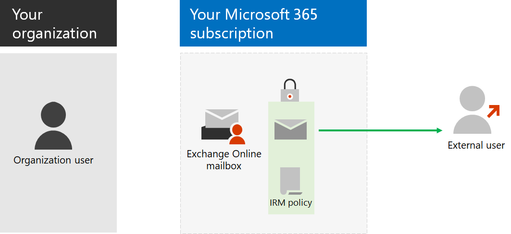

# 步驟 6：設定電子郵件加密Step 6: Configure email encryption

*此為選用步驟，且同時適用於 Microsoft 365 企業版 E3 和 E5 版本**This step is optional and applies to both the E3 and E5 versions of Microsoft 365 Enterprise*

有三種類型的 Microsoft 365 中的電子郵件加密。There are three types of email encryption in Microsoft 365.

|||
|:-------|:-----|
| Office 郵件加密 (OME)Office Message Encryption (OME) | Exchange Online 傳送組織外部的電子郵件加密。Encryption for Exchange Online email sent outside your organization. |
| 資訊版權管理 (IRM)Information Rights Management (IRM) | 加密和權限會對電子郵件。Encryption and permissions that travel with the email. |
| Secure/Multipurpose Internet Mail Extensions (S/MIME)Secure/Multipurpose Internet Mail Extensions (S/MIME) | 加密及數位簽章的電子郵件保護。Email protection with encryption and digital signatures. |
|||

## Office 365 郵件加密Office 365 Message Encryption

OME，與您的組織可以傳送和接收您組織內部和外部的人員之間的加密的電子郵件訊息。With OME, your organization can send and receive encrypted email messages between people inside and outside your organization. OME 適用於 Outlook.com、 yahoo ！、 Gmail，以及其他電子郵件服務。OME works with Outlook.com, Yahoo!, Gmail, and other email services. 電子郵件訊息加密有助於確保只有預定的收件者可以檢視郵件。Email message encryption helps ensure that only intended recipients can view the message.

您設定定義加密條件的傳輸規則。You set up transport rules that define the conditions for encryption. 當使用者傳送的郵件符合某規則時，會自動套用加密。When a user sends a message that matches a rule, encryption is applied automatically.

若要檢視加密的郵件，收件者可以取得一次性密碼，登入 Microsoft 帳戶或登入公司或學校帳戶與 Microsoft 365 相關聯。To view encrypted messages, recipients can either get a one-time passcode, sign in with a Microsoft account, or sign in with a work or school account associated with Microsoft 365. 收件者也可以傳送加密的回覆。Recipients can also send encrypted replies. 則不需要自己 Microsoft 365 訂用帳戶檢視加密的郵件，或傳送加密的回覆。They don't need their own Microsoft 365 subscription to view encrypted messages or send encrypted replies.

如需詳細資訊，請參閱〈[Office 365 郵件加密](https://docs.microsoft.com/Office365/SecurityCompliance/ome)〉。For more information, see [Office 365 Message Encryption](https://docs.microsoft.com/Office365/SecurityCompliance/ome).

## IRMIRM

Microsoft 365 中的 IRM 可協助您保護您的資訊與其他加密，並藉由套用智慧型原則，指定誰具有存取他們可以執行的動作。IRM in Microsoft 365 helps you secure your information with additional encryption and by applying an intelligent policy that specifies who has access what they can do. 電子郵件訊息，您可以使用 IRM 進行加密，並將流量限制套用。For email messages, you can use IRM for encryption and to apply usage restrictions. 例如，您可以指定某些收件者有管理電子郵件的所有功能，而且某些不都具有列印或轉寄電子郵件的能力。For example, you can specify that some recipients have all abilities to manage the email and some do not have the ability to print or forward the email. 

IRM 原則設定 Microsoft 365 內，且可以套用至文件中的 SharePoint Online 和電子郵件訊息。IRM policies are configured within Microsoft 365 and can apply to documents in SharePoint Online and email messages. 受 IRM 保護的電子郵件包含套用的原則設定套用和跟隨它。An IRM-protected email includes the applied policy settings applied and travel with it. 

當收件者開啟電子郵件與包含的原則時，可用來將郵件解密，並判斷收件者可以如何使用它的原則設定。When the recipient opens the email with the included policy, the policy settings are used to decrypt the message and determine what the recipient can do with it. 

如需詳細資訊，請參閱〈[Exchange Online 中的資訊版權管理]( https://docs.microsoft.com/office365/SecurityCompliance/information-rights-management-in-exchange-online)〉。For more information, see [Information Rights Management in Exchange Online]( https://docs.microsoft.com/office365/SecurityCompliance/information-rights-management-in-exchange-online).

## S/MIMES/MIME

S/MIME 是一種數位憑證型電子郵件型保護解決方案，可讓您同時加密，並以數位方式簽署郵件時。S/MIME is a digital certificate-based email-based protection solution that allows you to both encrypt and digitally sign a message. 郵件加密有助於確保只有預定的收件者可以開啟並閱讀郵件。The message encryption helps ensure that only the intended recipient can open and read the message. 數位簽章可協助收件者驗證寄件者的身分識別，並判斷該寄件者無法傳送它。A digital signature helps the recipient validate the identity of the sender and determine that only the sender could have sent it.

S/MIME 可用於電子郵件至您的 Microsoft 365 訂閱中的其他信箱或外部的使用者。S/MIME can be used for email to other mailboxes in your Microsoft 365 subscription or to external users.
郵件加密及數位簽章之所以可行，透過包含公用和私人索引鍵加密或解密訊息，以及建立和驗證數位簽章的數位憑證。Both message encryption and digital signatures are made possible through the use of digital certificates that contain the public and private keys for encrypting or decrypting messages and creating and verifying digital signatures.
若要使用 S/MIME，您必須擁有公開金鑰每個收件者。To use S/MIME, you must have the public keys for each recipient. 收件者維護自己私用的機碼，必須保持安全。Recipients maintain their own private keys, which must remain secure. 如果危害您的私密金鑰，您需要取得新的數位憑證，並重新分散到所有可能的寄件者的公開金鑰。If your private key is compromised, you need to get a new digital certificate and redistribute public keys to all potential senders.

如需詳細資訊，請參閱[為郵件簽章和加密的 S/MIME](https://docs.microsoft.com/Exchange/policy-and-compliance/smime)。For more information, see [S/MIME for message signing and encryption](https://docs.microsoft.com/Exchange/policy-and-compliance/smime).

作為過渡期的檢查點，您可以看到與此步驟相對應的[允出準則](infoprotect-exit-criteria.md#crit-infoprotect-step6)。As an interim checkpoint, see the [exit criteria](infoprotect-exit-criteria.md#crit-infoprotect-step6) corresponding to this step.

## 下一步Next step

|||
|:-------|:-----|
||[設定 Office 365 的特殊權限存取管理Configure privileged access management for Office 365](infoprotect-configure-privileged-access-management.md)|
