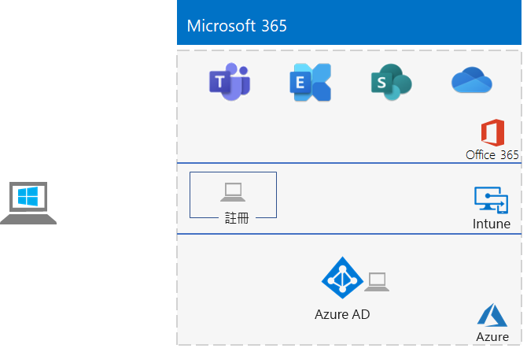

# <a name="the-lightweight-base-configuration"></a>輕量型基本組態

*此測試實驗室指南可用於 enterprise 和 Office 365 企業測試環境的 Microsoft 365。*

本文提供建立具備 Microsoft 365 E5 訂閱與執行 Windows 10 企業版電腦的簡化環境的逐步指示。 



使用所產生的環境來測試 [Microsoft 365 for enterprise](https://www.microsoft.com/microsoft-365/enterprise)的功能。


  
> [!TIP]
> 針對企業測試實驗室指南堆疊365中的所有文章，按一下 [ [microsoft 365 for Enterprise Test Lab guide] 堆疊](../media/m365-enterprise-test-lab-guides/Microsoft365EnterpriseTLGStack.pdf) ，以取得視覺地圖。

## <a name="phase-1-create-your-microsoft-365-e5-subscription"></a>階段1：建立您的 Microsoft 365 E5 訂閱

我們從 Microsoft 365 E5 試用訂閱開始，然後新增 Microsoft 365 E5 訂閱給它。

若要開始 Microsoft 365 E5 試用版訂閱，您需要虛構的公司名稱和新 Microsoft 帳戶。
  
1. 我們建議您使用公司名稱 Contoso 的變種作為公司名稱，也就是 Microsoft 範例內容中使用的虛構公司，但此為非必要的動作。在此處記錄您虛構公司名稱： 
    
2. 若要註冊新 Microsoft 帳戶，請移至 [https://outlook.com ](https://outlook.com)，並使用新電子郵件帳戶以及地址建立帳戶。您會使用這個帳戶來登入 Office 365。
    
  - 在此處記錄您新帳戶的名字和姓氏： 
    
  - 在此處記錄新電子郵件帳戶地址： @outlook.com
    
### <a name="sign-up-for-an-office-365-e5-trial-subscription"></a>註冊 Office 365 E5 試用訂閱

1. 在您的電腦上開啟網際網路瀏覽器，然後移至 [https://aka.ms/e5trial](https://aka.ms/e5trial)。
    
2. 在 **[感謝您選擇 Office 365 E5]** 頁面上，請於步驟 1 中指定您的新電子郵件帳戶位址。
3. 在追蹤訂閱程序的步驟 2 中，輸入要求的資訊，然後執行驗證。
4. 在步驟 3 中，輸入組織名稱，然後輸入將成為訂閱的全域系統管理員的帳戶名稱。 
5. 針對步驟 4，在此記錄登入頁面 (選取並複製)：  
6. 在此記錄使用者識別碼：.onmicrosoft.com  
   在安全位置中記錄您輸入的密碼。
   此值將被稱為 **「全域系統管理員名稱」**。
8. 按一下 **[移至設定]**。
9. 在 [Office 365 E5 設定] 中，按一下 [繼續在電子郵件和登入中使用 **您的組織.*onmicrosoft.com]*，** 然後按一下 **[結束並稍後再繼續]**。

您應該會看到 Microsoft 365 系統管理中心。
  
我們提供您建立 Office 365 試用版訂閱，以便測試環境中能有不同於您目前已有之付費訂閱的單獨 Azure AD 租用戶。 此區隔表示您可以在測試租用戶中新增和移除使用者，而不會影響到生產訂閱。
    
## <a name="phase-2-configure-your-office-365-trial-subscription"></a>階段 2：設定 Office 365 試用訂閱

在這個階段中，您可以設定其他使用者使用您的訂閱，並指派他們 Office 365 E5 授權。
  
使用 [[使用 PowerShell 連接至 Microsoft 365](connect-to-microsoft-365-powershell.md#connect-with-the-azure-active-directory-powershell-for-graph-module) ] 中的指示，從您的電腦使用 Azure Active Directory PowerShell for Graph 模組，以連線至您的訂閱。
    
在 **[Windows PowerShell 認證要求]** 對話方塊中，輸入全域管理員帳戶的使用者名稱 (例如：jdoe@contosotoycompany.onmicrosoft.com) 和密碼。
  
填入您的組織名稱 (範例︰contosotoycompany)，代表位置的兩個字元國家/地區代碼、常用帳戶密碼，再從 PowerShell 命令提示字元中執行下列命令：

```powershell
$orgName="<organization name>"
$loc="<two-character country code, such as US>"
$commonPW="<common user account password>"
$PasswordProfile=New-Object -TypeName Microsoft.Open.AzureAD.Model.PasswordProfile
$PasswordProfile.Password=$commonPW

$userUPN= "user2@" + $orgName + ".onmicrosoft.com"
New-AzureADUser -DisplayName "User 2" -GivenName User -SurName 2 -UserPrincipalName $userUPN -UsageLocation $loc -AccountEnabled $true -PasswordProfile $PasswordProfile -MailNickName "user2"
$License = New-Object -TypeName Microsoft.Open.AzureAD.Model.AssignedLicense
$License.SkuId = (Get-AzureADSubscribedSku | Where-Object -Property SkuPartNumber -Value "ENTERPRISEPREMIUM" -EQ).SkuID
$LicensesToAssign = New-Object -TypeName Microsoft.Open.AzureAD.Model.AssignedLicenses
$LicensesToAssign.AddLicenses = $License
Set-AzureADUserLicense -ObjectId $userUPN -AssignedLicenses $LicensesToAssign

$userUPN= "user3@" + $orgName + ".onmicrosoft.com"
New-AzureADUser -DisplayName "User 3" -GivenName User -SurName 3 -UserPrincipalName $userUPN -UsageLocation $loc -AccountEnabled $true -PasswordProfile $PasswordProfile -MailNickName "user3"
$License = New-Object -TypeName Microsoft.Open.AzureAD.Model.AssignedLicense
$License.SkuId = (Get-AzureADSubscribedSku | Where-Object -Property SkuPartNumber -Value "ENTERPRISEPREMIUM" -EQ).SkuID
$LicensesToAssign = New-Object -TypeName Microsoft.Open.AzureAD.Model.AssignedLicenses
$LicensesToAssign.AddLicenses = $License
Set-AzureADUserLicense -ObjectId $userUPN -AssignedLicenses $LicensesToAssign

$userUPN= "user4@" + $orgName + ".onmicrosoft.com"
New-AzureADUser -DisplayName "User 4" -GivenName User -SurName 4 -UserPrincipalName $userUPN -UsageLocation $loc -AccountEnabled $true -PasswordProfile $PasswordProfile -MailNickName "user4"
$License = New-Object -TypeName Microsoft.Open.AzureAD.Model.AssignedLicense
$License.SkuId = (Get-AzureADSubscribedSku | Where-Object -Property SkuPartNumber -Value "ENTERPRISEPREMIUM" -EQ).SkuID
$LicensesToAssign = New-Object -TypeName Microsoft.Open.AzureAD.Model.AssignedLicenses
$LicensesToAssign.AddLicenses = $License
Set-AzureADUserLicense -ObjectId $userUPN -AssignedLicenses $LicensesToAssign
```
> [!NOTE]
> 這裡會使用常見密碼，以便在測試環境中能自動化並輕鬆進行設定。 當然，對於生產訂閱，這是非常不鼓勵的。 

### <a name="record-key-information-for-future-reference"></a>記錄重要資訊供日後參考

您可能會想要列印本文章，以記錄 在Office 365 試用版訂閱的 30 天中此環境所需的特定資訊。 您可以輕鬆將試用訂閱延長 30 天。 若為永久測試環境，請建立具有個別 Azure AD 租用戶及少量授權的新付費訂閱。

記錄這些值：
  
- 全域系統管理員名稱： .onmicrosoft.com (來自階段 1 的步驟 6)
    
    也將此帳戶的密碼記錄在安全的位置。
    
- 您的試用訂閱組織名稱：  (來自階段 1 的步驟 4)
    
- 若要列出使用者 2、使用者 3、使用者 4 和使用者 5 的帳戶，從適用於 Windows PowerShell 的 Windows Azure Active Directory 模組提示字元中執行下列命令︰
    
  ```powershell
  Get-AzureADUser | Sort UserPrincipalName | Select UserPrincipalName
  ```

    在此記錄帳戶名稱：
    
  - 使用者 2 的帳戶名稱：user2@.onmicrosoft.com
    
  - 使用者 3 的帳戶名稱：user3@.onmicrosoft.com
    
  - 使用者 4 的帳戶名稱：user4@.onmicrosoft.com
    
  - 使用者 5 的帳戶名稱：user5@.onmicrosoft.com
    
    一併將這些帳戶的常見密碼記錄於安全的位置。
   

### <a name="using-an-office-365-test-environment"></a>使用 Office 365 測試環境

如果您只需要 Office 365 測試環境，您可以在這裡停止。 

如需適用于 Office 365 和 Microsoft 365 的其他測試實驗室指南，請參閱 [Microsoft 365 for Enterprise Test Lab 指南](m365-enterprise-test-lab-guides.md) 。
  
## <a name="phase-3-add-a-microsoft-365-e5-trial-subscription"></a>階段 3：新增 Microsoft 365 E5 試用版訂閱

在此階段中，您可以註冊 Microsoft 365 E5 試用版訂閱，並將它新增至與 Office 365 E5 試用版訂閱相同的組織。
  
首先，新增 Microsoft 365 E5 試用版訂閱，並將新的 Microsoft 365 授權指派給您的全域系統管理員帳戶。
  
1. 使用網際網路瀏覽器的私用執行個體，以全域系統管理員帳戶憑證登入位於 [https://admin.microsoft.com](https://admin.microsoft.com) 的 Microsoft 365 系統管理中心。
    
2. 在 [Microsoft 365 系統管理中心] **** 頁面的左側導覽中，按一下 [帳單 > 購買服務]****。
    
3. 在 **[購買服務]** 頁面上，按一下 **[Microsoft 365 E5]**，然後按一下 **[取得免費試用]**。

4. 在 [Microsoft 365 E5 試用版]**** 頁面上，選擇要收到簡訊或電話、輸入您的電話號碼，然後按一下 [傳送簡訊給我]**** 或 [打電話給我]****。 執行驗證。

5. 在 [確認訂單]**** 頁面上，按一下 [立即試用]****。

6. 在 [訂單收據]**** 頁面上，按一下 [繼續]****。

7. 在 Microsoft 365 系統管理中心中，按一下 [使用者] > **[作用中使用者]**。

8. 在 **[作用中使用者]** 中，按一下您的系統管理員帳戶。

9. 按一下 **[授權與 App]**。

10. 停用 Office 365 企業版 E5 授權，然後啟用 Microsoft 365 E5 授權。

11. 按一下 **[儲存變更]**，然後關閉使用者帳戶資訊窗格。

接下來，請為所有其他帳戶 (使用者 2、使用者 3、使用者 4 和使用者 5) 重複先前程序的步驟 8 至 11。
  
> [!NOTE]
> Microsoft 365 E5 試用版訂閱的期限是 30 天。 若為永久測試環境，請將此試用訂閱轉換為具少量授權的付費訂閱。 
  
測試環境現在擁有：
  
- Microsoft 365 E5 試用版訂閱。
- 所有適當的使用者帳戶 (全域系統管理員或所有五個使用者帳戶) 皆已可使用 Microsoft 365 E5。
    
以下是您產生的設定，它會新增 Microsoft 365 E5。
  

  
## <a name="phase-4-create-a-windows-10-enterprise-computer"></a>階段 4：建立 Windows 10 企業版電腦

在這個階段中，您會建立執行 Windows 10 企業版的獨立電腦，作為實體電腦、虛擬機器或是 Azure 虛擬機器。
  
### <a name="physical-computer"></a>實體電腦

取得個人電腦並在其上安裝 Windows 10 企業版。您可以在[這裡](https://www.microsoft.com/evalcenter/evaluate-windows-10-enterprise)下載 Windows 10 企業版試用版。
  
### <a name="virtual-machine"></a>虛擬機器

使用您所選的 Hypervisor 建立虛擬機器並在其上安裝 Windows 10 企業版。您可以在[這裡](https://www.microsoft.com/evalcenter/evaluate-windows-10-enterprise)下載 Windows 10 企業版試用版。
  
### <a name="virtual-machine-in-azure"></a>Azure 中的虛擬機器

若要在 Microsoft Azure 中建立 Windows 10 虛擬機器，***您必須擁有以 Visual Studio 為基礎的訂閱***，其具有 Windows 10 企業版的影像存取權。其他類型的 Azure 訂閱，例如試用版與付費訂閱，沒有此影像的存取權。如需最新資訊，請參閱[在 Azure 中使用 Windows 用戶端進行開發/測試案例](https://docs.microsoft.com/azure/virtual-machines/windows/client-images)。
  
> [!NOTE]
> 下列命令集會使用最新版的 Azure PowerShell。請參閱[開始使用 Azure PowerShell Cmdlet](https://docs.microsoft.com/powershell/azureps-cmdlets-docs/)。這些命令集會建置名為 WIN10 的 Windows 10 企業版虛擬機器，以及所有必要的基礎結構，包括資源群組、儲存體帳戶及虛擬網路。如果您已熟悉 Azure 基礎結構服務，請調整這些指示以符合您目前所部署的基礎結構。 
  
首先，啟動 Microsoft PowerShell 提示字元。
  
使用下列命令登入您的 Azure 帳戶。
  
```powershell
Connect-AzAccount
```

使用下列命令取得訂用帳戶名稱。
  
```powershell
Get-AzSubscription | Sort Name | Select Name
```

設定您的 Azure 訂閱帳戶。以正確的名稱取代括號中的所有項目，包括 \< and > 字元。
  
```powershell
$subscr="<subscription name>"
Get-AzSubscription -SubscriptionName $subscr | Select-AzSubscription
```

接著，建立新的資源群組。若要判斷資源群組名稱是否是唯一的，可使用此命令來列出現有的資源群組。
  
```powershell
Get-AzResourceGroup | Sort ResourceGroupName | Select ResourceGroupName
```

使用這些命令建立新的資源群組。以正確的名稱取代引號內的所有項目，包括 \< and > 字元。
  
```powershell
$rgName="<resource group name>"
$locName="<location name, such as West US>"
New-AzResourceGroup -Name $rgName -Location $locName
```

接下來，您可以使用這些命令建立新的虛擬網路和 WIN10 虛擬機器。出現提示時，請提供 WIN10 本機系統管理員帳戶的名稱和密碼，並將其存放在安全的位置。
  
```powershell
$corpnetSubnet=New-AzVirtualNetworkSubnetConfig -Name Corpnet -AddressPrefix 10.0.0.0/24
New-AzVirtualNetwork -Name "M365Ent-TestLab" -ResourceGroupName $rgName -Location $locName -AddressPrefix 10.0.0.0/8 -Subnet $corpnetSubnet
$rule1=New-AzNetworkSecurityRuleConfig -Name "RDPTraffic" -Description "Allow RDP to all VMs on the subnet" -Access Allow -Protocol Tcp -Direction Inbound -Priority 100 -SourceAddressPrefix Internet -SourcePortRange * -DestinationAddressPrefix * -DestinationPortRange 3389
New-AzNetworkSecurityGroup -Name Corpnet -ResourceGroupName $rgName -Location $locName -SecurityRules $rule1
$vnet=Get-AzVirtualNetwork -ResourceGroupName $rgName -Name "M365Ent-TestLab"
$nsg=Get-AzNetworkSecurityGroup -Name Corpnet -ResourceGroupName $rgName
Set-AzVirtualNetworkSubnetConfig -VirtualNetwork $vnet -Name Corpnet -AddressPrefix "10.0.0.0/24" -NetworkSecurityGroup $nsg
$vnet | Set-AzVirtualNetwork
$pip=New-AzPublicIpAddress -Name WIN10-PIP -ResourceGroupName $rgName -Location $locName -AllocationMethod Dynamic
$nic=New-AzNetworkInterface -Name WIN10-NIC -ResourceGroupName $rgName -Location $locName -SubnetId $vnet.Subnets[0].Id -PublicIpAddressId $pip.Id
$vm=New-AzVMConfig -VMName WIN10 -VMSize Standard_A2_V2
$cred=Get-Credential -Message "Type the name and password of the local administrator account for WIN10."
$vm=Set-AzVMOperatingSystem -VM $vm -Windows -ComputerName WIN10 -Credential $cred -ProvisionVMAgent -EnableAutoUpdate
$vm=Set-AzVMSourceImage -VM $vm -PublisherName MicrosoftWindowsDesktop -Offer Windows-10 -Skus RS3-Pro -Version "latest"
$vm=Add-AzVMNetworkInterface -VM $vm -Id $nic.Id
$vm=Set-AzVMOSDisk -VM $vm -Name WIN10-TestLab-OSDisk -DiskSizeInGB 128 -CreateOption FromImage
New-AzVM -ResourceGroupName $rgName -Location $locName -VM $vm
```

## <a name="phase-5-join-your-windows-10-computer-to-azure-ad"></a>階段 5：將 Windows 10 電腦加入 Azure AD

建立實體或虛擬機器的 Windows 10 企業版之後，使用本機系統管理員帳戶登入。
  
> [!NOTE]
> 針對 Azure 中的虛擬機器，使用[這些指示](https://docs.microsoft.com/azure/virtual-machines/windows/connect-logon)來與它連線。
  
接下來，將 WIN10 電腦加入 Microsoft 365 E5 訂閱的 Azure AD 租用戶。
  
1. 在 WIN10 電腦桌面，按一下 [開始] > [設定] > [帳戶] > [存取公司或學校] > [連線]****。
    
2. 在 [設定公司或學校帳戶]**** 對話方塊中，按一下 [將此裝置加入 Azure Active Directory]****。
    
3. 在 [公司或學校帳戶]**** 中，輸入 Microsoft 365 E5 訂閱的全域管理員帳戶名稱，然後按 [下一步]****。
    
4. 在 [輸入密碼]**** 中，輸入全域管理員帳戶的密碼，然後按一下 [登入]****。
    
5. 系統提示您確認這是您的組織時，按一下 [加入]****，然後按一下 [完成]****。
    
6. 關閉設定視窗。
    
接下來，在 WIN10 電腦上安裝 Microsoft 365 Apps 企業版。
  
1. 開啟 Microsoft Edge 瀏覽器，並使用您的全域系統管理員帳號憑證登入 [microsoft 365 系統管理中心](https://admin.microsoft.com) 。
    
2. 在 [Microsoft Office 首頁]**** 索引標籤上，按一下 [安裝 Office]****。
    
3. 系統提示您要執行的動作時，按一下 [執行]****，然後為 [使用者帳戶控制]**** 按一下 [是]****。
    
4. 等待 Office 完成安裝。當您看到 **「一切就緒！」** 時，按兩次 [關閉]****。
    
以下是您產生的環境。


這包括已完成下列項目的 WIN10 電腦：

- 已加入您的 Microsoft 365 E5 訂閱的 Azure AD 租用戶。
- 已在 Microsoft Intune (EMS) 中註冊為 Azure AD 裝置。
- 已安裝 Microsoft 365 Apps 企業版。
  
您現在已準備好嘗試使用 [Microsoft 365 for enterprise](https://www.microsoft.com/microsoft-365/enterprise)的其他功能。
  
## <a name="next-steps"></a>後續步驟

探索這些額外的測試實驗室指南集合：
  
- [身分識別](m365-enterprise-test-lab-guides.md#identity)
- [行動裝置管理](m365-enterprise-test-lab-guides.md#mobile-device-management)
- [資訊保護](m365-enterprise-test-lab-guides.md#information-protection)
   

## <a name="see-also"></a>另請參閱

[Microsoft 365 企業版測試實驗室指南](m365-enterprise-test-lab-guides.md)

[Microsoft 365 企業版概觀](microsoft-365-overview.md)

[適用于企業的 Microsoft 365 檔](https://docs.microsoft.com/microsoft-365-enterprise/)
