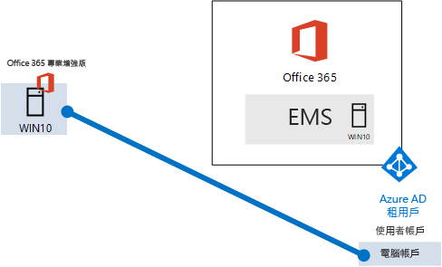
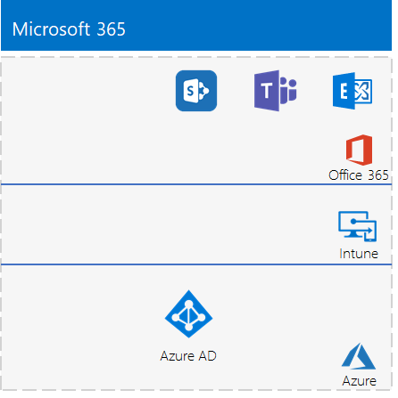

# <a name="the-lightweight-base-configuration"></a><span data-ttu-id="ca372-103">輕量型基本組態</span><span class="sxs-lookup"><span data-stu-id="ca372-103">The lightweight base configuration</span></span>

<span data-ttu-id="ca372-104">本文提供建立具備 Microsoft 365 E5 訂閱與執行 Windows 10 企業版電腦的簡化環境的逐步指示。</span><span class="sxs-lookup"><span data-stu-id="ca372-104">This article provides you with step-by-step instructions to create a simplified environment with a Microsoft 365 E5 subscription and a computer running Windows 10 Enterprise.</span></span> 



<span data-ttu-id="ca372-106">使用產生的環境來測試 [Microsoft 365 企業版](https://www.microsoft.com/microsoft-365/enterprise)的功能。</span><span class="sxs-lookup"><span data-stu-id="ca372-106">Use the resulting environment to test the features and functionality of [Microsoft 365 Enterprise](https://www.microsoft.com/microsoft-365/enterprise).</span></span>


  
> [!TIP]
> <span data-ttu-id="ca372-108">按一下[這裡](https://aka.ms/m365etlgstack)，可查看 Microsoft 365 企業版測試實驗室指南堆疊中文件的所有視覺對應。</span><span class="sxs-lookup"><span data-stu-id="ca372-108">Click [here](https://aka.ms/m365etlgstack) for a visual map to all the articles in the Microsoft 365 Enterprise Test Lab Guide stack.</span></span>

## <a name="phase-1-create-your-office-365-e5-subscription"></a><span data-ttu-id="ca372-109">階段 1：建立您的 Office 365 E5 訂閱</span><span class="sxs-lookup"><span data-stu-id="ca372-109">Phase 1: Create your Office 365 E5 subscription</span></span>

<span data-ttu-id="ca372-110">遵循 [Office 365 開發/測試環境](https://docs.microsoft.com/office365/enterprise/office-365-dev-test-environment)的階段 2 和階段 3 中的步驟來建立輕量型 Office 365 開發/測試環境。</span><span class="sxs-lookup"><span data-stu-id="ca372-110">Follow the steps in Phase 2 and Phase 3 of the [Office 365 dev/test environment](https://docs.microsoft.com/office365/enterprise/office-365-dev-test-environment) to create a lightweight Office 365 dev/test environment.</span></span>

>[!Note]
><span data-ttu-id="ca372-111">我們提供您建立 Office 365 試用版訂閱，以便開發/測試環境中能有不同於您目前已有之付費訂閱的單獨 Azure AD 租用戶。</span><span class="sxs-lookup"><span data-stu-id="ca372-111">We have you create a trial subscription of Office 365 so that your dev/test environment has a separate Azure AD tenant from any paid subscriptions you currently have.</span></span> <span data-ttu-id="ca372-112">此區隔表示您可以在測試租用戶中新增和移除使用者，而不會影響到生產訂閱。</span><span class="sxs-lookup"><span data-stu-id="ca372-112">This separation means you can add and remove users and groups in the test tenant without affecting your production subscriptions.</span></span>
>
  
## <a name="phase-2-add-a-microsoft-365-e5-trial-subscription"></a><span data-ttu-id="ca372-113">階段 2：新增 Microsoft 365 E5 試用版訂閱</span><span class="sxs-lookup"><span data-stu-id="ca372-113">Phase 2: Add a Microsoft 365 E5 trial subscription</span></span>

<span data-ttu-id="ca372-114">在此階段中，您可以註冊 Microsoft 365 E5 試用版訂閱，並將它新增至與 Office 365 E5 試用版訂閱相同的組織。</span><span class="sxs-lookup"><span data-stu-id="ca372-114">In this phase, you sign up for the Microsoft 365 E5 trial subscription and add it to the same organization as your Office 365 E5 trial subscription.</span></span>
  
<span data-ttu-id="ca372-115">首先，新增 Microsoft 365 E5 試用版訂閱，並將 Microsoft 365 授權指派給您的全域系統管理員帳戶。</span><span class="sxs-lookup"><span data-stu-id="ca372-115">First, add the Microsoft 365 E5 trial subscription and assign a Microsoft 365 license to your global administrator account.</span></span>
  
1. <span data-ttu-id="ca372-116">使用網際網路瀏覽器的私用執行個體，以全域系統管理員帳戶憑證登入位於 [https://admin.microsoft.com](https://admin.microsoft.com) 的 Microsoft 365 系統管理中心。</span><span class="sxs-lookup"><span data-stu-id="ca372-116">With a private instance of an Internet browser, sign in to the Microsoft 365 admin center at [https://admin.microsoft.com](https://admin.microsoft.com) with your global administrator account credentials.</span></span>
    
2. <span data-ttu-id="ca372-117">在 [Microsoft 365 系統管理中心] \*\*\*\* 頁面的左側導覽中，按一下 [帳單 > 購買服務]\*\*\*\*。</span><span class="sxs-lookup"><span data-stu-id="ca372-117">On the **Microsoft 365 admin center** page, in the left navigation, click **Billing > Purchase services**.</span></span>
    
3. <span data-ttu-id="ca372-118">在 [購買服務]\*\*\*\* 頁面上，找到 [Microsoft 365 E5]\*\*\*\* 項目。</span><span class="sxs-lookup"><span data-stu-id="ca372-118">On the **Purchase services** page, find the **Microsoft 365 E5** item.</span></span> <span data-ttu-id="ca372-119">將滑鼠指標停留在上面，並且按一下 [開始免費試用]\*\*\*\*。</span><span class="sxs-lookup"><span data-stu-id="ca372-119">Hover your mouse pointer over it and click **Start free trial**.</span></span>

4. <span data-ttu-id="ca372-120">在 [Microsoft 365 E5 試用版]\*\*\*\* 頁面上，選擇要收到簡訊或電話、輸入您的電話號碼，然後按一下 [傳送簡訊給我]\*\*\*\* 或 [打電話給我]\*\*\*\*。</span><span class="sxs-lookup"><span data-stu-id="ca372-120">On the **Microsoft 365 E5 Trial** page, choose to receive a text or a call, enter your phone number, then click **Text me** or **Call me**.</span></span>

5. <span data-ttu-id="ca372-121">在 [確認訂單]\*\*\*\* 頁面上，按一下 [立即試用]\*\*\*\*。</span><span class="sxs-lookup"><span data-stu-id="ca372-121">On the **Confirm your order** page, click **Try now**.</span></span>

6. <span data-ttu-id="ca372-122">在 [訂單收據]\*\*\*\* 頁面上，按一下 [繼續]\*\*\*\*。</span><span class="sxs-lookup"><span data-stu-id="ca372-122">On the **Order receipt** page, click **Continue**.</span></span>

7. <span data-ttu-id="ca372-123">在 Microsoft 365 系統管理中心，按一下 [作用中使用者]\*\*\*\*，然後您的系統管理員帳戶。</span><span class="sxs-lookup"><span data-stu-id="ca372-123">In the Microsoft 365 admin center, click **Active users**, and then your administrator account.</span></span>

8. <span data-ttu-id="ca372-124">按一下 [產品授權]\*\*\*\* 的 [編輯]\*\*\*\*。</span><span class="sxs-lookup"><span data-stu-id="ca372-124">Click **Edit** for **Product licenses**.</span></span>

9. <span data-ttu-id="ca372-125">關閉 Office 365 企業版 E5 授權，然後開啟 Microsoft 365 E5 授權。</span><span class="sxs-lookup"><span data-stu-id="ca372-125">Turn off the license for Office 365 Enterprise E5 and turn on the license for Microsoft 365 E5.</span></span>

10. <span data-ttu-id="ca372-126">按一下 [儲存 > 關閉 > 關閉]\*\*\*\*。</span><span class="sxs-lookup"><span data-stu-id="ca372-126">Click **Save > Close > Close**.</span></span>

<span data-ttu-id="ca372-127">接下來，***如果您已完成階段 3*** [Office 365 開發/測試環境](https://docs.microsoft.com/office365/enterprise/office-365-dev-test-environment)，請為所有其他帳戶重複步驟 8 到 11 的所有程序 (使用者 2、使用者 3、使用者 4 和使用者 5)。</span><span class="sxs-lookup"><span data-stu-id="ca372-127">Next, ***if you completed Phase 3 of the*** [Office 365 dev/test environment](https://docs.microsoft.com/office365/enterprise/office-365-dev-test-environment), repeat steps 8 through 11 of the previous procedure for all of your other accounts (User 2, User 3, User 4, and User 5).</span></span>
  
> [!NOTE]
> <span data-ttu-id="ca372-128">Microsoft 365 E5 試用版訂閱的期限是 30 天。</span><span class="sxs-lookup"><span data-stu-id="ca372-128">The Microsoft 365 E5 trial subscription is 30 days.</span></span> <span data-ttu-id="ca372-129">在永久測試環境中，將此試用訂閱轉換為具少數授權數的付費訂閱。</span><span class="sxs-lookup"><span data-stu-id="ca372-129">For a permanent test environment, convert this trial subscription to a paid subscription with a small number of licenses.</span></span> 
  
<span data-ttu-id="ca372-130">測試環境現在擁有：</span><span class="sxs-lookup"><span data-stu-id="ca372-130">Your test environment now has:</span></span>
  
- <span data-ttu-id="ca372-131">Microsoft 365 E5 試用版訂閱。</span><span class="sxs-lookup"><span data-stu-id="ca372-131">A Microsoft 365 E5 trial subscription.</span></span>
- <span data-ttu-id="ca372-132">所有適當的使用者帳戶 (全域系統管理員或所有五個使用者帳戶) 皆已可使用 Microsoft 365 E5。</span><span class="sxs-lookup"><span data-stu-id="ca372-132">All your appropriate user accounts (either just the global administrator or all five user accounts) are enabled to use Microsoft 365 E5.</span></span>
    
<span data-ttu-id="ca372-133">圖 1 顯示您產生的組態，該組態將新增 Microsoft 365 E5，其中包含 Office 365 和 Enterprise Mobility + Security (EMS)。</span><span class="sxs-lookup"><span data-stu-id="ca372-133">Figure 1 shows your resulting configuration, which adds Microsoft 365 E5, which includes both Office 365 and Enterprise Security + Management (EMS).</span></span>
  
<span data-ttu-id="ca372-134">**圖 1：新增 Microsoft 365 試用版訂閱**</span><span class="sxs-lookup"><span data-stu-id="ca372-134">**Figure 1: Adding the Microsoft 365 trial subscription**</span></span>


  
## <a name="phase-3-create-a-windows-10-enterprise-computer"></a><span data-ttu-id="ca372-136">階段 3：建立 Windows 10 企業版的電腦</span><span class="sxs-lookup"><span data-stu-id="ca372-136">Phase 3: Create a Windows 10 Enterprise computer</span></span>

<span data-ttu-id="ca372-137">在這個階段中，您會建立執行 Windows 10 企業版的獨立電腦，作為實體電腦、虛擬機器或是 Azure 虛擬機器。</span><span class="sxs-lookup"><span data-stu-id="ca372-137">In this phase, you create a standalone computer running Windows 10 Enterprise as either a physical computer, a virtual machine, or an Azure virtual machine.</span></span>
  
### <a name="physical-computer"></a><span data-ttu-id="ca372-138">實體電腦</span><span class="sxs-lookup"><span data-stu-id="ca372-138">Physical computer</span></span>

<span data-ttu-id="ca372-p104">取得個人電腦並在其上安裝 Windows 10 企業版。您可以在[這裡](https://www.microsoft.com/evalcenter/evaluate-windows-10-enterprise)下載 Windows 10 企業版試用版。</span><span class="sxs-lookup"><span data-stu-id="ca372-p104">Obtain a personal computer and install Windows 10 Enterprise on it. You can download the Windows 10 Enterprise trial [here](https://www.microsoft.com/evalcenter/evaluate-windows-10-enterprise).</span></span>
  
### <a name="virtual-machine"></a><span data-ttu-id="ca372-141">虛擬機器</span><span class="sxs-lookup"><span data-stu-id="ca372-141">Virtual machine</span></span>

<span data-ttu-id="ca372-p105">使用您所選的 Hypervisor 建立虛擬機器並在其上安裝 Windows 10 企業版。您可以在[這裡](https://www.microsoft.com/evalcenter/evaluate-windows-10-enterprise)下載 Windows 10 企業版試用版。</span><span class="sxs-lookup"><span data-stu-id="ca372-p105">Create a virtual machine using the hypervisor of your choice and install Windows 10 Enterprise on it. You can download the Windows 10 Enterprise trial [here](https://www.microsoft.com/evalcenter/evaluate-windows-10-enterprise).</span></span>
  
### <a name="virtual-machine-in-azure"></a><span data-ttu-id="ca372-144">Azure 中的虛擬機器</span><span class="sxs-lookup"><span data-stu-id="ca372-144">Virtual machine in Azure</span></span>

<span data-ttu-id="ca372-p106">若要在 Microsoft Azure 中建立 Windows 10 虛擬機器，***您必須擁有以 Visual Studio 為基礎的訂閱***，其具有 Windows 10 企業版的影像存取權。其他類型的 Azure 訂閱，例如試用版與付費訂閱，沒有此影像的存取權。如需最新資訊，請參閱[在 Azure 中使用 Windows 用戶端進行開發/測試案例](https://docs.microsoft.com/azure/virtual-machines/windows/client-images)。</span><span class="sxs-lookup"><span data-stu-id="ca372-p106">To create a Windows 10 virtual machine in Microsoft Azure, ***you must have a Visual Studio-based subscription***, which has access to the image for Windows 10 Enterprise. Other types of Azure subscriptions, such as trial and paid subscriptions, do not have access to this image. For the latest information, see [Use Windows client in Azure for dev/test scenarios](https://docs.microsoft.com/azure/virtual-machines/windows/client-images).</span></span>
  
> [!NOTE]
> <span data-ttu-id="ca372-p107">下列命令集會使用最新版的 Azure PowerShell。請參閱[開始使用 Azure PowerShell Cmdlet](https://docs.microsoft.com/powershell/azureps-cmdlets-docs/)。這些命令集會建置名為 WIN10 的 Windows 10 企業版虛擬機器，以及所有必要的基礎結構，包括資源群組、儲存體帳戶及虛擬網路。如果您已熟悉 Azure 基礎結構服務，請調整這些指示以符合您目前所部署的基礎結構。</span><span class="sxs-lookup"><span data-stu-id="ca372-p107">The following command sets use the latest version of Azure PowerShell. See [Get started with Azure PowerShell cmdlets](https://docs.microsoft.com/powershell/azureps-cmdlets-docs/). These command sets build a Windows 10 Enterprise virtual machine named WIN10 and all of its required infrastructure, including a resource group, a storage account, and a virtual network. If you are already familiar with Azure infrastructure services, please adapt these instructions to suit your currently deployed infrastructure.</span></span> 
  
<span data-ttu-id="ca372-152">首先，啟動 Microsoft PowerShell 提示字元。</span><span class="sxs-lookup"><span data-stu-id="ca372-152">First, start a Microsoft PowerShell prompt.</span></span>
  
<span data-ttu-id="ca372-153">使用下列命令登入您的 Azure 帳戶。</span><span class="sxs-lookup"><span data-stu-id="ca372-153">Sign in to your Azure account with the following command.</span></span>
  
```
Connect-AzAccount
```

<span data-ttu-id="ca372-154">使用下列命令取得訂用帳戶名稱。</span><span class="sxs-lookup"><span data-stu-id="ca372-154">Get your subscription name using the following command.</span></span>
  
```
Get-AzSubscription | Sort Name | Select Name
```

<span data-ttu-id="ca372-p108">設定 Azure 訂用帳戶。以正確的名稱取代括號中的所有項目 (包括 \< 和 > 字元)。</span><span class="sxs-lookup"><span data-stu-id="ca372-p108">Set your Azure subscription. Replace everything within the quotes, including the \< and > characters, with the correct name.</span></span>
  
```
$subscr="<subscription name>"
Get-AzSubscription -SubscriptionName $subscr | Select-AzSubscription
```

<span data-ttu-id="ca372-p109">接著，建立新的資源群組。若要判斷資源群組名稱是否是唯一的，可使用此命令來列出現有的資源群組。</span><span class="sxs-lookup"><span data-stu-id="ca372-p109">Next, create a new resource group. To determine a unique resource group name, use this command to list your existing resource groups.</span></span>
  
```
Get-AzResourceGroup | Sort ResourceGroupName | Select ResourceGroupName
```

<span data-ttu-id="ca372-p110">使用這些命令建立新的資源群組。以正確的名稱取代引號內的所有項目 (包括 \< 和 > 字元)。</span><span class="sxs-lookup"><span data-stu-id="ca372-p110">Create your new resource group with these commands. Replace everything within the quotes, including the \< and > characters, with the correct names.</span></span>
  
```
$rgName="<resource group name>"
$locName="<location name, such as West US>"
New-AzResourceGroup -Name $rgName -Location $locName
```

<span data-ttu-id="ca372-p111">接下來，您可以使用這些命令建立新的虛擬網路和 WIN10 虛擬機器。出現提示時，請提供 WIN10 本機系統管理員帳戶的名稱和密碼，並將其存放在安全的位置。</span><span class="sxs-lookup"><span data-stu-id="ca372-p111">Next, you create a new virtual network and the WIN10 virtual machine with these commands. When prompted, provide the name and password of the local administrator account for WIN10 and store these in a secure location.</span></span>
  
```
$corpnetSubnet=New-AzVirtualNetworkSubnetConfig -Name Corpnet -AddressPrefix 10.0.0.0/24
New-AzVirtualNetwork -Name "M365Ent-TestLab" -ResourceGroupName $rgName -Location $locName -AddressPrefix 10.0.0.0/8 -Subnet $corpnetSubnet
$rule1=New-AzNetworkSecurityRuleConfig -Name "RDPTraffic" -Description "Allow RDP to all VMs on the subnet" -Access Allow -Protocol Tcp -Direction Inbound -Priority 100 -SourceAddressPrefix Internet -SourcePortRange * -DestinationAddressPrefix * -DestinationPortRange 3389
New-AzNetworkSecurityGroup -Name Corpnet -ResourceGroupName $rgName -Location $locName -SecurityRules $rule1
$vnet=Get-AzVirtualNetwork -ResourceGroupName $rgName -Name "M365Ent-TestLab"
$nsg=Get-AzNetworkSecurityGroup -Name Corpnet -ResourceGroupName $rgName
Set-AzVirtualNetworkSubnetConfig -VirtualNetwork $vnet -Name Corpnet -AddressPrefix "10.0.0.0/24" -NetworkSecurityGroup $nsg
$vnet | Set-AzVirtualNetwork
$pip=New-AzPublicIpAddress -Name WIN10-PIP -ResourceGroupName $rgName -Location $locName -AllocationMethod Dynamic
$nic=New-AzNetworkInterface -Name WIN10-NIC -ResourceGroupName $rgName -Location $locName -SubnetId $vnet.Subnets[0].Id -PublicIpAddressId $pip.Id
$vm=New-AzVMConfig -VMName WIN10 -VMSize Standard_D1_V2
$cred=Get-Credential -Message "Type the name and password of the local administrator account for WIN10."
$vm=Set-AzVMOperatingSystem -VM $vm -Windows -ComputerName WIN10 -Credential $cred -ProvisionVMAgent -EnableAutoUpdate
$vm=Set-AzVMSourceImage -VM $vm -PublisherName MicrosoftWindowsDesktop -Offer Windows-10 -Skus RS3-Pro -Version "latest"
$vm=Add-AzVMNetworkInterface -VM $vm -Id $nic.Id
$vm=Set-AzVMOSDisk -VM $vm -Name WIN10-TestLab-OSDisk -DiskSizeInGB 128 -CreateOption FromImage
New-AzVM -ResourceGroupName $rgName -Location $locName -VM $vm
```

## <a name="phase-4-join-your-windows-10-computer-to-azure-ad"></a><span data-ttu-id="ca372-163">階段 4：將 Windows 10 電腦加入 Azure AD</span><span class="sxs-lookup"><span data-stu-id="ca372-163">Phase 4: Join your Windows 10 computer to Azure AD</span></span>

<span data-ttu-id="ca372-164">建立實體或虛擬機器的 Windows 10 企業版之後，使用本機系統管理員帳戶登入。</span><span class="sxs-lookup"><span data-stu-id="ca372-164">After the physical or virtual machine with Windows 10 Enterprise is created, sign in with a local administrator account.</span></span>
  
> [!NOTE]
> <span data-ttu-id="ca372-165">針對 Azure 中的虛擬機器，使用[這些指示](https://docs.microsoft.com/azure/virtual-machines/windows/connect-logon)來與它連線。</span><span class="sxs-lookup"><span data-stu-id="ca372-165">For a virtual machine in Azure, connect to it using [these instructions](https://docs.microsoft.com/azure/virtual-machines/windows/connect-logon).</span></span>
  
<span data-ttu-id="ca372-166">接下來，將 WIN10 電腦加入 Microsoft 365 E5 訂閱的 Azure AD 租用戶。</span><span class="sxs-lookup"><span data-stu-id="ca372-166">Next, join the WIN10 computer to the Azure AD tenant of your Microsoft 365 E5 subscription.</span></span>
  
1. <span data-ttu-id="ca372-167">在 WIN10 電腦桌面，按一下 [開始] > [設定] > [帳戶] > [存取公司或學校] > [連線]\*\*\*\*。</span><span class="sxs-lookup"><span data-stu-id="ca372-167">At the desktop of the WIN10 computer, click **Start > Settings > Accounts > Access work or school > Connect**.</span></span>
    
2. <span data-ttu-id="ca372-168">在 [設定公司或學校帳戶]\*\*\*\* 對話方塊中，按一下 [將此裝置加入 Azure Active Directory]\*\*\*\*。</span><span class="sxs-lookup"><span data-stu-id="ca372-168">In the **Set up a work or school account** dialog box, click **Join this device to Azure Active Directory**.</span></span>
    
3. <span data-ttu-id="ca372-169">在 [公司或學校帳戶]\*\*\*\* 中，輸入 Microsoft 365 E5 訂閱的全域管理員帳戶名稱，然後按 [下一步]\*\*\*\*。</span><span class="sxs-lookup"><span data-stu-id="ca372-169">In **Work or school account**, type the global administrator account name of your Microsoft 365 E5 subscription, and then click **Next**.</span></span>
    
4. <span data-ttu-id="ca372-170">在 [輸入密碼]\*\*\*\* 中，輸入全域管理員帳戶的密碼，然後按一下 [登入]\*\*\*\*。</span><span class="sxs-lookup"><span data-stu-id="ca372-170">In **Enter password**, type the password for your global administrator account, and then click **Sign in**.</span></span>
    
5. <span data-ttu-id="ca372-171">系統提示您確認這是您的組織時，按一下 [加入]\*\*\*\*，然後按一下 [完成]\*\*\*\*。</span><span class="sxs-lookup"><span data-stu-id="ca372-171">When prompted to make sure this is your organization, click **Join**, and then click **Done**.</span></span>
    
6. <span data-ttu-id="ca372-172">關閉設定視窗。</span><span class="sxs-lookup"><span data-stu-id="ca372-172">Close the settings window.</span></span>
    
<span data-ttu-id="ca372-173">接下來，在 WIN10 電腦上安裝 Office 365 專業增強版。</span><span class="sxs-lookup"><span data-stu-id="ca372-173">Next, install Office 365 ProPlus on the WIN10 computer.</span></span>
  
1. <span data-ttu-id="ca372-174">開啟 Microsoft Edge 瀏覽器，並使用全域管理員帳戶認證登入 Office 入口網站。</span><span class="sxs-lookup"><span data-stu-id="ca372-174">Open the Microsoft Edge browser and sign in to the Office portal with your global administrator account credentials.</span></span> <span data-ttu-id="ca372-175">如需說明，請參閱[在何處登入 Office 365](https://support.office.com/Article/Where-to-sign-in-to-Office-365-e9eb7d51-5430-4929-91ab-6157c5a050b4)。</span><span class="sxs-lookup"><span data-stu-id="ca372-175">For help, see [Where to sign in to Office 365](https://support.office.com/Article/Where-to-sign-in-to-Office-365-e9eb7d51-5430-4929-91ab-6157c5a050b4).</span></span>
    
2. <span data-ttu-id="ca372-176">在 [Microsoft Office 首頁]\*\*\*\* 索引標籤上，按一下 [安裝 Office]\*\*\*\*。</span><span class="sxs-lookup"><span data-stu-id="ca372-176">On the **Microsoft Office Home** tab, click **Install Office**.</span></span>
    
3. <span data-ttu-id="ca372-177">系統提示您要執行的動作時，按一下 [執行]\*\*\*\*，然後為 [使用者帳戶控制]\*\*\*\* 按一下 [是]\*\*\*\*。</span><span class="sxs-lookup"><span data-stu-id="ca372-177">When prompted with what to do, click **Run**, and then click **Yes** for **User Account Control**.</span></span>
    
4. <span data-ttu-id="ca372-p113">等待 Office 完成安裝。當您看到 **「一切就緒！」** 時，按兩次 [關閉]\*\*\*\*。</span><span class="sxs-lookup"><span data-stu-id="ca372-p113">Wait for Office to complete its installation. When you see **You're all set!**, click **Close** twice.</span></span>
    
<span data-ttu-id="ca372-180">圖 3 顯示產生的環境，其中包括以下的 WIN10 電腦：</span><span class="sxs-lookup"><span data-stu-id="ca372-180">Figure 3 shows your resulting environment, which includes the WIN10 computer that has:</span></span>

- <span data-ttu-id="ca372-181">已加入您的 Microsoft 365 E5 訂閱的 Azure AD 租用戶。</span><span class="sxs-lookup"><span data-stu-id="ca372-181">Joined the Azure AD tenant of your Microsoft 365 E5 subscription.</span></span>
- <span data-ttu-id="ca372-182">已在 Microsoft Intune (EMS) 中註冊為 Azure AD 裝置。</span><span class="sxs-lookup"><span data-stu-id="ca372-182">Enrolled as an Azure AD device in Microsoft Intune (EMS).</span></span>
- <span data-ttu-id="ca372-183">已安裝 Office 365 專業增強版。</span><span class="sxs-lookup"><span data-stu-id="ca372-183">Has Office 365 ProPlus installed.</span></span>
  
<span data-ttu-id="ca372-184">**圖 2：Microsoft 365 測試環境的最終組態**</span><span class="sxs-lookup"><span data-stu-id="ca372-184">**Figure 2: The final configuration of the Microsoft 365 test environment**</span></span>


  
<span data-ttu-id="ca372-186">您現在已準備好嘗試 [Microsoft 365 企業版](https://www.microsoft.com/microsoft-365/enterprise)的其他功能。</span><span class="sxs-lookup"><span data-stu-id="ca372-186">You are now ready to experiment with additional features of [Microsoft 365 Enterprise](https://www.microsoft.com/microsoft-365/enterprise).</span></span>
  
## <a name="next-steps"></a><span data-ttu-id="ca372-187">後續步驟</span><span class="sxs-lookup"><span data-stu-id="ca372-187">Next steps</span></span>

<span data-ttu-id="ca372-188">探索這些額外的測試實驗室指南集合：</span><span class="sxs-lookup"><span data-stu-id="ca372-188">Explore these additional sets of Test Lab Guides:</span></span>
  
- [<span data-ttu-id="ca372-189">身分識別</span><span class="sxs-lookup"><span data-stu-id="ca372-189">Identity</span></span>](m365-enterprise-test-lab-guides.md#identity)
- [<span data-ttu-id="ca372-190">行動裝置管理</span><span class="sxs-lookup"><span data-stu-id="ca372-190">Mobile device management</span></span>](m365-enterprise-test-lab-guides.md#mobile-device-management)
- [<span data-ttu-id="ca372-191">資訊保護</span><span class="sxs-lookup"><span data-stu-id="ca372-191">Information protection</span></span>](m365-enterprise-test-lab-guides.md#information-protection)
   

## <a name="see-also"></a><span data-ttu-id="ca372-192">另請參閱</span><span class="sxs-lookup"><span data-stu-id="ca372-192">See also</span></span>

[<span data-ttu-id="ca372-193">Microsoft 365 企業版測試實驗室指南</span><span class="sxs-lookup"><span data-stu-id="ca372-193">Microsoft 365 Enterprise Test Lab Guides</span></span>](m365-enterprise-test-lab-guides.md)

[<span data-ttu-id="ca372-194">部署 Microsoft 365 企業版</span><span class="sxs-lookup"><span data-stu-id="ca372-194">Deploy Microsoft 365 Enterprise</span></span>](deploy-microsoft-365-enterprise.md)

[<span data-ttu-id="ca372-195">Microsoft 365 企業版文件</span><span class="sxs-lookup"><span data-stu-id="ca372-195">Microsoft 365 Enterprise documentation</span></span>](https://docs.microsoft.com/microsoft-365-enterprise/)
