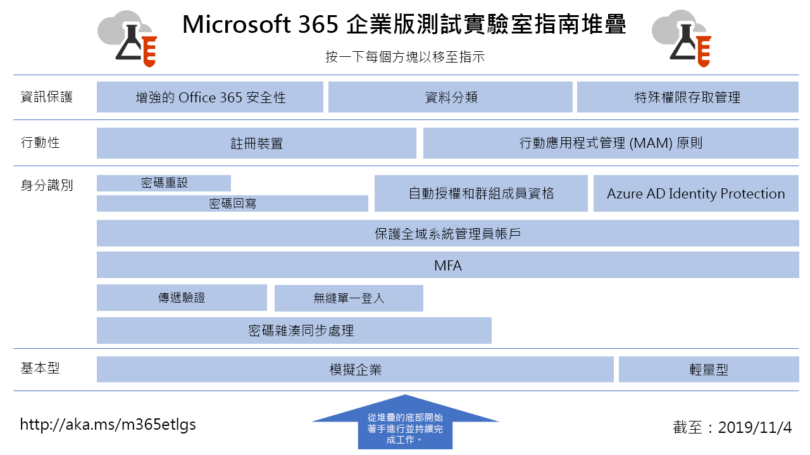

# Microsoft 365 企業版測試實驗室指南Microsoft 365 Enterprise Test Lab Guides

*本文適用於 Office 365 企業版和 Microsoft 365 企業版。**This article applies to both Office 365 Enterprise and Microsoft 365 Enterprise*

測試實驗室指南 (TLG) 可協助您快速地了解 Microsoft 產品。它們提供規範的指示，可以設定簡化但是具有代表性的測試環境。您可以將這些環境用於示範、自訂或者針對試用版或付費訂閱持續時間建立複雜的概念證明。Test Lab Guides (TLGs) help you quickly learn about Microsoft products. They provide prescriptive instructions to configure simplified but representative test environments. You can use these environments for demonstration, customization, or creation of complex proofs of concept for the duration of a trial or paid subscription. 

TLG 設計為模組化。它們根據彼此而建置，以建立能夠更加符合您學習或測試組態需求的多個組態。「我自行建置而且可以運作」提供實做經驗，可協助您了解新產品或案例的部署需求，因此您可以更有效地規劃在生產環境中裝載。TLGs are designed to be modular. They build upon each other to create multiple configurations that more closely match your learning or test configuration needs. The "I built it out myself and it works" hands-on experience helps you understand the deployment requirements of a new product or scenario so you can better plan for hosting it in production.

您也可以使用 TLG 針對應用程式開發和測試建立具有代表性的環境，亦稱為開發/測試環境。You can also use TLGs to create representative environments for development and testing of applications, also known as dev/test environments.
  

按一下[這裡](media/m365-enterprise-test-lab-guides/Microsoft365EnterpriseTLGStack.pdf) (英文)，可查看 Microsoft 365 企業版測試實驗室指南堆疊中所有文章的視覺對應。Click [here](media/m365-enterprise-test-lab-guides/Microsoft365EnterpriseTLGStack.pdf) for a visual map to all the articles in the Microsoft 365 Enterprise Test Lab Guide stack.

## 基本設定Base configuration

首先，您可以建立 [Microsoft 365 企業版](https://docs.microsoft.com/microsoft-365-enterprise/)的測試環境，以便包含 Office 365 E5、Enterprise Mobility + Security (EMS) E5 及 Windows 10 企業版。您可以建立兩個不同類型的基底組態：First, you create a test environment for [Microsoft 365 Enterprise](https://docs.microsoft.com/microsoft-365-enterprise/) that includes Office 365 E5, Enterprise Mobility + Security (EMS) E5, and Windows 10 Enterprise. You can create two different types of base configurations:

- 當您想要在僅雲端環境中 (其中不包含任何內部部署元件) 設定及示範 Microsoft 365 企業版功能時，使用[輕量型基底組態](lightweight-base-configuration-microsoft-365-enterprise.md)。Use the [lightweight base configuration](lightweight-base-configuration-microsoft-365-enterprise.md) when you want to configure and demonstrate Microsoft 365 Enterprise features and capabilities in a cloud-only environment, which does not include any on-premises components.

- 當您想要在混合式雲端環境 (該環境使用內部部署元件，例如 Active Directory Domain Services (AD DS) 網域) 中設定及示範 Microsoft 365 企業版功能時，使用[模擬的企業基底組態](simulated-ent-base-configuration-microsoft-365-enterprise.md)。Use the [simulated enterprise base configuration](simulated-ent-base-configuration-microsoft-365-enterprise.md) when you want to configure and demonstrate Microsoft 365 Enterprise features and capabilities in a hybrid cloud environment, which uses on-premises components such as an Active Directory Domain Services (AD DS) domain.

您也可以建立 Office 365 E5 的測試環境，做法是不要將 Microsoft 365 E5 授權新增至您的試用版或生產測試環境。You can also create test environments for Office 365 E5 by not adding the Microsoft 365 E5 license to your trial or production test environment.
    
## 身分識別Identity

若要示範身分識別相關的功能，請參閱：To demonstrate identity-related features and capabilities, see:

- [密碼雜湊同步處理Password hash synchronization](password-hash-sync-m365-ent-test-environment.md)
  
   啟用並測試 AD DS 網域控制站的密碼雜湊型目錄同步處理。Enable and test password hash-based directory synchronization from an AD DS domain controller.

- [傳遞驗證Pass-through authentication](pass-through-auth-m365-ent-test-environment.md)
  
   啟用及測試對 AD DS 網域控制站的傳遞驗證。Enable and test pass-through authentication to an AD DS domain controller.

- [Azure AD 無縫單一登入Azure AD Seamless Single Sign-on](single-sign-on-m365-ent-test-environment.md)
  
   使用 AD DS 網域控制站來啟用並測試 Azure AD 無縫單一登入 (SSO)。Enable and test Azure AD Seamless Single Sign-on (SSO) with an AD DS domain controller.

- [多重要素驗證Multi-factor authentication](multi-factor-authentication-microsoft-365-test-environment.md)
  
   為特定使用者帳戶啟用並測試智慧型手機的多重要素驗證。Enable and test smart phone-based multi-factor authentication for a specific user account.

- [保護全域系統管理員帳戶Protect global administrator accounts](protect-global-administrator-accounts-microsoft-365-test-environment.md)
 
   使用條件式存取原則鎖定您的全域系統管理員帳戶。Lock down your global administrator accounts with conditional access policies.

- [密碼回寫Password writeback](password-writeback-m365-ent-test-environment.md)

   您可使用密碼回寫，從 Azure AD 變更 AD DS 使用者帳戶的密碼。Use password writeback to change the password on your AD DS user account from Azure AD.

- [密碼重設Password reset](password-reset-m365-ent-test-environment.md)

   使用自助密碼重設 (SSPR) 來重設密碼。Use self-service password reset (SSPR) to reset your password.

- [自動授權和群組成員資格Automatic licensing and group membership](automate-licenses-group-membership-microsoft-365-test-environment.md)

   使用自動授權和動態群組成員資格，讓管理新帳戶比以往更容易。Make administering new accounts easier than ever with automatic licensing and dynamic group membership.

- [Azure AD Identity ProtectionAzure AD Identity Protection](azure-ad-identity-protection-microsoft-365-test-environment.md)

   掃描目前的使用者帳戶是否存在漏洞。Scan your current user accounts for vulnerabilities.

- [身分識別與裝置存取Identity and device access](identity-device-access-m365-test-environment.md)

   建立環境來測試建議的身分識別與裝置存取組態，以及條件式存取原則。Create an environment to test recommended identity and device access configurations and conditional access policies.

## 行動裝置管理Mobile device management

若要示範行動裝置管理相關的功能，請參閱：To demonstrate mobile device management-related features and capabilities, see:

- [裝置合規性原則Device compliance policies](mam-policies-for-your-microsoft-365-enterprise-dev-test-environment.md)
    
   建立 Windows 10 裝置的使用者群組和裝置合規性原則。Create a user group and a device compliance policy for Windows 10 devices.
    
- [註冊 iOS 和 Android 裝置Enroll iOS and Android devices](enroll-ios-and-android-devices-in-your-microsoft-enterprise-365-dev-test-environ.md)
   
   註冊 iOS 或 Android 裝置並從遠端管理。Enroll iOS or Android devices and manage them remotely.

## 資訊保護Information protection

若要示範資訊保護相關的功能，請參閱：To demonstrate information protection-related features and capabilities, see:

- [增強的 Office 365 安全性Increased Office 365 security](increased-o365-security-microsoft-365-enterprise-dev-test-environment.md)
    
   設定增強的 Office 365 安全性的設定，並且調查內建安全性工具。Configure settings for increased Office 365 security and investigate built-in security tools.
  
- [資料分類Data classification](data-classification-microsoft-365-enterprise-dev-test-environment.md)
    
   設定 Office 365 標籤並且將其套用至 SharePoint Online 小組網站中的文件。Configure and apply Office 365 labels to a document in a SharePoint Online team site.
    
- [特殊權限存取管理Privileged access management](privileged-access-microsoft-365-enterprise-dev-test-environment.md)
    
   設定特殊權限存取管理，以對您 Office 365 組織中提升權限和特殊權限的工作進行 Just-In-Time 存取。Configure privileged access management for just-in-time access to elevated and privileged tasks in your Office 365 organization.

