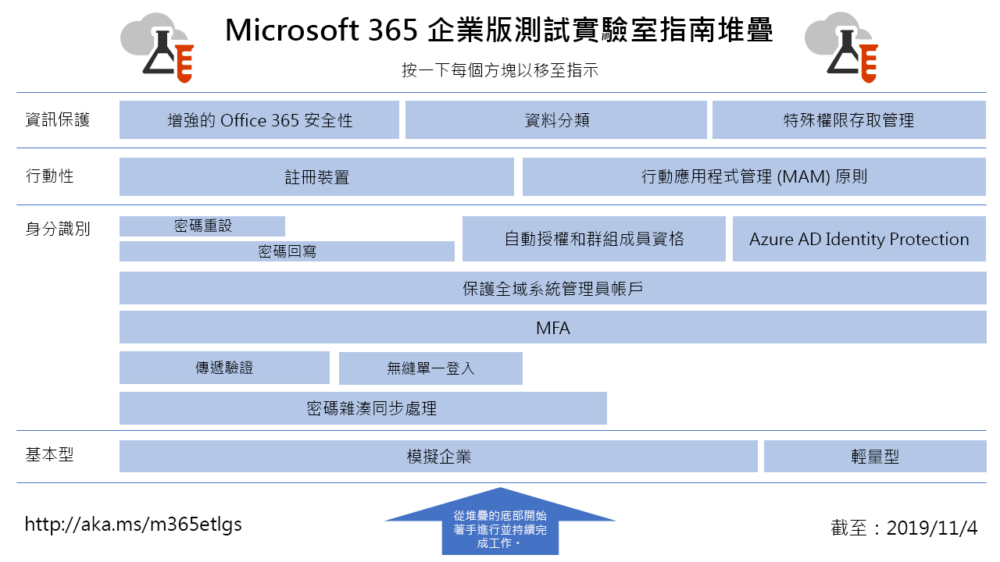

# 企業用 Microsoft 365 測試實驗室指南Microsoft 365 for enterprise Test Lab Guides

*本文適用於 Office 365 企業版和企業用 Microsoft 365。**This applies to both Microsoft 365 for enterprise and Office 365 Enterprise.*

測試實驗室指南 (TLG) 可協助您快速地了解 Microsoft 產品。它們提供規範的指示，可以設定簡化但是具有代表性的測試環境。您可以將這些環境用於示範、自訂或者針對試用版或付費訂閱持續時間建立複雜的概念證明。Test Lab Guides (TLGs) help you quickly learn about Microsoft products. They provide prescriptive instructions to configure simplified but representative test environments. You can use these environments for demonstration, customization, or creation of complex proofs of concept for the duration of a trial or paid subscription.

Tlg 設計為模組式。它們相互建立，以建立與您的學習或測試設定需求更接近的多個設定。「我自行建立並運作]，可協助您瞭解新產品或案例的部署需求，讓您能更好地規劃在生產環境中主控。TLGs are designed to be modular. They build upon each other to create multiple configurations that more closely match your learning or test configuration needs. The "I built it out myself and it works" hands-on experience helps you understand the deployment requirements of a new product or scenario, so that you can better plan for hosting it in production.

您也可以使用 Tlg 來建立具有代表性的環境，以開發及測試應用程式（也稱為開發/測試環境）。You can also use TLGs to create representative environments to develop and test applications, also known as dev/test environments.
  

如需 Microsoft 365 for enterprise 測試實驗室指南堆疊中所有文章的視覺對應，請展開下圖，或前往 [microsoft 365 for Enterprise Test Lab Guide 堆疊](../downloads/Microsoft365EnterpriseTLGStack.pdf)。For a visual map to all the articles in the Microsoft 365 for enterprise Test Lab Guide stack, expand the following graphic or go to [Microsoft 365 for enterprise Test Lab Guide Stack](../downloads/Microsoft365EnterpriseTLGStack.pdf).

## 基本設定Base configuration

首先，建立 [Microsoft 365 for enterprise](https://docs.microsoft.com/microsoft-365-enterprise/)的測試環境。您可以建立兩種不同的基本設定類型：First, create a test environment for [Microsoft 365 for enterprise](https://docs.microsoft.com/microsoft-365-enterprise/). You can create two different types of base configurations:

- [羽量級基本](lightweight-base-configuration-microsoft-365-enterprise.md) 設定-當您想要在僅雲端環境中為企業功能（不包含任何內部部署元件）設定及示範 Microsoft 365 時，請使用此設定。[Lightweight base configuration](lightweight-base-configuration-microsoft-365-enterprise.md) - Use this when you want to configure and demonstrate Microsoft 365 for enterprise features and capabilities in a cloud-only environment, which does not include any on-premises components.

- [模擬企業基本](simulated-ent-base-configuration-microsoft-365-enterprise.md) 設定-當您想要設定及365示範混合雲端環境中的企業功能（例如 Active Directory 網域服務 (AD DS) 網域）時，請使用此設定。[Simulated enterprise base configuration](simulated-ent-base-configuration-microsoft-365-enterprise.md) - Use this when you want to configure and demonstrate Microsoft 365 for enterprise features and capabilities in a hybrid cloud environment, which uses on-premises components such as an Active Directory Domain Services (AD DS) domain.

您也可以建立 Office 365 E5 的測試環境，做法是不要將 Microsoft 365 E5 授權新增至您的試用版或生產測試環境。You can also create test environments for Office 365 E5 by not adding the Microsoft 365 E5 license to your trial or production test environment.
    
## 身分識別Identity

若要示範身分識別相關的功能，請參閱：To demonstrate identity-related features and capabilities, see:

- [密碼雜湊同步處理Password hash synchronization](password-hash-sync-m365-ent-test-environment.md)
  
   啟用並測試 AD DS 網域控制站的密碼雜湊型目錄同步處理。Enable and test password hash-based directory synchronization from an AD DS domain controller.

- [傳遞驗證Pass-through authentication](pass-through-auth-m365-ent-test-environment.md)
  
   啟用及測試對 AD DS 網域控制站的傳遞驗證。Enable and test pass-through authentication to an AD DS domain controller.

- [同盟驗證Federated authentication](federated-identity-for-your-microsoft-365-dev-test-environment.md)
  
   啟用及測試對 AD DS 網域控制站的同盟驗證。Enable and test federated authentication to an AD DS domain controller.

- [Azure AD 無縫單一登入Azure AD Seamless Single Sign-on](single-sign-on-m365-ent-test-environment.md)
  
   使用 AD DS 網域控制站，啟用並測試 Azure AD 無縫單一登入 (無縫 SSO) 。Enable and test Azure AD Seamless Single Sign-on (Seamless SSO) with an AD DS domain controller.

- [多重要素驗證Multi-factor authentication](multi-factor-authentication-microsoft-365-test-environment.md)
  
   為特定使用者帳戶啟用並測試智慧型手機的多重要素驗證。Enable and test smart phone-based multi-factor authentication for a specific user account.

- [保護全域系統管理員帳戶Protect global administrator accounts](protect-global-administrator-accounts-microsoft-365-test-environment.md)

   使用條件式存取原則鎖定您的全域系統管理員帳戶。Lock down your global administrator accounts with conditional access policies.

- [密碼回寫Password writeback](password-writeback-m365-ent-test-environment.md)

   您可使用密碼回寫，從 Azure AD 變更 AD DS 使用者帳戶的密碼。Use password writeback to change the password on your AD DS user account from Azure AD.

- [密碼重設Password reset](password-reset-m365-ent-test-environment.md)

   使用自助密碼重設重設密碼。Use self-service password reset to reset your password.

- [自動授權和群組成員資格Automatic licensing and group membership](automate-licenses-group-membership-microsoft-365-test-environment.md)

   使用自動授權和動態群組成員資格，讓管理新帳戶比以往更容易。Make administering new accounts easier than ever with automatic licensing and dynamic group membership.

- [Azure AD Identity ProtectionAzure AD Identity Protection](azure-ad-identity-protection-microsoft-365-test-environment.md)

   掃描目前的使用者帳戶是否存在漏洞。Scan your current user accounts for vulnerabilities.

- [身分識別與裝置存取Identity and device access](identity-device-access-m365-test-environment.md)

   建立環境來測試建議的身分識別與裝置存取組態，以及條件式存取原則。Create an environment to test recommended identity and device access configurations and conditional access policies.

## 行動裝置管理Mobile device management

若要示範行動裝置管理相關的功能，請參閱：To demonstrate mobile device management-related features and capabilities, see:

- [裝置合規性原則Device compliance policies](mam-policies-for-your-microsoft-365-enterprise-dev-test-environment.md)
    
   建立 Windows 10 裝置的使用者群組和裝置合規性原則。Create a user group and a device compliance policy for Windows 10 devices.
    
- [註冊 iOS 和 Android 裝置Enroll iOS and Android devices](enroll-ios-and-android-devices-in-your-microsoft-enterprise-365-dev-test-environ.md)
   
   註冊 iOS 或 Android 裝置並從遠端管理。Enroll iOS or Android devices and manage them remotely.

## 資訊保護Information protection

若要示範資訊保護相關的功能，請參閱：To demonstrate information protection-related features and capabilities, see:

- [增強的 Microsoft 365 安全性Increased Microsoft 365 security](increased-o365-security-microsoft-365-enterprise-dev-test-environment.md)
    
   設定增強的 Microsoft 365 安全性的設定，並且調查內建安全性工具。Configure settings for increased Microsoft 365 security and investigate built-in security tools.
  
- [資料分類Data classification](data-classification-microsoft-365-enterprise-dev-test-environment.md)
    
   設定標籤並且將其套用至 SharePoint Online 小組網站中的文件。Configure and apply labels to a document in a SharePoint Online team site.
    
- [特殊權限存取管理Privileged access management](privileged-access-microsoft-365-enterprise-dev-test-environment.md)
    
   設定特殊權限存取管理，以對您組織中提升權限和特殊權限的工作進行 Just-In-Time 存取。Configure privileged access management for just-in-time access to elevated and privileged tasks in your organization.
