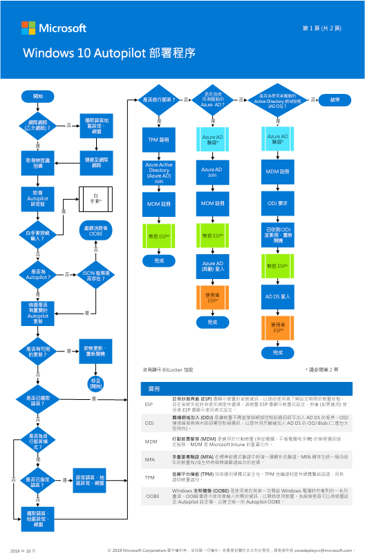
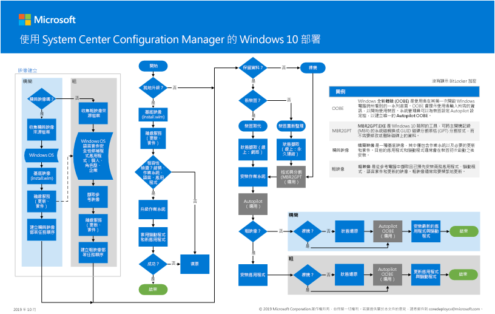
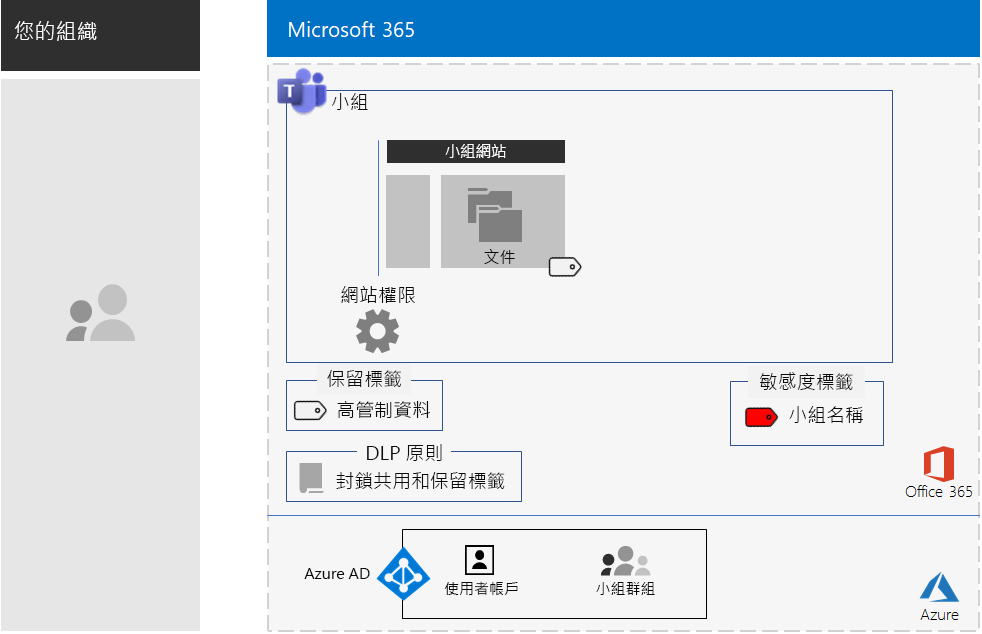
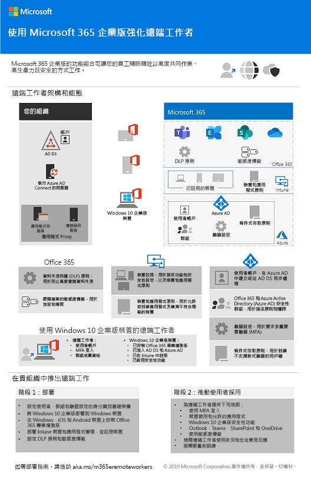
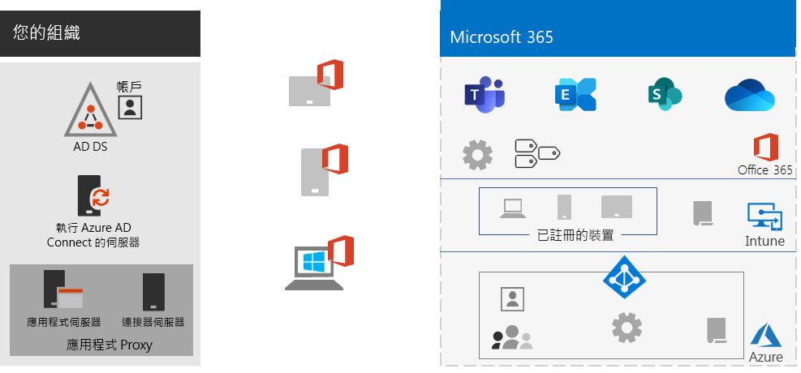
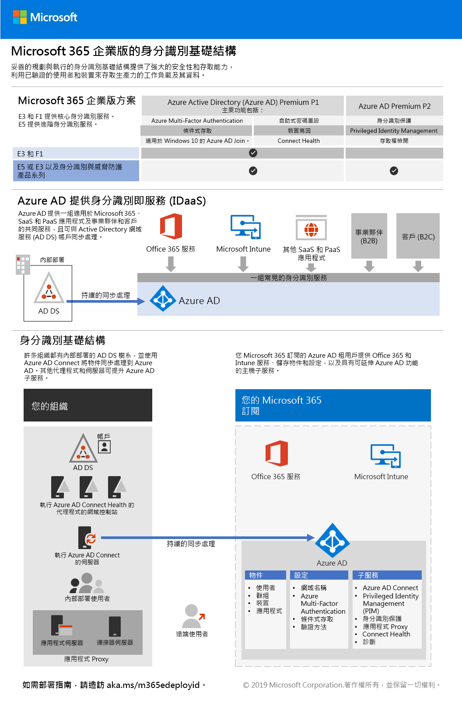
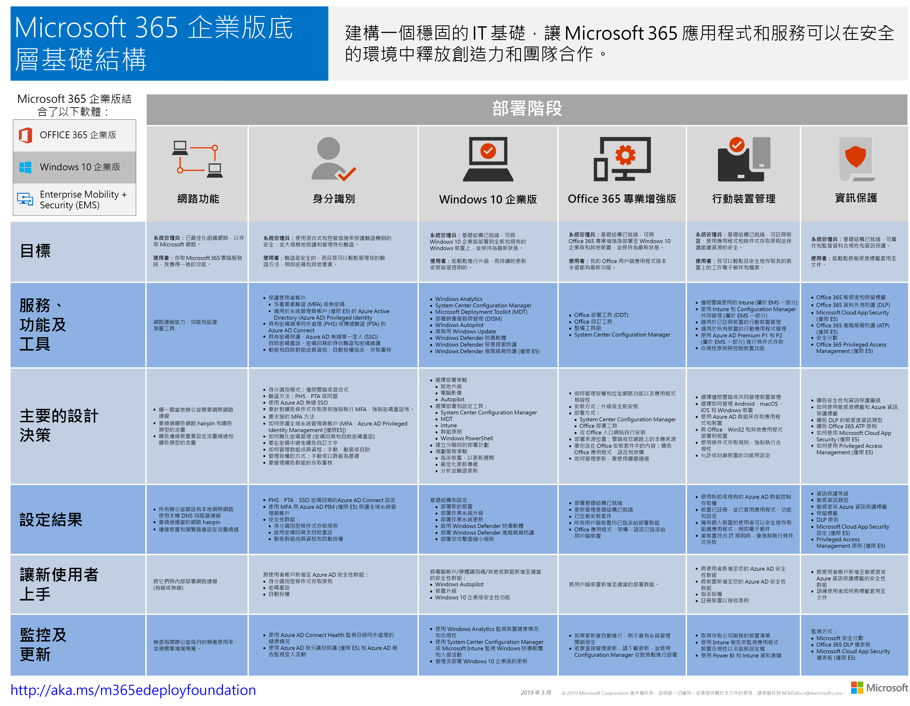

# Microsoft 365 企業版部署內容的變更Changes to Microsoft 365 Enterprise deployment content

## 2019 年 10 月October 2019

### 新增內容New content 

- [使用 Autopilot 部署 Windows 10 海報The Deploy Windows 10 with Autopilot poster](windows10-deploy-autopilot.md) 

  

- [使用 System Center Configuration Manager 的 Windows 10 部署海報The Windows 10 deployment with System Center Configuration Manager poster](windows10-deploy-inplaceupgrade.md)

  

- [適用於高度管制資料案例的 Microsoft TeamsTeams for highly regulated data scenario](secure-teams-highly-regulated-data-scenario.md)

  

- [強化遠端工作人員海報Empower remote workers poster](empower-people-to-work-remotely.md#poster)

   
 

### 更新和增強功能Updates and enhancements

- 重新整理 [Contoso 案例研究](contoso-case-study.md)Refresh of the [Contoso case study](contoso-case-study.md)
- 重新整理 [Microsoft Teams](teams-workload.md)、[Exchange Online](exchangeonline-workload.md) 和 [SharePoint Online](sharepoint-online-onedrive-workload.md) 的工作負載Refresh of the [Microsoft Teams](teams-workload.md), [Exchange Online](exchangeonline-workload.md), and [SharePoint Online](sharepoint-online-onedrive-workload.md) workloads
- 重新整理[適用於高度管制資料的 SharePoint 網站](teams-sharepoint-online-sites-highly-regulated-data.md)案例Refresh of the [SharePoint sites for highly regulated data](teams-sharepoint-online-sites-highly-regulated-data.md) scenario
 
  

- 適用於新案例的 [Microsoft 365 企業版海報](microsoft-365-overview.md#get-the-big-picture)[Microsoft 365 Enterprise poster](microsoft-365-overview.md#get-the-big-picture) for new scenarios 

  

## 2019 年 9 月September 2019

### 新增內容New content 

- [遠端工作者案例Remote workers scenario](empower-people-to-work-remotely.md)

   
 
- [階段 6：資訊保護](infoprotect-infrastructure.md)的[電子郵件加密步驟](infoprotect-email-encryption.md)[Email encryption step](infoprotect-email-encryption.md) for [Phase 6: Information Protection](infoprotect-infrastructure.md)

### 更新和增強功能Updates and enhancements

- 重新組織並重新整理[階段 2：身分識別](identity-infrastructure.md)Reorganization and refresh of [Phase 2: Identity](identity-infrastructure.md)
- 重新整理[階段 1：網路](networking-infrastructure.md)和[階段 6：資訊保護](infoprotect-infrastructure.md)Refresh of [Phase 1: Networking](networking-infrastructure.md) and [Phase 6: Information Protection](infoprotect-infrastructure.md)

## 2019 年 8 月August 2019

### 新增內容New content 

- [將您的組織轉換為 Microsoft 365 企業版Transition Your Organization to Microsoft 365 Enterprise poster](migration-microsoft-365-enterprise-workload.md#transition-your-entire-organization)

   
 
- [Microsoft 365 企業版的身分識別基礎結構海報Identity infrastructure for Microsoft 365 Enterprise poster](identity-infrastructure.md)

  

  公告：[Microsoft 365 技術社群部落格](https://techcommunity.microsoft.com/t5/Microsoft-365-Blog/Get-the-new-Identity-infrastructure-for-Microsoft-365-Enterprise/ba-p/874941)  |  [LinkedIn](https://www.linkedin.com/pulse/how-can-i-quickly-ramp-up-key-concepts-features-identity-joe-davies/?published=t)Announcements: [Microsoft 365 Technical Community blog](https://techcommunity.microsoft.com/t5/Microsoft-365-Blog/Get-the-new-Identity-infrastructure-for-Microsoft-365-Enterprise/ba-p/874941)  |  [LinkedIn](https://www.linkedin.com/pulse/how-can-i-quickly-ramp-up-key-concepts-features-identity-joe-davies/?published=t)

- [Windows 7 和 Office 10 終止支援海報Windows 7 and Office 10 End-of-Support poster](migration-microsoft-365-enterprise-workload.md#summary-of-options-for-office-2010-clients-and-servers-and-windows-7)
  
  

  公告：[Microsoft 365 技術社群部落格](https://techcommunity.microsoft.com/t5/Microsoft-365-Blog/Move-from-Office-2010-clients-and-servers-and-Windows-7-to/ba-p/846994)  |  [LinkedIn](https://www.linkedin.com/pulse/how-can-microsoft-365-enterprise-help-me-end-support-products-davies/)Announcements: [Microsoft 365 Technical Community blog](https://techcommunity.microsoft.com/t5/Microsoft-365-Blog/Move-from-Office-2010-clients-and-servers-and-Windows-7-to/ba-p/846994)  |  [LinkedIn](https://www.linkedin.com/pulse/how-can-microsoft-365-enterprise-help-me-end-support-products-davies/)

### 更新和增強功能Updates and enhancements

- 適用於新生產力案例的 [Microsoft 365 企業版海報](microsoft-365-overview.md#get-the-big-picture)[Microsoft 365 Enterprise poster](microsoft-365-overview.md#get-the-big-picture) for new productivity scenarios

   

## 2019 年 7 月July 2019

### 新增內容New content

- [適用於非企業組織的 Microsoft 365 企業版](deploy-foundation-infrastructure-non-enterprises.md#onboarding) Excel 活頁簿文章Excel workbook for [Microsoft 365 Enterprise for non-enterprise organizations article](deploy-foundation-infrastructure-non-enterprises.md#onboarding)

## 2019 年 5 月May 2019

### 新增內容New content

- [底層基礎結構海報Foundation Infrastructure poster](deploy-foundation-infrastructure.md#at-a-glance)

  

  公告：[LinkedIn](https://www.linkedin.com/pulse/how-can-i-get-big-picture-microsoft-365-enterprise-joe-davies/)Announcements: [LinkedIn](https://www.linkedin.com/pulse/how-can-i-get-big-picture-microsoft-365-enterprise-joe-davies/)

 
- [適用於非企業組織的 Microsoft 365 企業版文章Microsoft 365 Enterprise for non-enterprise organizations article](deploy-foundation-infrastructure-non-enterprises.md)

  

  公告：[Microsoft 365 技術社群部落格](https://techcommunity.microsoft.com/t5/Microsoft-365-Blog/Deploy-Microsoft-365-Enterprise-infrastructure-even-if-you-re/ba-p/900012)  |  [LinkedIn](https://www.linkedin.com/pulse/how-do-i-deploy-microsoft-365-enterprise-without-joe-davies/)Announcements: [Microsoft 365 Technical Community blog](https://techcommunity.microsoft.com/t5/Microsoft-365-Blog/Deploy-Microsoft-365-Enterprise-infrastructure-even-if-you-re/ba-p/900012)  |  [LinkedIn](https://www.linkedin.com/pulse/how-do-i-deploy-microsoft-365-enterprise-without-joe-davies/)

## 2019 年 4 月April 2019

### 新增內容New content 

- [身分識別和裝置存取權](identity-device-access-m365-test-environment.md)先決條件測試實驗室指南[Identity and device access](identity-device-access-m365-test-environment.md) prerequisite Test Lab Guides
- [階段 6：資訊保護](infoprotect-infrastructure.md)的 [Windows 資訊保護](infoprotect-deploy-windows-information-protection.md) 和 [Office 365 資料遺失防護](infoprotect-data-loss-prevention.md)步驟[Windows Information Protection](infoprotect-deploy-windows-information-protection.md) and [Office 365 Data Loss Prevention](infoprotect-data-loss-prevention.md) steps for [Phase 6: Information Protection](infoprotect-infrastructure.md)

## 另請參閱See also

[部署指南Deployment guide](deploy-microsoft-365-enterprise.md)
