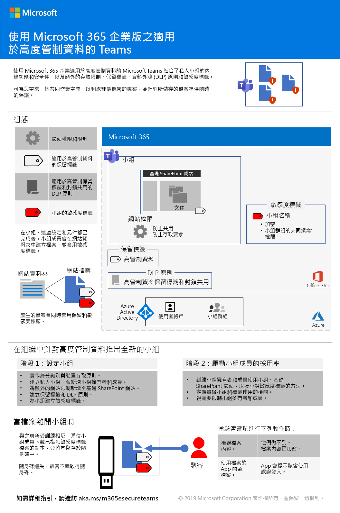
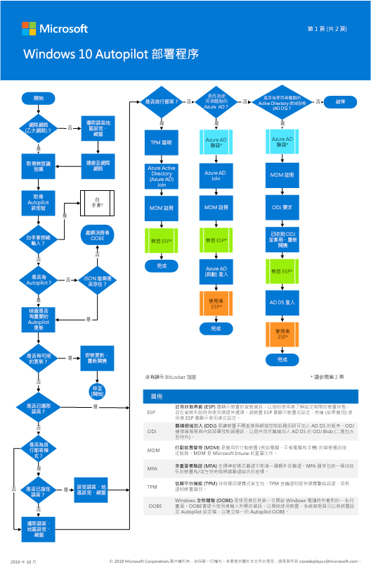
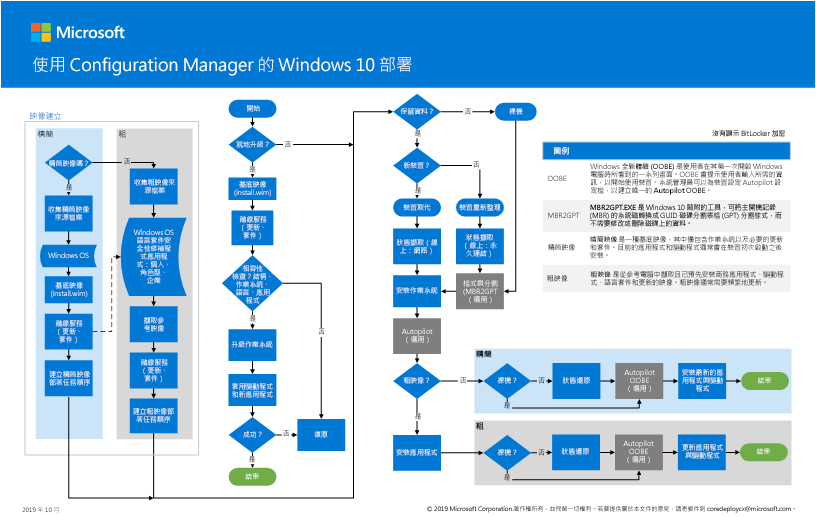
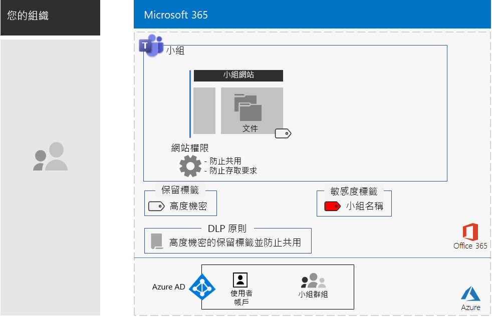
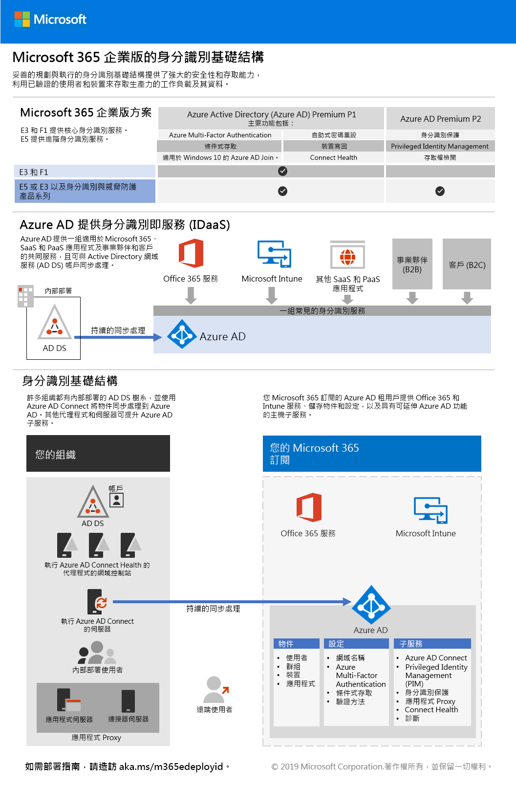

# Microsoft 365 企業版部署內容的變更

## 2019 年 12 月

### 新增內容 

- [適用於安全小組的檔案測試實驗室指南](https://docs.microsoft.com/microsoft-365/security/office-365-security/secure-team-for-files-in-a-dev-test-environment)

### 更新和增強功能

-  重新整理[測試實驗室指南](m365-enterprise-test-lab-guides.md) 

## 2019 年 11 月

### 新增內容 

- [從 Microsoft 365 商務版移轉至 Microsoft 365 E3](https://docs.microsoft.com/microsoft-365/business/migrate-from-microsoft-365-business-to-microsoft-365-enterprise)

- [Contoso Corporation 的機密專案小組](contoso-team-for-top-secret-project.md)

  

## 2019 年 10 月

### 新增內容 

- [適用於高度管制資料的 Teams 海報](secure-teams-highly-regulated-data-scenario.md#poster)

  

  您也可以用 [PDF](https://github.com/MicrosoftDocs/microsoft-365-docs/raw/public/microsoft-365/media/secure-teams-highly-regulated-data-scenario/TeamsHighlyRegulatedData.pdf) 或 [PowerPoint](https://github.com/MicrosoftDocs/microsoft-365-docs/raw/public/microsoft-365/media/secure-teams-highly-regulated-data-scenario/Teams-Highly-Regulated-Data-Poster.pptx) 格式下載此海報，以及用 Letter、Legal 或 Tabloid (11 x 17) 大小的紙張列印此海報。

- [適用於高度管制資料的 SharePoint 網站海報](teams-sharepoint-online-sites-highly-regulated-data.md#poster)

  

  您也可以用 [PDF](https://github.com/MicrosoftDocs/microsoft-365-docs/raw/public/microsoft-365/media/teams-sharepoint-online-sites-highly-regulated-data/SharePointSitesHighlyRegulatedData.pdf) 或 [PowerPoint](https://github.com/MicrosoftDocs/microsoft-365-docs/raw/public/microsoft-365/media/teams-sharepoint-online-sites-highly-regulated-data/SharePoint-Sites-Highly-Regulated-Data.pptx) 格式下載此海報，以及用 Letter、Legal 或 Tabloid (11 x 17) 大小的紙張列印此海報。

- [使用 Autopilot 部署 Windows 10 海報](windows10-deploy-autopilot.md) 

  

  您也可以以 [PDF](https://github.com/MicrosoftDocs/windows-itpro-docs/raw/public/windows/deployment/media/Windows10AutopilotFlowchart.pdf) 或 [Visio](https://github.com/MicrosoftDocs/windows-itpro-docs/raw/public/windows/deployment/media/Windows10Autopilotflowchart.vsdx) 格式下載此海報。

- [使用 Configuration Manager 的 Windows 10 部署海報](windows10-deploy-inplaceupgrade.md)

  

  您也可以以 [PDF](https://github.com/MicrosoftDocs/windows-itpro-docs/raw/public/windows/deployment/media/Windows10DeploymentConfigManager.pdf) 或 [Visio](https://github.com/MicrosoftDocs/windows-itpro-docs/raw/public/windows/deployment/media/Windows10DeploymentConfigManager.vsdx) 格式下載此海報。

- [適用於高度管制資料案例的 Microsoft Teams](secure-teams-highly-regulated-data-scenario.md)

  

  公告：[Microsoft 365 技術社群部落格](https://techcommunity.microsoft.com/t5/Microsoft-365-Blog/Protect-your-highly-regulated-files-in-Teams-with-Microsoft-365/ba-p/962985)  |  [LinkedIn](https://www.linkedin.com/pulse/how-can-i-lock-down-team-sensitive-top-secret-joe-davies/?published=t)

- [強化遠端工作人員海報](empower-people-to-work-remotely.md#poster)

   

  您也可以用 [PDF](https://github.com/MicrosoftDocs/microsoft-365-docs/raw/public/microsoft-365/media/empower-people-to-work-remotely/empower-remote-workers-scenario.pdf) 或 [PowerPoint](https://github.com/MicrosoftDocs/microsoft-365-docs/raw/public/microsoft-365/media/empower-people-to-work-remotely/Empower-Remote-Workers-Poster.pptx) 格式下載此海報，以及用 Letter、Legal 或 Tabloid (11 x 17) 大小的紙張列印此海報。

### 更新和增強功能

- 重新整理[階段 4：Office 365 專業增強版](office365proplus-infrastructure.md)
- 重新整理 [Contoso 案例研究](contoso-case-study.md)
- 重新整理 [Microsoft Teams](teams-workload.md)、[Exchange Online](exchangeonline-workload.md) 和 [SharePoint Online](sharepoint-online-onedrive-workload.md) 的工作負載
- 重新整理[適用於高度管制資料的 SharePoint 網站](teams-sharepoint-online-sites-highly-regulated-data.md)案例
 
  

- 適用於新案例的 [Microsoft 365 企業版海報](microsoft-365-overview.md#get-the-big-picture) 

  

## 2019 年 9 月

### 新增內容 

- [遠端工作者案例](empower-people-to-work-remotely.md)

   
 
  公告：[Microsoft 365 技術社群部落格](https://techcommunity.microsoft.com/t5/Microsoft-365-Blog/Empower-your-remote-workers-with-Microsoft-365-Enterprise/ba-p/935196#M236)  |  [LinkedIn](https://www.linkedin.com/pulse/how-do-i-configure-microsoft-365-enterprise-empower-my-joe-davies/)

- [階段 6：資訊保護](infoprotect-infrastructure.md)的[電子郵件加密步驟](infoprotect-email-encryption.md)

### 更新和增強功能

- 重新組織並重新整理[階段 2：身分識別](identity-infrastructure.md)
- 重新整理[階段 1：網路](networking-infrastructure.md)和[階段 6：資訊保護](infoprotect-infrastructure.md)

## 2019 年 8 月

### 新增內容 

- [將您的組織轉換為 Microsoft 365 企業版](migration-microsoft-365-enterprise-workload.md#transition-your-entire-organization)

   
 
- [Microsoft 365 企業版的身分識別基礎結構海報](identity-infrastructure.md)

  

  公告：[Microsoft 365 技術社群部落格](https://techcommunity.microsoft.com/t5/Microsoft-365-Blog/Get-the-new-Identity-infrastructure-for-Microsoft-365-Enterprise/ba-p/874941)  |  [LinkedIn](https://www.linkedin.com/pulse/how-can-i-quickly-ramp-up-key-concepts-features-identity-joe-davies/?published=t)

- [Windows 7 和 Office 10 終止支援海報](migration-microsoft-365-enterprise-workload.md#summary-of-options-for-office-2010-clients-and-servers-and-windows-7)
  
  

  公告：[Microsoft 365 技術社群部落格](https://techcommunity.microsoft.com/t5/Microsoft-365-Blog/Move-from-Office-2010-clients-and-servers-and-Windows-7-to/ba-p/846994)  |  [LinkedIn](https://www.linkedin.com/pulse/how-can-microsoft-365-enterprise-help-me-end-support-products-davies/)

### 更新和增強功能

- 適用於新生產力案例的 [Microsoft 365 企業版海報](microsoft-365-overview.md#get-the-big-picture)

   

## 2019 年 7 月

### 新增內容

- [適用於非企業組織的 Microsoft 365 企業版](deploy-foundation-infrastructure-non-enterprises.md#onboarding) Excel 活頁簿文章

## 2019 年 5 月

### 新增內容

- [底層基礎結構海報](deploy-foundation-infrastructure.md#at-a-glance)

  

  公告：[LinkedIn](https://www.linkedin.com/pulse/how-can-i-get-big-picture-microsoft-365-enterprise-joe-davies/)

 
- [適用於非企業組織的 Microsoft 365 企業版文章](deploy-foundation-infrastructure-non-enterprises.md)

  

  公告：[Microsoft 365 技術社群部落格](https://techcommunity.microsoft.com/t5/Microsoft-365-Blog/Deploy-Microsoft-365-Enterprise-infrastructure-even-if-you-re/ba-p/900012)  |  [LinkedIn](https://www.linkedin.com/pulse/how-do-i-deploy-microsoft-365-enterprise-without-joe-davies/)

## 2019 年 4 月

### 新增內容 

- [身分識別和裝置存取權](identity-device-access-m365-test-environment.md)先決條件測試實驗室指南
- [階段 6：資訊保護](infoprotect-infrastructure.md)的 [Windows 資訊保護](infoprotect-deploy-windows-information-protection.md) 和 [Office 365 資料遺失防護](infoprotect-data-loss-prevention.md)步驟

## 另請參閱

[部署指南](deploy-microsoft-365-enterprise.md)
