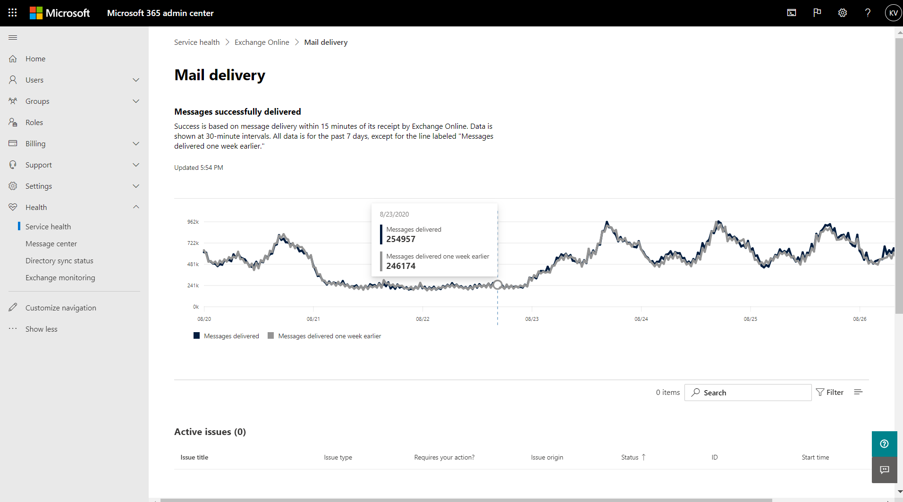

# 適用於 Microsoft 365 的 Exchange Online 監視Exchange Online monitoring for Microsoft 365

您可以在 Microsoft 365 系統管理中心使用 Exchange Online 監視，監視組織之 Microsoft 365 訂閱的 Exchange 服務健康情況。You can use Exchange Online monitoring in the Microsoft 365 admin center to monitor the health of the Exchange service for your organization’s Microsoft 365 subscription. Exchange Online 監視可為您提供下列類別的事件和建議相關資訊：Exchange Online monitoring provides you with information about incidents and advisories that are collected in these categories:

- **基礎結構**：在 Microsoft 擁有的 Microsoft 365 基礎結構中偵測問題，以提供定期更新並解決問題。**Infrastructure**: Issue is detected in the Microsoft 365 infrastructure that Microsoft owns for providing regular updates and resolving the issue. 例如，因為 Exchange 或其他 Microsoft 365 雲端基礎結構問題，導致使用者無法存取 Exchange Online。For example, users cannot access Exchange Online because of issues with Exchange or other Microsoft 365 cloud infrastructure.
- **協力廠商基礎結構**：在組織依賴的協力廠商基礎結構中偵測問題，且需要組織採取措施才能解決。**Third-party infrastructure**: Issue is detected in third-party infrastructure on which your organization has taken a dependency and requires action from your organization for resolution. 例如，使用者驗證交易會受到協力廠商安全性權杖服務 (STS) 提供者的限制，防止使用者連線到 Exchange Online。For example, user authentication transactions are getting throttled by a third-party security token service (STS) provider that prevents users from connecting to Exchange Online.
- **客戶基礎結構**：在您的組織基礎結構中偵測問題，且需要組織採取措施才能解決。**Customer infrastructure**: Issue is detected in your organization's infrastructure and requires action from your organization for resolution. 例如，使用者無法存取 Exchange Online，因為他們無法取得由貴組織託管的 STS 提供者提供的驗證權杖，因為該憑證已過期。For example, users cannot access Exchange Online because they are unable to obtain an authentication token from STS provider hosted by your organization because of an expired certificate.

以下是 Microsoft 365 系統管理中心的 **[服務健康情況]** 頁面範例，可從 [健康情況] > **[服務健康情況]** 進入此頁面。Here is an example of the **Service health** page in the Microsoft 365 admin center, available from **Health > Service health**.

![Microsoft 365 系統管理中心的 [服務健康情況] 頁面](../media/microsoft-365-exchange-monitoring/service-health-dashboard-example.png)

**[狀態]** 欄的值會根據 Microsoft 所維護的雲端服務，指出服務是否健康或是否有建議或事件發生。The value of the **Status** column indicates whether the service is healthy or has advisories or incidents based on the cloud services that Microsoft maintains. 

**[您的組織和協力廠商問題]** 欄的值指出您組織的基礎結構，或協力廠商軟體影響到您的使用者使用 Exchange Online 的服務健康狀況。The value of the **Your org and 3rd party issues** column indicates that your organization's infrastructure or third-party software affects your users service health experience with Exchange Online. *「您」* 必須採取行動才能解決建議或事件。Advisories or incidents require *your* actions to resolve.

以下是 Microsoft 365 系統管理中心的 **[Exchange Online]** 監視頁面範例，可從 **[健康情況] > [服務健康情況]> [Exchange Online]** 進入此頁面。Here is an example of the **Exchange Online** monitoring page in the Microsoft 365 admin center, available from **Health > Service health > Exchange Online**.

使用 **[Exchange Online]** 監視頁面，您可以查看 Exchange Online 服務是否健康，以及是否有任何相關的事件或建議。With the **Exchange Online** monitoring page, you can see whether the Exchange Online service is healthy or not and whether there are any associated incidents or advisories. 透過 Exchange Online 監視，您可以查看特定電子郵件案例的服務健康情況，並檢視近即時訊號來判斷案例帶來的影響。With Exchange Online monitoring, you can look at the service health for specific email scenarios and view near real-time signals to determine the impact by scenario. 

## 需求Requirements

符合以下需求的客戶可以啟用此預覽：This preview is enabled for customers who meet these requirements: 

- 組織必須擁有至少 10,000 個授權數，從一或下列產品的組合中：Office 365 E3、Microsoft 365 E3、Office 365 E5、Microsoft 365 E5。Your organization needs to have a license count of at least 10,000, from one or a combination of these products: Office 365 E3, Microsoft 365 E3, Office 365 E5, Microsoft 365 E5. 

  例如，您的組織可以擁有 3,000 個 Office 365 E3 授權，以及 8,500 個 Microsoft 365 E5，這樣總計為 11,500 個授權產品即符合資格。For example, your organization can have 3,000 Office 365 E3 licenses and 8,500 Microsoft 365 E5, for a total of 11,500 licenses from the qualifying products.

- 您的組織每月至少需要有 50 位作用中 Exchange Online 使用者Your organization needs to have at least 50 monthly active Exchange Online users.

使用 Exchange Online 監視，您可以根據電子郵件讀取活動檢視下列電子郵件用戶端的健康情況：With Exchange Online monitoring you can view the health for the following email clients based on email read activity:

- Outlook 電腦版Outlook Desktop
- Outlook 網頁版Outlook on the Web
- iOS 和 Android 的原生郵件用戶端Native mail clients of iOS and Android 
- iOS 和 Android 版 Outlook 行動裝置應用程式Outlook Mobile app in iOS and Android 
- Outlook Mac 用戶端Outlook Mac client

對於這些用戶端，您可以根據讀取電子郵件的使用者查看最近 30 分鐘的作用中使用者數量，以及儀表板中的事件和建議數量。For these clients, you can see the number of active users in the last 30 minutes based on users reading an email, along with number of incidents and advisories in the dashboard. 這個資料會與前一週相同間隔的資料進行比較，看看是否有問題。This data is compared to the same interval for the previous week to see if there’s an issue. 

>[!Note]
> 作用中使用者計數是由單一活動來計算，例如，使用者讀取電子郵件。Active user count is measured by a single activity, for example, when a user reads an email. 僅限活動的最後 30 分鐘。It only accounts for the last 30 minutes of activity.
>

您也可以監視下列案例的 Exchange Online 健康情況：You can also monitor Exchange Online health for the following scenarios:

- **郵件流程**：郵件到達 Microsoft 365 網路後，成功傳遞到信箱而不會有任何延遲的郵件數目。**Mail flow**: The number of messages successfully delivered to a mailbox without any delay after the message reached the Microsoft 365 network. 
- **基本驗證和新式驗證**：在 Exchange Online 服務中成功驗證的使用者數目。**Basic Authentication and Modern Authentication**: The number of users successfully validated in the Exchange Online service.

對於所有這些案例，關鍵數目是主儀表板中最後 30 分鐘的數目。For all these scenarios, the key numbers are for the last 30 minutes in the main dashboard. 這些案例中每一個案例的詳細檢視都顯示了與前一週相比，過去 7 天總計 30 分鐘的近即時趨勢。Detailed views for each of these scenarios shows the near real-time trend for seven days with the 30-minute aggregate compared with the previous week. 

## 傳送意見反應給我們Send us feedback

有兩種方式可提供意見反應：There are two ways you can provide feedback:

- 使用 Microsoft 365 系統管理中心中，每個頁面均提供的 **[提供意見反應]** 選項。Use the **Give feedback** option available on every page of the Microsoft 365 admin center.
- 針對特定事件或建議，使用 **[此文章是否有幫助?]** 連結提交意見反應。Submit feedback using the **Is this post helpful?** link for a specific incident or advisory.

## 常見問題集Frequently asked questions

#### 1. 為什麼我在 Microsoft 365 系統管理中心沒看到「Exchange Online 監視」?1. Why don’t I see “Exchange Online monitoring” under Health in the Microsoft 365 admin center? 

首先，請確定您已在 Microsoft 365 系統管理中心的 **[首頁]** 頁面上啟用新的系統管理中心。First, make sure you’ve enabled the new admin center on the **Home** page of the Microsoft 365 admin center. 

然後，確定您符合下列兩個需求：Then make sure you meet both of the following requirements: 

- 組織必須擁有至少 10,000 個授權數，從一或下列產品的組合中：Office 365 E3、Microsoft 365 E3、Office 365 E5、Microsoft 365 E5。Your organization needs to have a license count of at least 10,000, from one or a combination of these products: Office 365 E3, Microsoft 365 E3, Office 365 E5, Microsoft 365 E5. 
- 您的組織每月至少需要有 50 位作用中 Exchange Online 使用者Your organization needs to have at least 50 monthly active Exchange Online users.

如果組織的授權數量少於 10,000 位使用者，且每月作用中使用者少於 50 位，則必須先符合這些需求，才會啟用 Exchange Online 監視。If the license count for your organization goes below 10,000 users and the monthly active users goes below 50 users, Exchange Online monitoring won’t be enabled until these requirements are met.

#### 2. 儀表板中每個用戶端的作用中使用者數太低。2. The active user count in the dashboard for each client appears to be low. 我們已將大量的作用中授權指派給使用者。We have a lot of active licenses assigned to users. 這代表什麼意思？What does this mean? 

監視中顯示的作用中使用者數是以 30 分鐘為基礎，使用者在該時間內執行功能呼叫的活動。The active user count shown in monitoring is based on a 30-minute window where users have performed the activity called out in the feature. 不應將此與使用次數混淆。This shouldn’t be confused with usage numbers. 若要檢視使用次數，請使用 Microsoft 365 系統管理中心的活動報告 (**[報告] > [使用狀況]**)。To view usage numbers, use activity reports in the Microsoft 365 admin center (**Reports > Usage**).

#### 3. Teams 和 SharePoint 等其他服務是否還有其他監視案例？3. Will there be other monitoring scenarios for other services such as Teams and SharePoint? 

Microsoft 已在 Microsoft 365 系統管理中心的 [服務健康情況] 儀表板中直接整合了此體驗。Microsoft is integrating this experience directly inside the Service Health dashboard in the Microsoft 365 admin center. 這將為 Microsoft 提供擴充其他服務監視案例的機會，而當有最新消息時，我們將予以公佈。This will provide opportunities for Microsoft to extend monitoring scenarios for other services, which will be announced when there is news to share. 

#### 4. 針對這項體驗有何正式發行計劃？4. What is the plan for general availability of this experience? 

Microsoft 已在 Microsoft 365 系統管理中心的 **[服務健康情況]** 儀表板中直接整合 Exchange Online 監視功能。Microsoft has integrated Exchange Online monitoring directly on the **Service Health** dashboard in the Microsoft 365 admin center. 

透過這項全新的整合體驗，Microsoft 計劃先收集您的意見反應，然後再定義正式發行的計劃。With this new integrated experience, Microsoft's plan is to collect your feedback and then define our plan for general availability.

#### 5. 這是免費 (隨附) 或付費 (額外) 功能？5. Is this a free (included) or paid (extra) feature? 

這項功能處於公開預覽階段，且僅適用於符合問題 1 中需求的客戶。This feature is in Public preview and only available for customers that meet the requirements in question 1.

<!--
>[!Note]
>INTERNAL: That decision is pending
>
--> 

#### 6. 如何提供意見反應？6. How do I provide feedback? 

一般意見反應，請使用 **[Exchange Online]** 監視頁面右下角的 **[提供意見反應]** 圖示。For general feedback, use the **Give feedback** icon on the bottom-right corner of the **Exchange Online** monitoring page. 

有關事件或建議的意見反應，請使用 **[此文章是否有幫助?]** 連結。For feedback on incidents or advisories, use the **Is this post helpful?** link.

#### 7. 顯示活動趨勢的案例資料在哪裡檢測？7. Where is the data instrumented for the scenarios that show activity trends?

會在 Exchange Online 服務中檢測資料。The data is instrumented in the Exchange Online service. 如果在要求到達 Exchange Online 前發生錯誤，或 Exchange Online 中發生錯誤，則活動訊號將會下降。If there is a failure that happens before the request reaches Exchange Online or there is a failure in Exchange Online, you will see a drop in the activity signal.

