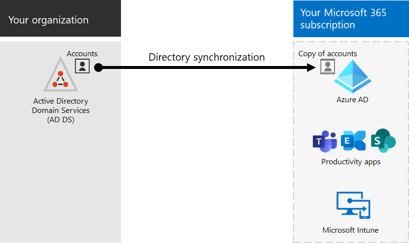

# 與內部部署環境的整合 Microsoft 365

*本文適用於 Microsoft 365 企業版和 Office 365 企業版。*

您可以使用現有的內部部署 Active Directory 網域服務，將 Microsoft 365 與現有的內部部署 Active Directory 網域服務 (AD DS) 和內部部署安裝的 Exchange Server、商務用 Skype Server 2015 或 SharePoint Server 整合。
  
 - 當您整合 AD DS 時，您可以同步處理及管理這兩種環境的使用者帳戶。 您也可以新增密碼雜湊同步處理 (PHS) 或單一登入 (SSO) ，讓使用者能夠使用內部部署認證登入這兩種環境。
 - 當您整合內部部署伺服器產品時，您會建立混合式環境。 混合式環境可協助您將使用者或資訊遷移至 Microsoft 365，也可以繼續將部分使用者或部分資訊放入內部部署，並在雲中進行。 如需混合式環境的詳細資訊，請參閱 [混合雲端](../solutions/cloud-architecture-models.md#hybrid)。

您也可以在 Microsoft 365 系統管理中心中，使用 Azure Active Directory (Azure AD) 顧問，以取得自訂安裝指導， (您必須登入 Microsoft 365) ：

- [Azure AD 安裝指南](https://aka.ms/aadpguidance)
- [從您的組織目錄同步處理使用者](https://aka.ms/aadconnectpwsync)
- [Active Directory Federation Services (AD FS) 部署顧問](https://aka.ms/adfsguidance)
   
## 開始之前

在整合 Microsoft 365 和內部部署環境之前，您也需要進行[網路規劃和效能調整](network-planning-and-performance.md)。 您也會想要瞭解可用的身分 [識別模型](about-microsoft-365-identity.md)。 

請參閱[管理 Microsoft 365 帳戶](manage-microsoft-365-accounts.md)，以取得可用於管理 Microsoft 365 使用者帳戶的工具清單。 
  
## 將 Microsoft 365 與 AD DS 整合

如果您在 AD DS 中有現有的使用者帳戶，您不想要在 Microsoft 365 中重新建立所有這些帳戶，以及在環境間引入差異或錯誤的風險。 目錄同步處理可協助您在您的內部部署與線上環境間鏡像這些帳戶。 透過目錄同步作業，您的使用者不需要記住每個環境的新資訊，而且您不需要建立或更新帳戶兩次。 您將需要 [準備內部部署目錄](prepare-for-directory-synchronization.md) ，以進行目錄同步處理。
  

  
如果您想要讓使用者能夠使用內部部署認證登入 Microsoft 365，您也可以設定 SSO。 使用 SSO 時，Microsoft 365 設定為信任內部部署環境以進行使用者驗證。
  

### 目錄同步處理時使用或不使用密碼雜湊同步處理或未通過驗證 (PTA) 

使用者使用使用者帳戶登入其內部部署環境 (網域 \ 使用者名稱) 。 當他們前往 Microsoft 365 時，他們必須使用其工作或學校帳戶 (user@domain.com) 登入。 這兩個環境中的使用者名稱相同。 當您新增 PHS 或 PTA 時，使用者會在兩個環境中使用相同的密碼，但在登入 Microsoft 365 時，必須提供這些認證。 目錄與 PHS 的同步處理是最常使用的目錄同步處理。

若要設定目錄同步處理，請使用 Azure AD 連線。 如需相關指示，請參閱[使用 express 設定](/azure/active-directory/hybrid/how-to-connect-install-express)Microsoft 365 的和 Azure AD 連線[設定目錄同步](set-up-directory-synchronization.md)處理。

深入瞭解[準備目錄同步處理至 Microsoft 365](prepare-for-directory-synchronization.md)。

### 與 SSO 同步處理的目錄

使用者可以使用其使用者帳戶登入其內部部署環境。 當他們前往 Microsoft 365 時，會自動登入這些記錄，或者使用其內部部署環境所用的相同認證來登入 (網域 \ 使用者名稱) 。

若要設定 SSO，您也可以使用 Azure AD 連線。 如需相關指示，請參閱[AZURE AD 連線的自訂安裝](/azure/active-directory/hybrid/how-to-connect-install-custom)。

如需詳細資訊，請參閱 [單一登入](/azure/active-directory/manage-apps/what-is-single-sign-on)。

## Azure AD Connect

Azure AD 連線取代舊版本的身分識別整合工具，例如 DirSync 和 Azure AD 同步。若要從 Azure Active Directory 同步處理至 Azure AD 連線，請參閱[升級指示](/azure/active-directory/hybrid/how-to-dirsync-upgrade-get-started)。 

## 另請參閱

[Microsoft 365 企業版概觀](microsoft-365-overview.md)