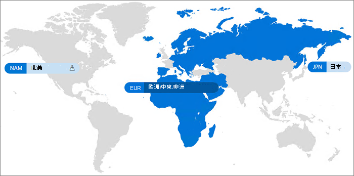

# Microsoft 365 多地理位置Microsoft 365 Multi-Geo

使用 Microsoft 365 多地理位置，貴組織可以將 Microsoft 365 目前狀態拓展至您現有租用戶中的多個地理區域及/或國家。請連絡 Microsoft 帳戶小組以註冊 Microsoft 365 多地理位置的多國公司。With Microsoft 365 Multi-Geo, your organization can expand its Microsoft 365 presence to multiple geographic regions and/or countries within your existing tenant. Reach out to your Microsoft Account Team to sign up your Multi-National Company for Microsoft 365 Multi-Geo.
  
您可以使用 Microsoft 365 多地理位置，在您所選擇的地理位置佈建和儲存待用資料以符合資料落地要求，同時將現代化生產力體驗逐步拓展至您的員工。With Microsoft 365 Multi-Geo, you can provision and store data at rest in the geo locations that you've chosen to meet data residency requirements, and at the same time unlock your global roll out of modern productivity experiences to your workforce.

如需 Microsoft 365 多地理位置的影片簡介，請參閱 [SharePoint Online 和 OneDrive 多地理位置，以控制資料存放處](https://www.youtube.com/watch?v=Do9U3JuROhk)。For a video introduction to Microsoft 365 Multi-Geo, see [SharePoint Online and OneDrive Multi-Geo to control where your data resides](https://www.youtube.com/watch?v=Do9U3JuROhk).

## 多個地理位置架構Multi-Geo architecture

在多地理位置環境中，Microsoft 365 租用戶包含中央位置 (即原始佈建 Microsoft 365 訂閱之處) 以及一或多個衛星位置。在多地理位置租用戶中，系統會在 Azure Active Directory (Azure AD) 中主控地理位置、群組和使用者資訊的相關資訊。因為您的租用戶資訊是集中管理且同步處理到每個地理位置，包含公司任何人的共用與體驗都會包含全域意識。In a Multi-Geo environment, your Microsoft 365 tenant consists of a central location (where your Microsoft 365 subscription was originally provisioned) and one or more satellite locations. In a multi-geo tenant, the information about geo locations, groups, and user information, is mastered in Azure Active Directory (Azure AD). Because your tenant information is mastered centrally and synchronized into each geo location, sharing and experiences involving anyone from your company contain global awareness.

請注意，Microsoft 365 多地理位置不是為效能最佳化優化而設計，其主要設計目的在滿足資料落地要求。Note that Microsoft 365 Multi-Geo is not designed for performance optimization, it is designed to meet data residency requirements. 如需 Microsoft 365 效能最佳化的詳細資訊，請參閱 [Microsoft 365 的網路規劃與效能調整](https://support.office.com/article/e5f1228c-da3c-4654-bf16-d163daee8848)或連絡客戶支援小組。For information about performance optimization for Microsoft 365, see [Network planning and performance tuning for Microsoft 365](https://support.office.com/article/e5f1228c-da3c-4654-bf16-d163daee8848) or contact your support group.

## 術語Terminology

以下是用於說明 Microsoft 365 多地理位置的重要詞彙：Here are the key terms used in describing Microsoft 365 Multi-Geo:

- **中央位置** - 佈建租用戶的原始地理位置。**Central location** - the geo location where your tenant was originally provisioned.
- **地理位置管理員** - 系統管理員，可以管理一或多個指定的衛星位置。**Geo administrator** - An administrator who can administer one or more specified satellite locations.
- **地理位置代碼** - 表示特定地理位置的三個字母代碼。**Geo code** - a three-letter code for a given geo location.
- **地理位置** – 用於在多地理位置租用戶中主控資料的地理位置，包括 Exchange 信箱以及 OneDrive 和 SharePoint 網站。**Geo location** – A geographic location that can be used in a multi-geo tenant to host data, including Exchange mailboxes and OneDrive and SharePoint sites.
- **慣用的資料位置 (PDL)** - 由系統管理員設定的使用者屬性，表示應佈建使用者 Exchange 信箱和 OneDrive 的地理位置。**Preferred Data Location (PDL)** – A user property set by the administrator that indicates where the geo location where the users Exchange mailbox and OneDrive should be provisioned. PDL 還可決定要在哪裡佈建使用者建立的 SharePoint 網站。The PDL also determines where SharePoint sites that are created by the user are provisioned.
- **衛星位置** – 在多地理位置租用戶中啟用地理感知 Microsoft 365工作量 (SharePoint、OneDrive和 Exchange) 的地理位置。**Satellite location** – The geo locations where the geo-aware Microsoft 365 workloads (SharePoint, OneDrive, and Exchange) are enabled in a multi-geo tenant.
- **租用戶** – 組織在 Microsoft 365 中的呈現方式，通常會有與其相關聯的一個或多個網域 (例如 contoso.com)。**Tenant** – An organization's representation in Microsoft 365 which typically has one or more domains associated with it (for example, contoso.com).

## 授權Licensing

Microsoft 365 多地理位置可作為以下 Microsoft 365 訂閱方案的附加元件，這些 Enterprise 合約客戶的租用戶中至少有 250 個 Microsoft 365 基座，其中至少有 5% 使用多地理位置。Microsoft 365 Multi-Geo is available as an add-on to the following Microsoft 365 subscription plans for Enterprise Agreement customers with a minimum of 250 Microsoft 365 seats in their tenant, and a minimum of 5% of those seats using multi-geo. 使用者訂閱授權必須位於與多地理位置服務授權相同的 Enterprise 合約上。User subscription licenses must be on the same Enterprise Agreement as the Multi-Geo Services licenses. 如需詳細資訊，請連絡您的 Microsoft 帳戶小組。Please contact your Microsoft account team for details.

- Microsoft 365 F1、F3、E3 或 E5Microsoft 365 F1, F3, E3, or E5
- Office 365 F3、E1、E3 或 E5Office 365 F3, E1, E3, or E5
- Exchange Online 方案 1 或方案 2Exchange Online Plan 1 or Plan 2
- 商務用 OneDrive 方案 1 或方案 2OneDrive for Business Plan 1 or Plan 2
- SharePoint Online 方案 1 或方案 2SharePoint Online Plan 1 or Plan 2

## Microsoft 365 多地理位置可用性Microsoft 365 Multi-Geo availability

目前在這些地區與國家中提供 Microsoft 365 多地理位置：Microsoft 365 Multi-Geo is currently offered in these regions and countries:

[!INCLUDE [Microsoft 365 Multi-Geo locations](../includes/microsoft-365-multi-geo-locations.md)]

## 快速入門Getting started

按照這些步驟來開始使用多地理位置：Follow these steps to get started with multi-geo:

1. 與您的帳戶團隊合作來新增「Microsoft 365 多地理位置功能」服務方案。Work with your account team to add the _Multi-Geo Capabilities in Microsoft 365_ service plan. 他們會引導您新增所需數量的授權。They will guide you to add the number of licenses needed. 多地理位置功能可供具有至少 250 個 Microsoft 365 訂閱的 EA 客戶使用。Multi-Geo feature is available to EA customers with a minimum of 250 Microsoft 365 subscriptions.

   開始使用 Microsoft 365 多地理位置之前，Microsoft 必須先設定您的 Exchange Online 租用戶，以支援多地理位置。Before you can start using Microsoft 365 Multi-Geo, Microsoft needs to configure your Exchange Online tenant for multi-geo support. 當您訂購「Microsoft 365 中的多地理位置功能」服務方案，並於租用戶中顯示授權之後，將觸發此一次性設定程序。This one-time configuration process is triggered after you order the *Multi-Geo Capabilities in Microsoft 365* service plan and the licenses show up in your tenant. 當您的租用戶完成每個工作負載的設定程式後，您就會在 [Microsoft 365 訊息中心](https://support.office.com/article/38FB3333-BFCC-4340-A37B-DEDA509C2093)中收到工作負載指定通知，然後您就可以開始設定並使用您的 Microsoft 365 多地理位置功能。You will receive workload-specific notifications in the [Microsoft 365 message center](https://support.office.com/article/38FB3333-BFCC-4340-A37B-DEDA509C2093) once your tenant has completed the configuration process for each workload, and you then may begin configuring and using your Microsoft 365 Multi-Geo capabilities. 將租使用者設定為多地域位置支援所需的時間，會因租使用者而異，但大部分租使用者會在收到功能授權後的一個月內完成設定。The time required to configure a tenant for Multi-Geo support varies from tenant to tenant, but most tenants finish within a month after receipt of the feature licenses. 較大或較複雜的租使用者可能需要更多時間才能完成設定程式。Larger or more complex tenants may require more time to complete the configuration process. 如需有關特定租使用者的詳細資料，請與您的帳戶小組聯繫。Please contact your account team for details on your specific tenant should you require it.

2. 閱讀[規劃多地理位置環境](plan-for-multi-geo.md)。Read [Plan your multi-geo environment](plan-for-multi-geo.md).

3. 深入了解[管理多地理位置環境](administering-a-multi-geo-environment.md)與[使用者會遇到的環境](multi-geo-user-experience.md)。Learn about [administering a multi-geo environment](administering-a-multi-geo-environment.md) and [how your users will experience the environment](multi-geo-user-experience.md).

4. 當您準備好設定 Microsoft 365 多地理位置，請[設定租用戶以支援多地理位置](multi-geo-tenant-configuration.md)。When you are ready to set up Microsoft 365 Multi-Geo, [configure your tenant for multi-geo](multi-geo-tenant-configuration.md).

5. [設定搜尋](configure-search-for-multi-geo.md)。[Set up search](configure-search-for-multi-geo.md).

## 請參閱See also

[Exchange Online 和 OneDrive 中的多地理位置Multi-Geo in Exchange Online and OneDrive](https://Aka.ms/GoMultiGeo)

[OneDrive 和 SharePoint Online 中的多地理位置功能Multi-Geo Capabilities in OneDrive and SharePoint Online](multi-geo-capabilities-in-onedrive-and-sharepoint-online-in-microsoft-365.md)

[Exchange Online 中的多地理位置功能Multi-Geo Capabilities in Exchange Online](multi-geo-capabilities-in-exchange-online.md)

[多地理位置環境中的 Teams 體驗Teams experience in a multi-geo environment](/microsoftteams/teams-experience-o365odb-spo-multi-geo)