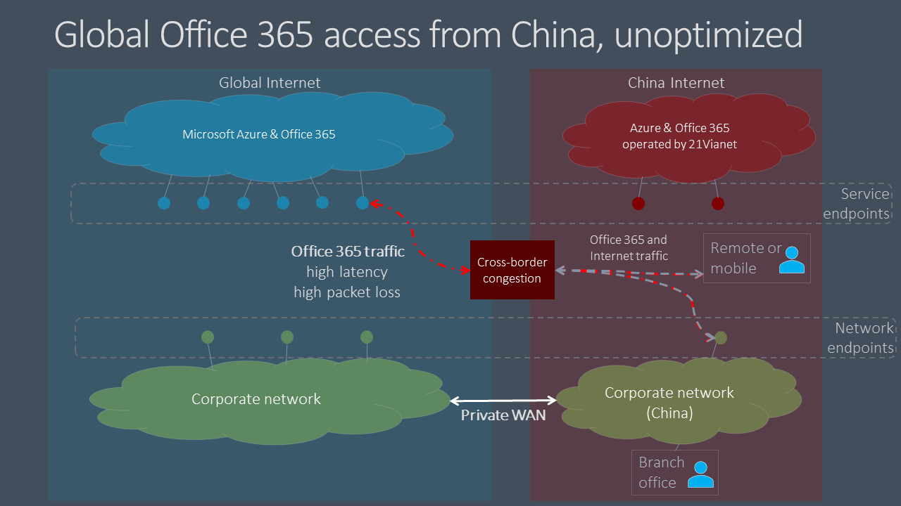

# 適用于中國使用者的 Microsoft 365 全域租使用者效能優化Microsoft 365 global tenant performance optimization for China users

>[!IMPORTANT]
>本指南專屬於使用案例，在該案例中， **企業的 microsoft 365 使用者** 會連接到 **全域 Microsoft 365 租** 使用者。This guidance is specific to usage scenarios in which **enterprise Microsoft 365 users located in China** connect to a **global Microsoft 365 tenant**. 本 **指南不適用於** 由世紀運作之 Office 365 中的承租人。This guidance does **not** apply to tenants in Office 365 operated by 21Vianet.

針對具有全球 Microsoft 365 租使用者的企業和中國的公司形象，中國使用者的 Microsoft 365 用戶端效能對中國電信的網際網路架構而言是很複雜的因素。For enterprises with global Microsoft 365 tenants and a corporate presence in China, Microsoft 365 client performance for China-based users can be complicated by factors unique to China Telco's Internet architecture.

中國 Isp 對全球公用網際網路的管制 offshore 連線，而這些裝置會透過可能會高層次的跨框線網路擁塞的周邊裝置。China ISPs have regulated offshore connections to the global public Internet that go through perimeter devices that are prone to high-levels of cross-border network congestion. 這項擁塞會針對所有進出中國的網際網路流量，建立封包遺失和延遲。This congestion creates packet loss and latency for all Internet traffic going into and out of China.

封包遺失和延遲對網路服務的效能有不利的影響，尤其是需要大量資料交換的服務 (例如大型檔案傳輸) 或需要接近即時效能 (音訊和影片應用程式) 。Packet loss and latency are detrimental to the performance of network services, especially services that require large data exchanges (such as large file transfers) or requiring near real-time performance (audio and video applications).

本主題的目標是提供最佳作法，以減輕 Microsoft 365 服務上的中國跨框線網路擁塞的影響。The goal of this topic is to provide best practices for mitigating the impact of China cross-border network congestion on Microsoft 365 services. 本主題不會解決其他常見的最後一個效能問題，例如由於中國運營商中的複雜路由而導致大量資料包延遲的問題。This topic does not address other common last-mile performance issues such as issues of high packet latency due to complex routing within China carriers.

## 公司網路的最佳作法Corporate network best practices

許多具有全球 Microsoft 365 承租人和中國使用者的企業，都已在全球範圍內實施含公司網路流量的私人網路與 offshore 位置之間的流量。Many enterprises with global Microsoft 365 tenants and users in China have implemented private networks that carry corporate network traffic between China office locations and offshore locations around the world. 這些企業可以利用此網路基礎結構，避免跨框線網路擁塞，並在中國優化其 Microsoft 365 服務效能。These enterprises can leverage this network infrastructure to avoid cross-border network congestion and optimize their Microsoft 365 service performance in China.

>[!IMPORTANT]
>就像所有私人 WAN 實施一樣，您必須為您的國家和/或地區參考法規需求，以確保您的網路設定符合規範。As with all private WAN implementations, you should always consult regulatory requirements for your country and/or region to ensure that your network configuration is in compliance.

第一步，您必須遵循 [Microsoft 365 的網路規劃和效能調整](./network-planning-and-performance.md)，遵循我們的基準網路指導方針。As a first step, it is crucial that you follow our benchmark network guidance at [Network planning and performance tuning for Microsoft 365](./network-planning-and-performance.md). 主要目標應該是盡可能避免從中國網際網路存取全球 Microsoft 365 服務。The primary goal should be to avoid accessing global Microsoft 365 services from the Internet in China if possible.

- 利用您現有的私人網路，在中國辦公網路和 offshore 位置之間傳送 Microsoft 365 網路流量，該位置是在中國以外的公用網際網路上出口。Leverage your existing private network to carry Microsoft 365 network traffic between China office networks and offshore locations that egress on the public Internet outside China. 在中國以外的任何位置幾乎都會提供明確的利益。Almost any location outside China will provide a clear benefit. 網路系統管理員可以透過使用 [Microsoft 全球網路](https://docs.microsoft.com/azure/networking/microsoft-global-network)的低延遲互連區域中的 egressing 進行進一步的優化。Network administrators can further optimize by egressing in areas with low-latency interconnect with the [Microsoft global network](https://docs.microsoft.com/azure/networking/microsoft-global-network). 香港，日本和韓國為範例。Hong Kong, Japan, and South Korea are examples.
- 設定使用者裝置以透過 VPN 連線存取公司網路，以允許 Microsoft 365 流量傳輸公司網路的私人 offshore 連結。Configure user devices to access the corporate network over a VPN connection to allow Microsoft 365 traffic to transit the corporate network's private offshore link. 確定 VPN 用戶端未設定成使用分割隧道，或使用者裝置已設定為忽略 Microsoft 365 流量的分割隧道。Ensure that VPN clients are either not configured to use split tunneling, or that user devices are configured to ignore split tunneling for Microsoft 365 traffic. 如需優化小組和即時媒體流量之 VPN 連線的詳細資訊， [請參閱本節](#optimizing-microsoft-teams-meetings-network-performance-for-users-in-china)。For additional information on optimizing VPN connectivity for Teams and real-time media traffic, see [this section](#optimizing-microsoft-teams-meetings-network-performance-for-users-in-china).
- 設定您的網路以路由傳送您私人 offshore 連結的所有 Microsoft 365 流量。Configure your network to route all Microsoft 365 traffic across your private offshore link. 如果您必須將私人連結的流量降到最低，您可以選擇只在 [ **優化** ] 類別中路由終結點，並允許要求 **允許** 和 **預設** 端點傳輸網際網路。If you must minimize the volume of traffic on your private link, you can choose to only route endpoints in the **Optimize** category, and allow requests to **Allow** and **Default** endpoints to transit the Internet. 這可將優化的流量限制在高延遲和封包遺失的重要服務上，以提升效能，並將頻寬消耗降至最低。This will improve performance and minimize bandwidth consumption by limiting optimized traffic to critical services that are most sensitive to high latency and packet loss.
- 如果可能的話，請使用 UDP （而非 TCP）即時媒體資料流程流量，例如用於小組。If possible, use UDP instead of TCP for live media streaming traffic, such as for Teams. UDP 可提供比 TCP 更佳的即時媒體資料流程效能。UDP offers better live media streaming performance than TCP.

如需如何選擇性路由 Microsoft 365 流量的相關資訊，請參閱 [管理 Office 365 端點](managing-office-365-endpoints.md)。For information about how to selectively route Microsoft 365 traffic, see [Managing Office 365 endpoints](managing-office-365-endpoints.md). 如需所有全球 Office 365 URLs 及 IP 位址的清單，請參閱 [Office 365 URLs 和 ip 位址範圍](urls-and-ip-address-ranges.md)。For a list of all worldwide Office 365 URLs and IP addresses, see [Office 365 URLs and IP address ranges](urls-and-ip-address-ranges.md).

## 使用者最佳作法User best practices

在中國與商業網路無連線的情況下，從遠端位置（例如，住房、咖啡店、旅館及分公司）連線至全球 Microsoft 365 租使用者的使用者，由於其裝置和 Microsoft 365 之間的流量必須傳輸中國網路的擁塞網路電路，因此可能會產生較低的網路效能。Users in China who connect to global Microsoft 365 tenants from remote locations such as homes, coffee shops, hotels, and branch offices with no connection to enterprise networks can experience poor network performance because traffic between their devices and Microsoft 365 must transit China's congested cross-border network circuits.

如果在公司網路中的跨框線私人網路絡和/或 VPN 存取不是一個選項，請訓練您的中國使用者來遵循這些最佳作法，以降低個別使用者的效能問題。If cross-border private networks and/or VPN access into the corporate network are not an option, per-user performance issues can still be mitigated by training your China-based users to follow these best practices.

- 利用支援快取的豐富 Office 用戶端 (例如，Outlook、小組、OneDrive 等 ) 和避免網路型用戶端。Utilize rich Office clients that support caching (e.g. Outlook, Teams, OneDrive, etc.), and avoid web-based clients. Office 用戶端快取及離線存取功能可大幅減少網路擁塞和延遲的影響。Office client caching and offline access features can dramatically reduce the impact of network congestion and latency.
- 如果您的 Microsoft 365 租使用者已設定 _音訊會議_ 功能，小組使用者可以透過公用交換電話網路 (PSTN) 加入會議。If your Microsoft 365 tenant has been configured with the _Audio Conferencing_ feature, Teams users can join meetings via the public switched telephone network (PSTN). 如需詳細資訊，請參閱 [Office 365 中的音訊會議](/microsoftteams/audio-conferencing-in-office-365)。For more information, see [Audio Conferencing in Office 365](/microsoftteams/audio-conferencing-in-office-365).
- 如果使用者遇到網路效能問題，他們應該向其 IT 部門報告疑難排解，並在懷疑 Microsoft 365 服務發生問題時升級至 Microsoft 支援服務。If users experience network performance issues, they should report to their IT department for troubleshooting, and escalate to Microsoft support if trouble with Microsoft 365 services is suspected. 並非所有問題都是由跨框線的網路效能所造成。Not all issues are caused by cross-border network performance.

## 優化 Microsoft 團隊會議中使用者的網路效能Optimizing Microsoft Teams meetings network performance for users in China  

針對具有全球 Microsoft 365 租使用者的組織和中國的目前狀態，中國型使用者的 Microsoft 365 用戶端效能可能會複雜于中國網際網路架構獨有的因素。For organizations with global Microsoft 365 tenants and a presence in China, Microsoft 365 client performance for China-based users can be complicated by factors unique to the China Internet architecture. 透過下列指導，許多公司和學校都已經報告好的結果。Many companies and schools have reported good results by following this guidance. 不過，此範圍會限制在控制 IT 網路安裝的使用者網路位置，例如，office 位置或具有 VPN 連線的家用/行動電話端點。However, the scope is limited to user network locations that are under control of the IT networking setup, for example, office locations or home/mobile endpoints with VPN connectivity. Microsoft 小組通話和會議通常是從外部位置（例如，家用辦事處、行動地點、旅途中和咖啡店）使用。Microsoft Teams calls and meetings are often used from external locations, such as home offices, mobile locations, on the road, and coffee shops. 因為呼叫和會議依賴即時媒體流量，所以這些小組體驗對網路擁塞特別敏感。Because calls and meetings rely on real-time media traffic, these Teams experiences are particularly sensitive to network congestion.

因此，Microsoft 已與電信服務提供者合作，以隨身攜帶小組和商務用 Skype Online 即時媒體流量，其使用的國內和公用電話 internet connections 之間的高品質優先網路路徑，以及 Microsoft 365 global cloud 中的團隊和 Skype 服務。As a result, Microsoft has partnered with telecommunications providers to carry Teams and Skype for Business Online real-time media traffic using a higher-quality, preferential network path between domestic and public internet connections in China and the Teams and Skype services in the Microsoft 365 global cloud. 這項功能產生的封包遺失和其他關鍵度量值的增加率超過10個，這會影響使用者的經驗。This capability has resulted in a more than ten-fold improvement in packet loss and other key metrics impacting your user's experience.

>[!IMPORTANT]
>目前，這些改進功能不會利用小組或 Microsoft 資料流程參加 Microsoft Live Events 會議，例如大型廣播或 "城鎮廳" 樣式會議。Currently, these improvements do not address attending Microsoft Live Events meetings such as large broadcast or “town hall” style meetings using Teams or Microsoft Stream. 若要查看即時事件會議，中國的使用者需要使用私人網路或 SDWAN/VPN 解決方案。To view a Live Events meeting, users in China need to use a private network or SDWAN/VPN solution. 不過，網路增強功能將有益於呈現或產生即時事件會議的使用者，因為該經驗是做為製造者或簡報者的一般小組會議。However, the network improvements will benefit users who are presenting or producing a Live Events meeting, because that experience acts as a regular Teams meeting for the producer or presenter.

### 團隊會議的組織網路最佳作法Organization network best practices for Teams meetings

在下列情況下，您必須考慮如何利用這些網路增強功能（假定先前的指南考慮私人網路絡擴充，以避免跨框線網路擁塞）。You need to consider how to leverage these network improvements, given that the previous guidance to consider a private network extension to avoid cross-border network congestion. 組織辦公室網路有兩個一般選項：There are two general options for organization office networks:

1.  不進行任何新增動作。Do nothing new. 繼續遵循有關私人網路旁路的先前指導方針，避免交叉框線擁塞。Continue to follow the earlier guidance around private network bypass to avoid cross-border congestion. 小組即時媒體流量將會利用該安裝程式（如之前）。Teams real-time media traffic will leverage that setup, as before.
2.  會執行分割/混合式模式。Implement a split/hybrid pattern. 

  - 除了小組會議及呼叫即時媒體流量之外，針對所有標記為要優化的流量，使用先前的指導方針。Use the previous guidance for all traffic flagged for optimization except Teams meetings and calling real-time media traffic.

  - 透過公用網際網路傳送小組會議及呼叫即時媒體流量。Route Teams meeting and calling real-time media traffic over the public internet. 如需識別即時媒體網路流量的詳細資訊，請參閱下列資訊。See the following information for specifics on identifying the real-time media network traffic.

使用較高品質的連線方式，透過公用網際網路傳送即時媒體音訊和影片流量，可導致大量的成本節約，因為這是免費的，而是透過私人網路絡傳送該流量。Sending Teams real-time media audio and video traffic over the public internet, which uses the higher quality connectivity, can result in considerable cost savings, because it is free versus paying to send that traffic over a private network. 如果使用者同時使用 SDWAN 或 VPN 用戶端，則可能會有類似的額外優點。There may be similar additional benefits if users are also using SDWAN or VPN clients. 有些組織可能也想要讓更多的資料越過公用網際網路連線（一般作法）。Some organizations may also prefer to have more of their data traverse public internet connections as a general practice.

您可以將相同的選項套用至 SDWAN 或 VPN 設定。The same options could apply to SDWAN or VPN configurations. 例如，使用者使用 SDWAN 或 VPN 將 Microsoft 365 流量路由傳送到公司網路，然後利用該網路的私人分機，避免跨框線擁塞。For example, a user is using an SDWAN or VPN to route Microsoft 365 traffic to the corporate network and then leveraging the private extension of that network to avoid cross-border congestion. 使用者的 SDWAN 或 VPN 現在可以設定為排除小組會議，並呼叫來自 VPN 路由的即時流量。The user’s SDWAN or VPN can now be configured to exclude Teams meeting and calling real-time traffic from the VPN routing. 此 VPN 設定稱為分割隧道。This VPN configuration is referred to as split tunneling. 如需詳細資訊，請參閱 [VPN 分割隧道 For Office 365](https://docs.microsoft.com/microsoft-365/enterprise/microsoft-365-vpn-implement-split-tunnel) 。See [VPN split tunneling for Office 365](https://docs.microsoft.com/microsoft-365/enterprise/microsoft-365-vpn-implement-split-tunnel) for more information.

您也可以繼續針對所有 Microsoft 365 流量（包括 Microsoft 團隊即時流量）使用 SDWAN 或 VPN。You can also continue to use your SDWAN or VPN for all Microsoft 365 traffic, including for Microsoft Teams real-time traffic. Microsoft 不建議使用 SDWAN 或 VPN 解決方案。Microsoft has no recommendations on the use of SDWAN or VPN solutions.

### 團隊會議的家用、行動和使用者網路最佳作法Home, mobile, and user network best practices for Teams meetings

當以室內電話或行動連線方式連線至中國的公用網際網路服務，中國的使用者就能利用這些改進功能。Users in China can take advantage of these improvements simply by connecting to the public internet service in China with a landline or mobile connection. 小組中的即時媒體音訊和影片流量會直接受益于增強的連線能力和品質。Teams real-time media audio and video traffic on the public internet directly benefits from improved connectivity and quality.

不過，來自其他 Microsoft 365 服務的資料，以及小組中的其他流量（如聊天或檔案），將無法直接受益于這些改進。However, data from other Microsoft 365 services—and other traffic in Teams, such as chat or files—will not directly benefit from these improvements. 組織網路外部的使用者可能仍然會遭受這種流量的網路效能不良。Users outside the organization network may still experience poor network performance for this traffic. 如本文所述，您可以使用 VPN 或 SDWAN 緩解這些影響。As discussed in this article, you can mitigate these effects by using a VPN or SDWAN. 您也可以讓使用者透過網頁用戶端使用豐富的桌面用戶端，以支援應用程式內快取，以減輕網路問題。You can also have your users use rich desktop clients over web clients, which support in-app caching to mitigate network issues.

### 識別小組即時媒體網路流量Identifying Teams real-time media network traffic

若要設定網路裝置或 VPN/SDWAN 設定，您只需要排除小組的即時媒體音訊和影片流量。For configuring a network device or a VPN/SDWAN setup, you need to exclude only the Teams real-time media audio and video traffic. 您可以在 [Office 365 URLs 和 IP 位址範圍](https://docs.microsoft.com/microsoft-365/enterprise/urls-and-ip-address-ranges#skype-for-business-online-and-microsoft-teams)的官方清單上找到 ID 11 的流量詳細資料。The traffic details can be found  for ID 11 on the official list of [Office 365 URLs and IP address ranges](https://docs.microsoft.com/microsoft-365/enterprise/urls-and-ip-address-ranges#skype-for-business-online-and-microsoft-teams). 其他所有網路設定應該會維持原樣。All other network configurations should remain as-is.

Microsoft 正致力於改善 Microsoft 365 使用者經驗，並透過最廣泛的網路架構和特性範圍來改善用戶端的效能。Microsoft is continually working to improve the Microsoft 365 user experience and the performance of clients over the widest possible range of network architectures and characteristics. 請造訪 [Office 365 網路技術社區]( https://techcommunity.microsoft.com/t5/office-365-networking/bd-p/Office365Networking) ，以啟動或加入交談、尋找資源，以及提交功能要求和建議Visit the [Office 365 Networking Tech Community]( https://techcommunity.microsoft.com/t5/office-365-networking/bd-p/Office365Networking) to start or join a conversation, find resources, and submit feature requests and suggestions

## 相關主題Related topics

[Microsoft 365 的網路規劃和效能調整Network planning and performance tuning for Microsoft 365](./network-planning-and-performance.md)

[Microsoft 365 網路連線原則Microsoft 365 network connectivity principles](microsoft-365-network-connectivity-principles.md)

[管理 Office 365 端點Managing Office 365 endpoints](managing-office-365-endpoints.md)

[Office 365 URL 與 IP 位址範圍Office 365 URLs and IP address ranges](urls-and-ip-address-ranges.md)

[Microsoft 全球網路Microsoft global network](/azure/networking/microsoft-global-network)