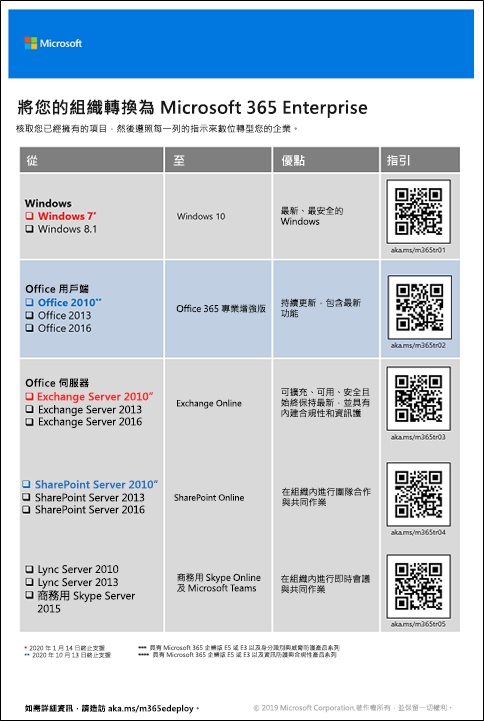

# Microsoft 365 企業版概觀Microsoft 365 Enterprise overview

Microsoft 365 企業版是完整的智慧型解決方案，讓所有人發揮創意並安全地合作。Microsoft 365 Enterprise is a complete, intelligent solution that empowers everyone to be creative and work together securely. 

雖然專為大型組織，那麼 Microsoft 365 企業版可以也用於中型和小型企業所需的最進階的安全性和生產力功能。Although designed for large organizations, Microsoft 365 Enterprise can also be used for medium-sized and small businesses that need the most advanced security and productivity capabilities. 

## 零件Components

Microsoft 365 企業版所組成：Microsoft 365 Enterprise consists of:

|||
|:-------|:-----|
| 本機和以雲端為基礎的應用程式和生產力服務Local and cloud-based apps and productivity services | 包含這兩個 Office 365 專業增強版，您的 PC 和 Mac （例如 Word、 Excel、 PowerPoint、 Outlook 和其他人），和一套完整的電子郵件、 檔案儲存與共同作業、 會議及更多的線上服務的最新的 Office 應用程式。Includes both Office 365 ProPlus, the latest Office apps for your PC and Mac (such as Word, Excel, PowerPoint, Outlook, and others), and a full suite of online services for email, file storage and collaboration, meetings, and more. |
| Windows 10 企業版Windows 10 Enterprise | 解決大型且中型組織中，為使用者提供與最具生產力且安全的 Windows 版本的需求和 IT 專業人員更完整的部署、 裝置和應用程式管理。Addresses the needs of both large and midsize organizations, providing users with the most productive and secure version of Windows and IT professionals with comprehensive deployment, device, and app management. |
| 裝置管理和進階的安全性的服務Device management and advanced security services | 包含 Microsoft Intune，也就是雲端式企業行動力管理 (EMM) 服務，可協助讓您同時將保持公司資料保護提高生產力的工作人員。Includes Microsoft Intune, which is a cloud-based enterprise mobility management (EMM) service that helps enable your workforce to be productive while keeping your corporate data protected. |
|||

## 方案Plans

在三種計劃中使用 Microsoft 365 企業版。Microsoft 365 Enterprise is available in three plans.

|||
|:-------|:-----|
| 版 E3E3 | 存取核心產品與安全地增強工作場所生產力和磁碟機創新能力，Microsoft 365 內的功能。Access core products and features within Microsoft 365 to enhance workplace productivity and drive innovation, securely. |
| E5E5 | 存取最新的產品和 Microsoft 365 內的功能，包括進階威脅防護、 安全性和共同作業工具.Access the latest products and features within Microsoft 365, including advanced threat protection, security and collaboration tools.. 包含所有的 E3 的功能以及進階的安全性、 語音及資料分析工具。Includes all of E3's capabilities plus advanced security, voice, and data analysis tools. |
| F1F1 | 與第一線透過特殊用途的工具和資源，以允許他們盡善盡美連線。Connect with your Firstline Workers through purpose-built tools and resources that allow them to do their best work. |
|||

如果您有 Microsoft 365 企業版 E3，您也可以取得這些[供應項目](https://www.microsoft.com/microsoft-365/blog/2019/01/02/introducing-new-advanced-security-and-compliance-offerings-for-microsoft-365/)：If you have Microsoft 365 Enteprise E3, you can also get these [offerings](https://www.microsoft.com/microsoft-365/blog/2019/01/02/introducing-new-advanced-security-and-compliance-offerings-for-microsoft-365/):

- 身分識別 & 威脅防護Identity & Threat Protection
- 資訊保護 & 合規性Information Protection & Compliance

這些供應項目包含隨附於 Microsoft 365 企業版 E5 的其他功能。These offerings contain additional features that are included with Microsoft 365 Enterprise E5.

如需詳細資訊，請參閱[每個計劃的功能](https://www.microsoft.com/microsoft-365/compare-all-microsoft-365-plans)。For more information, see [Features and capabilities for each plan](https://www.microsoft.com/microsoft-365/compare-all-microsoft-365-plans).

## 在快速At-a-glance

[Microsoft 365 企業版海報](http://aka.ms/m365eposter)是中央位置，讓您檢視：The [Microsoft 365 Enterprise poster](http://aka.ms/m365eposter) is a central location for you to view:

- Microsoft 365 企業版及應用程式和服務如何對應至其值要點的優點The benefits of Microsoft 365 Enterprise and how apps and services map to its value pillars
- Microsoft 365 企業版方案，而且其中包含哪些元件Microsoft 365 Enterprise plans and which components they contain 
- 現代化工作場所，可讓 Microsoft 365 企業版的主要元件The key components of the Modern Workplace, which Microsoft 365 Enterprise enables
- [Microsoft 365 生產力文件庫](https://www.microsoft.com/microsoft-365/success/)及一些常見的組織部門的代表性案例The [Microsoft 365 Productivity Library](https://www.microsoft.com/microsoft-365/success/) and representative scenarios for some common organization departments
- 重點在於說明 Microsoft 365 企業版[部署指南](deploy-microsoft-365-enterprise.md)採用藍圖The adoption roadmap that highlights the Microsoft 365 Enterprise [Deployment Guide](deploy-microsoft-365-enterprise.md)

若要下載一份海報，請按一下[這裡](https://github.com/MicrosoftDocs/microsoft-365-docs/raw/public/microsoft-365/enterprise/media/Microsoft365Enterprise.pdf)。To download a copy of the poster, click [here](https://github.com/MicrosoftDocs/microsoft-365-docs/raw/public/microsoft-365/enterprise/media/Microsoft365Enterprise.pdf).

## 轉換整個組織Transition your entire organization

若要取得較佳的圖片，將整個組織移至 Microsoft 365 企業版產品與服務欲了解，請下載[轉換海報](https://github.com/MicrosoftDocs/microsoft-365-docs/raw/public/microsoft-365/enterprise/media/deploy-microsoft-365-enterprise/transitionorgtom365.pdf)。To get a better picture of how to move your entire organization to the products and services in Microsoft 365 Enterprise, download the [transition poster](https://github.com/MicrosoftDocs/microsoft-365-docs/raw/public/microsoft-365/enterprise/media/deploy-microsoft-365-enterprise/transitionorgtom365.pdf).

這兩個頁面海報是清查您現有的基礎結構，以取得將移至對應的產品或服務，Microsoft 365 企業版中的指引的快速方法。This two-page poster is a quick way to inventory your existing infrastructure and get to the guidance for moving to the corresponding product or service in Microsoft 365 Enterprise. 其中包括 Windows 和 Office 產品及其他基礎結構和安全性的元素，例如裝置管理、 identity 及資訊和威脅保護。It includes Windows and Office products and other infrastructure and security elements such as device management, identity, and information and threat protection.

您可以列印此海報以字母、 法律或 tabloid (11 x 17) 格式。You can print this poster in letter, legal, or tabloid (11 x 17) formats.

## 部署Deploying

有三種方式可以部署產品、 功能和 Microsoft 365 企業版的元件：There are three ways to deploy the products, features, and components of Microsoft 365 Enterprise:

1. 與 FastTrackIn partnership with FastTrack
  
   使用 FastTrack，Microsoft 工程師協助您移動到您自己的步調雲端。With FastTrack, Microsoft engineers help you move to the cloud at your own pace. 請參閱[適用於 Microsoft 365 的 FastTrack](https://fasttrack.microsoft.com/microsoft365)。See [FastTrack for Microsoft 365](https://fasttrack.microsoft.com/microsoft365).
  
2. Microsoft 諮詢服務或[Microsoft 合作夥伴](https://partner.microsoft.com/)的協助。With the help of Microsoft Consulting Services or a [Microsoft partner](https://partner.microsoft.com/).

   顧問可以分析您目前的基礎結構並協助您開發以納入所有軟體與服務的 Microsoft 365 企業版計劃。Consultants can analyze your current infrastructure and help you develop a plan to incorporate all of the software and services of Microsoft 365 Enterprise.

3. 自行執行此工作Do it yourself

   [Microsoft 365 企業版部署指南](deploy-microsoft-365-enterprise.md)會帶您逐步透過建置基礎結構和生產力工作負載。The [Microsoft 365 Enterprise deployment guide](deploy-microsoft-365-enterprise.md) takes you step by step through building out the infrastructure and productivity workloads. 

如需部署資訊，請參閱如何：For more deployment information, see how:

- [客戶](deploy-microsoft-365-enterprise.md#how-customers-use-microsoft-365-enterprise)使用 Microsoft 365 企業版。[Customers](deploy-microsoft-365-enterprise.md#how-customers-use-microsoft-365-enterprise)  use Microsoft 365 Enterprise.
- [Microsoft](deploy-microsoft-365-enterprise.md#how-microsoft-uses-microsoft-365-enterprise)會使用 Microsoft 365 企業版。[Microsoft](deploy-microsoft-365-enterprise.md#how-microsoft-uses-microsoft-365-enterprise) uses Microsoft 365 Enterprise.
- [Contoso Corporation](contoso-overview.md)，虛構但有代表性的跨國企業，已部署 Microsoft 365 企業版。[The Contoso Corporation](contoso-overview.md), a fictional but representative multinational organization, has deployed Microsoft 365 Enterprise.

## 其他 Microsoft 365 解決方案Additional Microsoft 365 solutions

- [Microsoft 365 商務版 Microsoft 365 Business](https://docs.microsoft.com/microsoft-365/business/)
 
  將 Office 365 的同等級最佳生產力和共同作業能力與裝置管理和安全性解決方案整合在一起，以保護中小型企業 (SMB) 的商務資料。Bring together the best-in-class productivity and collaboration capabilities of Office 365 with device management and security solutions to safeguard business data for small and midsize businesses (SMB).

- [Microsoft 365 教育版Microsoft 365 Education](https://docs.microsoft.com/education)
 
  可讓授課者解放創意、提升團隊合作，並在專為教育打造且價格合理的單一解決方案中提供簡單且安全的體驗。Empower educators to unlock creativity, promote teamwork, and provide a simple and safe experience in a single, affordable solution built for education.

- [Microsoft 365 政府版Microsoft 365 Government](https://www.microsoft.com/microsoft-365/government)
 
  讓美國公共部門員工在一起，安全地運作。Empower United States public sector employees to work together, securely.

## Microsoft 365 教育訓練Microsoft 365 training

|||
|:-------|:-----|
| 取得自行訓練，並向 Microsoft 365 憑證運作。Get yourself trained and work towards a Microsoft 365 certification.   開始使用[Microsoft 365 基本概念](https://docs.microsoft.com/learn/paths/m365-fundamentals/)。Start with [Microsoft 365 Fundamentals](https://docs.microsoft.com/learn/paths/m365-fundamentals/).
|||

## 下一步Next step

如果您正在自行進行部署，來啟動您的[Microsoft 365 企業版部署的作業過程](deploy-microsoft-365-enterprise.md)。If you are doing the deployment yourself, start your [Microsoft 365 Enterprise deployment journey](deploy-microsoft-365-enterprise.md).

## 另請參閱See also

[Microsoft 365 Enterprise 產品頁面Microsoft 365 Enterprise product page](https://www.microsoft.com/microsoft-365/enterprise)
