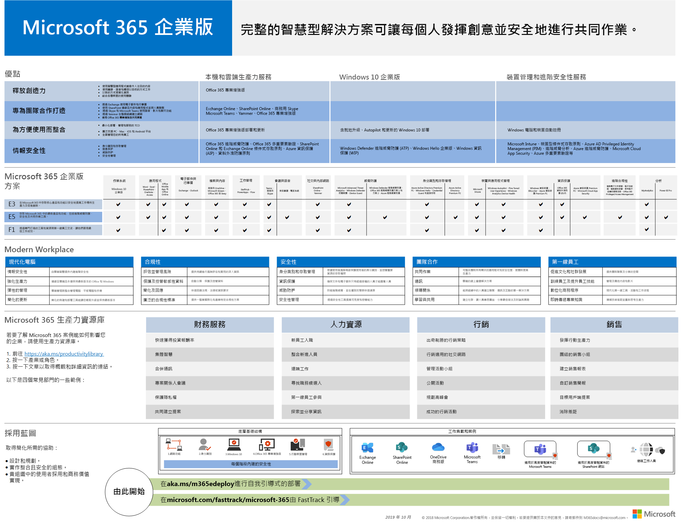

# Microsoft 365 企業版概觀

Microsoft 365 企業版是完整的智慧型解決方案，讓所有人發揮創意並安全地合作。 

雖然專為大型組織，那麼 Microsoft 365 企業版可以也用於中型和小型企業所需的最進階的安全性和生產力功能。 

## 零件

Microsoft 365 企業版所組成：

|||
|:-------|:-----|
| Office 365 Enterprise | 包含這兩個 Office 365 專業增強版，您的 PC 和 Mac （例如 Word、 Excel、 PowerPoint、 Outlook 和其他人），和一套完整的電子郵件、 檔案儲存與共同作業、 會議及更多的線上服務的最新的 Office 應用程式。 |
| Windows 10 企業版 | 解決大型且中型組織中，為使用者提供與最具生產力且安全的 Windows 版本的需求和 IT 專業人員更完整的部署、 裝置和應用程式管理。 |
| Enterprise Mobility + Security (EMS) | 包含 Microsoft Intune，也就是雲端式企業行動力管理 (EMM) 服務，可協助讓您同時將保持公司資料保護提高生產力的工作人員。 |
|||

## 方案

在三種計劃中使用 Microsoft 365 企業版。

|||
|:-------|:-----|
| 版 E3 | 包含 Office 365 企業版、 Windows 10 企業版和 Enterprise Mobility + Security (EMS)。 |
| E5 | 包含所有的 E3 的功能以及進階的安全性、 語音及資料分析工具。 |
| F1 | 特殊用途 firstline 工作者連接至工具和盡善盡美所需的資源。 Firstline 工作者所列的第一個與您的客戶，並代表您公司的品牌和 value， |
|||

如需詳細資訊，請參閱[每個計劃的功能](https://www.microsoft.com/microsoft-365/compare-all-microsoft-365-plans)。

## 在快速

[Microsoft 365 企業版海報](http://aka.ms/m365eposter)是中央位置，讓您檢視：

- 產品與功能的 Microsoft 365 企業版和如何對應到其值要點
- Microsoft 365 企業版方案，而且其中包含哪些元件 
- 現代化工作場所，可讓 Microsoft 365 企業版的主要元件
- Microsoft 365 企業版的重要商務值案例的服務和產品使它們，即會發生
- 重點在於說明 Microsoft 365 企業版[部署指南](deploy-microsoft-365-enterprise.md)採用藍圖

若要下載一份海報，請按一下[這裡](https://github.com/MicrosoftDocs/microsoft-365-docs/raw/public/microsoft-365/enterprise/media/Microsoft365Enterprise.pdf)。

## 部署

有三種方式可以部署產品、 功能和 Microsoft 365 企業版的元件：

1. 與 FastTrack
  
   使用 FastTrack，Microsoft 工程師協助您移動到您自己的步調雲端。 請參閱[適用於 Microsoft 365 的 FastTrack](https://fasttrack.microsoft.com/microsoft365)。
  
2. Microsoft 諮詢服務或[Microsoft 合作夥伴](https://partner.microsoft.com/)的協助。

   顧問可以分析您目前的基礎結構並協助您開發以納入所有軟體與服務的 Microsoft 365 企業版計劃。

3. 自行執行此工作

   [Microsoft 365 企業版部署指南](deploy-microsoft-365-enterprise.md)會帶您逐步透過建置基礎結構和生產力工作負載。 

如需部署資訊，請參閱如何：

- [客戶](deploy-microsoft-365-enterprise.md#how-customers-use-microsoft-365-enterprise)使用 Microsoft 365 企業版。
- [Microsoft](deploy-microsoft-365-enterprise.md#how-microsoft-uses-microsoft-365-enterprise)會使用 Microsoft 365 企業版。
- [Contoso Corporation](contoso-overview.md)，虛構但有代表性的跨國企業，已部署 Microsoft 365 企業版。

## 其他 Microsoft 365 解決方案

- [Microsoft 365 商務版 ](https://docs.microsoft.com/microsoft-365/business/)
 
  將 Office 365 的同等級最佳生產力和共同作業能力與裝置管理和安全性解決方案整合在一起，以保護中小型企業 (SMB) 的商務資料。

- [Microsoft 365 教育版](https://docs.microsoft.com/education)
 
  可讓授課者解放創意、提升團隊合作，並在專為教育打造且價格合理的單一解決方案中提供簡單且安全的體驗。

- [Microsoft 365 政府版](https://www.microsoft.com/microsoft-365/government)
 
  讓美國公共部門員工在一起，安全地運作。

## Microsoft 365 教育訓練

|||
|:-------|:-----|
| 取得自行訓練，並向 Microsoft 365 憑證運作。   開始使用[Microsoft 365 基本概念](https://docs.microsoft.com/learn/paths/m365-fundamentals/)。

## 下一步

如果您正在自行進行部署，來啟動您的[Microsoft 365 企業版部署的作業過程](deploy-microsoft-365-enterprise.md)。

## 另請參閱

[Microsoft 365 Enterprise 產品頁面](https://www.microsoft.com/microsoft-365/enterprise)
