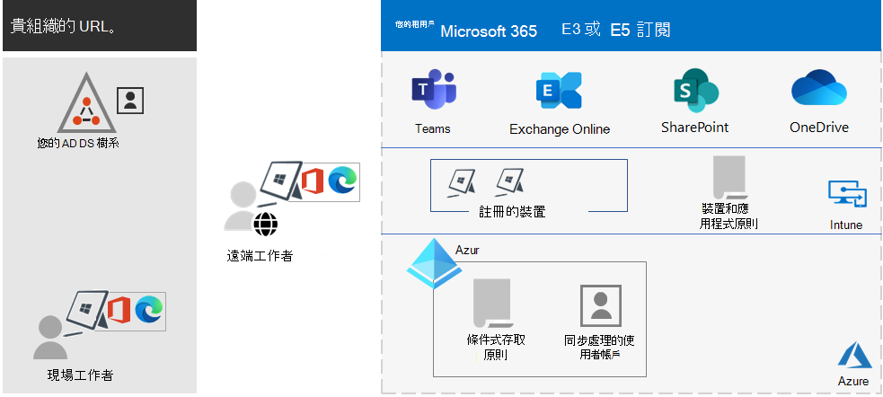

# Microsoft 365 企業版概觀Microsoft 365 for enterprise overview

Microsoft 365 企業版是完整的智慧型解決方案，可讓每個人發揮創意並安全地進行共同作業。Microsoft 365 for enterprise is a complete, intelligent solution that empowers everyone to be creative and work together securely.

Microsoft 365 企業版是為大型組織所設計，但也可用於需要最進階安全性和生產力功能的中小型企業。Microsoft 365 for enterprise is designed for large organizations, but it can also be used for medium-sized and small businesses that need the most advanced security and productivity capabilities.

## 元件Components

Microsoft 365 企業版包含：Microsoft 365 for enterprise consists of:

|服務Services|描述Description|
|---|---|
|本機和以雲端為基礎的應用程式和生產力服務Local apps and cloud-based apps and productivity services|包含 Microsoft 365 Apps 企業版、最新的 PC 與 Mac 版 Office 應用程式 (如 Word、Excel、PowerPoint、Outlook 和其他項目)，以及一組完整的電子郵件、檔案儲存空間和共同作業、會議和其他的線上服務。Includes both Microsoft 365 Apps for enterprise, the latest Office apps for your PC and Mac (such as Word, Excel, PowerPoint, Outlook, and others), and a full suite of online services for email, file storage and collaboration, meetings, and more.|
|Windows 10 企業版Windows 10 Enterprise|符合大中型組織的需求。Meets the needs of both large and midsize organizations. 這是適用於使用者的最高生產力和最安全的 Windows 版本。It's the most productive and secure version of Windows for users. 針對 IT 專業人員，它也提供全面的部署、裝置和應用程式管理功能。For IT professionals, it also provides comprehensive deployment, device, and app management.|
|裝置管理和進階安全性服務Device management and advanced security services|包括 Microsoft Intune，它是雲端式企業行動力管理服務，可在協助提高員工生產力的同時持續保護貴組織的資料。Includes Microsoft Intune, which is a cloud-based enterprise mobility management service that helps enable your workforce to be productive while protecting your organization data.|
|||

## 方案Plans

Microsoft 365 企業版提供三個方案。Microsoft 365 for enterprise is available in three plans.

|方案名稱Plan name|功能Capabilities|
|---|---|
|E3E3|存取 Microsoft 365 核心產品和功能，以提高工作場所生產力並推動創新。Access the Microsoft 365 core products and features to securely enhance workplace productivity and drive innovation.|
|E5E5|存取 Microsoft 365 最新產品和功能。Access the Microsoft 365 latest products and features. 這些包括適用於 Office 365 的 Defender、安全性工具和共同作業工具。These include Defender for Office 365, security tools, and collaboration tools. 此方案包括所有 E3 的功能與進階安全性、語音和資料分析工具。This plan includes all E3 capabilities, plus advanced security, voice, and data analysis tools.|
|F3F3|透過專門打造的工具和資源與第一線員工交流，他們可以使用這些工具和資源來幫助展現最佳工作成效。Connect with your first-line workers through purpose-built tools and resources that they can use to help them do their best work.|
|||

如果您有 Microsoft 365 E3，您也可以取得這些附加元件：If you have Microsoft 365 E3, you can also get these add-ons:

- 身分識別和威脅防護Identity & Threat Protection
- 資訊保護與合規性Information Protection & Compliance
- [Microsoft 365 E5 合規性Microsoft 365 E5 Compliance](https://www.microsoft.com/microsoft-365/business/e5-compliance)
- Microsoft 365 E5 測試人員風險Microsoft 365 E5 Insider Risk

Microsoft 365 E3 使用者可以使用這些附加元件來利用 Microsoft 365 E5 所含的一些額外功能。Microsoft 365 E3 users can use these add-ons to take advantage of some of the additional features Microsoft 365 E5 includes.

如需詳細資訊，請參閱[每個方案的特性和功能](https://www.microsoft.com/microsoft-365/compare-all-microsoft-365-plans)。For more information, see [Features and capabilities for each plan](https://www.microsoft.com/microsoft-365/compare-all-microsoft-365-plans).

## 了解全貌Get the big picture

[Microsoft 365 企業版海報](../downloads/Microsoft365Enterprise.pdf)是可讓您檢視下列各項的中央位置：The [Microsoft 365 for enterprise poster](../downloads/Microsoft365Enterprise.pdf) is a central location for you to view:

- Microsoft 365 企業版的優勢，以及應用程式和服務如何與其價值支柱對應。The benefits of Microsoft 365 for enterprise, and how apps and services map to its value pillars.
- Microsoft 365 企業版方案，以及其包含的元件。Microsoft 365 for enterprise plans and which components they contain.
- Microsoft 365 企業版實現的 Microsoft 現代化工作場所的重要元件。The key components of the Microsoft modern workplace, which Microsoft 365 for enterprise enables.
- [Microsoft 365 生產力資源庫](https://www.microsoft.com/microsoft-365/success/)和一些常見組織部門的代表性案例。The [Microsoft 365 Productivity Library](https://www.microsoft.com/microsoft-365/success/) and representative scenarios for some common organization departments.

您也可以[下載此海報的副本](https://github.com/MicrosoftDocs/microsoft-365-docs/raw/public/microsoft-365/downloads/Microsoft365Enterprise.pdf)。You can also [download a copy of the poster](https://github.com/MicrosoftDocs/microsoft-365-docs/raw/public/microsoft-365/downloads/Microsoft365Enterprise.pdf).

## 轉換整個組織Transition your entire organization

若要更全面地掌握關於如何將整個組織移至 Microsoft 365 企業版中的產品和服務，請參閱[轉換海報](https://download.microsoft.com/download/2/c/7/2c7bcc04-aae3-4604-9707-1ffff66b9851/transition-org-to-m365.pdf)。To get a better picture about how to move your entire organization to the products and services in Microsoft 365 for enterprise, see the [transition poster](https://download.microsoft.com/download/2/c/7/2c7bcc04-aae3-4604-9707-1ffff66b9851/transition-org-to-m365.pdf).

這份雙頁海報是清查現有基礎結構的快速方式。This two-page poster is a quick way to inventory your existing infrastructure. 可協助您尋找指導方針，並移至 Microsoft 365 企業版中對應的產品或服務。It helps you to find guidance and move to the corresponding product or service in Microsoft 365 for enterprise. 包含 Windows 和 Office 產品和其他基礎結構與安全性元素，例如裝置管理、身分識別以及資訊和威脅防護。It includes Windows and Office products and other infrastructure and security elements, such as device management, identity, and information and threat protection.

## Windows 7 和 Office 2010 用戶端與伺服器的終止支援End of support for Windows 7 and Office 2010 clients and servers

[Windows 7](https://aka.ms/win7upgrade) 已於 **2020 年 1 月 14 日** 進入終止支援。[Windows 7](https://aka.ms/win7upgrade) reached end of support on **January 14, 2020**.

這些產品已於 **2020 年 10 月 13 日** 進入終止支援：These products reached end of support on **October 13, 2020**:

- [Office 2010Office 2010](/DeployOffice/office-2010-end-support-roadmap)
- [Exchange Server 2010Exchange Server 2010](exchange-2010-end-of-support.md)

[SharePoint Server 2010](upgrade-from-sharepoint-2010.md) 將於 **2021 年 4 月 13 日** 到達終止支援。[SharePoint Server 2010](upgrade-from-sharepoint-2010.md) will reach end of support on **April 13, 2021**.

如需適用於這些產品的升級、移轉和移至雲端選項的視覺摘要，請參閱[終止支援海報](../downloads/Office2010Windows7EndOfSupport.pdf)。For a visual summary of the upgrade, migrate, and move-to-the-cloud options for these products, see the [end of support poster](../downloads/Office2010Windows7EndOfSupport.pdf).

這張單頁海報可讓您快速了解可以採取的各種方法，以防止 Windows 7 及 Office 2010 用戶端與伺服器產品進入終止支援，而海報上也會強調顯示 Microsoft 365 企業版中偏好的途徑和支援。This one-page poster is a quick way to understand the various paths you can take to prevent Windows 7 and Office 2010 client and server products from reaching end of support, with preferred paths and support in Microsoft 365 for enterprise highlighted.

您也可以[下載此海報](https://github.com/MicrosoftDocs/microsoft-365-docs/raw/public/microsoft-365/downloads/Office2010Windows7EndOfSupport.pdf)，並以 Letter、Legal 或 Tabloid (11 x 17) 格式列印此海報。You can also [download this poster](https://github.com/MicrosoftDocs/microsoft-365-docs/raw/public/microsoft-365/downloads/Office2010Windows7EndOfSupport.pdf) and print it in letter, legal, or tabloid (11 x 17) formats.

## 規劃和部署Plan for and deploy

規劃和部署 Microsoft 365 企業版產品、功能和元件有三個方式：There are three ways to plan for and deploy the products, features, and components of Microsoft 365 for enterprise:

- 與 FastTrack 合作In partnership with FastTrack

   透過 FastTrack，Microsoft 工程師可協助您以您自己的步調移至雲端。With FastTrack, Microsoft engineers help you move to the cloud at your own pace. 請參閱[適用於 Microsoft 365 的 FastTrack](https://fasttrack.microsoft.com/microsoft365)。See [FastTrack for Microsoft 365](https://fasttrack.microsoft.com/microsoft365).

- 利用 Microsoft 諮詢服務或 [Microsoft 合作夥伴](https://partner.microsoft.com/)的協助With the help of Microsoft Consulting Services or a [Microsoft partner](https://partner.microsoft.com/)

   顧問可以分析您目前的基礎架構，並協助您開發方案來納入 Microsoft 365 企業版的所有軟體和服務。Consultants can analyze your current infrastructure and help you develop a plan to incorporate all the software and services of Microsoft 365 for enterprise.

- 自行完成Do it yourself

   從[網路藍圖](networking-roadmap-microsoft-365.md)開始建置或驗證您現有的基礎結構和生產力工作負載。Start with the [Networking roadmap](networking-roadmap-microsoft-365.md) to build out or verify your existing infrastructure and productivity workloads.

關於虛構但有代表性的跨國組織如何部署 Microsoft 365 企業版之案例，請參閱 [Contoso Corporation 案例研究](contoso-overview.md)。For an example of how a fictional but representative multinational organization has deployed Microsoft 365 for enterprise, see the [Contoso Corporation case study](contoso-overview.md).

## 其他 Microsoft 365 產品Additional Microsoft 365 products

- [Microsoft 365 商務進階版Microsoft 365 Business Premium](../business/index.yml)

  將同等級最佳生產力和共同作業功能與裝置管理和安全性解決方案整合在一起，以保護中小型企業的商務資料。Bring together the best-in-class productivity and collaboration capabilities with device management and security solutions to safeguard business data for small and midsize businesses.

- [Microsoft 365 教育版Microsoft 365 Education](/education)

  可讓授課者解放創意、提升團隊合作，並在專為教育打造且價格合理的單一解決方案中提供簡單且安全的體驗。Empower educators to unlock creativity, promote teamwork, and provide a simple and safe experience in a single, affordable solution built for education.

- [Microsoft 365 GovernmentMicrosoft 365 Government](https://www.microsoft.com/microsoft-365/government)

  讓美國公營事業員工共同且安全地合作。Empower United States public sector employees to work together, securely.

## 搭配使用 Surface 和 Microsoft Edge 瀏覽器以達到最佳效能Best together with Surface and the Edge browser

利用 Microsoft 365 企業版、Microsoft Surface 裝置和 Microsoft Edge 瀏覽器的最佳組合，最佳化使用者的整合和安全生產力。Optimize your user’s integrated and secure productivity with the best-together combination of Microsoft 365 for enterprise, Microsoft Surface devices, and the Microsoft Edge browser. 這種跨產品整合提供：This cross-product integration provides:

- 常用的身分識別和登入安全性基礎結構。A common identity and sign-in security infrastructure.
- 整合的本機與雲端應用程式，以進行搜尋、共同作業、生產力及合規性。Integrated local and cloud apps for search, collaboration, productivity, and compliance.
- 對硬體、瀏覽器、本機應用程式和雲端應用程式進行全面且整合的安全性。Comprehensive and integrated security for hardware, browser, local app, and cloud apps.
- 適用於安裝和更新 IT 管理的一般基礎結構。A common infrastructure for IT management of installs and updates.

以下是企業組織的範例。Here is an example for an enterprise organization.

如需中小型企業和教育機構的詳細資訊和設定範例，請下載 [最佳組合海報](https://download.microsoft.com/download/2/8/d/28db0cf9-2f5a-4f63-91e2-46ff5c4d3baf/microsoft-best-together-poster.pdf)。For more information and configuration examples for a small and medium business and an educational institution, download the [Best together poster](https://download.microsoft.com/download/2/8/d/28db0cf9-2f5a-4f63-91e2-46ff5c4d3baf/microsoft-best-together-poster.pdf).

## Microsoft 365 訓練Microsoft 365 training

若要深入瞭解 Microsoft 365 並致力於 Microsoft 365 認證，您可以從 [Microsoft 365 認證：基礎](/learn/paths/m365-fundamentals/)開始。To learn more about Microsoft 365 and work toward a Microsoft 365 certification, you can start with [Microsoft 365 Certified: Fundamentals](/learn/paths/m365-fundamentals/).

## 另請參閱See also

[Microsoft 365 企業版產品頁面Microsoft 365 for enterprise product page](https://www.microsoft.com/microsoft-365/enterprise)