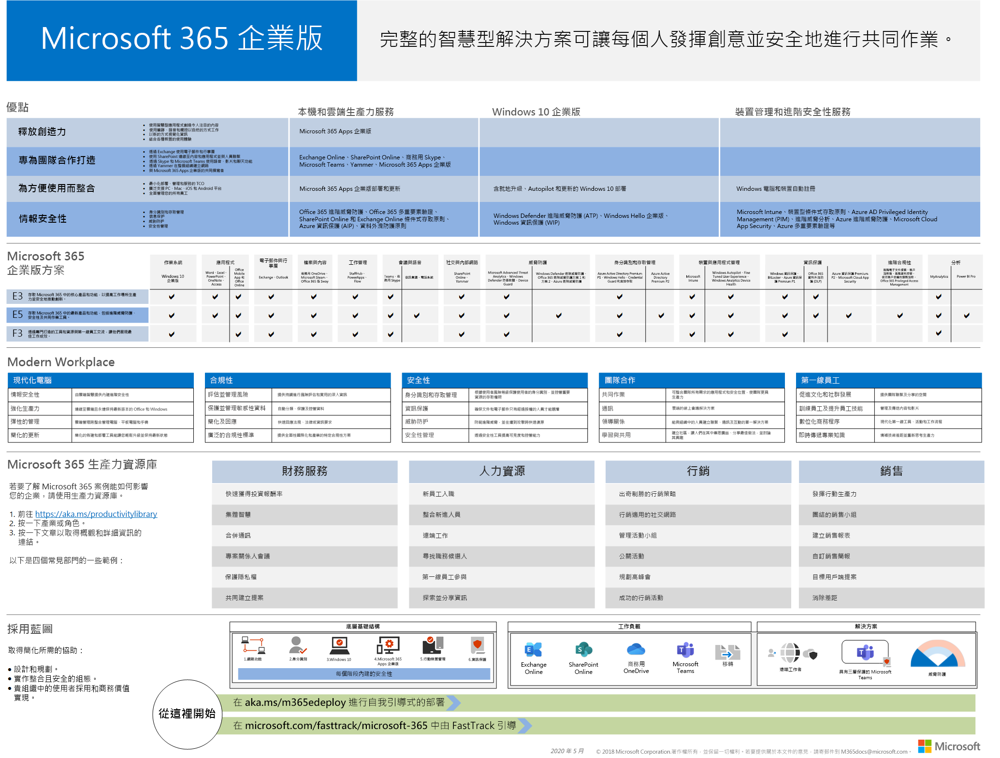

# Microsoft 365 企業版概觀

適用于企業的 Microsoft 365 是完整的智慧解決方案，可讓每個人都有創造性且安全地協同運作。 

雖然適用于大型組織，但 Microsoft 365 for enterprise 也可用於需要最高級安全性和生產力功能的中型和小型企業。 

## 零件

適用于企業的 Microsoft 365 包括：

|||
|:-------|:-----|
| 本機和雲端架構應用程式與生產力服務 | 包含適用于企業的 Microsoft 365 應用程式、適用于電腦和 Mac 的最新 Office 應用程式（例如 Word、Excel、PowerPoint、Outlook 及其他），以及完整的線上服務，以供電子郵件、檔案儲存及共同作業、會議等等。 |
| Windows 10 企業版 | 同時滿足大型和中型組織的需求，為使用者提供最具生產力且安全的 Windows 和 IT 專業人員，具有全面的部署、裝置和應用程式管理。 |
| 裝置管理和高級安全性服務 | 包含 Microsoft Intune，也就是雲端式企業行動管理（EMM）服務，可協助讓您的員工在保持公司資料保護的情況下成為生產力。 |
|||

## 方案

適用于企業的 Microsoft 365 可在三個方案中取得。

|||
|:-------|:-----|
| E3 | 存取 Microsoft 365 中的核心產品和功能，以加強工作場所生產力，並安全地推動創新。 |
| E5 | 存取 Microsoft 365 內最新的產品和功能，包括「高級威脅防護」、「安全性與共同作業」工具。。 包含所有的 E3's 功能，以及高級安全性、語音及資料分析工具。 |
| F3 | 透過專門構建的工具和資源，與您的 Firstline 工作者進行連線，讓他們可以進行最佳的工作。 |
|||

如果您有 Microsoft 365 E3，您也可以取得下列[產品](https://www.microsoft.com/microsoft-365/blog/2019/01/02/introducing-new-advanced-security-and-compliance-offerings-for-microsoft-365/)：

- 身分識別 & 威脅防護
- 資訊保護 & 法規遵從性

這些產品包含 Microsoft 365 E5 隨附的其他功能。

如需詳細資訊，請參閱[每個方案的功能](https://www.microsoft.com/microsoft-365/compare-all-microsoft-365-plans)。

## 取得大圖片

適用于[企業海報的 Microsoft 365](../media/m365-poster/Microsoft365Enterprise.pdf)是一個集中位置，供您查看：

- Microsoft 365 for enterprise 的優點，以及應用程式和服務對應到其價值支柱的優點
- 適用于企業方案的 Microsoft 365，及其包含的元件 
- Microsoft 365 enterprise 啟用的現代工作場所重要元件
- 適用于某些常見組織部門的[Microsoft 365 生產力庫](https://www.microsoft.com/microsoft-365/success/)和代表性案例
- 重點介紹 Microsoft 365 for enterprise[部署指南](deploy-microsoft-365-enterprise.md)的採用藍圖

若要下載此海報的副本，請按一下[這裡](https://github.com/MicrosoftDocs/microsoft-365-docs/raw/public/microsoft-365/media/m365-poster/Microsoft365Enterprise.pdf)。

## 轉換您的整個組織

若要進一步瞭解如何將整個組織移至 Microsoft 365 for enterprise 中的產品和服務，請參閱[轉換海報](../media/deploy-microsoft-365-enterprise/transition-org-to-m365.pdf)。

這份雙頁海報可讓您快速清查您現有的基礎結構，並取得移至 Microsoft 365 企業版中對應產品或服務的指導方針。 包含 Windows 和 Office 產品和其他基礎結構與安全性元素，例如裝置管理、身分識別以及資訊和威脅防護。

您也可以[下載此海報](https://github.com/MicrosoftDocs/microsoft-365-docs/raw/public/microsoft-365/media/deploy-microsoft-365-enterprise/transition-org-to-m365.pdf)，並以 Letter、Legal 或 Tabloid (11 x 17) 格式列印此海報。

## 避免 Windows 7 和 Office 2010 用戶端和伺服器的支援終止

[Windows 7](https://aka.ms/win7upgrade)已于**2020 年1月14日**到達支援的結尾。

下列產品會在**2020 年10月13日**到達支援終止：

- [Office 2010](https://docs.microsoft.com/DeployOffice/office-2010-end-support-roadmap)
- [Exchange Server 2010](https://docs.microsoft.com/office365/enterprise/exchange-2010-end-of-support)

2010**年4月 13 2021 日** [SharePoint Server](https://docs.microsoft.com/office365/enterprise/upgrade-from-sharepoint-2010)將會到達支援終止。

如需適用於這些產品的升級、移轉和移至雲端選項的視覺摘要，請參閱[終止支援海報](../media/migration-microsoft-365-enterprise-workload/Office2010Windows7EndOfSupport.pdf)。

這個單頁標牌是一種快速瞭解可讓您採取的各種途徑，以防止 Windows 7 和 Office 2010 用戶端和伺服器產品達到支援的狀態，並在 Microsoft 365 for enterprise 中以偏好的方式顯示。

您也可以[下載此海報](https://github.com/MicrosoftDocs/microsoft-365-docs/raw/public/microsoft-365/media/migration-microsoft-365-enterprise-workload/Office2010Windows7EndOfSupport.pdf)，並以 Letter、Legal 或 Tabloid (11 x 17) 格式列印此海報。

## 部署

有三種方法可以部署 Microsoft 365 for enterprise 的產品、功能和元件：

1. 與 FastTrack 合作
  
   透過 FastTrack，Microsoft 工程師可協助您以您自己的速度移至雲端。 請參閱[適用於 Microsoft 365 的 FastTrack](https://fasttrack.microsoft.com/microsoft365)。
  
2. 請使用説明 Microsoft 諮詢服務或[microsoft 合作夥伴](https://partner.microsoft.com/)。

   顧問可以分析您目前的基礎結構，並協助您開發一個計畫，以整合 Microsoft 365 for enterprise 的所有軟體和服務。

3. 自行動手

   [Microsoft 365 for enterprise deployment guide](deploy-microsoft-365-enterprise.md)會逐步引導您建立基礎結構和生產力工作負載。 

如需更多部署資訊，請參閱 how：

- [客戶](deploy-microsoft-365-enterprise.md#how-customers-use-microsoft-365-for-enterprise)使用 Microsoft 365 for enterprise。
- [Microsoft](deploy-microsoft-365-enterprise.md#how-microsoft-uses-microsoft-365-for-enterprise)使用 microsoft 365 for enterprise。
- [Contoso Corporation](contoso-overview.md)（虛構但具有代表性的跨國組織）已部署 Microsoft 365 for enterprise。

## 其他 Microsoft 365 解決方案

- [Microsoft 365 商務進階版](https://docs.microsoft.com/microsoft-365/business/)
 
  將 Office 365 的同等級最佳生產力和共同作業能力與裝置管理和安全性解決方案整合在一起，以保護中小型企業 (SMB) 的商務資料。

- [Microsoft 365 教育版](https://docs.microsoft.com/education)
 
  可讓授課者解放創意、提升團隊合作，並在專為教育打造且價格合理的單一解決方案中提供簡單且安全的體驗。

- [Microsoft 365 政府版](https://www.microsoft.com/microsoft-365/government)
 
  讓美國公用部門員工可以安全地一起運作。

## Microsoft 365 訓練

|||
|:-------|:-----|
| 取得您的訓練有素，並向 Microsoft 365 認證工作。   開始使用[Microsoft 365 基礎](https://docs.microsoft.com/learn/paths/m365-fundamentals/)。
|||

## 下一步

如果您是自行進行部署，請啟動您[的 Microsoft 365，以進行企業部署旅程](deploy-microsoft-365-enterprise.md)。

## 另請參閱

[適用于企業產品的 Microsoft 365 頁面](https://www.microsoft.com/microsoft-365/enterprise)
