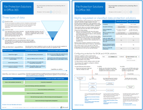

# 身分識別與裝置存取設定

此系列文章說明如何藉由實作建議的環境與設定，包括條件式存取原則規定的設定來設定安全地存取雲端服務，透過 Enterprise Mobility + Security (EMS) 的產品和相關的功能。 EMS 是 Microsoft 365 的核心元件。 您可以使用本指南來保護所有與 Azure Active Directory，包括 Office 365 服務與 Azure AD 應用程式 Proxy 發佈的其他 SaaS 服務，以及內部應用程式整合的服務存取權。 

這些建議會對齊 Microsoft 安全分數，以及[分數 Azure AD 中的身分識別](https://docs.microsoft.com/azure/active-directory/fundamentals/identity-secure-score)，並會增加這些分數的組織。 這些建議也可協助您實作下列[五個步驟來保護您的身分識別基礎結構](https://docs.microsoft.com/azure/security/azure-ad-secure-steps)。 

Microsoft 了解某些組織中具有唯一環境需求或複雜性。 如果您是下列其中一個這些組織，使用這些建議作為起點。 不過，大多數的組織可以實作這些建議，如規定。 

## 目標對象

這些建議都適用於企業架構設計人員和 IT 專業人員熟悉[Office 365](https://technet.microsoft.com/library/dn127064(v=office.14).aspx)及[Microsoft Enterprise Mobility + Security](https://microsoft.com/ems)，其中包含，與其他人，Azure Active Directory (identity)、 Microsoft Intune （裝置管理） 與 Azure 資訊保護 （資料保護）。

### 客戶環境

建議的原則適用於企業組織運作完全在 Microsoft cloud 中並具有混合式基礎結構的客戶 （部署在內部部署和 Microsoft cloud）。

提供建議的許多自信地仰賴服務只適用於 Enterprise Mobility + Security (EMS) E5 授權。 呈現的建議事項會假設完整 EMS E5 授權功能。

對於不具備 Enterprise Mobility + Security E5 授權的組織來說，Microsoft 建議您至少實作隨附於所有計劃的 Azure AD 基準保護功能。 Azure AD 程式庫中，可以[的基準保護功能](/azure/active-directory/active-directory-conditional-access-baseline-protection)，此文章中找到詳細資訊。

### 出現警告

您的組織可能受法規或其他合規性需求，包括可能需要將偏離這些建議的組態的原則套用的特定建議。 這些設定會建議過去未提供的使用情形控制項。 建議使用這些控制項，因為我們相信它們代表安全性與生產力之間的平衡。  

我們已經盡力的各種不同的組織保護需求，但我們不能夠帳戶針對所有可能的需求或您組織的所有唯一的各個層面。

## 三層保護

大部分組織都有安全性和資料保護的相關特定需求。 根據產業部門和組織內的職責，這些需求會不同。 例如，您的法務部門和 Office 365 系統管理員可能需要其電子郵件對應的額外安全性和資訊保護控制，但其他業務單位使用者則不需要。 

每個產業也都有自己的一組特殊法規。 而不提供一份所有可能的安全性選項或建議每個產業區段或是工作函式，建議已提供三種不同的層級的安全性和保護功能可以套用根據您所需要的細微度.

- **基準保護**： 我們建議您建立的最小標準保護資料，以及身分識別與裝置存取您的資料。 您可以遵循這些基準建議，以提供滿足許多組織的強式預設保護。
- **敏感性保護**： 有些客戶會希望必須受保護的資料子集較高層級，或他們可能需要較高層級受到保護的所有資料。 您可以將加強防護套用至 Office 365 環境中的所有或特定資料集。 建議保護以可比較的安全性層級存取敏感性資料的身分識別和裝置。  
- **高管制**： 有些組織可能會有少量高分類的資料、 consititutes 貿易機密資料，或受管制的資料。 Microsoft 所提供的功能可協助組織符合這些需求，包含針對身分識別和裝置新增的保護。

本指南將示範如何實作保護身分識別和每個這些保護層級的裝置。 使用此指導方針做為起點，為您的組織，並調整以符合貴組織的特定需求的原則。

請務必針對您的資料、身分識別和裝置使用一致的保護層級。 例如，如果您實作此指導方針，請務必來保護您的資料，可以比較層級。 這些架構模型顯示哪些功能會比較。

**Office 365 的身分識別與裝置保護** 
 
[PDF](https://go.microsoft.com/fwlink/p/?linkid=841656) | [Visio](https://go.microsoft.com/fwlink/p/?linkid=841657) | [更多語言](https://www.microsoft.com/download/details.aspx?id=55032)

**Office 365 的檔案保護方案** 
 
[PDF](https://download.microsoft.com/download/7/8/9/789645A5-BD10-4541-BC33-F8D1EFF5E911/MSFT_cloud_architecture_O365%20file%20protection.pdf) | [Visio](https://download.microsoft.com/download/7/8/9/789645A5-BD10-4541-BC33-F8D1EFF5E911/MSFT_cloud_architecture_O365%20file%20protection.vsdx)

## 安全性與生產力的取捨

實作任何安全性策略需要之間的安全性與生產力的取捨。 很有幫助評估每個決策會如何影響安全性、 功能及使用者更方便使用的平衡。

所提供的建議根據下列原則：

- 知道您對象，而且是以其安全性和功能需求有彈性。
- 即時套用安全性原則，並確定其有意義。

## 服務和概念的身分識別與裝置存取保護

Microsoft 365 企業版旨在為大型組織，且安全地整合了 Office 365 企業版、 Windows 10 企業版和 Enterprise Mobility + Security (EMS)，讓所有人發揮創造性和一起運作。

本節提供 Microsoft 365 服務和身分識別與裝置存取重要的功能的概觀。

### Microsoft Azure Active Directory

Azure AD 會提供一套完整的身分識別管理功能。 保護存取的建議使用下列功能：

- **[自助式密碼重設 (SSPR)](/azure/active-directory/authentication/concept-sspr-howitworks)**: 允許使用者重設其密碼安全且不需要 helpdesk 介入，提供驗證的系統管理員可以控制的多種驗證方法。

- **[多重要素驗證 (MFA)](/azure/active-directory/authentication/concept-mfa-howitworks)**: MFA 需要使用者提供兩種形式的驗證，例如使用者的密碼再加上從 Microsoft Authenticator app 或者撥打電話的通知。 MFA 大幅降低風險，遭竊的身分識別可以是用來存取您的 Office 365 環境。

- **[條件式存取](/azure/active-directory/conditional-access/overview)**： Azure AD 會評估條件的使用者登入，並使用您建立用來允許存取的條件式存取原則。 例如，在本指南中我們告訴您如何建立條件式存取原則來要求裝置相容性的敏感資料的存取權。 這可大幅減少遭竊的身分識別駭客可以存取您的機密資料的風險。 因為裝置符合特定需求的健康狀況和安全性，它也會保護裝置上的敏感資料。

- **[Azure AD 群組](/azure/active-directory/fundamentals/active-directory-manage-groups)**： 條件式存取規則、 裝置管理與 Intune，以及偶數檔案與您組織中的網站權限依賴使用者和/或 Azure AD 群組的工作分派。 我們建議您建立對應至您要實作的保護層級的 Azure AD 群組。 例如，您行政人員就是可能的駭客較高的值目標。 因此，它合理將這些員工指派給 Azure AD 群組，並將此群組指派給條件式存取原則與其他原則以強制執行較高層級的存取的保護。

- **[裝置註冊](/azure/active-directory/devices/overview)**： 到 Azure AD 以提供身分識別裝置註冊的裝置。 若要驗證裝置，當使用者登入並套用需要網域加入或相容電腦的條件式存取規則，會使用此身分識別。 此指導方針，我們使用裝置註冊自動註冊加入網域的 Windows 電腦。 裝置註冊是管理使用 Intune 裝置的先決條件。 

- **[Azure AD Identity Protection](/azure/active-directory/identity-protection/overview)**: Azure AD Identity Protection 可讓您偵測會影響組織身分識別的潛在弱點，並設定自動的修復原則對低、 中、、 高程度的登入風險與使用者風險。 本指南依賴此風險評估，若要套用的多重要素驗證的條件式存取原則。 本指南也包括條件式存取原則，要求使用者變更其密碼，如果其帳戶偵測到高風險的活動。

### Microsoft Intune

[Intune](https://docs.microsoft.com/intune/introduction-intune)是 Microsoft 的雲端式的行動裝置管理服務。 本指南提供建議的 Windows 電腦與 Intune 裝置管理，並建議裝置合規性原則設定。 Intune 會決定是否裝置相容，並將此資料傳送到 Azure AD 以套用條件式存取原則時所使用。

#### Intune 應用程式防護

[Intune 應用程式防護](https://docs.microsoft.com/intune/app-protection-policy)原則可以用來保護您的組織資料中包含或不含管理到註冊裝置的行動裝置 app。 Intune 可協助保護 Office 365 的詳細資訊，並確定您的員工仍可以生產力，並防止資料遺失。 藉由實作應用程式層級原則，您可以限制存取公司資源，並保留您的 IT 部門的控制項內的資料。

本指南說明如何建立建議的原則強制使用的核准應用程式，並判斷這些應用程式如何使用您的商務資料。

### Office 365

本指南將示範如何實作原則，以保護 Office 365，包括 Exchange Online、 SharePoint Online 和商務用 OneDrive 的存取一組。 除了實作這些原則，我們建議您也會引發的保護使用這些資源的 Office 365 租用戶層級：

- [設定您的 Office 365 租用戶的增強的安全性](https://support.office.com/article/Configure-your-Office-365-tenant-for-increased-security-8d274fe3-db51-4107-ba64-865e7155b355)： 這些建議適用於您的 Office 365 租用戶基準安全性。
- [Office 365 安全性藍圖： 前的 30 天、 前 90 天及過後](https://support.office.com/article/Office-365-security-roadmap-Top-priorities-for-the-first-30-days-90-days-and-beyond-28c86a1c-e4dd-4aad-a2a6-c768a21cb352)： 這些建議包含記錄、 資料控管、 系統管理存取權和威脅防護。

### Windows 10 和 Office 365 專業增強版

Windows 10 和 Office 365 專業增強版是建議的用戶端環境的電腦。 我們建議您 Windows 10 中，為 Azure 設計用來提供可能的平滑經驗的內部部署與 Azure AD。 Windows 10 也包含進階的安全性功能，可以透過 Intune 進行管理。 Office 365 專業增強版包含最新版的 Office 應用程式。 這些條件式存取使用更安全的新式驗證和需求。 這些應用程式也包含增強的安全性與合規性工具。

## 跨三種保護層級的套用這些功能

下表摘要說明我們跨三種保護層級的使用這些功能的建議。

|保護機制|基準|敏感性|高管制|
|:-------------------|:-------|:--------|:---------------|
|**強制執行 MFA**|在中或以上的登入風險上|在低或以上的登入風險上|在所有新的工作階段上|
|**強制執行密碼變更**|高風險使用者|高風險使用者|高風險使用者|
|**強制執行 Intune 應用程式防護**|是|是|是|
|**強制執行 Intune 註冊 (COD)**|需要相容或加入網域的電腦，但允許 BYOD 電話/平板電腦|需要相容或加入網域的裝置|需要相容或加入網域的裝置|

## 裝置擁有權

請以上方表格會反映出對許多組織而言，以支援混合的公司擁有裝置，以及個人或帶-您對擁有的裝置 (BYODs) 來啟用行動生產力跨人力趨勢。 Intune 應用程式保護原則會確保可保護電子郵件會從 exfiltrating 超出 Outlook 行動裝置 app 和其他 Office 行動裝置 app，公司擁有裝置和 BYODs 上。  

我們建議您公司擁有裝置由 Intune 管理或已加入網域的額外保護和控制套用。 資料敏感度，根據您的組織可能會選擇不允許 BYODs 特定的使用者人數或特定應用程式。

## 後續步驟

[實作身分識別與裝置存取原則的必要工作](identity-access-prerequisites.md)
