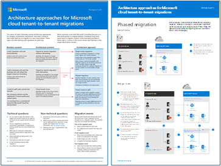

# Microsoft 365 租使用者對租使用者遷移

合併、收購、divestitures 及其他案例的一些架構方法可能會讓您將現有的 Microsoft 365 租使用者遷移至新的租使用者。 大部分的客戶都可以與 Microsoft 諮詢服務或 Microsoft 合作夥伴合作，以遷移承租人，包括使用協力廠商工具來遷移內容。 

使用 [租使用者對租使用者遷移架構模型](https://download.microsoft.com/download/b/a/1/ba19dfe7-96e2-4983-8783-4dcff9cebe7b/microsoft-365-tenant-to-tenant-migration.pdf) ，瞭解如何規劃 Microsoft 365 租使用者對租使用者的遷移和遷移步驟。

 

您可以下載 [PDF](https://github.com/MicrosoftDocs/microsoft-365-docs/raw/public/microsoft-365/downloads/Microsoft-365-tenant-to-tenant-migration.pdf) 格式的此模型，並在 letter、法律或卡片 (11 x 17) 大小的紙上列印此模型。

這種模型提供下列專案的指導方針和切入點：

- 商務案例與架構方法的對應
- 設計考量

此模型也包含下列各項的詳細範例：

- 單一事件遷移流程
- 逐步遷移流程
- 承租人移動或分割流程
