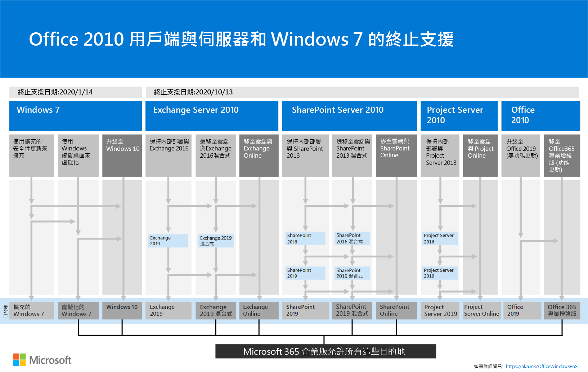
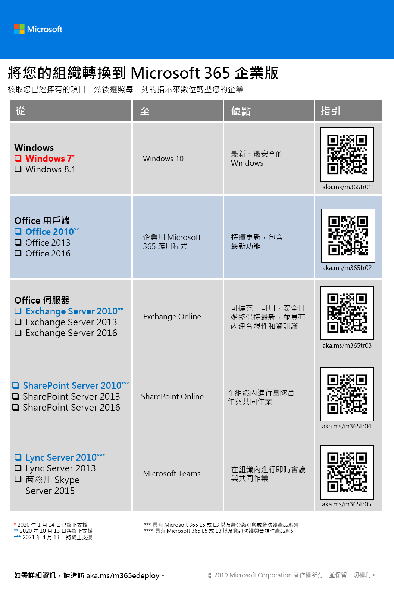

# 移轉至 Microsoft 365 企業版

大多數的企業組織擁有異質環境，其中具有多種版本的作業系統、用戶端軟體及伺服器軟體。Microsoft 365 企業版包含 IT 基礎結構中這些主要元件最安全的版本，且具有專為充分利用雲端技術所設計的生產力功能。

若要充分發揮 Microsoft 365 企業版產品整合套件的商務價值，請開始規劃並實作策略以移轉以下版本：

- 將安裝在您電腦上的 Office 用戶端移轉為 Office 365 專業增強版
- 將安裝在您伺服器上的 Office 伺服器移轉為 Office 365 中的對等服務
- 將裝置上的 Windows 7 和 Windows 8.1 移轉為 Windows 10 企業版

>[!Note]
>Windows 7 將於 **2020 年 1 月 14 日**終止支援。 如需詳細資訊，請按一下[這裡](https://support.microsoft.com/help/4057281/windows-7-support-will-end-on-january-14-2020)。
>

在一段時間內完成所有這些移轉，讓您的組織更接近[現代職場](https://www.microsoft.com/microsoft-365/blog/2018/04/27/making-it-simpler-with-a-modern-workplace/)，也就是安全的整合式環境，讓組織可發揮團隊合作和創意，而以上這些都是藉由 Microsoft 365 企業版來提供及達成。 

如需關於為特定 Office 365 工作負載遷移使用者和資料的資訊：

- 使用者信箱從 Exchange Server 到 Exchange Online，請參閱 [Exchange Online 工作負載](exchangeonline-workload.md)。
- SharePoint 資料從 SharePoint Server 到 SharePoint Online，請參閱 [SharePoint Online 工作負載](sharepoint-online-onedrive-workload.md)。
- 商務用 Skype Online 到 Microsoft Teams，請參閱 [Microsoft Teams 工作負載](teams-workload.md)。

## Microsoft Office 用戶端產品的移轉

在許多大型和小型組織中，您可能會使用較舊版本的 Office 用戶端產品組合，例如 Word、Excel 和 PowerPoint。這些較舊的版本：

- 可使用最新的安全性更新和支援修正進行[更新](https://support.office.com/article/install-office-updates-2ab296f3-7f03-43a2-8e50-46de917611c5)，但此程序有時需手動進行，且可能無法擴及整個組織。
- 未以最佳化方式啟用以便運用 Microsoft 雲端技術，及協助您的企業進行數位轉型。
- 不包含新功能。
 
Microsoft 365 企業版包含 Office 365 專業增強版，此 Office 用戶端產品版本可使用 Microsoft 365 企業版授權，且會從 Microsoft 雲端進行安裝與更新。 Office 365 專業增強版包括安全性更新和最新功能。 如需詳細資訊，請參閱[關於企業中的 Office 365 專業增強版](https://docs.microsoft.com/deployoffice/about-office-365-proplus-in-the-enterprise)。

### Office 2007

針對 Office 2007 版的 Office 版本，已終止支援。如需詳細資訊，請參閱 [Office 2007 終止支援藍圖](https://docs.microsoft.com/deployoffice/office-2007-end-support-roadmap)。

若不使用 Office 2010、Office 2013 或 Office 2016 來升級您執行 Office 2007 的電腦，請考慮：

1. 為使用者取得並指派 Microsoft 365 授權。
2. 在使用者電腦中解除安裝 Office 2007。
3. 安裝 Office 365 專業增強版 (個別或搭配 IT 推出)。如需詳細資訊，請參閱[階段 4：Office 365 專業增強版](office365proplus-infrastructure.md)。

Office 365 專業增強版會自動安裝更新，可以充分利用 Office 365 中以雲端為基礎的服務，以取得增強的安全性和生產力。

### Office 2010

針對 Office 2010 發行版本中的 Office 版本，終止支援為 **2020 年 10 月 13 日**。 如需詳細資訊，請參閱 [Office 2010 終止支援藍圖](https://docs.microsoft.com/deployoffice/office-2010-end-support-roadmap)。

若不使用 Office 2013 或 Office 2016 (這兩者都必須手動更新) 來升級您執行 Office 2010 的電腦，請考慮： 

1. 為使用者取得並指派 Microsoft 365 授權。
2. 在使用者電腦中解除安裝 Office 2010。
3. 安裝 Office 365 專業增強版 (個別或搭配 IT 推出)。如需詳細資訊，請參閱[階段 4：Office 365 專業增強版](office365proplus-infrastructure.md)。

Office 365 專業增強版會自動安裝安全性和新功能更新，並可以充分利用 Microsoft 365 中以雲端為基礎的服務，以取得增強的安全性和生產力。

### Office 2013 和 Office 2016

Office 2013 和 Office 2016 版的終止支援藍圖尚未確定。 不過，與 Office 2010 相同，您仍必須[安全性更新](https://support.office.com/article/install-office-updates-2ab296f3-7f03-43a2-8e50-46de917611c5)，而具體取決於組織的規模，可能無法妥善地擴充。

若不想使用 Office 2013 或 Office 2016 的最新安全性更新持續更新您的電腦，或將您電腦從 Office 2013 更新至 Office 2016，請考慮：

1. 為使用者取得並指派 Microsoft 365 授權。
2. 在使用者電腦中解除安裝 Office 2013 或 Office 2016。
3. 安裝 Office 365 專業增強版 (個別或搭配 IT 推出)。如需詳細資訊，請參閱[階段 4：Office 365 專業增強版](office365proplus-infrastructure.md)。

Office 365 專業增強版會自動安裝安全性和新功能更新，並可以充分利用 Microsoft 365 中以雲端為基礎的服務，以取得增強的安全性和生產力。

## Microsoft Office 伺服器產品的移轉

在許多大型和小型組織中，您可能會使用較舊版本的 Office 伺服器產品組合，例如 Exchange Server 與 SharePoint Server。這些較舊的版本：

- 應使用最新的安全性更新和支援修正進行更新。在某些情況下，這些更新會每月發行。
- 未以最佳化方式啟用以便運用 Microsoft 雲端技術，及協助您的企業進行數位轉型。
- 不包含新的生產力應用程式，例如 Microsoft Teams。
- 不包含最新的安全性功能，例如 Exchange 進階威脅防護。

Microsoft 365 企業版包括 Office 365，其中包括雲端型的 Office 伺服器服務，這些服務使用的工具與內部部署版的 Office 伺服器軟體相同，例如 Web 瀏覽器和 Outlook 用戶端。 這些服務會不斷進行安全性更新，而不需 IT 進行，進而為您節省了維護和更新內部部署伺服器所需的時間。 這些服務也含有 Office 伺服器軟體中沒有的新功能增強功能。 

### Office Server 2007

對於 Office 2007 版的伺服器產品，已終止支援。請參閱下列文章取得詳細資料：

- [Exchange 2007 終止支援藍圖](https://docs.microsoft.com/office365/enterprise/exchange-2007-end-of-support)
- [SharePoint Server 2007 終止支援藍圖](https://docs.microsoft.com/office365/enterprise/sharepoint-2007-end-of-support)
- [Project Server 2007 終止支援藍圖](https://docs.microsoft.com/office365/enterprise/project-server-2007-end-of-support)
- [Office Communications Server 終止支援藍圖](https://docs.microsoft.com/skypeforbusiness/plan-your-deployment/upgrade)
- [PerformancePoint Server 2007 終止支援藍圖](https://docs.microsoft.com/office365/enterprise/pps-2007-end-of-support)

若不使用 Office 2010、Office 2013 或 Office 2016 版的伺服器產品升級 Office 2007 版的伺服器產品，請考慮：

1. 將 Office 2007 伺服器上的資料移轉到 Office 365。如需協助，請雇用 Microsoft 合作夥伴。
2. 向使用者推出新功能和作業程序。
3. 不再需要執行 Office 2007 伺服器產品的內部部署伺服器時，請予以解除。

### Office Server 2010

以下 Office 2010 版的伺服器產品將於 **2020 年 10 月 13 日**終止支援：

- [Exchange Server 2010](https://docs.microsoft.com/office365/enterprise/exchange-2010-end-of-support)
- [SharePoint Server 2010](https://docs.microsoft.com/office365/enterprise/upgrade-from-sharepoint-2010)

若不使用 Office 2013 或 Office 2016 版的伺服器產品升級 Office 2010 版的這些伺服器產品，請考慮：

1. 將 Office 2010 伺服器上的資料移轉至 Microsoft 365。 若需要協助，請參閱[適用於 Microsoft 365 的 FastTrack](https://fasttrack.microsoft.com/microsoft365) 或雇用 Microsoft 合作夥伴。
2. 向使用者推出新功能和作業程序。
3. 不再需要執行 Office 2010 伺服器產品的內部部署伺服器時，請予以解除。

### Office Server 2013

對於 Office 2013 版的伺服器產品，尚未決定終止支援。若不使用 Office 2016 版的伺服器產品升級 Office 2013 版的伺服器產品，請考慮：

1. 將 Office 2013 伺服器上的資料移轉到 Office 365。如需協助，請參閱 [Microsoft 365 的 FastTrack](https://fasttrack.microsoft.com/microsoft365) 或雇用 Microsoft 合作夥伴。
2. 向使用者推出新功能和作業程序。
3. 不再需要執行 Office 2013 伺服器產品的內部部署伺服器時，請予以解除。

### Office Server 2016

對於 Office 2016 版的伺服器產品，尚未決定終止支援。若要充分利用以雲端為基礎的服務和增強功能，以便貴公司進行數位轉型，請考慮：

1. 將 Office 2016 伺服器上的資料移轉到 Office 365。如需協助，請參閱 [Microsoft 365 的 FastTrack](https://fasttrack.microsoft.com/microsoft365) 或雇用 Microsoft 合作夥伴。
2. 向使用者推出新功能和作業程序。
3. 不再需要執行 Office 2016 伺服器產品的內部部署伺服器時，請予以解除。

## Microsoft Windows 7 和 8.1 的移轉

Windows 7 將於 **2020 年 1 月 14 日**終止支援。 若要移轉執行 Windows 7 或 Windows 8.1 的裝置，您可以執行[就地升級](https://docs.microsoft.com/microsoft-365/enterprise/windows10-deploy-inplaceupgrade)。 

如需其他方法，請參閱 [Windows 10 部署案例](https://docs.microsoft.com/windows/deployment/windows-10-deployment-scenarios)。 您也可以自行[規劃 Windows 10 部署](https://aka.ms/planforwin10deployment)。

## 適用於 Office 2010 用戶端與伺服器和 Windows 7 的選項摘要

如需適用於這些產品的升級、移轉和移至雲端選項的視覺摘要，請參閱[終止支援海報](../media/migration-microsoft-365-enterprise-workload/Office2010Windows7EndOfSupport.pdf)。

這張單頁海報可讓您快速了解可以採取的各種方法，以防止 Office 2010 用戶端與伺服器產品以及 Windows 7 進入終止支援，而海報上也會強調顯示 Microsoft 365 企業版中慣用的方式和結果目的地。

您可以[下載此海報](https://github.com/MicrosoftDocs/microsoft-365-docs/raw/public/microsoft-365/enterprise/media/migration-microsoft-365-enterprise-workload/Office2010Windows7EndOfSupport.pdf)，並以 Letter、Legal 或 Tabloid (11 x 17) 格式列印此海報。

## Microsoft 如何執行 Microsoft 365 企業版

請查看 Microsoft 的 IT 專業人員如何使用以下資源將公司移轉到 Microsoft 365 企業版： 

- [部署及更新 Microsoft Office 365 專業增強版](https://www.microsoft.com/itshowcase/Article/Content/757/Deploying-and-updating-Microsoft-Office-365-ProPlus)
- [Microsoft 會將 150000 個信箱移轉到 Exchange Online](https://www.microsoft.com/itshowcase/Article/Content/577/Microsoft-migrates-150000-mailboxes-to-Exchange-Online)
- [SharePoint 至雲端：深入了解 Microsoft 如何執行自己的移轉](https://www.microsoft.com/itshowcase/Article/Content/691/SharePoint-to-the-cloud-Learn-how-Microsoft-ran-its-own-migration)
- [在 Microsoft 以就地升級方式部署 Windows 10](https://www.microsoft.com/itshowcase/Article/Content/668/Deploying-Windows-10-at-Microsoft-as-an-inplace-upgrade)
- [Windows 10 部署：Microsoft IT 的秘訣與技巧](https://www.microsoft.com/itshowcase/Article/Content/951/Windows-10-deployment-tips-and-tricks-from-Microsoft-IT) (影片)

## 轉換您的整個組織

若要更全面地掌握如何將整個組織移至 Microsoft 365 企業版中的產品和服務，請下載[轉換海報](../media/deploy-microsoft-365-enterprise/transition-org-to-m365.pdf)。

這份雙頁海報可讓您快速清查您現有的基礎結構，並取得移至 Microsoft 365 企業版中對應產品或服務的指導方針。 包含 Windows 和 Office 產品和其他基礎結構與安全性元素，例如裝置管理、身分識別以及資訊和威脅防護。

您可以[下載此海報](https://github.com/MicrosoftDocs/microsoft-365-docs/raw/public/microsoft-365/enterprise/media/deploy-microsoft-365-enterprise/transition-org-to-m365.pdf)，並以 Letter、Legal 或 Tabloid (11 x 17) 格式列印此海報。

## 結果

貴組織已將舊版 Microsoft Office、Office 伺服器及 Windows 移轉為 Microsoft 365 企業版。
