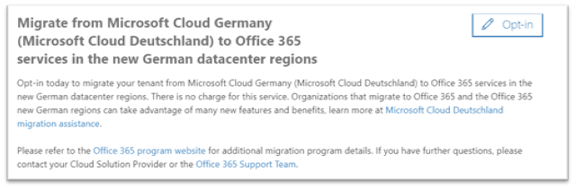
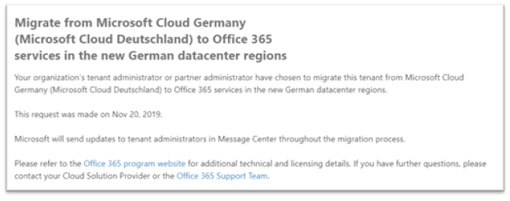

# 如何加入宣告新的從 microsoft cloud 德國遷移 (microsoft cloud Deutschland) 以 Office 365 新的德國資料中心區域中的服務

> [!NOTE]
> 本文僅適用于 Microsoft cloud 德國 (Microsoft cloud Deutschland) 客戶。
>

## 如何要求移轉

如果您是在 microsoft cloud Deutschland 中布建服務的合格客戶 (microsoft cloud) 且已以承租人 (全域) 管理員身分登入，則 Microsoft 365 系統管理中心的頁面可讓您選擇要進行遷移。

若要存取此頁面，請展開左側功能窗格中 **設定**，然後按一下 [**組織設定檔**]。

在 [組織設定檔] 頁面上，往下捲動到 [從 Microsoft Cloud Germany (Microsoft Cloud Deutschland) 移轉到新德國資料中心區域中的 Office 365 服務] 區段。

若要從 microsoft cloud 德國遷移服務 (microsoft cloud Deutschland) 以 Office 365 新的德國資料中心區域中的服務，請按一下 [**加入宣告**]。
 

新的區段會出現在畫面右側，以接受您的確認。 選取 **[是]**，然後按一下 [ **儲存**]。
 

一旦您已自願加入您的承租人，所有系統管理員就會在 **[從 microsoft (cloud Deutschland 遷移] 中看到確認。) 若要在 [新德文資料中心區域] 區段中 Office 365 服務**，包含自願加入的日期。 系統管理員也會在 Microsoft 365 系統管理中心的郵件中心接收確認。 
 

## 選擇進行遷移後，會發生什麼事？

針對加入宣告 Microsoft 導向方法的組織，遷移將會從舊版2021開始2021，且會在 Microsoft Cloud 德國 (Microsoft Cloud Deutschland) 退休日期於年10月29日為止完成。  移轉之後，核心客戶資料和訂閱都會移至新的德國區域。  Microsoft 會在郵件中心的整個遷移程式中發佈更新。 請參閱 [下列文章](#more-information) 以深入瞭解。

## 如果您不選擇在系統管理中心進行遷移，會發生什麼事？

線上服務條款已變更，包含可讓 microsoft 將您的 Microsoft 365、Dynamics 365 和 Power BI 資料和訂閱從 Microsoft Cloud Deutschland 遷移至新資料中心的字詞。 這些字詞會在任何 Microsoft Cloud 德國 (Microsoft cloud Deutschland) 訂閱從2020年5月1日起更新。 

客戶租使用者管理員會在電子郵件中收到通知，並建議您加入宣告遷移的訊息中心會自動進行 Microsoft 輔助遷移。 在自動加入宣告之前，至少會傳送30天的通知。 遷移加入宣告後，所有通訊和狀態更新都會傳送給郵件中心的客戶租使用者系統管理員。

客戶與合作夥伴租使用者系統管理員可在 Microsoft 365 系統管理中心內選擇要進行遷移，讓遷移程式可以儘早開始。

## 下一步

[瞭解遷移期間的客戶體驗](ms-cloud-germany-transition-experience.md)

## 其他資訊

開始：

- [從 Microsoft Cloud Deutschland 遷移至新德國資料中心區域的 Office 365 服務](ms-cloud-germany-transition.md)
- [Microsoft Cloud Deutschland 移轉協助](https://aka.ms/germanymigrateassist)
- [遷移期間的客戶體驗](ms-cloud-germany-transition-experience.md)

在轉換中移動：

- [移轉階段的動作與影響](ms-cloud-germany-transition-phases.md)
- [其他預備工作](ms-cloud-germany-transition-add-pre-work.md)
- [AZURE AD](ms-cloud-germany-transition-azure-ad.md)、[裝置](ms-cloud-germany-transition-add-devices.md)、[經驗](ms-cloud-germany-transition-add-experience.md)和[AD FS](ms-cloud-germany-transition-add-adfs.md)的其他資訊。

雲端應用程式：

- [Dynamics 365 的移轉程式資訊](/dynamics365/get-started/migrate-data-german-region)
- [Power BI 移轉程式資訊](/power-bi/admin/service-admin-migrate-data-germany)
- [開始升級您的 Microsoft Teams](/microsoftteams/upgrade-start-here)
