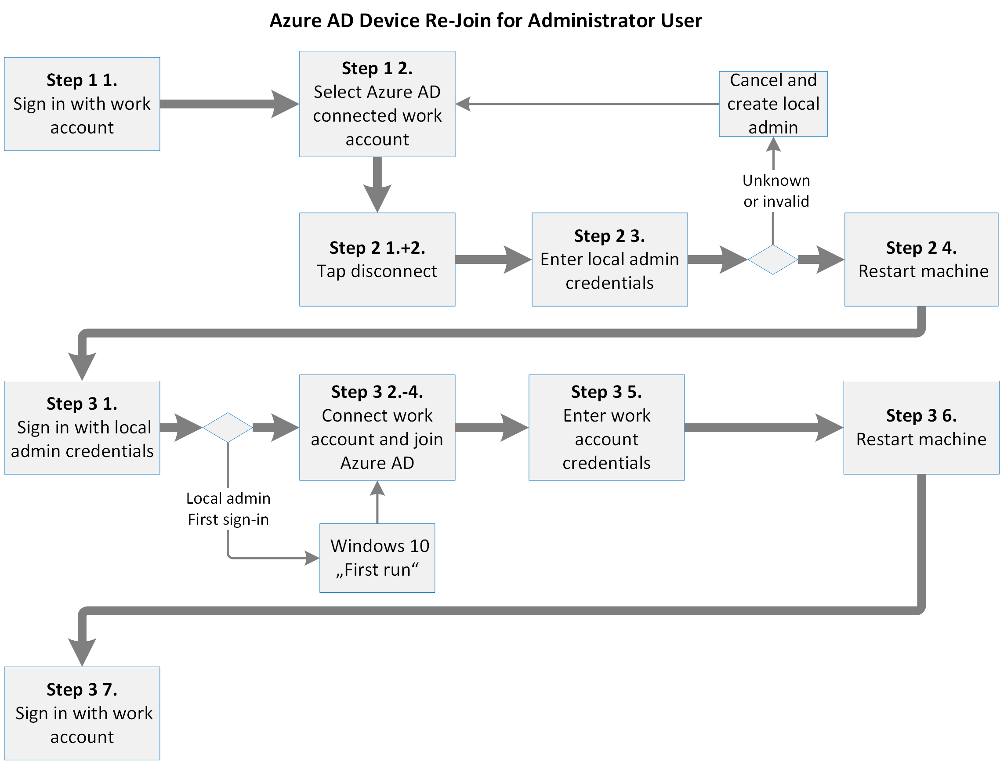

# <a name="additional-device-information-for-the-migration-from-microsoft-cloud-deutschland"></a><span data-ttu-id="59724-103">從 Microsoft Cloud Deutschland 遷移的其他裝置資訊</span><span class="sxs-lookup"><span data-stu-id="59724-103">Additional device information for the migration from Microsoft Cloud Deutschland</span></span>

<span data-ttu-id="59724-104">連接至 Microsoft 雲端 Deutschland 的 Azure AD 加入和註冊裝置必須在階段9和階段10之前遷移。</span><span class="sxs-lookup"><span data-stu-id="59724-104">Azure AD joined and registered devices connected to Microsoft Cloud Deutschland must be migrated after phase 9 and before phase 10.</span></span> <span data-ttu-id="59724-105">裝置的遷移取決於裝置類型、作業系統和 Azure AD 關聯。</span><span class="sxs-lookup"><span data-stu-id="59724-105">The migration of a device depends on the devices type, operating system and Azure AD relation.</span></span>

## <a name="azure-ad-joined-windows-10-devices"></a><span data-ttu-id="59724-106">Azure AD 加入 Windows 10 裝置</span><span class="sxs-lookup"><span data-stu-id="59724-106">Azure AD Joined Windows 10 devices</span></span>
<span data-ttu-id="59724-107">如果 Windows 10 裝置已加入 azure ad，必須中斷與 azure ad 的連線，且必須重新連線。</span><span class="sxs-lookup"><span data-stu-id="59724-107">If a Windows 10 device is Azure AD joined, it must be disconnected from Azure AD and must be connected again.</span></span>

<span data-ttu-id="59724-108">[](../media/ms-cloud-germany-migration-opt-in/AAD-ReJoin-flow.png#lightbox)</span><span class="sxs-lookup"><span data-stu-id="59724-108">[  ](../media/ms-cloud-germany-migration-opt-in/AAD-ReJoin-flow.png#lightbox)</span></span>


<span data-ttu-id="59724-109">如果使用者是 Windows 10 裝置上的系統管理員，使用者可以從 Azure AD 中登出裝置，並以三個步驟重新加入。</span><span class="sxs-lookup"><span data-stu-id="59724-109">If the user is an administrator on the Windows 10 device, the user can unregister the device from Azure AD and re-join it again in three steps.</span></span>

### <a name="step-1-determine-if-the-device-is-azure-id-joined"></a><span data-ttu-id="59724-110">步驟1：判斷裝置是否已加入 Azure 識別碼</span><span class="sxs-lookup"><span data-stu-id="59724-110">Step 1: Determine if the device is Azure ID joined</span></span>

1. <span data-ttu-id="59724-111">使用您的工作帳戶登入。</span><span class="sxs-lookup"><span data-stu-id="59724-111">Sign in with your work account.</span></span>
2. <span data-ttu-id="59724-112">移至 **設定**  >  **帳戶**  >  **存取工作或學校**。</span><span class="sxs-lookup"><span data-stu-id="59724-112">Go to **Settings** > **Accounts** > **Access Work Or School**.</span></span>
3. <span data-ttu-id="59724-113">在清單中尋找 **已連接至 [...] ' 的帳戶s Azure AD**。</span><span class="sxs-lookup"><span data-stu-id="59724-113">Look for an account in the list with **connected to […]‘s Azure AD**.</span></span>
4. <span data-ttu-id="59724-114">如果已連線的帳戶存在，請繼續進行步驟2。</span><span class="sxs-lookup"><span data-stu-id="59724-114">If a connected account exists, proceed with Step 2.</span></span>

### <a name="step-2-disconnect-the-device-from-azure-ad"></a><span data-ttu-id="59724-115">步驟2：從 Azure AD 中斷裝置連線</span><span class="sxs-lookup"><span data-stu-id="59724-115">Step 2: Disconnect the device from Azure AD</span></span>

1. <span data-ttu-id="59724-116">在 [連線的公司或學校帳戶] 上，按一下 [ **中斷連線]** 。</span><span class="sxs-lookup"><span data-stu-id="59724-116">Click **Disconnect** on the connected work or School Account.</span></span>
2. <span data-ttu-id="59724-117">確認 [中斷連線] 兩次。</span><span class="sxs-lookup"><span data-stu-id="59724-117">Confirm the disconnect twice.</span></span>
3. <span data-ttu-id="59724-118">輸入本機系統管理員的使用者名稱和密碼。</span><span class="sxs-lookup"><span data-stu-id="59724-118">Enter a local administrator username and password.</span></span> <span data-ttu-id="59724-119">裝置中斷連線。</span><span class="sxs-lookup"><span data-stu-id="59724-119">The device is disconnected.</span></span>
4. <span data-ttu-id="59724-120">重新開機裝置。</span><span class="sxs-lookup"><span data-stu-id="59724-120">Restart the device.</span></span>

### <a name="step-3-join-the-device-to-azure-ad"></a><span data-ttu-id="59724-121">步驟3：將裝置加入 Azure AD</span><span class="sxs-lookup"><span data-stu-id="59724-121">Step 3: Join the device to Azure AD</span></span>

1. <span data-ttu-id="59724-122">使用本機系統管理員的認證登入。</span><span class="sxs-lookup"><span data-stu-id="59724-122">Sign in with the credentials of the local administrator.</span></span>
2. <span data-ttu-id="59724-123">移至 **設定**  >  **帳戶**  >  **存取工作或學校**。</span><span class="sxs-lookup"><span data-stu-id="59724-123">Go to **Settings** > **Accounts** > **Access Work Or School**.</span></span>
3. <span data-ttu-id="59724-124">按一下 **[連線]**。</span><span class="sxs-lookup"><span data-stu-id="59724-124">Click **Connect**.</span></span>
4. <span data-ttu-id="59724-125">**重要** 事項：按一下 [ **加入 Azure AD**]。</span><span class="sxs-lookup"><span data-stu-id="59724-125">**IMPORTANT**: Click **Join to Azure AD**.</span></span>
5. <span data-ttu-id="59724-126">輸入您工作帳戶的電子郵件地址和密碼。</span><span class="sxs-lookup"><span data-stu-id="59724-126">Enter the e-mail address and password of your work account.</span></span> <span data-ttu-id="59724-127">裝置已連線。</span><span class="sxs-lookup"><span data-stu-id="59724-127">The device is connected.</span></span>
6. <span data-ttu-id="59724-128">重新開機裝置。</span><span class="sxs-lookup"><span data-stu-id="59724-128">Restart the device.</span></span>
7. <span data-ttu-id="59724-129">使用您的工作帳戶的電子郵件地址和密碼登入。</span><span class="sxs-lookup"><span data-stu-id="59724-129">Sign in with the email address and password of your work account.</span></span>

<span data-ttu-id="59724-130">如果使用者不是裝置的系統管理員，Azure AD 全域系統管理員可以在此設定路徑之後的裝置上建立本機系統管理員帳戶，然後將裝置脫離：</span><span class="sxs-lookup"><span data-stu-id="59724-130">If the user is not an administrator of the device, an Azure AD global administrator can create the local administrator account on the device following this configuration path and unjoin the device:</span></span>

<span data-ttu-id="59724-131">*設定 > 帳戶 > 其他帳戶 > 憑證未知 > 新增沒有 Microsoft 帳戶的使用者*</span><span class="sxs-lookup"><span data-stu-id="59724-131">*Settings > Accounts > Other Accounts > Credentials unknown > Add user without Microsoft-Account*</span></span>

<span data-ttu-id="59724-132">若要重新加入，您可以在此步驟中使用您組織中任何工作帳戶的認證。</span><span class="sxs-lookup"><span data-stu-id="59724-132">For re-joining, the credentials of any work account from your organization can be used in this step.</span></span>

<span data-ttu-id="59724-133">請考慮加入裝置所用的工作帳戶，會自動以裝置管理員的身分升級。</span><span class="sxs-lookup"><span data-stu-id="59724-133">Please consider that the work account used to join the device will be automatically promoted as an Administrator of the device.</span></span>
<span data-ttu-id="59724-134">組織中的任何其他工作帳戶都可以登入裝置，但沒有系統管理員許可權。</span><span class="sxs-lookup"><span data-stu-id="59724-134">Any other work account from the organization can sign in to the device, but has no administrator privileges.</span></span>

## <a name="azure-ad-registered-workplace-joined-windows-10-devices"></a><span data-ttu-id="59724-135">) Windows 10 裝置 (已加入 workplace 的 Azure AD</span><span class="sxs-lookup"><span data-stu-id="59724-135">Azure AD registered (workplace-joined) Windows 10 devices</span></span>

<span data-ttu-id="59724-136">如果 Windows 10 裝置已註冊 azure ad，則必須中斷與 azure ad 的連線，並再次連接。</span><span class="sxs-lookup"><span data-stu-id="59724-136">If a Windows 10 device is Azure AD registered, it needs to be disconnected from the Azure AD and connected again.</span></span>

<span data-ttu-id="59724-137">[](../media/ms-cloud-germany-migration-opt-in/AAD-ReJoin-flow.png#lightbox)</span><span class="sxs-lookup"><span data-stu-id="59724-137">[  ](../media/ms-cloud-germany-migration-opt-in/AAD-ReJoin-flow.png#lightbox)</span></span>

### <a name="step-1-determine-if-the-device-is-azure-id-registered"></a><span data-ttu-id="59724-138">步驟1：判斷裝置是否已註冊 Azure 識別碼</span><span class="sxs-lookup"><span data-stu-id="59724-138">Step 1: Determine if the device is Azure ID registered</span></span>

1. <span data-ttu-id="59724-139">使用使用者登入。</span><span class="sxs-lookup"><span data-stu-id="59724-139">Sign in with your user.</span></span>
2. <span data-ttu-id="59724-140">移至 **設定**  >  **帳戶**  >  **存取工作或學校**。</span><span class="sxs-lookup"><span data-stu-id="59724-140">Go to **Settings** > **Accounts** > **Access Work Or School**.</span></span>
3. <span data-ttu-id="59724-141">在清單中探索您的工作帳戶，並檢查其是否已 **連接至 [...] 's Azure AD**。</span><span class="sxs-lookup"><span data-stu-id="59724-141">Discover your work account in the list and check if it is **connected to […]‘s Azure AD**.</span></span>

    <span data-ttu-id="59724-142">如果您的工作帳戶在清單中，但未連線到 Azure AD，請繼續進行步驟2。</span><span class="sxs-lookup"><span data-stu-id="59724-142">If your work account is in the list but NOT connected to an Azure AD, proceed with step 2.</span></span>

    <span data-ttu-id="59724-143">否則，您的裝置是 azure 已加入 azure 的裝置，您必須參照[azure ad 加入的 Windows 10 裝置](#azure-ad-joined-windows-10-devices)。</span><span class="sxs-lookup"><span data-stu-id="59724-143">Otherwise, your device is an Azure AD joined device and you have to refer to [Azure AD Joined Windows 10 devices](#azure-ad-joined-windows-10-devices).</span></span>

### <a name="step-2-disconnect-the-device-from-azure-ad"></a><span data-ttu-id="59724-144">步驟2：從 Azure AD 中斷裝置連線</span><span class="sxs-lookup"><span data-stu-id="59724-144">Step 2: Disconnect the device from Azure AD</span></span>

1. <span data-ttu-id="59724-145">按一下您的工作帳戶。</span><span class="sxs-lookup"><span data-stu-id="59724-145">Click on your work account.</span></span> <span data-ttu-id="59724-146">隨即出現 [按鈕 *資訊* 及 *中斷連線]* 。</span><span class="sxs-lookup"><span data-stu-id="59724-146">The buttons *Info* and *Disconnect* appear.</span></span>
2. <span data-ttu-id="59724-147">按一下 **[中斷連線]**。</span><span class="sxs-lookup"><span data-stu-id="59724-147">Click **Disconnect**.</span></span>
3. <span data-ttu-id="59724-148">按一下 **[是]** 確認移除裝置中的帳戶。</span><span class="sxs-lookup"><span data-stu-id="59724-148">Confirm account removal from the device by clicking **Yes**.</span></span>

### <a name="step-3-connect-the-device-to-azure-ad"></a><span data-ttu-id="59724-149">步驟3：將裝置連線至 Azure AD</span><span class="sxs-lookup"><span data-stu-id="59724-149">Step 3: Connect the device to Azure AD</span></span>

1. <span data-ttu-id="59724-150">按一下 **[連線]**。</span><span class="sxs-lookup"><span data-stu-id="59724-150">Click **Connect**.</span></span>
2. <span data-ttu-id="59724-151">輸入您的工作帳戶的電子郵件地址，然後按 **[下一步]**。</span><span class="sxs-lookup"><span data-stu-id="59724-151">Enter the email address of your work account and click **Next**.</span></span>
3. <span data-ttu-id="59724-152">輸入工作帳戶的密碼，然後按一下 [登 **入**]。</span><span class="sxs-lookup"><span data-stu-id="59724-152">Enter the password of your work account and click **Sign in**.</span></span>
4. <span data-ttu-id="59724-153">按一下 [ **完成**] 以確認。</span><span class="sxs-lookup"><span data-stu-id="59724-153">Confirm by clicking **Done**.</span></span> <span data-ttu-id="59724-154">您的工作帳戶會再次列出。</span><span class="sxs-lookup"><span data-stu-id="59724-154">Your work account is listed again.</span></span>

## <a name="android"></a><span data-ttu-id="59724-155">Android</span><span class="sxs-lookup"><span data-stu-id="59724-155">Android</span></span>

<span data-ttu-id="59724-156">若為 Android，使用者將需要撤銷註冊並重新登錄其裝置。</span><span class="sxs-lookup"><span data-stu-id="59724-156">For Android, users will need to unregister and re-register their devices.</span></span> <span data-ttu-id="59724-157">這可以透過 Microsoft Authenticator 應用程式或公司入口網站應用程式來完成。</span><span class="sxs-lookup"><span data-stu-id="59724-157">This can be done via the Microsoft Authenticator app or the Company Portal app.</span></span>

- <span data-ttu-id="59724-158">在 Microsoft Authenticator 應用程式中，使用者可以前往 **設定 > 裝置註冊**。</span><span class="sxs-lookup"><span data-stu-id="59724-158">From the Microsoft Authenticator app, users can go to **Settings > Device Registration**.</span></span> <span data-ttu-id="59724-159">從這裡開始，使用者可以撤銷註冊並重新登錄其裝置。</span><span class="sxs-lookup"><span data-stu-id="59724-159">From there users can unregister and re-register their device.</span></span>

- <span data-ttu-id="59724-160">從公司入口網站中，使用者可以移至 [**裝置**] 索引標籤並移除裝置。</span><span class="sxs-lookup"><span data-stu-id="59724-160">From the Company Portal, users can go to **Devices** tab and remove the device.</span></span> <span data-ttu-id="59724-161">之後，使用公司入口網站重新註冊裝置。</span><span class="sxs-lookup"><span data-stu-id="59724-161">After that, re-enroll the device by using Company Portal.</span></span>

- <span data-ttu-id="59724-162">使用者也可以從 [帳戶設定] 頁面移除帳戶，然後重新加入工作帳戶，以取消登錄和重新註冊。</span><span class="sxs-lookup"><span data-stu-id="59724-162">Users can also unregister and re-register by removing the account from the account settings page and then re-adding the work account.</span></span>

<span data-ttu-id="59724-163">若要使用 Microsoft Authenticator 應用程式在 Android 上撤銷登錄並重新登錄，請執行下列動作：</span><span class="sxs-lookup"><span data-stu-id="59724-163">To unregister and re-register the device on Android by using the Microsoft Authenticator app:</span></span>

1. <span data-ttu-id="59724-164">開啟 Microsoft Authenticator 應用程式，然後移至 **設定**。</span><span class="sxs-lookup"><span data-stu-id="59724-164">Open the Microsoft Authenticator app and go to **Settings**.</span></span>
2. <span data-ttu-id="59724-165">選取 **Device registration**。</span><span class="sxs-lookup"><span data-stu-id="59724-165">Select **Device registration**.</span></span>
3. <span data-ttu-id="59724-166">選取 [ **登出**] 以取消登錄裝置。</span><span class="sxs-lookup"><span data-stu-id="59724-166">Unregister the device by selecting **Unregister**.</span></span>
4. <span data-ttu-id="59724-167">若為 **Device registration**，請輸入您的電子郵件地址，然後選取 [ **註冊**]，以重新註冊裝置。</span><span class="sxs-lookup"><span data-stu-id="59724-167">For **Device registration**, re-register the device by typing your email address, and then select **Register**.</span></span>

<span data-ttu-id="59724-168">若要使用 Android 設定頁面來撤銷註冊並重新登錄 Android 裝置，請執行下列動作：</span><span class="sxs-lookup"><span data-stu-id="59724-168">To unregister and re-register an Android device with the Android Settings page:</span></span>

1. <span data-ttu-id="59724-169">開啟 [**裝置設定**]，然後移至 [**帳戶**]。</span><span class="sxs-lookup"><span data-stu-id="59724-169">Open **Device Settings** and go to **Accounts**.</span></span>
2. <span data-ttu-id="59724-170">選取您要重新註冊的工作帳戶，然後選取 [ **移除帳戶**]。</span><span class="sxs-lookup"><span data-stu-id="59724-170">Select the work account that you want to re-register and select **Remove account**.</span></span>
3. <span data-ttu-id="59724-171">移除帳戶後，請從 [ **帳戶** ] 頁面中，選取 [ **新增帳戶 > 工作帳戶**]。</span><span class="sxs-lookup"><span data-stu-id="59724-171">After the account is removed, from the **Accounts** page, select **Add Account > Work account**.</span></span>
4. <span data-ttu-id="59724-172">在 [ **Workplace Join**] 中輸入您的電子郵件地址，然後選取 [ **加入** ] 以完成裝置的註冊。</span><span class="sxs-lookup"><span data-stu-id="59724-172">For **Workplace Join**, type your email address and select **Join** to complete registering the device.</span></span>

<span data-ttu-id="59724-173">若要從公司入口網站登出並重新登錄 Android 上的裝置：</span><span class="sxs-lookup"><span data-stu-id="59724-173">To unregister and re-register the device on Android from Company Portal:</span></span>

1. <span data-ttu-id="59724-174">啟動公司入口網站，然後移至 [**裝置**] 索引標籤。</span><span class="sxs-lookup"><span data-stu-id="59724-174">Launch Company Portal and go to **Devices** tab.</span></span>
2. <span data-ttu-id="59724-175">選取裝置以查看裝置詳細資料。</span><span class="sxs-lookup"><span data-stu-id="59724-175">Select the device to see the device details.</span></span>
3. <span data-ttu-id="59724-176">從省略號 (三點) 功能表中，選取 [ **移除裝置**]，並在對話方塊中確認以完成移除。</span><span class="sxs-lookup"><span data-stu-id="59724-176">From the ellipses (three dots) menu, select **Remove Device**, and complete the removal by confirming in the dialog.</span></span>
4. <span data-ttu-id="59724-177">您現在應該已登出公司入口網站的應用程式。</span><span class="sxs-lookup"><span data-stu-id="59724-177">You should now be logged out of the Company Portal app.</span></span> <span data-ttu-id="59724-178">選取 [登入] 以重新 **登錄** 裝置。</span><span class="sxs-lookup"><span data-stu-id="59724-178">Select **Sign in** to re-register the device.</span></span>

<span data-ttu-id="59724-179">如需此工作負載遷移階段所需之任何動作的詳細資訊，或對管理或使用的影響，請參閱 azure ad) 中 Azure Active Directory (Azure ad 的相關資訊，以[供從 Microsoft Cloud Deutschland 進行遷移的其他 azure ad 資訊中取得](ms-cloud-germany-transition-azure-ad.md)。</span><span class="sxs-lookup"><span data-stu-id="59724-179">For more information about any actions required during the migration phase of this workload, or impact to administration or usage, review the information about Azure Active Directory (Azure AD) in [Additional Azure AD information for the migration from Microsoft Cloud Deutschland](ms-cloud-germany-transition-azure-ad.md).</span></span>

## <a name="ios"></a><span data-ttu-id="59724-180">iOS</span><span class="sxs-lookup"><span data-stu-id="59724-180">iOS</span></span>

<span data-ttu-id="59724-181">在 iOS 裝置上，使用者將需要從 Microsoft Authenticator 手動移除任何快取的帳戶、登出裝置，然後登出裝置上的任何原生應用程式。</span><span class="sxs-lookup"><span data-stu-id="59724-181">On iOS devices, a user will need to manually remove any cached accounts from the Microsoft Authenticator, unregister the device, and sign out from any native apps on the device.</span></span>

### <a name="step-1-if-present-remove-the-account-from-the-microsoft-authenticator-app"></a><span data-ttu-id="59724-182">步驟1：若存在，請從 Microsoft Authenticator 應用程式中移除帳戶。</span><span class="sxs-lookup"><span data-stu-id="59724-182">Step 1: If present, remove the account from the Microsoft Authenticator app</span></span>

1. <span data-ttu-id="59724-183">在 Microsoft Authenticator 應用程式中點擊帳戶。</span><span class="sxs-lookup"><span data-stu-id="59724-183">Tap the account in the Microsoft Authenticator app.</span></span>
2. <span data-ttu-id="59724-184">按一下右上角的 **設定** 圖示。</span><span class="sxs-lookup"><span data-stu-id="59724-184">Tap the **Settings** icon in the top-right corner.</span></span> <span data-ttu-id="59724-185">如果您沒有看到 **設定** 圖示，則可能是您使用的是 Microsoft Authenticator 的最新版本。</span><span class="sxs-lookup"><span data-stu-id="59724-185">If you don't see the **Settings** icon, you might not be using the latest version of Microsoft Authenticator.</span></span>
3. <span data-ttu-id="59724-186">點擊 [ **移除帳戶** ] 按鈕。</span><span class="sxs-lookup"><span data-stu-id="59724-186">Tap the **Remove account** button.</span></span>
4. <span data-ttu-id="59724-187">點擊 [ **此裝置上的所有應用程式**]。</span><span class="sxs-lookup"><span data-stu-id="59724-187">Tap **All apps on this device**.</span></span>

### <a name="step-2-unregister-the-device-from-the-microsoft-authenticator-app"></a><span data-ttu-id="59724-188">步驟2：從 Microsoft Authenticator 應用程式中登出裝置</span><span class="sxs-lookup"><span data-stu-id="59724-188">Step 2: Unregister the device from the Microsoft Authenticator app</span></span>

1. <span data-ttu-id="59724-189">在右上角點擊功能表圖示。</span><span class="sxs-lookup"><span data-stu-id="59724-189">Tap the menu icon in the top-right corner.</span></span>
2. <span data-ttu-id="59724-190">按 **設定**，然後按 **裝置註冊**。</span><span class="sxs-lookup"><span data-stu-id="59724-190">Tap **Settings** and then **Device Registration**.</span></span>
3. <span data-ttu-id="59724-191">如果顯示您的帳戶，請點擊 [ **登出裝置** ]，然後在對話方塊中 **繼續** 。</span><span class="sxs-lookup"><span data-stu-id="59724-191">If your account is shown, tap **Unregister device** and **Continue** in the dialog.</span></span> <span data-ttu-id="59724-192">之後，您就不會看到任何帳戶。</span><span class="sxs-lookup"><span data-stu-id="59724-192">You should see no account after that.</span></span>

### <a name="step-3-sign-out-from-individual-apps-if-necessary"></a><span data-ttu-id="59724-193">步驟3：必要時登出個別應用程式</span><span class="sxs-lookup"><span data-stu-id="59724-193">Step 3: Sign out from individual apps if necessary</span></span>

<span data-ttu-id="59724-194">使用者可以移至個別應用程式，例如 Outlook、Teams 及 OneDrive，以及從這些應用程式中移除帳戶。</span><span class="sxs-lookup"><span data-stu-id="59724-194">Users can go to individual apps like Outlook, Teams, and OneDrive, and remove accounts from those apps.</span></span>

## <a name="frequently-asked-questions"></a><span data-ttu-id="59724-195">常見問題集</span><span class="sxs-lookup"><span data-stu-id="59724-195">Frequently asked questions</span></span>

<span data-ttu-id="59724-196">**如何判斷組織是否受到影響？**</span><span class="sxs-lookup"><span data-stu-id="59724-196">**How can I tell if my organization is affected?**</span></span>

<span data-ttu-id="59724-197">管理員應該檢查 `https://portal.microsoftazure.de` 是否有任何 AZURE ad 已註冊或 AZURE ad 聯結裝置。</span><span class="sxs-lookup"><span data-stu-id="59724-197">Administrators should check `https://portal.microsoftazure.de` to determine if they have any Azure AD registered or Azure AD joined devices.</span></span> <span data-ttu-id="59724-198">如果您的組織已註冊 Azure AD 或已加入 Azure AD 的裝置，您的組織必須依照此頁面上的指示進行。</span><span class="sxs-lookup"><span data-stu-id="59724-198">If your organization has Azure AD registered or Azure AD joined devices, your organization has to follow the instructions on this page.</span></span>

<span data-ttu-id="59724-199">**我的使用者何時重新註冊其裝置？**</span><span class="sxs-lookup"><span data-stu-id="59724-199">**When do my users re-register their devices?**</span></span>

<span data-ttu-id="59724-200">您的成功必須先取消註冊，然後在 [階段 9](ms-cloud-germany-transition-phases.md#phase-9--10-azure-ad-finalization) 完成之後重新登錄裝置，這一點很重要。</span><span class="sxs-lookup"><span data-stu-id="59724-200">It's critical to your success that you only unregister and re-register your devices after [phase 9](ms-cloud-germany-transition-phases.md#phase-9--10-azure-ad-finalization) has been completed.</span></span> <span data-ttu-id="59724-201">您必須在第10階段開始之前完成重新註冊，否則您可能會失去對裝置的存取權。</span><span class="sxs-lookup"><span data-stu-id="59724-201">You must finish the re-registration before phase 10 starts, otherwise you could lose access to your device.</span></span>

<span data-ttu-id="59724-202">**如何知道我的所有裝置都已登錄公用雲端？**</span><span class="sxs-lookup"><span data-stu-id="59724-202">**How do I know that all my devices are registered in the public cloud?**</span></span>

<span data-ttu-id="59724-203">若要檢查您的裝置是否已在公用雲端中註冊，您應該將裝置清單從 Azure AD 入口網站匯出並下載至 Excel 試算表。</span><span class="sxs-lookup"><span data-stu-id="59724-203">To check whether your devices are registered in the public cloud, you should export and download the list of devices from the Azure AD portal to an Excel spreadsheet.</span></span> <span data-ttu-id="59724-204">然後，在您的組織已超過遷移程式的 [階段 9](ms-cloud-germany-transition-phases.md#phase-9--10-azure-ad-finalization)之後，使用 _registeredTime_ 欄) ，以篩選 (註冊的裝置。</span><span class="sxs-lookup"><span data-stu-id="59724-204">Then, filter the devices that are registered (by using the _registeredTime_ column) after the date when your organization has passed [phase 9 of the migration process](ms-cloud-germany-transition-phases.md#phase-9--10-azure-ad-finalization).</span></span>

<span data-ttu-id="59724-205">**我還是需要 [使用以 Windows 為基礎的 dns 建立 Microsoft dns 記錄](/microsoft-365/admin/dns/create-dns-records-using-windows-based-dns?view=o365-worldwide#add-two-cname-records-for-mobile-device-management-mdm-for-microsoft)中所述的方式來新增 dns 名稱嗎？**</span><span class="sxs-lookup"><span data-stu-id="59724-205">**Do I still need to add the DNS name as stated in [Create DNS records for Microsoft using Windows-based DNS](/microsoft-365/admin/dns/create-dns-records-using-windows-based-dns?view=o365-worldwide#add-two-cname-records-for-mobile-device-management-mdm-for-microsoft)?**</span></span>

<span data-ttu-id="59724-206">重新註冊裝置不再需要此 DNS 專案。</span><span class="sxs-lookup"><span data-stu-id="59724-206">This DNS entry is no longer needed for re-registering your device.</span></span> 

## <a name="additional-considerations"></a><span data-ttu-id="59724-207">其他考量</span><span class="sxs-lookup"><span data-stu-id="59724-207">Additional considerations</span></span>

> [!IMPORTANT]
> <span data-ttu-id="59724-208">在遷移程式的 [階段 3](ms-cloud-germany-transition-phases.md#phase-3-subscription-transfer)之後，將會啟用 Intune 服務主體，這表示 Azure AD Device Registration 的啟用。</span><span class="sxs-lookup"><span data-stu-id="59724-208">The Intune service principal will be enabled after [phase 3 of the migration process](ms-cloud-germany-transition-phases.md#phase-3-subscription-transfer), which implies the activation of Azure AD Device Registration.</span></span> <span data-ttu-id="59724-209">如果您在遷移之前封鎖 Azure AD 裝置註冊，您必須使用 PowerShell 停用 Intune service 主體，以使用 Azure AD 入口網站停用 Azure AD 裝置註冊。</span><span class="sxs-lookup"><span data-stu-id="59724-209">If you blocked Azure AD Device Registration before migration, you must disable the Intune service principal with PowerShell to disable Azure AD Device Registration with the Azure AD portal again.</span></span> <span data-ttu-id="59724-210">您可以在 Graph 模組的 Azure Active Directory PowerShell 中，使用此命令來停用 Intune 服務主體。</span><span class="sxs-lookup"><span data-stu-id="59724-210">You can disable the Intune service principal with this command in the Azure Active Directory PowerShell for Graph module.</span></span>

```powershell
Get-AzureADServicePrincipal -All:$true |Where-object -Property AppId -eq "0000000a-0000-0000-c000-000000000000" | Set-AzureADServicePrincipal -AccountEnabled:$false
```

## <a name="more-information"></a><span data-ttu-id="59724-211">其他相關資訊</span><span class="sxs-lookup"><span data-stu-id="59724-211">More information</span></span>

<span data-ttu-id="59724-212">開始：</span><span class="sxs-lookup"><span data-stu-id="59724-212">Getting started:</span></span>

- [<span data-ttu-id="59724-213">從 Microsoft Cloud Deutschland 遷移至新德國資料中心區域的 Office 365 服務</span><span class="sxs-lookup"><span data-stu-id="59724-213">Migration from Microsoft Cloud Deutschland to Office 365 services in the new German datacenter regions</span></span>](ms-cloud-germany-transition.md)
- [<span data-ttu-id="59724-214">Microsoft Cloud Deutschland 移轉協助</span><span class="sxs-lookup"><span data-stu-id="59724-214">Microsoft Cloud Deutschland Migration Assistance</span></span>](https://aka.ms/germanymigrateassist)
- [<span data-ttu-id="59724-215">如何選擇加入移轉</span><span class="sxs-lookup"><span data-stu-id="59724-215">How to opt-in for migration</span></span>](ms-cloud-germany-migration-opt-in.md)
- [<span data-ttu-id="59724-216">遷移期間的客戶體驗</span><span class="sxs-lookup"><span data-stu-id="59724-216">Customer experience during the migration</span></span>](ms-cloud-germany-transition-experience.md)

<span data-ttu-id="59724-217">在轉換中移動：</span><span class="sxs-lookup"><span data-stu-id="59724-217">Moving through the transition:</span></span>

- [<span data-ttu-id="59724-218">移轉階段的動作與影響</span><span class="sxs-lookup"><span data-stu-id="59724-218">Migration phases actions and impacts</span></span>](ms-cloud-germany-transition-phases.md)
- [<span data-ttu-id="59724-219">其他預備工作</span><span class="sxs-lookup"><span data-stu-id="59724-219">Additional pre-work</span></span>](ms-cloud-germany-transition-add-pre-work.md)
- <span data-ttu-id="59724-220">[AZURE AD](ms-cloud-germany-transition-azure-ad.md)、[裝置](ms-cloud-germany-transition-add-devices.md)、[經驗](ms-cloud-germany-transition-add-experience.md)和[AD FS](ms-cloud-germany-transition-add-adfs.md)的其他資訊。</span><span class="sxs-lookup"><span data-stu-id="59724-220">Additional information for [Azure AD](ms-cloud-germany-transition-azure-ad.md), [devices](ms-cloud-germany-transition-add-devices.md), [experiences](ms-cloud-germany-transition-add-experience.md), and [AD FS](ms-cloud-germany-transition-add-adfs.md).</span></span>

<span data-ttu-id="59724-221">雲端應用程式：</span><span class="sxs-lookup"><span data-stu-id="59724-221">Cloud apps:</span></span>

- [<span data-ttu-id="59724-222">Dynamics 365 的移轉程式資訊</span><span class="sxs-lookup"><span data-stu-id="59724-222">Dynamics 365 migration program information</span></span>](/dynamics365/get-started/migrate-data-german-region)
- [<span data-ttu-id="59724-223">Power BI 移轉程式資訊</span><span class="sxs-lookup"><span data-stu-id="59724-223">Power BI migration program information</span></span>](/power-bi/admin/service-admin-migrate-data-germany)
- [<span data-ttu-id="59724-224">開始升級您的 Microsoft Teams</span><span class="sxs-lookup"><span data-stu-id="59724-224">Getting started with your Microsoft Teams upgrade</span></span>](/microsoftteams/upgrade-start-here)
