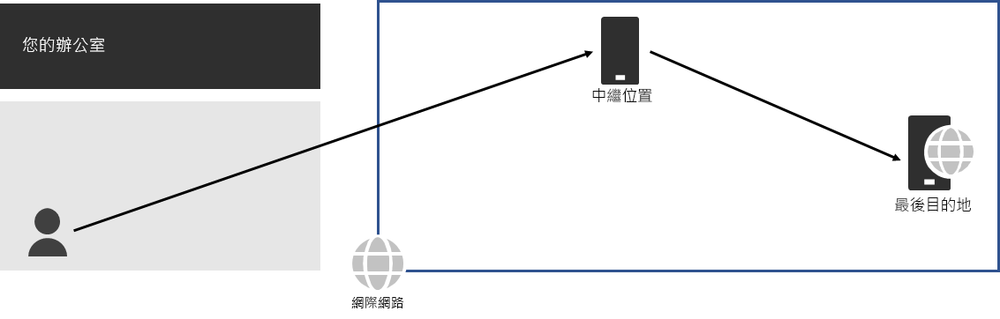
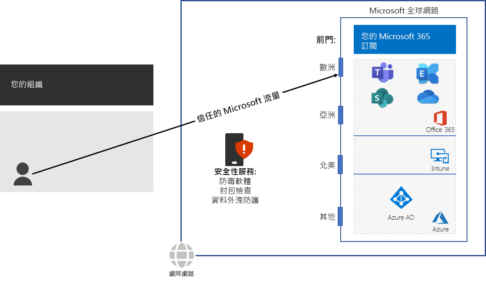

# 步驟 3：避免網路 HairpinStep 3: Avoid network hairpins

*此為必要步驟，且同時適用於 Microsoft 365 企業版 E3 和 E5 版本**This step is required and applies to both the E3 and E5 versions of Microsoft 365 Enterprise*

當繫結到目的地的流量 (例如內部部署安全性堆疊、雲端存取代理程式或雲端 Web 閘道) 首先被導向另一個中繼位置時，會發生[網路 hairpin](https://docs.microsoft.com/office365/enterprise/office-365-network-connectivity-principles#BKMK_P3)。A [network hairpin](https://docs.microsoft.com/office365/enterprise/office-365-network-connectivity-principles#BKMK_P3) happens when traffic bound for a destination is first directed to another intermediate location, such as an on-premises security stack, cloud access broker, or cloud-based web gateway. 範例如下。Here is an example.

網路 hairpin 也可能是由於網路服務提供者在網際網路上的路由不良所導致。A network hairpin could also be caused by poor routing on the Internet due to network service providers. 

Hairpin 會增加延遲，並可能將流量重新導向距離較遠的位置。A hairpin adds latency and can potentially redirect traffic to a geographically distant location.

若要最佳化 Microsoft 365 雲端型服務之流量的效能，請檢查提供當地網際網路連線的 ISP 是否在接近該位置之處具有與 Microsoft 全球網路的直接對等關係。這些連線沒有 Hairpin。To optimize performance for traffic to Microsoft 365 cloud-based services, check whether the ISP providing the local Internet connection has a direct peering relationship with the Microsoft Global Network in close proximity to that location. These connections do not have hairpins.

如果您為 Microsoft 365 流量使用雲端型網路或安全性服務，請務必評估 Hairpinning 效果，並了解它對效能的影響。請檢查下列各項：If you use cloud-based network or security services for your Microsoft 365 traffic, ensure that the hairpinning effect is evaluated and its impact on performance is understood. Examine the following:

- 針對您的分公司和 Microsoft 全球網路對等點，透過其轉送流量之服務提供者的數目和位置The number and locations of your service providers through which the traffic is forwarded in relationship to your branch offices and Microsoft Global Network peering points 
- 服務提供者與您的 ISP 和 Microsoft 之網路對等關係的品質The quality of the network peering relationship of the service provider with your ISP and Microsoft 
- 服務提供者基礎結構中回載的效能影響The performance impact of backhauling in the service provider infrastructure

儘可能將您的邊緣路由器設定為直接傳送信任的 Microsoft 365 流量，而不是透過處理網際網路流量的協力廠商雲端或雲端型網路安全性廠商來進行 Proxy 處理或通道傳送。Whenever possible, configure your edge routers to send trusted Microsoft 365 traffic directly, instead of proxying or tunneling through a third-party cloud or cloud-based network security vendor that processes your Internet traffic. 

若要測試您與 Microsoft 全球網路進入點有多接近，以及您與組織網路連線至 ISP 的點有多接近，請使用 [Office 365 網路上線工具](https://connectivity.office.com/)。To test how close you are to an entry point for Microsoft’s global network and how close you are to the point where your organization network connects to your ISP, use the [Office 365 Network Onboarding tool](https://connectivity.office.com/).

做為過渡期的檢查點，您可以看到此步驟的[允出準則](networking-exit-criteria.md#crit-networking-step3)。As an interim checkpoint, you can see the [exit criteria](networking-exit-criteria.md#crit-networking-step3) for this step.

## 下一步Next step

|||
|:-------|:-----|
||[設定流量旁路Configure traffic bypass](networking-configure-proxies-firewalls.md)|
