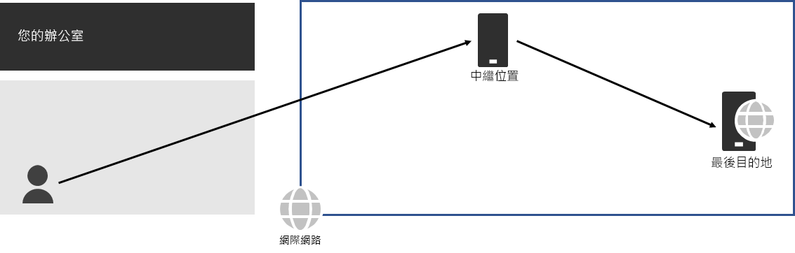
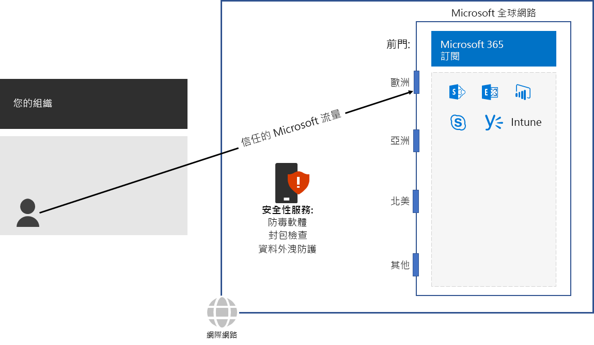

# 步驟 3：避免網路 Hairpin

*此為必要步驟，且同時適用於 Microsoft 365 企業版 E3 和 E5 版本*

當繫結到目的地的流量 (例如內部部署安全性堆疊、雲端存取代理程式或雲端 Web 閘道) 首先被導向另一個中繼位置時，會發生[網路 hairpin](https://docs.microsoft.com/office365/enterprise/office-365-network-connectivity-principles#BKMK_P3)。 範例如下。

網路 hairpin 也可能是由於網路服務提供者在網際網路上的路由不良所導致。 

Hairpin 會增加延遲，並可能將流量重新導向距離較遠的位置。

若要最佳化 Microsoft 365 雲端型服務之流量的效能，請檢查提供當地網際網路連線的 ISP 是否在接近該位置之處具有與 Microsoft 全球網路的直接對等關係。這些連線沒有 Hairpin。

如果您為 Microsoft 365 流量使用雲端型網路或安全性服務，請務必評估 Hairpinning 效果，並了解它對效能的影響。請檢查下列各項：

- 針對您的分公司和 Microsoft 全球網路對等點，透過其轉送流量之服務提供者的數目和位置 
- 服務提供者與您的 ISP 和 Microsoft 之網路對等關係的品質 
- 服務提供者基礎結構中回載的效能影響

儘可能將您的邊緣路由器設定為直接傳送信任的 Microsoft 365 流量，而不是透過處理網際網路流量的協力廠商雲端或雲端型網路安全性廠商來進行 Proxy 處理或通道傳送。 

做為過渡期的檢查點，您可以看到此步驟的[允出準則](networking-exit-criteria.md#crit-networking-step3)。

## 下一步

|||
|:-------|:-----|
||[設定流量旁路](networking-configure-proxies-firewalls.md)|
