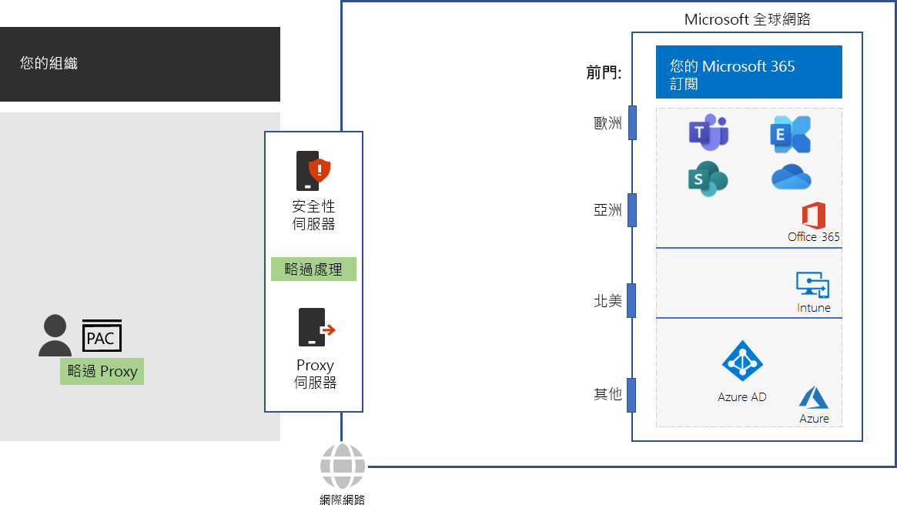

# 步驟 4：設定流量旁路

*此為選用步驟，且同時適用於 Microsoft 365 企業版 E3 和 E5 版本*

由於一般網際網路流量可能會有風險，因此一般的組織網路會使用邊緣裝置 (例如 proxy 伺服器、SSL 中斷和檢查、封包檢查裝置和資料外洩防護系統) 來加強安全性。 請參閱[使用協力廠商網路裝置或解決方案管理 Office 365 流量](https://support.microsoft.com/help/2690045/using-third-party-network-devices-or-solutions-with-office-365)中的網路攔截裝置問題。

不過，Microsoft 365 雲端型服務所使用的 DNS 網域名稱與 IP 位址 是眾所周知的。此外，流量和服務本身會受到許多安全性功能保護。因為此安全性和保護已經到位，所以您的邊緣裝置需要複製它。Microsoft 365 流量的中繼目的地和複製安全性處理會大幅降低效能。

消除中繼目的地及複製安全性處理的第一個步驟是識別 Microsoft 365 流量。Microsoft 已定義下列類型的 DNS 網域名稱和 IP 位址範圍，稱為端點：

- **最佳化** - 連線至每個 Office 365 服務所需的動作，並代表超過 75% 的 Microsoft 365 頻寬、連線和資料量。 這些端點代表對網路效能、延遲和可用性最敏感的 Microsoft 365 案例。
- **允許** - 連線至特定 Microsoft 365 服務與功能所需的動作，但對網路效能和延遲不如最佳化類別中的項目敏感。
 - **預設** - 代表不需要任何最佳化的 Microsoft 365 服務。 您可以將預設類別端點視為正常網際網路流量。

您可以在 [ https://aka.ms/o365endpoints ](https://aka.ms/o365endpoints) 找到 DNS 網域名稱及 IP 位址範圍。

Microsoft 建議您：

- 在內部部署電腦的網際網路瀏覽器上使用 Proxy 自動設定 (PAC) 指令碼，對 Microsoft 365 雲端型服務的 DNS 網域名稱略過 Proxy 伺服器。 如需最新的 Microsoft 365 PAC 指令碼，請參閱 [Get-Pacfile PowerShell 指令碼](https://docs.microsoft.com/office365/enterprise/managing-office-365-endpoints#use-a-pac-file-for-direct-routing-of-vital-office-365-traffic)。

- 分析您的邊緣裝置來判定複製處理，然後設定它們以將流量轉送至最佳化及允許端點。這稱為流量旁路。 

以下是對您的網路基礎結構的有關建議。

邊緣裝置包括防火牆、SSL 中斷和檢查、封包檢查裝置，以及資料外洩防護系統。 若要設定及更新邊緣裝置的設定，您可以使用指令碼或 REST 呼叫，使用來自 Office 365 端點 Web 服務的結構化清單。 如需詳細資訊，請參閱 [Office 365 IP 位址和 URL Web 服務](https://docs.microsoft.com/office365/enterprise/office-365-ip-web-service)。

請注意，您只對 Microsoft 365 最佳化和允許類別端點的流量略過一般 Proxy 和網路安全性處理。所有其他一般網際網路流量將會透過 Proxy 進行，並受制於您的現有網路安全性處理。

## 針對使用 VPN 連線的遠端工作人員將流量最佳化

遠端工作人員通常會使用虛擬私人網路 (VPN) 連線來存取組織內部網路中的資源。 傳統的 VPN 連線會將所有流量 (包括網際網路流量) 路由到組織內部網路。 網際網路流量會路由到組織的邊緣網路和封包處理裝置。 這項流量會受到移動和處理延遲的影響，可能會大幅降低效能並影響遠端工作人員的生產力。 

分割通道是 VPN 連線在網際網路上路由指定流量的功能，而不是透過 VPN 連線將其傳送到內部網路的功能。 若要讓遠端工作人員獲得關鍵 Microsoft 365 服務 (例如 Teams、SharePoint Online 和 Exchange Online) 的最佳效能，請設定分割通道 VPN 連線，直接透過網際網路將流量傳送到最佳化類別的 Office 365 端點。 

如需詳細資訊，請參閱[使用 VPN 分割通道將遠端使用者的 Office 365 連線能力最佳化](https://docs.microsoft.com/office365/enterprise/office-365-vpn-split-tunnel)。

做為過渡期的檢查點，您可以看到此步驟的[允出準則](networking-exit-criteria.md#crit-networking-step4)。

## 下一步

|||
|:-------|:-----|
||[最佳化用戶端和 Office 365 服務效能](networking-optimize-tcp-performance.md) |

