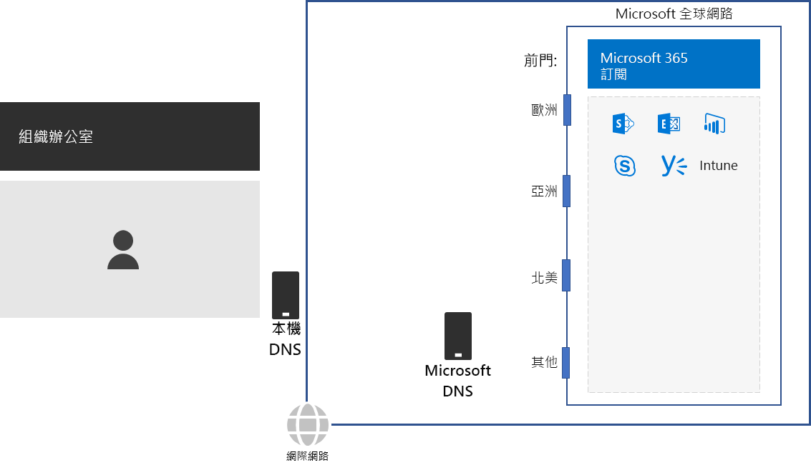
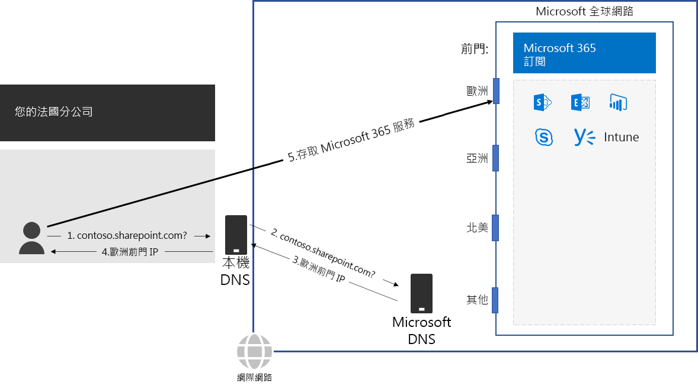

# 步驟 2：設定每個辦公室的當地網際網路連線Step 2: Configure local Internet connections for each office

*此為必要步驟，且同時適用於 Microsoft 365 企業版 E3 和 E5 版本**This step is required and applies to both the E3 and E5 versions of Microsoft 365 Enterprise*

在步驟 2 中，您確定您的每個辦公室都有當地網際網路連線，並使用當地 DNS 伺服器。這兩個元素需要減少連線延遲，並確定內部部署用戶端電腦連線至 Microsoft 365 雲端型服務的最近進入點。In Step 2, you ensure that each of your offices have local Internet connections and use local DNS servers. Both of these elements are required to reduce connection latency and ensure that on-premises client computers make connections to the nearest point of entry to Microsoft 365 cloud-based services.

在大型組織的傳統網路中，網際網路流量流經網路主幹，傳輸到中央網際網路連線。In traditional networks for large organizations, Internet traffic travels across the network backbone to a central Internet connection. 這項功能不適用於將全域分散式軟體即服務 (SaaS) 基礎結構的效能最佳化，該基礎結構包含 Microsoft 365 中的 Office 365 和 Intune 產品。In traditional networks for large organizations, Internet traffic travels across the network backbone to a central Internet connection. This does not work well for optimizing performance to a globally distributed Software-as-a-Service (SaaS) infrastructure, which includes the Office 365 and Enterprise Mobility + Security (EMS) products in Microsoft 365.

Microsoft 全域網路包含*分散式 Front Door* 基礎結構，這是一種地理位置分散的高可用性且可調整的網路邊緣。The Microsoft Global Network includes a *Distributed Service Front Door* infrastructure, a highly available and scalable network edge with geographically distributed locations. 它會終止前門伺服器上的使用者連線，並有效地路由 Microsoft 全域網路中的使用者流量。It terminates end user connections at a front door server and efficiently routes end user traffic within the Microsoft Global Network.

為了獲得最佳效能，內部部署用戶端應存取地理位置最接近的前門位置，而不是以網路主幹和最接近組織中央網際網路連線的前門傳送流量。The Microsoft Global Network includes front end servers to the set of cloud services for Microsoft 365 all over the world. For the best performance, on-premises clients should access a front-end server that is geographically closest to them, rather than sending the traffic over a network backbone and to the front-end server that is closest to the organization’s central Internet connection.

請見以下範例。Here's an example:

當巴黎分公司的使用者想要存取 SharePoint Online 網站時：When a user in the Paris branch office wants to access a SharePoint Online site:

1. 它會傳送 DNS 查詢來解析名稱，例如 contoso.sharepoint.com。It sends a DNS query to resolve a name, such as contoso.sharepoint.com. 
2. ISP 提供的 DNS 伺服器將該查詢轉寄到 Microsoft DNS 伺服器。The DNS server provided by the ISP forwards that query to a Microsoft DNS server.
3. Microsoft 的 DNS 伺服器會將轉寄 DNS 查詢的來源 IP 位址與指派該位址的全球區域進行比對。Microsoft’s DNS servers match the source IP address of the forwarded DNS query to the region of the world assigned that address. Microsoft DNS 伺服器會以位於歐洲最接近 Microsoft 網路前門的 IP 位址回應。The Microsoft DNS server responds with the IP address of the nearest Microsoft Network front door in Europe.
4. ISP DNS 伺服器會將該 IP 位址傳送給使用者。The ISP DNS server sends that IP address to the user.
5. 使用者透過歐洲前門開始連線到 SharePoint Server。The user initiates a connection to the SharePoint server through the Europe front door.

為了將用戶端要求導向至地理位置最接近的前門，Microsoft 的 DNS 伺服器會使用與用戶端初始連線要求相對應的 DNS 查詢。To direct a client request to the geographically nearest front-end server, Microsoft’s DNS servers use the DNS queries corresponding the client’s initial connection request. Therefore, for the lowest network latency: 因此，為了達到最低網路延遲：Therefore, for the lowest network latency:

- 您組織的所有辦公室都應具有當地網際網路連線，以[最佳化](https://docs.microsoft.com/office365/enterprise/office-365-network-connectivity-principles#new-office-365-endpoint-categories)類別網路流量。All offices of your organization should have local Internet connections for [Optimize](https://docs.microsoft.com/office365/enterprise/office-365-network-connectivity-principles#new-office-365-endpoint-categories) category network traffic.
- 每個當地網際網路連線應該使用當地 DNS 伺服器，以從該位置傳送連出網際網路流量。Each local Internet connection should be using a regionally local DNS server for outbound Internet traffic from that location.

如需詳細資訊，請參閱[在本機上輸出網路連線](https://docs.microsoft.com/office365/enterprise/office-365-network-connectivity-principles#egress-network-connections-locally)。For more information, see [Egress network connections locally](https://docs.microsoft.com/office365/enterprise/office-365-network-connectivity-principles#egress-network-connections-locally). 

做為過渡期的檢查點，您可以看到此步驟的[允出準則](networking-exit-criteria.md#crit-networking-step2)。As an interim checkpoint, you can see the [exit criteria](networking-exit-criteria.md#crit-networking-step2) for this step.

## 下一步Next step

|||
|:-------|:-----|
||[避免網路 hairpinAvoid network hairpins](networking-avoid-network-hairpins.md)|
