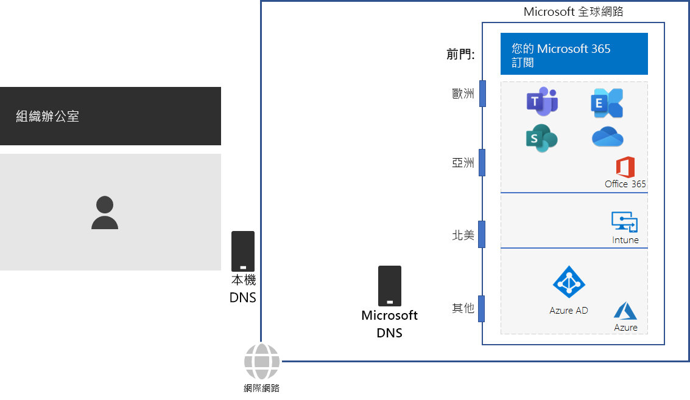
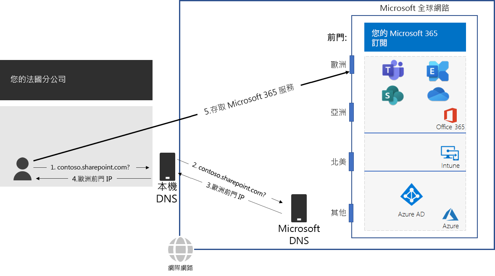

# 步驟 2：設定每個辦公室的當地網際網路連線

*此為必要步驟，且同時適用於 Microsoft 365 企業版 E3 和 E5 版本*

在步驟 2 中，您確定您的每個辦公室都有當地網際網路連線，並使用當地 DNS 伺服器。這兩個元素需要減少連線延遲，並確定內部部署用戶端電腦連線至 Microsoft 365 雲端型服務的最近進入點。

在大型組織的傳統網路中，網際網路流量流經網路主幹，傳輸到中央網際網路連線。 這項功能不適用於將全域分散式軟體即服務 (SaaS) 基礎結構的效能最佳化，該基礎結構包含 Microsoft 365 中的 Office 365 和 Intune 產品。

Microsoft 全域網路包含*分散式 Front Door* 基礎結構，這是一種地理位置分散的高可用性且可調整的網路邊緣。 它會終止前門伺服器上的使用者連線，並有效地路由 Microsoft 全域網路中的使用者流量。

為了獲得最佳效能，內部部署用戶端應存取地理位置最接近的前門位置，而不是以網路主幹和最接近組織中央網際網路連線的前門傳送流量。

請見以下範例。

當巴黎分公司的使用者想要存取 SharePoint Online 網站時：

1. 它會傳送 DNS 查詢來解析名稱，例如 contoso.sharepoint.com。 
2. ISP 提供的 DNS 伺服器將該查詢轉寄到 Microsoft DNS 伺服器。
3. Microsoft 的 DNS 伺服器會將轉寄 DNS 查詢的來源 IP 位址與指派該位址的全球區域進行比對。 Microsoft DNS 伺服器會以位於歐洲最接近 Microsoft 網路前門的 IP 位址回應。
4. ISP DNS 伺服器會將該 IP 位址傳送給使用者。
5. 使用者透過歐洲前門開始連線到 SharePoint Server。

為了將用戶端要求導向至地理位置最接近的前門，Microsoft 的 DNS 伺服器會使用與用戶端初始連線要求相對應的 DNS 查詢。 因此，為了達到最低網路延遲：

- 您組織的所有辦公室都應具有當地網際網路連線，以[最佳化](https://docs.microsoft.com/office365/enterprise/office-365-network-connectivity-principles#new-office-365-endpoint-categories)類別網路流量。
- 每個當地網際網路連線應該使用當地 DNS 伺服器，以從該位置傳送連出網際網路流量。

如需詳細資訊，請參閱[在本機上輸出網路連線](https://docs.microsoft.com/office365/enterprise/office-365-network-connectivity-principles#egress-network-connections-locally)。 

做為過渡期的檢查點，您可以看到此步驟的[允出準則](networking-exit-criteria.md#crit-networking-step2)。

## 下一步

|||
|:-------|:-----|
||[避免網路 hairpin](networking-avoid-network-hairpins.md)|
