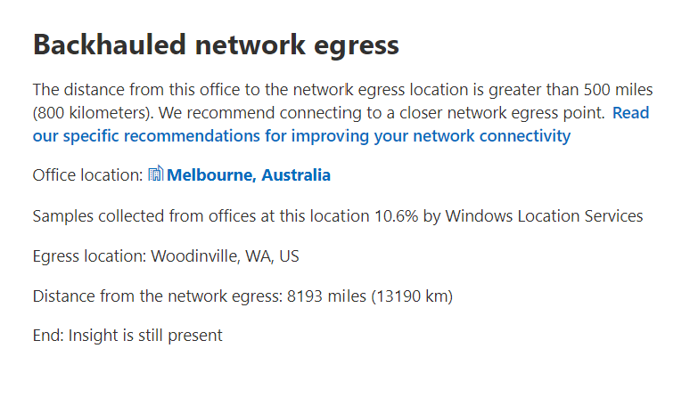
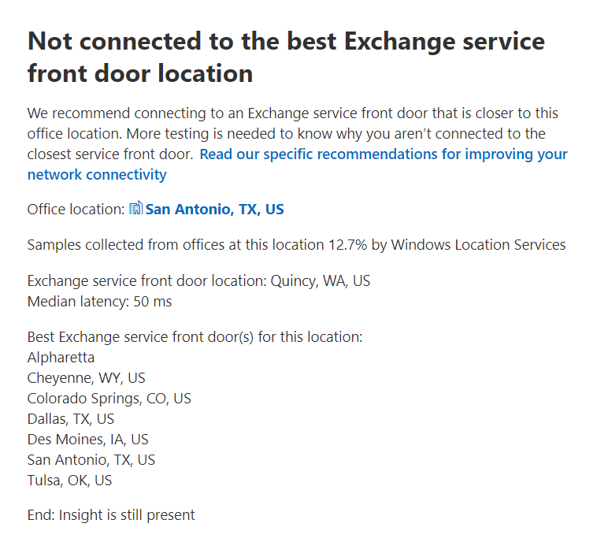
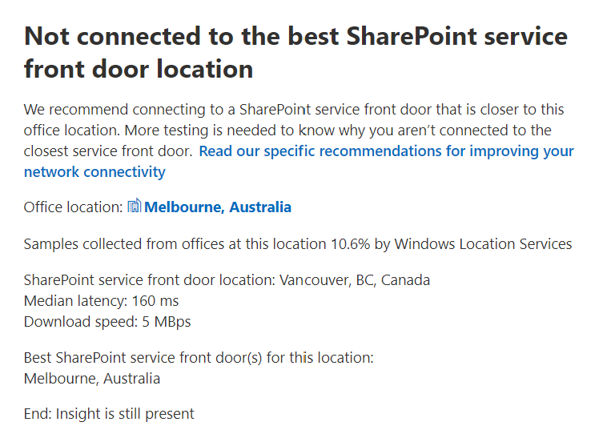

# Microsoft 365 網路洞察力 (預覽) 

**網路洞察力** 是從您的 Microsoft 365 租使用者收集到的效能度量，而且只能在您的租使用者中查看其管理使用者。 Insights 會顯示在 Microsoft 365 系統管理中心中 <https://portal.microsoft.com/adminportal/home#/networkperformance> 。

深入瞭解有助於為您的辦公室位置設計網路週邊。 每個真知灼見都會針對使用者存取租使用者時，針對每個地理位置的特定一般問題，提供有關效能特性的實際詳細資料。

每個辦公室位置都可能顯示六個特定的網路洞察力：

- [Backhauled 網路出局](#backhauled-network-egress)
- [接近您的客戶，偵測到更佳效能](#better-performance-detected-for-customers-near-you)
- [使用非最優 Exchange Online 服務前門](#use-of-a-non-optimal-exchange-online-service-front-door)
- [使用非最佳的 SharePoint 線上服務前門](#use-of-a-non-optimal-sharepoint-online-service-front-door)
- [從 SharePoint 前門開始的低下載速度](#low-download-speed-from-sharepoint-front-door)
- [中國使用者最佳網路出口](#china-user-optimal-network-egress)

租使用者可能會顯示兩個租使用者層級的網路洞察力。 這些也會出現在 [producvitivy 分數] 頁面上：

- [Exchange 抽樣連接問題影響的連線](#exchange-sampled-connections-impacted-by-connectivity-issues)
- [受連線問題影響的 SharePoint 採樣連接](#sharepoint-sampled-connections-impacted-by-connectivity-issues)

>[!IMPORTANT]
>Microsoft 365 系統管理中心的網路洞察力、效能建議和評估目前處於預覽狀態，只適用于已在功能預覽計畫中註冊的 Microsoft 365 承租人。

## Backhauled 網路出局

如果網路洞察力服務偵測到網路出局的指定使用者位置的距離超過500英里 (800 公里) ，表示 Microsoft 365 流量正 backhauled 至一般的 Internet edge 裝置或 proxy，就會顯示這種洞察力。

在某些摘要視圖中，此深入瞭解是所謂的「出局」。

### 案例

這表示辦公室地點和網路出局之間的距離為500英里 (800 公里) 。 Office 位置是由經過模糊處理的用戶端機器位置所識別，網路出局位置是透過對位置資料庫使用反向 IP 位址識別。 如果電腦上的 Windows 位置服務停用，則 office 位置可能不准確。 如果反向 IP 位址資料庫資訊不正確，網路出局位置可能不准確。

此深入瞭解的詳細資料包括辦公室位置、預估的承租人使用者總數、目前的網路出局位置、出局位置的相關性、位置與目前的出局點之間的距離、第一次偵測條件的日期，以及解決條件的日期。

### 我該怎麼做？

針對這種觀點，我們建議網路出口離辦公室位置更近，讓連線可以最佳路由傳送至 Microsoft 的全域網路和最接近的 Microsoft 365 服務前端門。 將網路出口關閉至使用者的 office 位置也可讓您日後提高效能，因為 Microsoft 會在未來的網路點擴充目前狀態和 Microsoft 365 服務前門。

如需如何解決此問題的詳細資訊，請參閱[Office 365 網路連線原則](microsoft-365-network-connectivity-principles.md)中[本機的出局網路](microsoft-365-network-connectivity-principles.md#egress-network-connections-locally)連線。

## 接近您的客戶，偵測到更佳效能

如果網路洞察力服務偵測到大量客戶在您的組織中，其效能低於組織中的使用者，就會顯示這種洞察力。

在某些摘要視圖中，此深入瞭解是 "對等" 的縮寫。

### 案例

這項洞察力會檢查與此辦公室位置在相同城市的 Microsoft 365 客戶的匯總效能。 如果使用者的平均延遲比鄰近承租人的平均延遲高出10%，就會顯示這種洞察力。

### 我該怎麼做？

這種情況可能有許多原因，包括公司網路或 ISP、瓶頸或架構設計問題中的延遲。 檢查您的 office 網路和目前的 Microsoft 365 前端的路由之間，每個躍點之間的延遲。 如需詳細資訊，請參閱 [Office 365 Network Connectivity 原則](microsoft-365-network-connectivity-principles.md)。

## 使用非最優 Exchange Online 服務前門

如果網路洞察力服務偵測到特定位置的使用者未連線到最佳 Exchange Online 服務前門，就會顯示這種洞察力。

在某些摘要視圖中，此深入瞭解是「路由」。

### 案例

我們會列出 Exchange Online 服務前門，其適用于 office 位置的城市，具有良好的效能。 如果目前的測試顯示使用此清單上的 Exchange Online service front 前門，請致電此建議。

### 我該怎麼做？

使用非最優 Exchange Online 服務前門可能是由網路 backhaul 在公司網路出口之前所造成，因此我們建議您在本機和直接的網路出口。 這種情況也可能是使用遠端 DNS 遞迴解析伺服器所造成，在此情況下，我們建議您將 DNS 遞迴解析程式伺服器與網路出局對齊。

## 使用非最佳的 SharePoint 線上服務前門

如果網路洞察力服務偵測到特定位置的使用者未連接到最接近的 SharePoint 線上服務前門，就會顯示這種洞察力。

在某些摘要視圖中，此真知灼見是縮寫為 "Afd"。

### 案例

我們識別測試用戶端所連接的 SharePoint 線上服務前門。 然後，我們會比較該城市的預期 SharePoint Online 服務前門。 如果不相符，則建議您這麼做。

### 我該怎麼做？

使用非最佳的 SharePoint 線上服務前門可能是由網路 backhaul 在公司網路出口之前所造成，我們建議您在本機和直接的網路出口。 這種情況也可能是使用遠端 DNS 遞迴解析伺服器所造成，在此情況下，我們建議您將 DNS 遞迴解析程式伺服器與網路出局對齊。

## 從 SharePoint 前門開始的低下載速度

如果網路洞察力服務偵測到特定辦公室位置和 SharePoint 線上之間的頻寬低於 1 MBps，就會顯示這種洞察力。

在某些摘要視圖中，此深入瞭解是以「輸送量」做為縮寫。

### 案例

使用者可以從 SharePoint Online 和 OneDrive 商務服務前端取得的下載速度，以每秒 mb 為單位， (Mbits) 。 如果此值小於 1 MBps，我們就會提供這種洞察力。

### 我該怎麼做？

若要改善下載速度，可能需要增加頻寬。 或者，在辦公室地點的使用者機器與 SharePoint 線上服務前門之間可能有網路擁塞。 這有時稱為 congestive 遺失，它會限制使用者可以使用的下載速度，即使有足夠的頻寬可供使用。

## 中國使用者最佳網路出口

如果貴組織的使用者在中國連接至您的 Microsoft 365 租使用者至其他地理位置，就會顯示這項洞察力。 

### 案例

如果您的組織具備私人 WAN 連線能力，我們建議您在中國的 office 位置，設定網路 WAN 電路，在下列任何位置都有網路出口給網際網路：

- 香港特別行政區
- 日本
- 台灣
- 南韓
- 新加坡
- 馬來西亞

來自于這些位置以外之使用者的網際網路出口會降低效能，而在中國內出口的情況可能會因為邊界堵塞而導致高延遲和連線問題。

### 我該怎麼做？

如需如何減輕與此洞察力相關之效能問題的詳細資訊，請參閱 [適用于中國使用者的 Office 365 全域承租人效能優化](microsoft-365-networking-china.md)。

## Exchange 抽樣連接問題影響的連線

這種洞察力會顯示何時會影響50% 或更多的抽樣連線。 每個範例的 Exchange 評估為低於60% 的 Exchange 評估所定義的影響。

### 案例

這表示大多數的使用者可能會在連線至 Exchange Online 的 Outlook 中遇到使用者經驗問題。 樣本百分比可能代表顯示低於60點的使用者百分比。  

### 我該怎麼做？

若尚未啟用 office 位置網路連線，請啟用。 您想要找出影響 Exchange 的網路連線不良影響哪些分支機搆，並尋找將使用者連線至 Microsoft 網路的方法，以改善網路周邊網路的速度。

## 受連線問題影響的 SharePoint 採樣連接

這種洞察力會顯示何時會影響50% 或更多的抽樣連線。 每個範例的 SharePoint 評估所定義的影響低於40%。

### 案例

這表示大多數的使用者可能會遇到 SharePoint 和 OneDrive 的使用者經驗問題。 樣本百分比可能代表顯示低於40點的使用者百分比。  

### 我該怎麼做？

若尚未啟用 office 位置網路連線，請啟用。 您想要找出會影響 SharePoint 不良網路連線的分支，並尋找一種方法，以將使用者連接至 Microsoft 的網路，以提升網路周邊網路的能力。

## 相關主題

[Microsoft 365 系統管理中心的網路連線 (預覽) ](office-365-network-mac-perf-overview.md)

[Microsoft 365 網路評估 (預覽) ](office-365-network-mac-perf-score.md)

[Microsoft 365 network connectivity test 工具 (預覽) ](office-365-network-mac-perf-onboarding-tool.md)

[Microsoft 365 Network Connectivity Location 服務 (預覽) ](office-365-network-mac-location-services.md)
