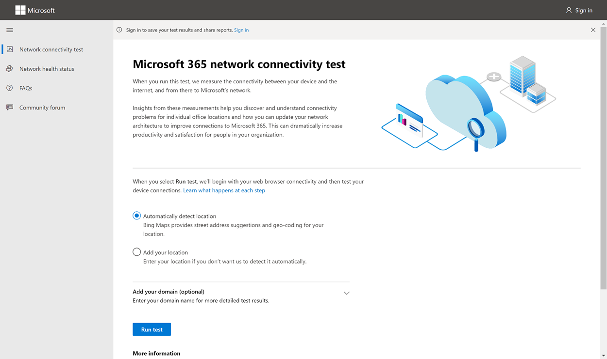
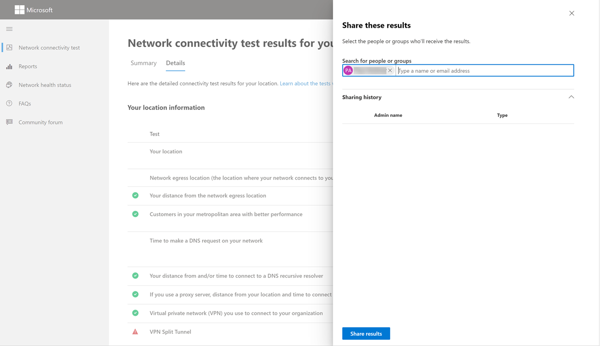
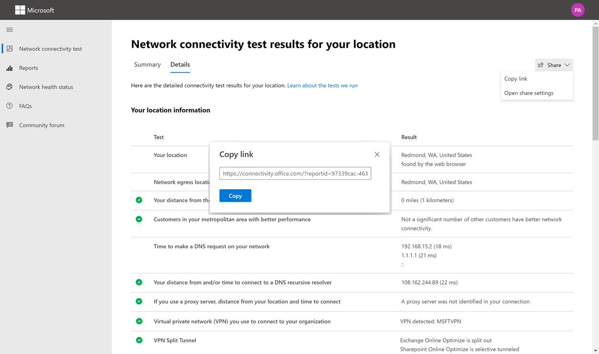
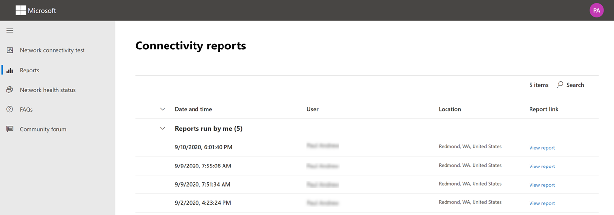
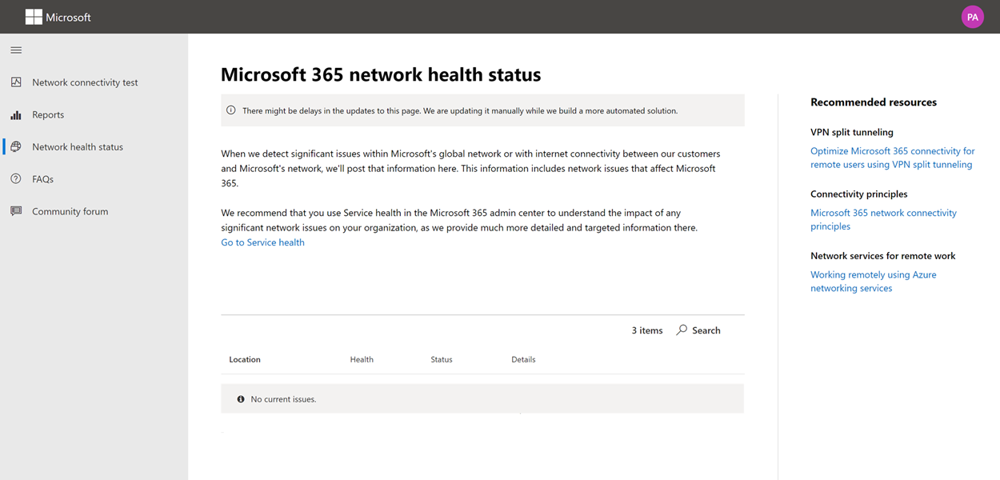

# Microsoft 365 network connectivity test 工具 (預覽) 

Microsoft 365 network connectivity test 工具位於 <https://connectivity.office.com> 。 其為輔助工具，可在 Microsoft 365 系統管理中心的 [ **健康情況 |] 底下使用網路評估和網路洞察力資訊。連接** 功能表。

>[!NOTE]
>Network connectivity test 工具支援位於 WW 和德國的承租人，但不支援 GCC 適中、GCC 高、DoD 或中國。

Microsoft 365 系統管理中心的網路洞察力是以週期性產品測量值為基礎，針對每日進行匯總的 Microsoft 365 租使用者。 相比之下，來自 Microsoft 365 網路連線測試的網路洞察力會在本機執行，並在工具中執行一次。 您可以在產品中執行的測試是有限的，而且在使用者可以收集更多資料的地方執行測試時，可能會產生更深入的洞察力。 請考慮，Microsoft 365 系統管理中心的網路洞察力會顯示在特定辦公室位置使用 Microsoft 365 的網路問題。 Microsoft 365 連線測試可協助識別導致網路效能改進動作的問題根源。

建議您將這些功能搭配使用，讓您可以在 Microsoft 365 系統管理中心中評估每個辦公室位置的網路品質狀態，並且在部署以 Microsoft 365 連線測試為基礎的測試之後找到更多細節。

>[!IMPORTANT]
>Microsoft 365 系統管理中心的網路洞察力、效能建議和評估目前處於預覽狀態，只適用于已在功能預覽計畫中註冊的 Microsoft 365 承租人。

## 每個測試步驟會發生什麼事

### 辦公室位置識別

當您按一下 [執行測試] 按鈕時，會顯示 [正在執行的測試] 頁面，並識別辦公室位置。 您可以使用城市、州和國家輸入您的位置，也可以從網頁瀏覽器中偵測到該位置。 如果您偵測到這種情況，我們會從網頁瀏覽器要求緯度和經度，並在使用之前限制 300m 300m 的精確度。 之所以這麼做，是因為不需要更正確地識別位置，而不是網路效能的大樓。 

### JavaScript 測試

在 office 位置識別後，我們會在 JavaScript 中執行 TCP 延遲測試，我們會向服務要求有關使用中及建議的 Office 365 服務前端伺服器的資料。 完成這些工作之後，我們會在地圖和 [詳細資料] 索引標籤中顯示它們，以在下一個步驟之前查看。

### 下載高級測試用戶端應用程式

接下來，我們將開始下載高級測試用戶端應用程式。 我們依靠使用者來啟動用戶端應用程式，而且也必須已安裝 .NET Core。

Microsoft 365 網路連線測試有兩個部分; <https://connectivity.office.com> 可執行高級網路連線測試的網站和可下載的 Windows 用戶端應用程式。 大部分的測試都需要執行應用程式。 它會在執行時，將結果填回網頁。

網頁瀏覽器測試完成後，系統會提示您從網站下載高級用戶端測試應用程式。 出現提示時，開啟並執行檔。

### 啟動 [高級測試] 用戶端應用程式

一旦用戶端應用程式啟動網頁，便會更新以顯示這種情況，而且測試資料將會開始接收到網頁。 它會在每次接收新資料時更新，您可以在資料到達時查看資料。

### 已完成的高級測試及測試報表上載

測試完成後，網頁和高級測試用戶端會同時指出這一點，而且如果使用者已登入測試報告，就會將其上傳至客戶租使用者。

## 共用您的測試報告

測試報表需要登入您的 Office 365 帳戶。 您的系統管理員會選取如何共用您的測試報告。

### 與系統管理員共用您的報表

登入時的所有測試報告都會與您的系統管理員共用。

### 與您的 Microsoft 帳戶小組、支援或其他人員共用

不含任何個人身分識別的測試報告會與 Microsoft 員工共用。 預設為啟用，您的系統管理員可以在 **健康情況 | 中停用此項。** Microsoft 365 系統管理中心的 [網路連接] 頁面。

### 與登入相同 Office 365 租使用者的其他使用者共用

您可以選擇要與其共用報告的使用者，且預設為啟用。 您的系統管理員也可以停用此功能。

### 使用 ReportID 連結與任何人共用

您可以透過提供 ReportID 連結的存取權，與任何人共用您的測試報告。 這會產生 URL 供您傳送給某人，讓他們可以在未登入的情況下，顯示測試報表。 預設會停用此功能，必須由您的系統管理員加以啟用。

## 網路連線測試結果

結果會顯示在 [ **摘要** ] 和 [ **詳細資料** ] 索引標籤中。 [摘要] 索引標籤會顯示偵測到之網路周邊的對應，以及網路評估與附近其他 Office 365 客戶的比較。 它也允許共用測試報告。 [摘要結果] 視圖的外觀如下。

以下是該工具顯示之詳細資料] 索引標籤輸出的範例。 在 [詳細資料] 索引標籤上，如果結果比對臨界值比較，我們會顯示綠色圓圈核取記號。 如果結果超過表示網路洞察力的臨界值，我們就會顯示紅色三角形驚嘆號。 下列各節說明每一個詳細資料索引標籤的結果列，並說明用於網路洞察力的門限。

### 您的位置資訊

本節顯示與您的位置相關的測試結果。

#### 您的位置

使用者位置是從使用者網頁瀏覽器中偵測到，也可以在使用者選擇中輸入。 用來識別商業網路周邊特定部分的網路距離。 只有來自此位置偵測的城市和其他網路點的距離會儲存于報告中。

使用者辦公室位置會顯示在地圖視圖上。

#### 網路出局位置 (網路連接至 ISP 的位置) 

我們會在伺服器端識別網路出局 IP 位址。 位置資料庫是用來查詢網路出口的大致位置。 這些資料庫一般會有大約90% 的 IP 位址準確度。 如果從網路出局 IP 位址查看的位置不正確，則此測試會導致錯誤結果。 若要驗證特定 IP 位址是否發生此錯誤，您可以使用可公開存取的網路 IP 位址位置網站，以與您的實際位置進行比較。

#### 網路出局位置的距離

我們決定從該位置到辦公室地點的距離。 這會顯示為網路洞察力，如果距離大於 **500 英里** (800 公里) 因為這可能會使 TCP 延遲超過25ms，而且可能會影響使用者經驗。

網路出局位置會顯示在地圖視圖上，並聯機至使用者辦公室位置，表示企業 WAN 內部的網路 backhaul。

建議使用 Microsoft 365 網路連線，將使用者辦公室位置的本機和直接網路輸出實施至網際網路。 對本機和直接出口的增強功能是解決這種網路洞察力的最佳方式。

#### Proxy 伺服器資訊

我們識別在本機電腦上設定的 proxy 伺服器 (s) 。 我們會識別是否有任何在網路路徑中設定，以優化類別 Microsoft 365 網路流量。 我們識別從使用者辦公室位置到 proxy 伺服器的距離。 會先透過 ICMP ping 測試距離，如果失敗，我們會使用 TCP ping 進行測試，最後如果失敗，我們會在 IP 位址位置資料庫中查詢 proxy 伺服器的 IP 位址。 如果 proxy 伺服器的 **500 英里後超過英里** (800 公里) 離開使用者辦公室位置，我們就會顯示網路洞察力。

#### 虛擬私人網路 (用來連接組織的 VPN) 

這會偵測您是否使用 VPN 連線到 Office 365。 如果您沒有 VPN，或者您有 VPN 搭配 Office 365 的建議分割隧道設定，則會顯示傳遞結果。

#### VPN 分割隧道

Exchange Online 的每個最優化類別路由、SharePoint 線上，以及 Microsoft 團隊會進行測試，以查看其是否為 VPN 上的隧道功能。 分割的工作負載可以完全避免 VPN。 隧道工作負載全部透過 VPN 傳送。 選擇性隧道工作負載會透過 VPN 傳送某些路由，並進行一些分割。如果所有工作負載都已分割或選擇性隧道，將會顯示傳遞結果。

#### 具有較佳效能的大都市區域中的客戶

Exchange Online 服務前端的使用者辦公室位置的網路 TCP 延遲會與其他 Microsoft 365 客戶在相同大都市區域中進行比較。 如果相同地鐵區域中10% 以上的客戶都具有較佳的效能，就會顯示網路洞察力。 這表示在 Microsoft 365 使用者介面中，使用者的效能會比較好。

在城市中的所有使用者都可以存取相同的電信基礎結構，以及對網際網路電路和 Microsoft 網路的接近程度，就會產生網路洞察力。

#### 在您的網路上進行 DNS 要求的時間

這會顯示在執行測試的用戶端電腦上設定的 DNS 伺服器。 它可能是 DNS 遞迴解析器伺服器，但這不常見。 這很可能是 DNS 轉寄站伺服器，可快取 DNS 結果並將任何未緩存的 DNS 要求轉送至另一部 DNS 伺服器。

這只是為了提供資訊，不會參與任何網路洞察力。

#### 連接至 DNS 遞迴解析程式的距離和/或時間

在 [使用中的 DNS 遞迴解析程式] 中，進行特定的 DNS 要求，然後要求 DNS 名稱伺服器接收相同的要求時，便會加以識別。 此 IP 位址是 DNS 遞迴解析程式，它會在 IP 位址位置資料庫中查閱，以尋找位置。 然後計算從使用者辦公室位置到 DNS 遞迴解析伺服器位置的距離。 如果距離大於 **500 英里** (800 公里) 會顯示為網路洞察力。

從網路出局 IP 位址查看的位置可能不正確，這會導致此測試的錯誤結果。 若要驗證特定 IP 位址是否發生此錯誤，您可以使用可公開存取的網路 IP 位址位置網站。

這項網路洞察力特別會影響 Exchange Online 服務前端的選取範圍。 若要解決此深入瞭解，本機和 direct 網路出局應該是必要條件，而且 DNS 遞迴解析器應該位於該網路出口之外。

### Exchange Online

本節顯示與 Exchange Online 相關的測試結果。

#### Exchange 服務的前門位置

「使用中 Exchange 服務前門」是以 Outlook 這麼做的相同方式來識別，我們會從使用者位置測量網路的 TCP 延遲。 會顯示 TCP 延遲，並將使用中 Exchange 服務的前蓋與目前位置的最佳服務前門清單進行比較。 如果其中一個最佳 Exchange 服務前門 (s) 並未使用中，這會顯示為網路洞察力。

[！附注] 在公司網路出口之前，不使用其中一個最佳 Exchange 服務前門 (s) 可能是由網路 backhaul 造成的，我們建議您在本機和直接的網路出口。 這種情況也可能是使用遠端 DNS 遞迴解析伺服器所造成，在此情況下，我們建議您將 DNS 遞迴解析程式伺服器與網路出局對齊。

我們計算對 Exchange 服務前門 (ms) 的 TCP 延遲的潛在改進。 若要執行此動作，請查看已測試的使用者 office 位置網路延遲，並從目前的位置減去網路延遲，直到 closets Exchange 服務的前門。 差異代表潛在的改進機會。

#### 您位置的最佳 Exchange 服務前門 (s) 

這會列出您所在地區的最佳 Exchange 服務前門位置（按城市）。

#### 在用戶端 DNS 中記錄的服務前面門

這會顯示您定向的 Exchange 服務前端伺服器的 DNS 名稱及 IP 位址。 只提供此資訊，而且沒有相關聯的網路洞察力。

### SharePoint Online

本節顯示與 SharePoint 線上及 OneDrive 相關的測試結果。

#### 服務的前門位置

使用中 SharePoint 服務的前門是以 OneDrive 用戶端所用的相同方式來識別，而且我們會從使用者辦公室位置測量網路的 TCP 延遲。

#### 下載速度

我們從 SharePoint 服務的前門，測量15Mb 檔案的下載速度。 結果會以每秒 mb 為單位顯示，以指出可以從 SharePoint 或 OneDrive 中的 **一秒**內的哪一個大小的檔案下載 mb。 此數目應類似于每秒百萬位元最小電路頻寬的十分之一。 例如，如果您有100mbps 網際網路連線，可能會預期每秒 10 mb (10MBps) 。

#### 緩衝區膨脹

在15Mb 下載期間，我們會測量 SharePoint 服務前門的 TCP 延遲。 這是負載下的延遲時間，在未負載下時比較為延遲時間。 當負載不足時，延遲的增加通常是由 (或 bloated) 中載入的消費網路裝置緩衝區所造成。 任何1000或更多的膨脹都會顯示網路洞察力。

#### 在用戶端 DNS 中記錄的服務前面門

這會顯示您定向的 SharePoint 服務前門伺服器的 DNS 名稱和 IP 位址。 只提供此資訊，而且沒有相關聯的網路洞察力。

### Microsoft Teams

本節顯示與 Microsoft 小組相關的測試結果。

#### Media connectivity (音訊、影片和應用程式共用) 

這會測試對 Microsoft 小組服務前門的 UDP 連線。 如果遭到封鎖，則 Microsoft 小組可能仍然使用 TCP，但音訊和影片會受損。 閱讀更多有關這些 UDP 網路度量的資訊，這些是在[商務用 Skype Online 中的媒體質量和網路連線效能](https://docs.microsoft.com/skypeforbusiness/optimizing-your-network/media-quality-and-network-connectivity-performance)上套用至 Microsoft 小組的。

#### 封包遺失

顯示 UDP 封包遺失，以10秒的測試音訊撥號從用戶端到 Microsoft 小組服務的前門。 這應低於 **1.00%** 的傳遞。

### 延遲

顯示測定的 UDP 延遲，它應低於 **100ms**。

#### 抖動

顯示測定的 UDP 抖動，它應低於 **30ms**。

#### 連線能力

我們會將使用者辦公室位置的 HTTP 連線測試至所有必要的 Microsoft 365 網路端點。 這些是發佈于 [https://aka.ms/o365ip](https://aka.ms/o365ip) 。 對於任何無法連線的必要網路端點，都會顯示網路洞察力。

在商業網路周邊或使用做為雲端 proxy 的 proxy 伺服器、防火牆或其他網路安全裝置封鎖連線能力 ay。

我們會在每個必要的 Microsoft 365 網路端點（已于所定義的 [優化] 或 [允許] 類別中）測試 SSL 憑證 [https://aka.ms/o365ip](https://aka.ms/o365ip) 。 如果任何測試未找到 Microsoft SSL 憑證，則所連接的加密網路必須已被仲介網路裝置截獲。 網路洞察力會顯示在任何截獲的加密網路端點上。

如果 Microsoft 未提供 SSL 憑證，我們會顯示測試的 FQDN 和使用中的 SSL 憑證擁有者。 這個 SSL 憑證擁有者可能是 proxy 伺服器廠商，也可能是企業自我簽署憑證。

#### 網路路徑

本節顯示 ICMP traceroute 至 Exchange Online 服務前門、SharePoint Online 服務前門和 Microsoft 團隊服務前門的結果。 只提供此資訊，而且沒有相關聯的網路洞察力。 提供三種 traceroutes。 Traceroute 至 _outlook.office365.com_、traceroute 至客戶 SharePoint 前端或 _microsoft.sharepoint.com_ （如果未提供），以及 traceroute 到 _world.tr.teams.microsoft.com_。

## 連線性報告

登入後，您可以查看先前所執行的報告。 您也可以將其共用或從清單中刪除。

## 網路健康狀態

這會顯示 Microsoft 全球網路的任何重大健康情況問題，可能會影響 Microsoft 365 客戶。

## 常見問題集

以下是一些常見問題的解答。

### Microsoft 是否已發行及支援此工具？

這是一種預覽方式，我們計畫定期提供更新，直到我們達到一般可用性發行狀態時，才會從 Microsoft 取得支援。 請提供意見反應以協助我們改進。 我們打算將更詳細的 Office 365 網路上架指南發佈為此工具的一部分，此工具是由其測試結果自訂為組織的一部分。

### 執行高級測試用戶端的必要條件為何？

高級測試用戶端需要 .NET Core 3.1 Desktop Runtime。 如果您執行的是未安裝的高級測試用戶端，將會定向至 [.Net Core 3.1 installer 頁面](https://dotnet.microsoft.com/download/dotnet-core/3.1)。 請務必安裝桌面執行時間，而不是 SDK，或頁面上較高的 ASP.NET 核心執行時間。 需要有機器的系統管理員許可權，才能安裝 .NET Core。

### 何謂 Microsoft 365 服務的前門？

Microsoft 365 服務前端是 Microsoft 全球網路的進入點，Office 用戶端和服務會在此位置中斷其網路連線。 為了獲得最佳網路連接至 Microsoft 365，建議您的網路連線在您的城市或地鐵的最接近的 Microsoft 365 前端。

附注： Microsoft 365 服務前端沒有 azure marketplace 中可用的 **Azure 前端服務** 產品的直接關聯。

### 最佳的 Microsoft 365 服務前門是什麼？

最佳的 Microsoft 365 服務前門 (（先前稱為最佳服務前門) 是最接近網路出口的最佳服務，通常是在您的城市或大都市區內。 使用 Microsoft 365 網路效能工具判斷您使用中的 Microsoft 365 服務前門和最佳的服務前門 (s) 。 如果工具判斷您的使用中的前門是其中一個是最佳的，則您應該會指望 Microsoft 的全球網路的連線能力很好。

### 何謂網際網路出口的位置？

網際網路出局位置是網路流量結束商業網路並連接到網際網路的位置。 此位置也會識別為您具有網路位址轉譯 (NAT) 裝置的位置，通常是您與網際網路服務提供者 (ISP) 的位置。 如果您看到位置和網際網路出局位置之間有長距離的距離，則這可能會識別重要的 WAN backhaul。

## 相關主題

[Microsoft 365 系統管理中心的網路連線 (預覽) ](office-365-network-mac-perf-overview.md)

[Microsoft 365 網路效能深入 (預覽) ](office-365-network-mac-perf-insights.md)

[Microsoft 365 網路評估 (預覽) ](office-365-network-mac-perf-score.md)

[Microsoft 365 Network Connectivity Location 服務 (預覽) ](office-365-network-mac-location-services.md)
