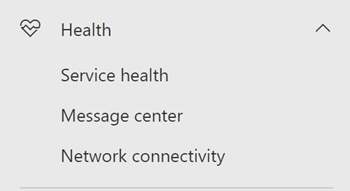
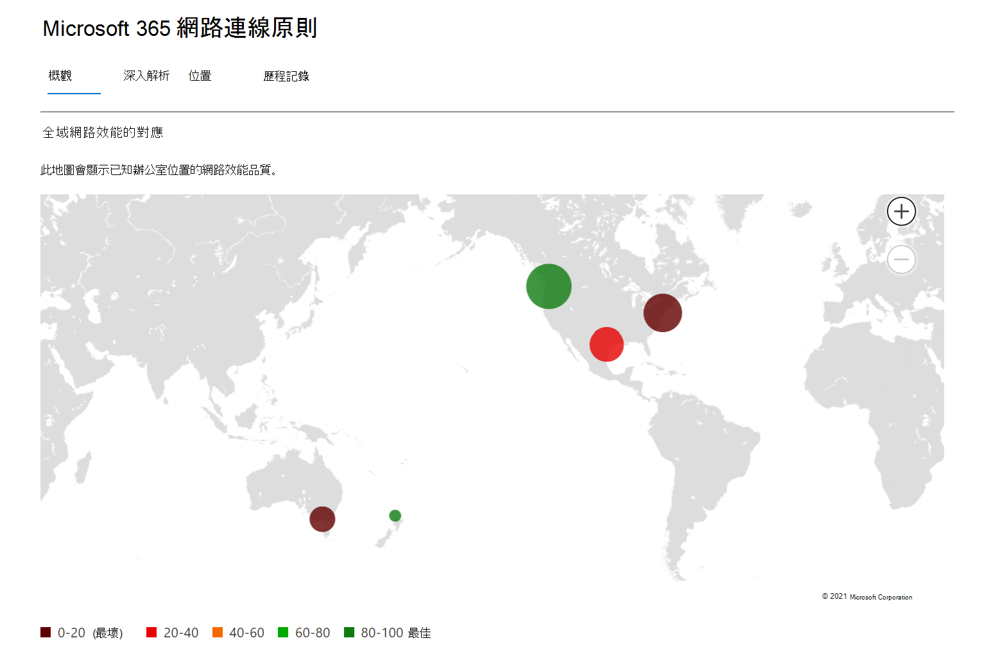
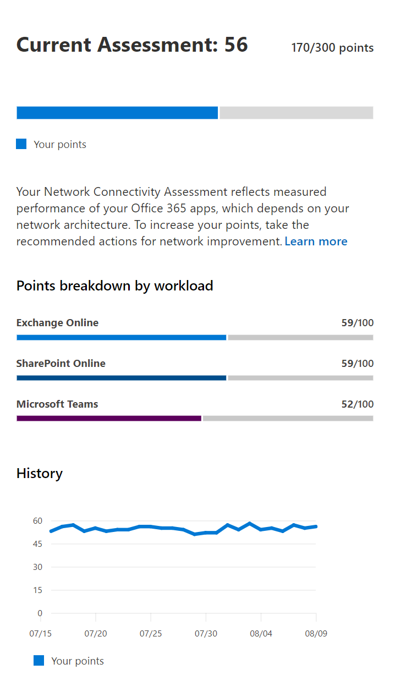
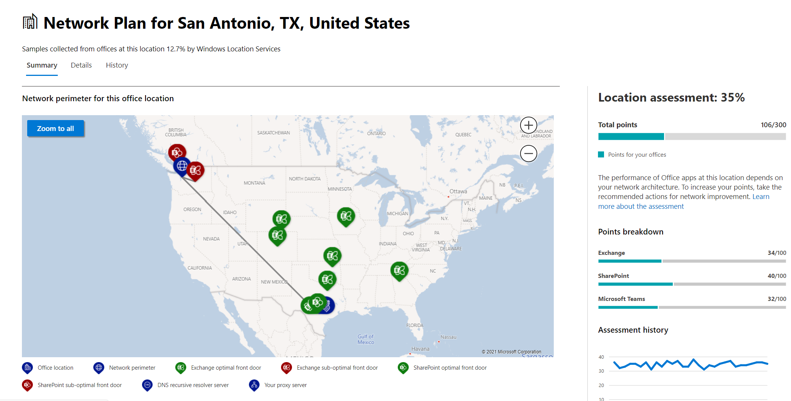
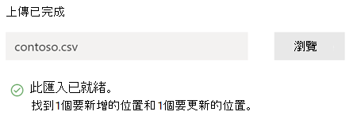

# Microsoft 365 系統管理中心的網路連線 (預覽) Network connectivity in the Microsoft 365 Admin Center (preview)

Microsoft 365 系統管理中心現在包含從您的 Microsoft 365 租使用者收集到的匯總網路連線衡量標準，而且只能在租使用者中查看其管理使用者。The Microsoft 365 Admin Center now includes aggregated network connectivity metrics collected from your Microsoft 365 tenant and available to view only by administrative users in your tenant.

**網路評估** 和 **網路洞察力** 會顯示在 Microsoft 365 系統管理中心的 [ **狀況] |連線能力**。**Network assessments** and **network insights** are displayed in the Microsoft 365 Admin Center under **Health | Connectivity**.

您可能需要代表您的組織加入此功能的公開預覽。You may be asked to join the public preview for this feature on behalf of your organization. 接受通常會立即發生，然後您就會看到 [網路連接] 頁面。Acceptance usually happened immediately and then you will see the network connectivity page. 

流覽至 [網路連線] 頁面時，您會看到 [一覽表] 窗格，其中包含全域網路效能對應、整個承租人範圍的網路評估，以及目前問題的清單。On navigating to the network connectivity page, you will see an overview pane containing a map of global network performance, a network assessment scoped to the entire tenant, and a list of current issues. 若要存取此頁面，您必須是 Microsoft 365 內組織的管理員。To access this page you must be an administrator for the organization within Microsoft 365. 報告讀取器系統管理角色對此資訊具有「讀取」許可權。The Report Reader administrative role will have read access to this information. 若要設定網路連線的位置和其他元素，系統管理員必須是伺服器管理員角色的一部分，例如服務支援系統管理員角色。To configure locations and other elements of network connectivity an administrator must be part of a server administrator role such as the Service support admin role. 您可以從 [概述] 中深入查看特定的網路效能度量和依位置的問題。From the overview, you can drill down to view specific network performance metrics and issues by location. 如需詳細資訊，請參閱 [Microsoft 365 系統管理中心的網路效能概述](#network-connectivity-overview-in-the-microsoft-365-admin-center)。For more information, see [Network performance overview in the Microsoft 365 Admin Center](#network-connectivity-overview-in-the-microsoft-365-admin-center).

## 顯示網路連線評估的先決條件Pre-requisites for network connectivity assessments to appear

網路連線能力可以在整個組織中評估，因此必須針對特定的 office 位置進行任何網路設計改進。Whilst network connectivity can be evaluated across the organization, any network design improvements will need to be done for specific office locations. 可以決定這些位置之後，會為每個辦公室位置提供網路連線資訊。Network connectivity information is provided for each office location once those locations can be determined. 有三個選項可從您的 office 位置取得網路評估：There are three options for getting network assessments from your office locations:

### 1. 啟用 Windows 位置服務1. Enable Windows Location Services

在此選項中，您必須至少要有兩部電腦在支援先決條件的辦公室位置執行。For this option you must have at least two computers running at each office location that support the pre-requisites. 您必須在每一部電腦上安裝 Windows 版本 **19.232** 或更新版本的 OneDrive。OneDrive for Windows version **19.232** or above must be installed on each computer. 如需 OneDrive 版本的詳細資訊，請參閱 [OneDrive 版本](https://support.office.com/article/onedrive-release-notes-845dcf18-f921-435e-bf28-4e24b95e5fc0)資訊。For more information on OneDrive versions, see the [OneDrive release notes](https://support.office.com/article/onedrive-release-notes-845dcf18-f921-435e-bf28-4e24b95e5fc0). 在近期的 Office 365 用戶端應用程式中，計畫加入網路度量。Network measurements are planned to be added in other Office 365 client applications in the near future.

Windows 位置服務必須同意電腦。Windows Location Service must be consented on the machines. 您可以執行「 **地圖** 」應用程式並自行尋找，以測試這種情況。You can test this by running the **Maps** app and locating yourself. 可在具有設定的單一機器上啟用 **|隱私權 |** 必須啟用設定 _允許應用程式存取您的位置_ 的位置。It can be enabled on a single machine with **Settings | Privacy | Location** where the setting _Allow apps to access your location_ must be enabled. 您可以使用 MDM 或群組原則，將 Windows Location 服務同意部署至使用設定 _LetAppsAccessLocation_的電腦。Windows Location Services consent can be deployed to PCs using MDM or Group Policy with the setting _LetAppsAccessLocation_.

您不需要使用此方法在系統管理中心中新增位置，因為它們會在城市解析度中自動識別。You do not need to add locations in the Admin Center with this method as they are automatically identified at the city resolution. 您無法使用 Windows 位置服務，在城市內顯示多個辦公室位置。You cannot show multiple office locations within a city using Windows Location Services. 位置資訊也會四捨五入至最接近的300米（300米），以便在上傳之前，無法存取更精確的位置資訊。Location information is also rounded to the nearest 300 meters by 300 meters before being uploaded so that more precise location information is not possible to access.

電腦應該有 Wi-Fi 網路，而不是乙太網線。The machines should have Wi-Fi networking rather than an ethernet cable. 使用乙太網線的電腦沒有正確的位置資訊。Machines with an ethernet cable do not have accurate location information.

在符合這些先決條件後，應會在24小時內開始顯示度量範例和辦公室位置。Measurement samples and office locations should start to appear 24 hours after these pre-requisites have been met.

### 2. 新增位置及提供 LAN 子網資訊2. Add locations and provide LAN subnet information

若為此選項，則不需要 Windows Location 服務和 Wi-Fi。For this option neither Windows Location Services nor Wi-Fi are required. 您需要在該位置的每台電腦上安裝 Windows 版本 **20.161** 或更新版本 OneDrive。You need OneDrive for Windows version **20.161** or above installed on each computer at the location.

您也需要在系統管理中心的 [網路連線] 頁面中新增位置，或從 CSV 檔案匯入這些位置。You also need to add locations in the Admin Center network connectivity page or to import those from a CSV file. 新增的位置必須包含您的 office LAN 子網資訊。The locations added must include your office LAN subnet information.

因為您是要新增位置，所以您可以在城市內定義多個辦事處。Because you are adding the locations, you can have multiple offices defined within a city.

在符合這些先決條件後，應會在24小時內開始顯示度量範例和辦公室位置。Measurement samples and office locations should start to appear 24 hours after these pre-requisites have been met.

### 3. 使用 Microsoft 365 network connectivity test 工具手動收集測試報告3. Manually gather test reports with the Microsoft 365 network connectivity test tool

針對此選項，您必須在每個位置識別人員。For this option you need to identify a person at each location. 要求他們在具有管理許可權的 Windows 電腦上流覽至 [Microsoft 365 網路連線測試](https://connectivity.office.com) 。Ask them to browse to [Microsoft 365 network connectivity test](https://connectivity.office.com) on a Windows machine that they have administrative permissions on. 在網站上，他們必須登入其 Office 365 帳戶，以取得您想要查看結果的相同組織。On the web site, they need to sign-in to their Office 365 account for the same organization that you want to see the results. 然後按一下 [執行測試]。Then they click Run test. 在測試期間，有一個已下載的 Connectivity test EXE。During the test there is a downloaded Connectivity test EXE. 他們也需要開啟並執行這種情況。They need to open and execute that also. 測試完成後，測試結果會上傳至 Office 365。Once the tests are completed, the test result is uploaded to Office 365.

測試報告如果是以 LAN 子網資訊新增，則會連結至該位置，否則只會顯示在城市位置。Test reports are linked to a location if it was added with LAN subnet information, otherwise they are shown at the city location only.

測試報告完成後，測量範例和辦公室位置應會在2-3 分鐘內開始顯示。Measurement samples and office locations should start to appear 2-3 minutes after a test report is completed. 如需詳細資訊，請參閱 [Microsoft 365 network connectivity test (preview) ](office-365-network-mac-perf-onboarding-tool.md)。For more information, see [Microsoft 365 network connectivity test (preview)](office-365-network-mac-perf-onboarding-tool.md).

## 如何使用此資訊？How do I use this information?

**網路洞察力**，其相關的效能建議和網路評估是為了協助您為辦公室位置設計網路周邊。**Network insights**, their related performance recommendations and network assessments are intended to help in designing network perimeters for your office locations. 每個洞察力都會針對使用者存取租使用者時，針對每個地理位置的特定一般問題，提供有關效能特性的詳細資料。Each insight provides details about the performance characteristics for a specific common issue for each geographic location where users are accessing your tenant. 每個網路洞察力的**效能建議**提供特定的網路架構設計變更，以改進與 Microsoft 365 網路連接相關的使用者體驗。**Performance recommendations** for each network insight offer specific network architecture design changes you can make to improve user experience related to Microsoft 365 network connectivity. 網路評估顯示網路連線影響使用者經驗的方式，允許比較不同的使用者位置網路連接。The network assessment shows how network connectivity impacts user experience, allowing for comparison of different user location network connections.

**網路評估** 會將許多網路效能度量的集合提煉成商業網路健康情況的快照，以點數從 0-100。**Network assessments** distill an aggregate of many network performance metrics into a snapshot of your enterprise network health, represented by a points value from 0 - 100. 網路評估同時適用于整個承租人和每個地理位置，讓使用者可以從該位置連線到您的租使用者，為 Microsoft 365 系統管理員提供一種簡單的方法來立即抓住商業網路健康情況的 gestalt，並快速深入查看任何全球辦公室位置的詳細報告。Network assessments are scoped to both the entire tenant and for each geographic location from which users connect to your tenant, providing Microsoft 365 administrators with an easy way to instantly grasp a gestalt of the enterprise's network health and quickly drill down into a detailed report for any global office location.

具有多個辦公室位置和非普通網路周邊架構的複雜企業，可在初始上架至 Microsoft 365 時受益，或修復使用狀況成長所發現的網路效能問題。Complex enterprises with multiple office locations and non-trivial network perimeter architectures can benefit from this information either during their initial onboarding to Microsoft 365 or to remediate network performance issues discovered with usage growth. 使用 Microsoft 365 的小型企業或任何已具備簡易和直接網路連線能力的企業，通常不需要這麼做。This is usually not necessary for small businesses using Microsoft 365, or any enterprises who already have simple and direct network connectivity. 使用超過500個使用者和多個辦公室位置的企業，可獲得最大效益。Enterprises with over 500 users and multiple office locations are expected to benefit the most.

>[!IMPORTANT]
>Microsoft 365 系統管理中心的網路洞察力、效能建議和評估目前處於預覽狀態，只適用于已在功能預覽計畫中註冊的 Microsoft 365 承租人。Network insights, performance recommendations and assessments in the Microsoft 365 Admin Center is currently in preview status, and is only available for Microsoft 365 tenants that have been enrolled in the feature preview program.

## 商業網路連線挑戰Enterprise network connectivity challenges

許多企業的網路周邊設定已經成長，主要是用來容納員工網際網路網站存取，而大多數網站卻不會事先知道，而且不受信任。Many enterprises have network perimeter configurations which have grown over time and are primarily designed to accommodate employee Internet web site access where most web sites are not known in advance and are untrusted. 「主要」和「必要」的重點是避免來自這些未知網站的惡意程式碼和釣魚攻擊。The prevailing and necessary focus is avoiding malware and fishing attacks from these unknown web sites. 這個網路設定策略在安全性方面很有説明，可能會導致 Microsoft 365 使用者效能和使用者體驗的降級。This network configuration strategy, while helpful for security purposes, can lead to degradation of Microsoft 365 user performance and user experience.

## 我們可如何解決這些難題How we can solve these challenges

企業可以遵循 [Office 365 連線原則](https://aka.ms/pnc) ，以及使用 Microsoft 365 系統管理中心的網路連線功能，來改善一般使用者經驗並保護其環境。Enterprises can improve general user experience and secure their environment by following [Office 365 connectivity principles](https://aka.ms/pnc) and by using the Microsoft 365 Admin Center network connectivity feature. 在大多數情況下，遵循這些一般原則會對使用者的延遲（服務可靠性和 Microsoft 365 的整體效能）產生重大的積極影響。In most cases, following these general principles will have a significant positive impact on end user latency, service reliability and overall performance of Microsoft 365.

Microsoft 有時候會要求您調查大型企業客戶的 Microsoft 365 的網路效能問題，這些問題通常會與客戶網路周邊基礎結構相關的根本原因。Microsoft is sometimes asked to investigate network performance issues with Microsoft 365 for large enterprise customers, and these frequently have a root cause related to the customers network perimeter infrastructure. 當找到客戶網路周邊問題的常見根本原因時，我們會搜尋識別它所識別的簡單測試度量。When a common root cause of a customer network perimeter issue is found we seek to identify simple test measurements that identifies it. 使用識別特定問題的測量臨界值進行測試是非常有價值的，因為我們可以在任何位置測試相同的度量，判斷是否存在此根本原因，並加以共用，以與系統管理員的網路洞察力共用。A test with a measurement threshold that identifies a specific problem is valuable because we can test the same measurement at any location, tell whether this root cause is present there and share it as a network insight with the administrator.

有些網路洞察力只會指出需要進一步調查的問題。Some network insights will merely indicate a problem that needs further investigation. 網路洞察力：我們有足夠的測試顯示特定的修正動作，以修正根本原因，會列為建議的 **動作**。A network insight where we have enough tests to show a specific remediation action to correct the root cause is listed as a **recommended action**. 這些建議會根據即時度量，顯示在預先確定的臨界值以外的值，比一般的最佳作法建議更為重要，因為它們是特定于您的環境，而且會在進行建議的變更之後顯示實際的改進。These recommendations, based on live metrics that reveal values that fall outside a predetermined threshold, are much more valuable than general best practice advice since they are specific to your environment and will show the actual improvement once the recommended changes have been made.

## Microsoft 365 系統管理中心的網路連線性一覽表Network connectivity overview in the Microsoft 365 Admin Center

Microsoft 已從數個 Office 桌面和網頁用戶端，提供支援 Microsoft 365 作業的現有網路度量。Microsoft has existing network measurements from several Office desktop and web clients which support the operation of Microsoft 365. 這些測量現在是用來提供網路架構設計真知灼見和網路評估，其顯示在 Microsoft 365 系統管理中心的 [ **網路** 連線] 頁面中。These measurements are now being used to provide network architecture design insights and a network assessment which are shown in the **Network connectivity** page in the Microsoft 365 Admin Center.

根據預設，與網路度量相關聯的大致位置資訊，識別用戶端裝置所在的城市。By default, approximate location information associated with the network measurements identify the city where client devices are located. 每個位置的網路評估會顯示色彩，每個位置的使用者相對數量是以圓形大小來表示。The network assessment at each location is shown with color and the relative number of users at each location is represented by the size of the circle.

[一覽表] 頁面也會顯示客戶的網路評估，在所有辦公室位置都是加權平均。The overview page also shows the network assessment for the customer as a weighted average across all office locations.

您可以在 [位置] 索引標籤中，查看可篩選、排序及編輯之位置的表格視圖。具有特定建議的位置也會包含估計的潛在延遲改進。You can view a table view of the locations where they can be filtered, sorted, and edited in the locations tab. Locations with specific recommendations may also include an estimated potential latency improvement. 這是透過在該位置取得組織使用者的中間延遲，並減去同一個城市中所有組織的中間延遲。This is calculated by taking the median latency of your organization users at the location and subtracting the median latency for all organizations in the same city.

## 特定的辦公室位置網路效能摘要和洞察力Specific office location network performance summary and insights

選取「辦公室位置」會開啟位置特定摘要頁面，顯示已從該辦公室位置度量單位識別的網路出局詳細資料。Selecting an office location opens a location-specific summary page showing details of the network egress that has been identified from measurements for that office location.

組織中組織使用者的周邊網路對應，包含下列部分或所有要素：A map of the perimeter network for your organization users at the location is shown with some or all of these elements:

- **Office 位置** -您正在查看之頁面的辦公室位置**Office location** - The office location for the page you are looking at
- **網路周邊** -從辦公室位置連接之來源 IP 位址的位置。**Network perimeter** - The location of the source IP Address for connections from the office location. 這取決於地理位置 IP 位置資料庫的準確性This depends on the accuracy of geo-IP location databases
- **Exchange 最優服務的前端門** -此辦公室位置的使用者應該連接至其中一個建議的 Exchange 服務前端門**Exchange optimal service front door** - One of the recommended Exchange service front doors that users in this office location should connect to
- **Exchange 欠最優** 的前門-使用者連線到的 exchange 服務前門，但是不建議使用**Exchange sub-optimal front door** - An Exchange service front door that users are connected to, but is not recommended
- **SharePoint 最優服務的前端門** -此辦公室位置的使用者應該連接到的建議 SharePoint 服務前端門之一。**SharePoint optimal service front door** - One of the recommended SharePoint service front doors that users in this office location should connect to
- **SharePoint 欠最優的服務前端門** -一種已連接至使用者的 SharePoint 服務前門門，但不建議使用。**SharePoint sub-optimal service front door** - A SharePoint service front door that users are connected to, but is not recommended
- **DNS 遞迴解析伺服器** -從偵測到之 DNS 遞迴解析程式（如果有的話）所用的地域 IP 資料庫的位置（如果有的話） () **DNS recursive resolver server** - The location from a geo IP database of the detected DNS recursive resolver used for Exchange Online (if available)
- **Proxy 伺服器** -從偵測到之 proxy 伺服器之地理 IP 資料庫的位置 (（如果有的話）) **Your proxy server** - The location from a geo IP database of the detected proxy server (if available) 

「Office 位置摘要」頁面也會顯示位置的網路評估、網路評估記錄、此位置的評估與相同城市中其他客戶的比較，以及您可以採取以改善網路效能與可靠性的特定真知灼見和建議清單。The office location summary page additionally shows the location's network assessment, network assessment history, a comparison of this location's assessment to other customers in the same city, and a list of specific insights and recommendations that you can undertake to improve network performance and reliability.

在相同城市中的客戶之間的比較，取決於所有客戶都對網路服務提供者、電信基礎結構和目前的 Microsoft 網路點狀態具有相同存取權的預期。Comparisons between customers in the same city are based on the expectation that all customers have equal access to network service providers, telecommunications infrastructure, and nearby Microsoft network points of presence.

[Office 位置] 頁面上的 [詳細資料] 索引標籤會顯示用來提出任何真知灼見、建議及網路評估的特定測量結果。The details tab on the office location page shows the specific measurement results that were used to come up with any insights, recommendations, and the network assessment. 這樣做是為了讓網路工程師能夠驗證其環境中任何限制或細節的建議和因素。This is provided so that network engineers can validate the recommendations and factor in any constraints or specifics in their environment.

## LAN 子網辦公位置的 CSV 匯入CSV Import for LAN subnet office locations

針對 LAN 子網的 office 身分識別，您必須預先新增每個位置。For LAN subnet office identification, you need to add each location in advance. 您可以從 CSV 檔案匯入這些位置，而不是在 [ **位置** ] 索引標籤中新增個別的 office 位置。Instead of adding individual office locations in the **Locations** tab you can import them from a CSV file. 您可以從其他儲存的地方取得此資料，例如通話品質儀表板或 Active Directory 網站和服務You may be able to obtain this data from other places you have stored it such as the Call Quality Dashboard or Active Directory Sites and Services

在 CSV 檔案中，已發現的城市位置會顯示在 [userEntered] 欄中為空白，手動新增的 office 位置會顯示為1。In the CSV file a discovered city location shows in the userEntered column as blank, and a manually added office location shows as 1.

1. 在 [主要 _連接至 Microsoft 365_ ] 視窗中，按一下 [ **位置** ] 索引標籤。In the main _Connectivity to Microsoft 365_ window, click the **Locations** tab.
1. 按一下 [位置] 清單上方的 [匯 **入** ] 按鈕。Click the **Import** button just above the locations list. 隨即會顯示 [匯 **入 office 位置** ] 快顯視窗。The **Import office locations** flyout will appear.

   

1. 按一下 [將 \*\*目前的 office 位置 ( .csv) \*\* ] 連結，將目前的位置清單匯出至 csv 檔案，並將其儲存到本機硬碟。Click the **Download current office locations (.csv)** link to export the current locations list to a CSV file, and save it to your local hard disk. 這將為您提供正確的格式 CSV 和您可以新增位置的欄標題。This will provide you with a correctly formatted CSV with column headings to which you can add locations. 您可以保留現有的匯出位置。當您匯入更新的 CSV 時，將不會重複。You can leave the existing exported locations as they are; they will not be duplicated when you import the updated CSV. 如果您想要變更現有位置的位址，當您匯入 CSV 時，它就會更新。If you wish to change the address of an existing location, it will be updated when you import the CSV. 您無法變更所探索之城市的位址。You cannot change the address of a discovered city.
1. 開啟 CSV 並新增您的位置，方法是針對您想要新增的每個位置，在新行上填上下欄欄位。Open the CSV and add your locations by filling out the following fields on a new line for each location you want to add. 保留所有其他欄位為空白;您在其他欄位中輸入的值將會被忽略。Leave all other fields blank; values you enter in other fields will be ignored.
   1. **userEntered** (必要) ：必須為1，以供新的 LAN 子網辦公位置使用**userEntered** (required): Must be 1 for a new LAN Subnet office location
   1. **Address** (必要) ： office 的實體位址**Address** (required): The physical address of the office
   1. **Latitude** (選用) ：以 Bing 地圖（如果空白）的查閱來填入。**Latitude** (optional): Populated from Bing maps lookup of the address if blank
   1. **經度** (選用) ：填入的 Bing 地圖中的位址若為空白**Longitude** (optional): Populated from Bing maps lookup of the address if blank
   1. **出局 IP 位址範圍 1-5** (選用) ：針對每個範圍，請輸入電路名稱，後面接著是以空格分隔的有效 IPv4 或 IPv6 CIDR 地址清單。**Egress IP Address ranges 1-5** (optional): For each range, enter the circuit name followed by a space separated list of valid IPv4 or IPv6 CIDR addresses. 這些值是用來區分您使用相同 LAN 子網 IP 位址的多個辦公室位置。These values are used to differentiate multiple office locations where you use the same LAN subnet IP Addresses.
   1. **LanIps** (必要) ：列出此辦公室位置所使用的局域網子網範圍。**LanIps** (required): List the LAN subnet ranges in use at this office location.
1. 當您已新增辦公室位置並儲存檔案後，請按一下 [**上傳完成**] 欄位旁邊的 [**流覽]** 按鈕，然後選取儲存的 CSV 檔案。When you have added your office locations and saved the file, click the **Browse** button next to the **Upload the completed** field and select the saved CSV file.
1. 檔案將會自動驗證。The file will be automatically validated. 如果有驗證錯誤，您會看到錯誤訊息在匯 _入檔案中有一些錯誤。請複查錯誤，修正匯入檔，然後再試一次。_If there are validation errors, you will see the error message _There are some errors in the import file. Review the errors, correct the import file, and then try again._ 按一下 [連結] 中的 [ **開啟錯誤詳細資料** ]，以取得特定欄位驗證錯誤的清單。Click the link **Open error details** for a list of specific field validation errors.

   

1. 如果檔案中沒有錯誤，您將會看到 _[報告已就緒] 的訊息。找到要新增的 x 位置和要更新的 x 位置。_If there are no errors in the file, you will see the message _The report is ready. Found x locations to add and x locations to update._ 按一下 [匯 **入** ] 按鈕上傳 CSV。Click the **Import** button to upload the CSV.

   

## 常見問題集FAQ

### 何謂 Microsoft 365 服務的前門？What is a Microsoft 365 service front door?

Microsoft 365 服務前端是 Microsoft 全球網路的進入點，Office 用戶端和服務會在此位置中斷其網路連線。The Microsoft 365 service front door is an entry point on Microsoft's global network where Office clients and services terminate their network connection. 為了獲得最佳網路連接至 Microsoft 365，建議您的網路連線中斷最近的 Microsoft 365 前端。For an optimal network connection to Microsoft 365, it is recommended that your network connection is terminated into the closest Microsoft 365 front door.

>[!NOTE]
>Microsoft 365 服務前端沒有 azure marketplace 中可用的 Azure 前門服務產品的直接關聯。Microsoft 365 service front door has no direct relationship to the Azure Front Door Service product available in the Azure marketplace.

### 何謂最優的 Microsoft 365 服務前門？What is an optimal Microsoft 365 service front door?

最佳的 Microsoft 365 服務前端是最接近您的網路出局，通常是在您的城市或大都市區域中。An optimal Microsoft 365 service front door is one that is closest to your network egress, generally in your city or metro area. 使用 [microsoft 365](office-365-network-mac-perf-onboarding-tool.md) 的連線測試來判斷您使用中的 microsoft 365 服務前門和最優服務前門的位置。Use the [Microsoft 365 connectivity test](office-365-network-mac-perf-onboarding-tool.md) to determine location of your in-use Microsoft 365 service front door and optimal service front door. 如果工具判斷您的使用中的前門是最優的，您就會以最優化方式連線至 Microsoft 的全球網路。If the tool determines your in-use front door is optimal, then you are optimally connecting into Microsoft's global network.

### 何謂網際網路出口的位置？What is an internet egress location?

網際網路出局位置是網路流量結束商業網路並連接到網際網路的位置。The internet egress location is the location where your network traffic exits your enterprise network and connects to the Internet. 此位置也會識別為您具有網路位址轉譯 (NAT) 裝置的位置，通常是您與網際網路服務提供者 (ISP) 的位置。This is also identified as the location where you have a Network Address Translation (NAT) device and usually where you connect with an Internet Service Provider (ISP). 如果您看到位置和網際網路出局位置之間有長距離的距離，則這可能表示有重要的 WAN backhaul。If you see a long distance between your location and your internet egress location, then this may indicate a significant WAN backhaul.

## 相關主題Related topics

[Microsoft 365 網路洞察力 (預覽) Microsoft 365 network insights (preview)](office-365-network-mac-perf-insights.md)

[Microsoft 365 網路評估 (預覽) Microsoft 365 network assessment (preview)](office-365-network-mac-perf-score.md)

[Microsoft 365 connectivity test in M365 Admin Center (預覽) Microsoft 365 connectivity test in the M365 Admin Center (preview)](office-365-network-mac-perf-onboarding-tool.md)

[Microsoft 365 Network Connectivity Location 服務 (預覽) Microsoft 365 Network Connectivity Location Services (preview)](office-365-network-mac-location-services.md)

[Microsoft 365 network connectivity test 工具 (預覽) Microsoft 365 network connectivity test tool (preview)](office-365-network-mac-perf-onboarding-tool.md)
