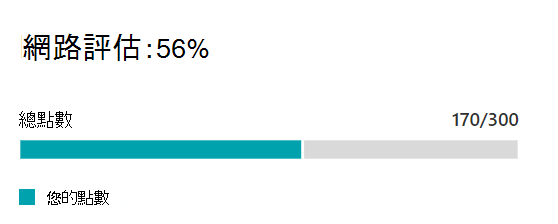

# Microsoft 365 網路評估 (預覽) Microsoft 365 network assessment (preview)

在 Microsoft 365 系統管理中心與 Microsoft 365 的連線能力頁面中， **網路評估** 會將許多網路效能度量的匯總，提煉成商業網路周邊健康情況的快照，以點數從 0-100 來表示。In the Microsoft 365 Admin Center's Connectivity to Microsoft 365 page, **network assessments** distill an aggregate of many network performance metrics into a snapshot of your enterprise network perimeter health, represented by a points value from 0 - 100. 網路評估同時適用于整個承租人和每個地理位置，讓使用者可以從該位置連線到您的租使用者，為 Microsoft 365 系統管理員提供一種簡單的方法來立即抓住商業網路健康情況的 gestalt，並快速深入查看任何全球辦公室位置的詳細報告。Network assessments are scoped to both the entire tenant and for each geographic location from which users connect to your tenant, providing Microsoft 365 administrators with an easy way to instantly grasp a gestalt of the enterprise's network health and quickly drill down into a detailed report for any global office location.

網路評估點值是 TCP 延遲、下載速度及 UDP 連線品質度量在查看時所進行的平均衡量。The network assessment points value is an average measurement of TCP latency, download speed and UDP connection quality metrics compiled live at the time they are viewed. Microsoft 所擁有網路的效能度量會從這些測量值中排除，以確保評估結果對於公司網路明確且特定。Performance metrics for Microsoft-owned networks are excluded from these measurements to ensure that assessment results are unambiguous and specific to the corporate network.

「非常低的網路評估」價值表示 Microsoft 365 用戶端在連線至租使用者時發生重大問題，或維持回應的使用者體驗，而高值則表示設定正確的網路，而不會發生很少的效能問題。A very low network assessment value suggests that Microsoft 365 clients will have significant problems connecting to the tenant or maintaining a responsive user experience, while a high value indicates a properly configured network with few ongoing performance issues. 80% 的值代表正常的基準，您不應預期會因網路效能而收到有關 Microsoft 365 連線或回應回應的一般使用者意見。A value of 80% represents a healthy baseline where you should not expect to receive regular user complaints about Microsoft 365 connectivity or responsiveness due to network performance. 隨著重複網路連線能力的增強，此值會隨著使用者經驗而增加。As iterative network connectivity improvements are made, this value will increase along with user experience.

>[!IMPORTANT]
>Microsoft 365 系統管理中心的網路洞察力、效能建議和評估目前處於預覽狀態，只適用于已在功能預覽計畫中註冊的 Microsoft 365 承租人。Network insights, performance recommendations and assessments in the Microsoft 365 Admin Center is currently in preview status, and is only available for Microsoft 365 tenants that have been enrolled in the feature preview program.

## 網路評估面板Network assessment panel

每個網路評估，不論是限定在租使用者或特定辦公室位置，都會顯示一個包含評估詳細資料的面板。Each network assessment, whether scoped to the tenant or to a specific office location, shows a panel with details about the assessment. 這個面板顯示評估的橫條圖，其百分比和每個元件工作負載的總點數，包括只接收度量資料的工作負載。This panel shows a bar chart of the assessment both as a percentage and as the total points for each component workload including only workloads where measurement data was received. 針對 office 位置網路評估，我們也會顯示基準，此基準是所有 Microsoft 365 用戶端中報告與您辦公室位置的資料。For an office location network assessment, we also show a benchmark which is the median of all Microsoft 365 clients that reported data in the same city as your office location.

面板中的 **評估分解** 會顯示每個元件工作負載的評估。The **Assessment breakdown** in the panel shows the assessment for each of the component workloads.

**評估記錄**會顯示過去30天的評估和基準。The **Assessment history** shows the past 30 days of the assessment and the benchmark. 您也可以使用 [記錄] 索引標籤，在最多兩年中報告任何 office 位置的計量歷程記錄。You can also report on the metrics history for any office location for up to two years using the history tab.

## 租使用者網路評估與 office 位置網路評估Tenant network assessments and office location network assessments

網路評估會將辦公位置的網路周邊環境設計，評定為 Microsoft 的網路。A network assessment measures the design of the network perimeter of an office location to Microsoft's network. 對網路周邊的增強功能最適合於每個辦公室位置，或會影響多個位置的增強功能。Improvements to the network perimeter is best done at each office location, or where network connectivity is aggregated there may be improvements that impact multiple locations.

我們會在 [網路效能一覽表] 頁面上，顯示整個 Microsoft 365 租使用者的網路評估值，以及該位置 [摘要] 頁面上每個偵測到之 office 位置的特定值。We show a network assessment value for the whole Microsoft 365 tenant on the network performance overview page and a specific value for each detected office location on that location's summary page.

## Exchange OnlineExchange Online

針對 Exchange Online，從用戶端電腦到 Exchange 前端伺服器的 TCP 延遲是測量。For Exchange Online the TCP latency from the client machine to the Exchange front end server is measured. 這可能會受到網路透過客戶局域網和 WAN 的距離所影響。This can be impacted by the distance the network travels over the customers LAN and WAN. 這種情況也可能會受到網路仲介裝置或服務的影響，以延遲連線或造成封包重發。It can also be impacted by network intermediary devices or services which delay the connectivity or cause packets to be resent. 中間的 (也稱為第50個百分點值或 P50 量值，) 是針對前三天的所有度量所取。The median (also known as the 50th percentile or P50 measure) is taken for all measurements over the previous three days.

Exchange Online 評估是使用下表進行。The Exchange Online assessment is made using the following table. 在頻帶中以線性方式指派閾值之間的任何 TCP 延遲數位。Any TCP latency number between the thresholds are assigned points linearly within the band.

| TCP 延遲TCP Latency   | 點Points |
| :------------ | :----- |
| 10ms 或更少10ms or less  | 100100    |
| 25ms25ms          | 8080     |
| 100ms100ms         | 6060     |
| 200ms200ms         | 4040     |
| 300ms300ms         | 共20     |
| 350ms 或更多350ms or more | 00      |

## SharePoint OnlineSharePoint Online

針對 SharePoint 線上，可供使用者從 SharePoint Online 或 OneDrive 存取檔的下載速度。For SharePoint Online the download speed available for a user to access a document from SharePoint Online or OneDrive is measured. 這可能會受到用戶端電腦與 Microsoft 網路之間網路環路上可用頻寬的影響。This can be impacted by the bandwidth available on network circuits between the client machine and Microsoft's network. 這通常是因為網路擁塞存在於複雜網路裝置或不良覆蓋 Wi-Fi 區域中的網路擁塞所影響。It is also often impacted by network congestion that exists in bottlenecks in complex network devices or in poor coverage Wi-Fi areas. 下載速度是以每秒 mb 為單位，大約一十分之一每秒額定百萬位元的電路。The download speed is measured in megabytes per second which is approximately one tenth of a circuits rated megabits per second. 第25個百分點值 (也稱為 P25 量值，) 是針對前三天的所有度量所取。The 25th percentile (also known as the P25 measure) is taken for all measurements over the previous three days.

使用下表進行 SharePoint 線上評估。The SharePoint Online assessment is made using the following table. 在頻帶中以線性方式指派閾值之間的任何下載速度。Any download speed number between the thresholds are assigned points linearly within the band.

| 下載速度Download speed | 點Points |
| :------------- | :----- |
| 20MBps 或更多20MBps or more | 100100    |
| 14MBps14MBps         | 8080     |
| 8MBps8MBps          | 6060     |
| 4MBps4MBps          | 4040     |
| 2MBps2MBps          | 共20     |
| 0MBps0MBps          | 00      |

## Microsoft TeamsMicrosoft Teams

針對 Microsoft 小組，網路品質是指 UDP 延遲、UDP 抖動及 UDP 封包遺失。For Microsoft Teams the Network quality is measured as UDP latency, UDP jitter, and UDP packet loss. UDP 可用於 Microsoft 小組的通話和會議音訊和影片媒體連線。UDP is used for call and conferencing audio and video media connectivity for Microsoft Teams. 這可能會受到延遲和下載速度相同的因素所影響，除了 UDP 是分別設定為較為常見的 TCP 通訊協定以外，其他情況也是在網路的 UDP 支援中使用網路中斷性。This can be impacted by the same factors as for latency and download speed in addition to connectivity gaps in a network's UDP support since UDP is configured separately to the more common TCP protocol. 中間的 (也稱為第50個百分點值或 P50 量值，) 是針對前三天的所有度量所取。The median (also known as the 50th percentile or P50 measure) is taken for all measurements over the previous three days. 

Microsoft 小組評估是使用下表進行。The Microsoft Teams assessment is made using the following table. 所有三個 UDP 測量值都必須超過所列的臨界值，以達到顯示的點數。All three of the UDP measurements must be above the threshold listed to achieve the points shown. 在頻帶內沒有任何單一位置的評估。There are no assessments for a single location within a band.

| UDP 封包遺失UDP packet loss | UDP 延遲UDP latency | UDP 抖動UDP jitter | 點Points |
| :-------------- | :---------- | :--------- | :----- |
| 0.25%0.25%           | 60ms60ms        | 15ms15ms       | 100100    |
| 1.00%1.00%           | 120ms120ms       | 40ms40ms       | 8080     |
| 1.50%1.50%           | 240ms240ms       | 65ms65ms       | 6060     |
| 3.00%3.00%           | 275ms275ms       | 80ms80ms       | 4040     |
| 5.00%5.00%           | 350ms350ms       | 150ms150ms      | 共20     |
| 任何較高Any higher      | 任何較高Any higher  | 任何較高Any higher | 00      |

## 相關主題Related topics

[Microsoft 365 系統管理中心的網路效能建議 (預覽) Network performance recommendations in the Microsoft 365 Admin Center (preview)](office-365-network-mac-perf-overview.md)

[Microsoft 365 網路效能深入 (預覽) Microsoft 365 network performance insights (preview)](office-365-network-mac-perf-insights.md)

[Microsoft 365 connectivity test in M365 Admin Center (預覽) Microsoft 365 connectivity test in the M365 Admin Center (preview)](office-365-network-mac-perf-onboarding-tool.md)

[Microsoft 365 Network Connectivity Location 服務 (預覽) Microsoft 365 Network Connectivity Location Services (preview)](office-365-network-mac-location-services.md)
