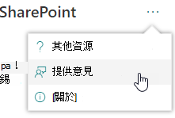
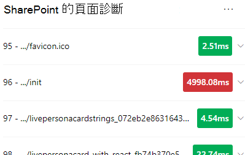
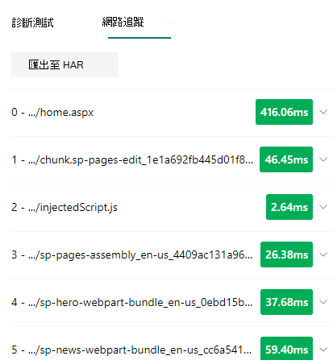
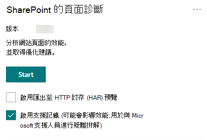

# 針對 SharePoint 工具使用頁面診斷程式

本文說明如何使用 **SharePoint 工具的頁面診斷** ，對照一組預先定義的效能準則來 SharePoint 分析線上現代化和傳統的網站頁面。

您可以為下列專案安裝 SharePoint 工具的頁面診斷程式：

- **Microsoft edge** [ (edge 延伸)](https://microsoftedge.microsoft.com/addons/detail/ocemkolpnamjcacndljdfmhlpcaoipji)
- **Chrome** [ (chrome 副檔名)](https://chrome.google.com/webstore/detail/inahogkhlkbkjkkaleonemeijihmfagi)

>[!TIP]
>版本 **2.0.0** 及更新版本包含對現代頁面的支援，除了傳統的網站頁面。 如果您不確定所使用的工具版本，可以選取 [ **關於** ] 連結或 [省略號 ( ...] ) 以驗證您的版本。 使用工具時 **，永遠更新為最新的版本**。

適用於 SharePoint 的頁面診斷工具是全新 Microsoft Edge (https://www.microsoft.com/edge) 和 Chrome 瀏覽器的擴充功能，可以用來分析 SharePoint Online 新式入口網站與傳統發佈網站頁面。 此工具僅適用于線上 SharePoint，無法在 SharePoint 系統] 頁面上使用。

工具會針對每個已分析的頁面產生報表，顯示頁面如何針對預先定義的規則集執行，並在測試結果超出基線值時顯示詳細資訊。 SharePoint Online 管理員和設計者可以使用工具來疑難排解效能問題，並確保新頁面在發佈之前已經過優化。

頁面診斷工具專門設計用來分析 SharePoint 網站頁面，而不是 allitems 的系統頁面（如： *.aspx* 或 *SharePoint .aspx*）。 如果您嘗試在系統頁面或任何其他非網站頁面上執行該工具，您將會收到錯誤訊息，建議您無法針對該類型的頁面執行該工具。

> [!div class="mx-imgBorder"]
> 

這不是工具中的錯誤，因為評估文件庫或系統頁面時沒有任何值。 請流覽至 SharePoint 網站頁面以使用工具。 如果 SharePoint 頁面上發生此錯誤，請檢查主版頁面，確定尚未移除 SharePoint metatags。

若要提供工具的意見反應，請選取工具右上角的省略號，然後選取 [ [提供意見](https://go.microsoft.com/fwlink/?linkid=874109)反應]。

> [!div class="mx-imgBorder"]
> 
  
## 安裝 SharePoint 工具的頁面診斷程式

本節中的安裝程式會同時適用于 Chrome 和 Microsoft Edge 瀏覽器。

> [!IMPORTANT]
> Microsoft 不會讀取由「SharePoint 工具」頁面診斷進行分析的資料或頁面內容，也不會捕獲任何個人資訊、網站或下載資訊。 由工具記錄的唯一可識別資訊是租使用者名稱、失敗的規則計數，以及執行該工具的日期和時間。 Microsoft 使用此資訊來更深入瞭解新式入口網站，併發布網站使用量趨勢和常見效能問題。

1. 針對適用于 **Microsoft Edge** [ (Edge 擴充](https://microsoftedge.microsoft.com/addons/detail/ocemkolpnamjcacndljdfmhlpcaoipji) 的 SharePoint 工具安裝頁面診斷，) 或 **chrome** [ (chrome 副檔名)](https://chrome.google.com/webstore/detail/inahogkhlkbkjkkaleonemeijihmfagi)。 請查看存放區中「描述」頁面上提供的使用者隱私權原則。 在您的瀏覽器中新增工具時，您會看到下列許可權通知。

    > [!div class="mx-imgBorder"]
    > 

    因為頁面上可能包含來自 SharePoint 以外之位置的內容，視頁面上的網頁元件及自訂專案而定，所以已存在此通知。 這表示，當您按一下 [開始] 按鈕時，此工具會讀取要求和回應，而且只適用于執行工具所在的使用中 SharePoint] 索引標籤。 此資訊是透過網頁瀏覽器在本機捕獲，可透過您透過工具的 [_網路追蹤_] 索引標籤中的 [**匯出至 JSON** ] 或 [**匯出至 HAR** ] 按鈕供您使用。**資訊不會傳送至 Microsoft 或由 Microsoft 所捕獲**。  (此工具會尊重您在 [這裡](https://go.microsoft.com/fwlink/p/?linkid=857875)存取的 Microsoft 隱私權原則。 ) 

    「 _管理您的下載_ 」許可權涵蓋如何使用此工具的 **匯出至 JSON** 功能。 請遵照貴公司專屬的隱私權指導方針，在組織外共用 JSON 檔案，因為結果包含 URLs，而且可以分類為 PII (個人身分識別資訊) 。
1. 如果您想要在 Incognito 或 InPrivate 模式中使用工具，請遵循瀏覽器的程式：
    1. 在 Microsoft Edge 中，流覽至 [ **副檔名** ] 或在 URL 欄中輸入 _edge://extensions_ ，然後選取分機的 **詳細資料** 。 在 [副檔名] 設定中，選取 [ **允許在 InPrivate**] 的核取方塊。
    1. 在 Chrome 中，流覽至 [ **副檔名** ] 或在 URL 欄中輸入 _chrome://extensions_ ，然後選取分機的 **詳細資料** 。 在 [副檔名] 設定中，選取 [ **允許在 Incognito 中** 的滑塊]。
1. 流覽至您要審閱 SharePoint Online 上的 [SharePoint 網站] 頁面。 我們允許對頁面上的專案進行「延遲載入」;因此，此工具不會自動停止 (這種設計是為了容納) 所有的頁面載入案例。 若要停止收集，請選取 [ **停止**]。 在停止資料收集之前，請確定頁面載入已完成，否則您只會捕獲部分追蹤。
1. 按一下分機的工具列按鈕  若要載入工具，將會出現下列副檔名快顯功能表視窗：

    

選取 [ **開始** ] 以開始收集資料以供分析。

## 您會在 SharePoint 工具的頁面診斷資訊中看到的內容

1. 按一下工具右上角的 [省略號 ( ... ) ，以尋找下列連結：
   1. [ **其他資源** ] 連結提供有關工具的一般指導及詳細資訊，包括傳回本文的連結。
   1. [ **提供意見** 反應] 連結可提供 _SharePoint 網站與共同作業使用者語音_ 網站的連結。
   1. [ **關於** ] 連結包括目前已安裝的工具版本，以及該工具的協力廠商通知的直接連結。  
1. **相關識別碼、SPRequestDuration、SPIISLatency**、**頁面載入時間** 及 **URL** 詳細資料都是資訊性的，可用於少數用途。

    > [!div class="mx-imgBorder"]
    > 

   - 當您使用 Microsoft 支援時， **CorrelationID** 是一個重要的元素，因為它可讓使用者收集特定頁面的其他診斷資料。
   - **SPRequestDuration** 是 SharePoint 處理頁面所用的時間。 結構化導覽、大圖像、大量 API 通話都可能會導致工期更長。
   - **SPIISLatency** 是 SharePoint 線上開始載入頁面時所花費的時間（以毫秒為單位）。 此值不包含 web 應用程式回應所需的時間。
   - **頁面載入時間** 是指從要求的時間到在瀏覽器中接收及呈現回應時間的頁面所記錄的總時間。 這個值會受到各種因素的影響，包括網路延遲、電腦效能，以及瀏覽器載入頁面所需的時間。
   - **頁面 URL** (統一資源定位器) 是目前頁面的網頁位址。

1. [ [**診斷測試**](#how-to-use-the-diagnostic-tests-tab) ] 索引標籤會以三個類別顯示分析結果。 **不需要任何動作**、 **改進機遇** 及 **必要的注意事項**。 每個測試結果都是以下列其中一個類別中的專案表示，如下表所述：

    |類別  |色彩  |描述  |
    |---------|---------|---------|
    |**需要注意** |紅色 |測試結果會超出比較基準值，而且會影響頁面效能。 遵循修復指導方針。|
    |**改進機會** |黃色 |測試結果會超出基準值，而且可能會影響效能問題。 可能會套用特定測試準則。|
    |**不需要採取任何動作** |綠色 |測試結果介於測試的比較基準值內。|

    > [!div class="mx-imgBorder"]
    > 

1. [ [**網路追蹤**](#how-to-use-the-network-trace-tab-and-how-to-export-a-har-file) ] 索引標籤提供頁面組建要求和回應的詳細資料。

## 如何使用 [診斷測試] 索引標籤

當您使用 SharePoint 工具的頁面診斷來分析 SharePoint 新式入口網站頁面或傳統發佈網站頁面時，會使用預先定義的規則來分析結果，以比較比較基準值及顯示在 [ **診斷測試** ] 索引標籤中的結果。某些測試的規則可能會針對新式入口網站和傳統發佈網站使用不同的比較基準值，具體取決於兩者之間的特定效能特性各有不同。

出現在 [增加 **機會** ] 或 [ **注意事項** ] 類別中的測試結果指出應該針對建議的做法評審的區域，並可供選取以顯示結果的其他資訊。 每個專案的詳細資料包括「 _深入瞭解_ 」連結，它會直接向您傳送與測試相關的適當指導方針。 [ **無必要動作** ] 類別中顯示的測試結果表示符合相關的規則，且選取時不會顯示其他詳細資料。

[診斷測試] 索引標籤中的資訊不會告訴您如何設計頁面，但是會強調可能影響頁面效能的因素。 某些頁面功能和自訂對頁面效能的影響不可避免，應檢查是否有潛在的修復，或在其影響很大時省略頁面。

紅色或黃色結果也可能表示重新整理資料的網頁元件過於頻繁。 例如，公司新聞並非每秒都會更新，但是自訂網頁元件通常是用來每秒提取最新的新聞，而不是執行可改善整體使用者體驗的快取元素。 在頁面上加入網頁元件時，請務必注意，如果是透過評估每個可用參數的值來降低其效能影響，以確保針對其預定用途進行適當設定，請務必注意。

>[!NOTE]
>未啟用發佈功能的傳統小組網站無法使用 Cdn。 當您在這些網站上執行工具時，CDN 測試預期會失敗而且可以忽略，但其餘的測試皆適用。 SharePoint 發佈功能的其他功能可增加頁面載入時間，所以不應該只為允許啟用 CDN 功能。

>[!IMPORTANT]
>已定期新增及更新測試規則因此，請參閱最新版的工具，以取得目前的規則及測試結果中所含特定資訊的詳細資訊。 您可以透過管理您的分機來驗證版本，而且分機將會告知是否有可用的更新。

## 如何使用 [網路追蹤] 索引標籤以及如何匯出 HAR 檔案

[ **網路追蹤** ] 索引標籤提供兩個要求的詳細資訊，用以建立頁面及從 SharePoint 收到的回應。

1. **尋找標記為紅色的專案載入時間**。 每個要求和回應都是以色彩編碼，以指出其對整體頁面效能的影響，使用下列延遲度量值：
    - 綠色： \< 500ms
    - 黃色： 500-1000ms
    - 紅色： \> 1000ms

    > [!div class="mx-imgBorder"]
    > 

    在上面顯示的圖像中，紅色專案與預設頁面有關。 除非1000ms 中載入的頁面 \< (小於1秒的) ，否則它永遠會顯示紅色。

2. **測試專案載入時間**。 在某些情況下，由於瀏覽器已經快取這些專案，因此不會有任何時間或色彩指示器。 若要正確地進行此項測試，請開啟頁面，清除瀏覽器快取，然後按一下 [ **啟動** ]，將會強制 "冷" 頁面載入，並成為初始頁面載入的實際反映。 這樣一來，就應該將它與「暖色」頁面負載進行比較，以協助判斷頁面上快取哪些專案。

3. **與其他可協助調查問題的相關詳細資訊共用**。 若要與您的開發人員或技術支援人員共用工具中提供的詳細資料或資訊，使用 [ **匯出至 HTTP 封存 (HAR)** ] 是建議的方法。 

   > [!div class="mx-imgBorder"]
   > 

按一下 [開始]，然後在瀏覽器中啟用偵錯模式時，應該先啟用該功能。 它會產生 (HAR) 上的 HTTP 封存檔案，然後可透過「網路追蹤」索引標籤來存取。按一下 [匯出至 HAR]，它會將檔案下載到您的電腦，然後再進行適當共用。 您可以使用各種調試工具（例如 F12 開發人員工具和 Fiddler）來開啟檔案。

> [!div class="mx-imgBorder"]
> 

> [!IMPORTANT]
> 這些結果包含 URLs，而且可以分類為 PII (個人身分識別資訊) 。 在發佈該資訊之前，請務必遵循組織的指導方針。

## 與 Microsoft 支援人員接洽

我們已包含 **Microsoft 支援層級功能** ，只應在直接使用支援案例時使用。 使用此功能時，不需要支援小組合作，也不會對您提供任何好處，而且可使頁面執行速度大幅減慢。 在工具中使用此功能時，不需要額外的資訊，因為會將額外資訊新增至服務中的記錄。

不會顯示任何變更，只是因為您將會收到您的通知，您會收到您的通知，而您的頁面效能將會隨著2-3 倍于啟用的速度而大幅降低。 它只會與特定頁面及該作用中的會話相關。 基於這個理由，應慎用此方式，僅在主動與支援時使用。

### 啟用 Microsoft 支援層級功能

1. 開啟 SharePoint 工具的頁面診斷程式。
2. 在鍵盤上按下 **ALT 鍵-L**。 這會顯示 [ **啟用支援記錄** ] 核取方塊。
3. 選取核取方塊，然後按一下 [ **開始** ] 以重新載入頁面並產生詳細記錄。

   > [!div class="mx-imgBorder"]
   > 
  
    您應記下 (顯示在) 工具上方的 CorrelationID，並將其提供給支援代表，讓他們可以收集有關診斷會話的其他資訊。

## 相關主題

[調整 SharePoint Online 效能](tune-sharepoint-online-performance.md)

[調整 Office 365 效能](tune-microsoft-365-performance.md)

[SharePoint 新式體驗中的效能](/sharepoint/modern-experience-performance)

[內容傳遞網路](content-delivery-networks.md)

[使用 Office 365 內容傳遞網路 (CDN) 搭配 SharePoint Online](use-microsoft-365-cdn-with-spo.md)