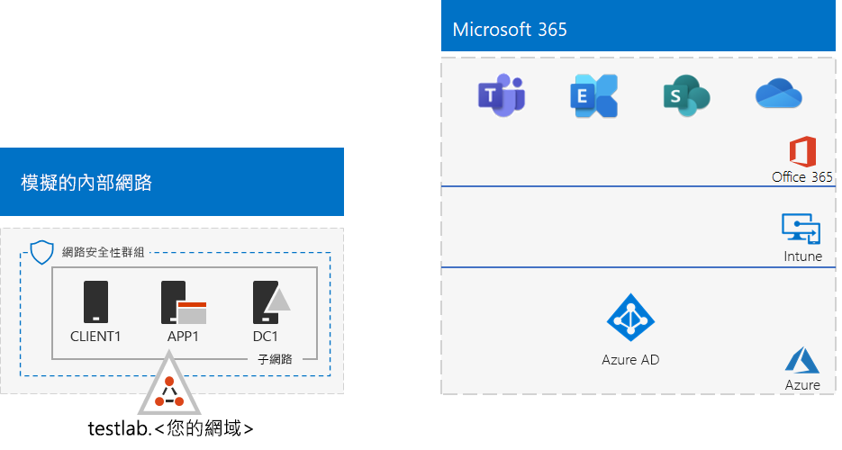

# <a name="password-hash-synchronization-for-your-microsoft-365-test-environment"></a>適用於 Office 365 測試環境的密碼雜湊同步處理

*這個測試實驗室指南可用於 Microsoft 365 企業版和 Office 365 企業版兩種測試環境。*

許多組織使用 Azure AD Connect 和密碼雜湊同步處理，將其內部部署 Active Directory Domain Services (AD DS) 樹系中的帳戶集同步處理至 Microsoft 365 訂閱的 Azure AD 租用戶帳戶集。 本文說明如何將密碼雜湊同步處理新增至 Office 365 測試環境，進而產生下列組態：
  

  
設定此測試環境有兩個主要階段︰
  
1. 建立 Microsoft 365 模擬企業測試環境。
2. 在 APP1 上安裝及設定 Azure AD Connect。
    
> [!TIP]
> 按一下[這裡](../media/m365-enterprise-test-lab-guides/Microsoft365EnterpriseTLGStack.pdf)，可查看 Microsoft 365 企業版測試實驗室指南堆疊中所有文章的視覺對應。
  
## <a name="phase-1-create-the-microsoft-365-simulated-enterprise-test-environment"></a>階段 1：建立 Microsoft 365 模擬企業測試環境

請依照 [Microsoft 365 模擬企業基本設定](simulated-ent-base-configuration-microsoft-365-enterprise.md)中的指示操作。以下是所產生的組態。
  

  
此組態包含： 
  
- Microsoft 365 E5 或 Office 365 E5 試用版或付費訂閱。
- 簡化的組織內部網域與網際網路的連線，由 Azure 虛擬網路中的 DC1、APP1 及 CLIENT1 虛擬機器組成。 DC1 是 testlab 的網域控制站。\<您的公開網域名稱> AD DS 網域。

## <a name="phase-2-create-and-register-the-testlab-domain"></a>階段 2：建立及註冊 testlab 網域

在這個階段，您會新增公用 DNS 網域並將它新增至您的訂閱。

首先，與您的公用 DNS 註冊提供者合作，以根據目前的網域名稱建立新的公用 DNS 網域名稱，並新增到您的訂閱中。建議名稱使用 **testlab.**\<您的公用網域>。比方說，如果您的公用網域名稱為 **<span>contoso</span>.com**，請新增公用網域名稱 **<span>testlab</span>.contoso.com**。
  
接下來，您會進行網域註冊程序，以將 **testlab.**\<您的公用網域名稱> 網域新增至 Microsoft 365 或 Office 365 試用版或付費訂閱。 這包括將其他 DNS 記錄新增至 **testlab.**\<您的公用網域名稱> 網域。 如需詳細資訊，請參閱[新增網域至 Office 365](https://docs.microsoft.com/office365/admin/setup/add-domain)。 

以下是產生的組態。
  

  
此組態包含：

- 已註冊 DNS 網域 testlab.\<您的公用網域名稱> 的 Microsoft 365 E5 或 Office 365 E5 試用版或付費訂閱。
- 簡化的組織內部網域與網際網路的連線，由 Azure 虛擬網路的子網路上的 DC1、APP1 及 CLIENT1 虛擬機器組成

請注意 testlab.\<您的公用網域名稱> 目前的狀況：

- 由公用 DNS 記錄支援。
- 已在您的 Microsoft 365 訂閱中註冊。
- 模擬內部網路上的 AD DS 網域。
     
## <a name="phase-3-install-azure-ad-connect-on-app1"></a>階段 3：在 APP1 上安裝 Azure AD Connect

在這個階段，您會在 APP1 上安裝及設定 Azure AD Connect 工具，然後確認它可運作。
  
首先，在 APP1 上安裝及設定 Azure AD Connect。

1. 從 [Azure 入口網站](https://portal.azure.com)，以您的全域管理員帳戶登入，然後以 TESTLAB\\User1 帳戶連線到 APP1。
    
2. 從 APP1 的桌面，開啟系統管理員層級 Windows PowerShell 命令提示字元，然後執行下列命令：
    
   ```powershell
   Set-ItemProperty -Path "HKLM:\SOFTWARE\Microsoft\Active Setup\Installed Components\{A509B1A7-37EF-4b3f-8CFC-4F3A74704073}" -Name "IsInstalled" -Value 0
   Set-ItemProperty -Path "HKLM:\SOFTWARE\Microsoft\Active Setup\Installed Components\{A509B1A8-37EF-4b3f-8CFC-4F3A74704073}" -Name "IsInstalled" -Value 0
   Stop-Process -Name Explorer -Force
   ```

3. 從工作列按一下 [Internet Explorer]****，然後移至 [https://aka.ms/aadconnect](https://aka.ms/aadconnect)。
    
4. 在 [Microsoft Azure Active Directory Connect] 頁面上，按一下 [下載]****，然後按一下 [執行]****。
    
5. 在 [歡迎使用 Azure AD Connect]**** 頁面上，按一下 [我同意]****，然後按一下 [繼續]****。
    
6. 在 [快速設定]**** 頁面上，按一下 [使用快速設定]****。
    
7. 在 [連線到 Azure AD]**** 頁面上，在 [使用者名稱]**** 中輸入您的全域系統管理員帳戶名稱，在 [密碼]**** 中輸入其密碼，然後按 [下一步]****。
    
8. 在 [連線到 AD DS]**** 頁面上，在 [使用者名稱]**** 中輸入 **TESTLAB\\User1**，在 [密碼]**** 中輸入其密碼，然後按 [下一步]****。
    
9. 在 [準備設定]**** 頁面上，按一下 [安裝]****。
    
10. 在 [組態完成]**** 頁面上，按一下 [結束]****。
    
11. 在 Internet Explorer 中，移至 Microsoft 365 系統管理中心 ([https://portal.microsoft.com](https://portal.microsoft.com))。
    
12. 在左方的瀏覽區域中，按一下 [使用者] > [作用中的使用者]****。
    
    請注意名為 **User1** 的帳戶。 此帳戶是來自 TESTLAB AD DS 網域，且經過證明目錄同步作業可以運作。
    
13. 按一下 **User1** 帳戶，然後按一下 [授權與 App]****。
    
14. 在 [產品授權]**** 中，選取您的位置 (如有需要)，停用 **Office 365 E5** 授權，並啟用 **Microsoft 365 E5** 授權。 

15. 按一下頁面底部的 [儲存]****，然後按一下 [關閉]****。
    
接下來，測試使用 <strong>user1@testlab.</strong>\<您的網域名稱> User1 帳戶的使用者名稱來登入訂閱的能力。

1. 從 APP1 登出，然後再次登入，這次指定不同的帳戶。

2. 當系統提示您輸入使用者名稱和密碼時，指定 <strong>user1@testlab.</strong>\<您的網域名稱> 與 User1 密碼。您應該可以成功以 User1 身分登入。 
 
請注意，User1 雖具有 TESTLAB AD DS 網域的網域管理員權限，但並不是全域管理員。 因此，您不會看到 [管理員]**** 圖示選項。 

以下是產生的組態。


此組態包含： 
  
- 已註冊 DNS 網域 TESTLAB.\<您的網域名稱> 的 Microsoft 365 E5 或 Office 365 E5 試用版或付費訂閱。
- 簡化的組織內部網域與網際網路的連線，由 Azure 虛擬網路的子網路上的 DC1、APP1 及 CLIENT1 虛擬機器組成 Azure AD Connect 在 APP1 上執行，以定期將 TESTLAB AD DS 網域同步至 Microsoft 365 訂閱的 Azure AD 租用戶。
- TESTLAB AD DS 網域中的 User1 帳戶已經與 Azure AD 租用戶同步處理。

## <a name="next-step"></a>下一步

瀏覽測試環境中的其他[身分識別](m365-enterprise-test-lab-guides.md#identity)功能。

## <a name="see-also"></a>另請參閱

[Microsoft 365 企業版測試實驗室指南](m365-enterprise-test-lab-guides.md)

[部署 Microsoft 365 企業版](deploy-microsoft-365-enterprise.md)

[Microsoft 365 企業版文件](https://docs.microsoft.com/microsoft-365-enterprise/)


