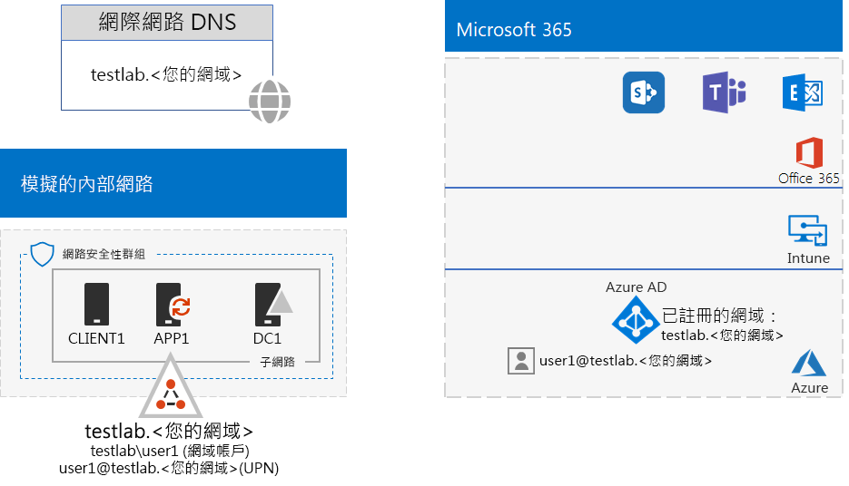
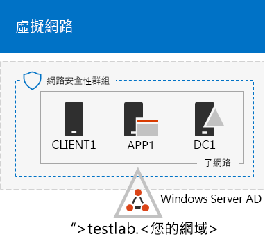
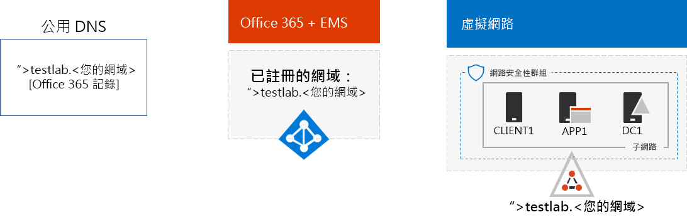

# <a name="password-hash-synchronization-for-your-microsoft-365-test-environment"></a><span data-ttu-id="ad7af-103">適用於 Office 365 測試環境的密碼雜湊同步處理</span><span class="sxs-lookup"><span data-stu-id="ad7af-103">Password hash synchronization for your Microsoft 365 test environment</span></span>

<span data-ttu-id="ad7af-104">許多組織使用 Azure AD Connect 和密碼雜湊同步處理，將其內部部署 Active Directory Domain Services (AD DS) 樹系中的帳戶集同步處理至 Office 365 和 EMS E5 訂閱的 Azure AD 租用戶中的帳戶集。</span><span class="sxs-lookup"><span data-stu-id="ad7af-104">Many organizations use Azure AD Connect and password hash synchronization to synchronize the set of accounts in their on-premises Windows Server Active Directory (AD) forest to the set of accounts in the Azure AD tenant of their Office 365 and EMS E5 subscriptions. This article describes how you can add password hash synchronization to your Microsoft 365 test environment, resulting in the following configuration:</span></span> <span data-ttu-id="ad7af-105">本文說明如何將密碼雜湊同步處理新增至 Office 365 測試環境，進而產生下列組態：</span><span class="sxs-lookup"><span data-stu-id="ad7af-105">This article describes how you can add password hash synchronization to your Microsoft 365 test environment, resulting in the following configuration:</span></span>
  

  
<span data-ttu-id="ad7af-107">設定此測試環境有兩個主要階段︰</span><span class="sxs-lookup"><span data-stu-id="ad7af-107">There are two phases to setting up this test environment:</span></span>
  
1. <span data-ttu-id="ad7af-108">建立 Microsoft 365 模擬企業測試環境。</span><span class="sxs-lookup"><span data-stu-id="ad7af-108">Create the Microsoft 365 simulated enterprise test environment.</span></span>
2. <span data-ttu-id="ad7af-109">在 APP1 上安裝及設定 Azure AD Connect。</span><span class="sxs-lookup"><span data-stu-id="ad7af-109">Install and configure Azure AD Connect on APP1.</span></span>
    
> [!TIP]
> <span data-ttu-id="ad7af-110">按一下[這裡](https://aka.ms/m365etlgstack)，可查看 Microsoft 365 企業版測試實驗室指南堆疊中所有文章的視覺對應。</span><span class="sxs-lookup"><span data-stu-id="ad7af-110">Click [here](https://aka.ms/m365etlgstack) for a visual map to all the articles in the Microsoft 365 Enterprise Test Lab Guide stack.</span></span>
  
## <a name="phase-1-create-the-microsoft-365-simulated-enterprise-test-environment"></a><span data-ttu-id="ad7af-111">階段 1：建立 Microsoft 365 模擬企業測試環境</span><span class="sxs-lookup"><span data-stu-id="ad7af-111">Phase 1: Create the Microsoft 365 simulated enterprise test environment</span></span>

<span data-ttu-id="ad7af-p102">請依照 [Microsoft 365 模擬企業基本設定](simulated-ent-base-configuration-microsoft-365-enterprise.md)中的指示操作。以下是所產生的組態。</span><span class="sxs-lookup"><span data-stu-id="ad7af-p102">Follow the instructions in [simulated enterprise base configuration for Microsoft 365](simulated-ent-base-configuration-microsoft-365-enterprise.md). Here is your resulting configuration.</span></span>
  

  
<span data-ttu-id="ad7af-115">此組態包含：</span><span class="sxs-lookup"><span data-stu-id="ad7af-115">This configuration consists of:</span></span> 
  
- <span data-ttu-id="ad7af-116">Office 365 E5 和 EMS E5 試用版或付費訂閱。</span><span class="sxs-lookup"><span data-stu-id="ad7af-116">Office 365 E5 and EMS E5 trial or paid subscriptions.</span></span>
- <span data-ttu-id="ad7af-117">簡化的組織內部網域與網際網路的連線，由 Azure 虛擬網路中的 DC1、APP1 及 CLIENT1 虛擬機器組成。</span><span class="sxs-lookup"><span data-stu-id="ad7af-117">A simplified organization intranet connected to the Internet, consisting of the DC1, APP1, and CLIENT1 virtual machines on a subnet of an Azure virtual network.</span></span> <span data-ttu-id="ad7af-118">DC1 是 testlab.\<您的公用網域名稱> Active Directory Domain Services (AD DS) 網域的網域控制站。</span><span class="sxs-lookup"><span data-stu-id="ad7af-118">DC1 is a domain controller for the testlab.\<your public domain name> Active Directory Domain Services (AD DS) domain.</span></span>

## <a name="phase-2-create-and-register-the-testlab-domain"></a><span data-ttu-id="ad7af-119">階段 2：建立及註冊 testlab 網域</span><span class="sxs-lookup"><span data-stu-id="ad7af-119">Phase 2: Create and register the testlab domain</span></span>

<span data-ttu-id="ad7af-120">在這個階段，您會新增公用 DNS 網域並將它新增至您的訂閱。</span><span class="sxs-lookup"><span data-stu-id="ad7af-120">In this phase you add a public DNS domain and add it to your subscription.</span></span>

<span data-ttu-id="ad7af-p104">首先，與您的公用 DNS 註冊提供者合作，以根據目前的網域名稱建立新的公用 DNS 網域名稱，並新增到您的 Office 365 訂閱中。建議名稱使用 **testlab.**\<您的公用網域>。比方說，如果您的公用網域名稱為 <span>**contoso</span>.com**，請新增公用網域名稱 **<span>testlab</span>.contoso.com**。</span><span class="sxs-lookup"><span data-stu-id="ad7af-p104">First, work with your public DNS registration provider to create a new public DNS domain name based on your current domain name and add it to your Office 365 subscription. We recommend using the name **testlab.**\<your public domain>. For example, if your public domain name is <span>**contoso</span>.com**, add the public domain name **<span>testlab</span>.contoso.com**.</span></span>
  
<span data-ttu-id="ad7af-124">接下來，您會進行網域註冊程序，以將 **testlab.**\<您的公用網域名稱> 網域新增至 Office 365 試用版或付費訂閱。</span><span class="sxs-lookup"><span data-stu-id="ad7af-124">Next, you add the **testlab.**\<your public domain> domain to your Office 365 trial or permanent subscription by going through the domain registration process. This consists of adding additional DNS records to the testlab.your public domain> domain. For more information, see Add users and domain to Office 365.</span></span> <span data-ttu-id="ad7af-125">這包括將其他 DNS 記錄新增至 **testlab.**\<您的公用網域名稱> 網域。</span><span class="sxs-lookup"><span data-stu-id="ad7af-125">This consists of adding additional DNS records to the **testlab.**\<your public domain> domain.</span></span> <span data-ttu-id="ad7af-126">如需詳細資訊，請參閱[將使用者與網域新增至 Office 365](https://support.office.com/article/Add-users-and-domain-to-Office-365-6383f56d-3d09-4dcb-9b41-b5f5a5efd611)。</span><span class="sxs-lookup"><span data-stu-id="ad7af-126">To learn more, see [Add users and domain to Office 365](https://support.office.com/article/Add-users-and-domain-to-Office-365-6383f56d-3d09-4dcb-9b41-b5f5a5efd611).</span></span> 

<span data-ttu-id="ad7af-127">以下是產生的組態。</span><span class="sxs-lookup"><span data-stu-id="ad7af-127">Here is your resulting configuration.</span></span>
  

  
<span data-ttu-id="ad7af-129">此組態包含：</span><span class="sxs-lookup"><span data-stu-id="ad7af-129">This configuration consists of:</span></span>

- <span data-ttu-id="ad7af-130">已註冊 DNS 網域 testlab.\<您的網域名稱> 的 Office 365 E5 和 EMS E5 試用版或付費訂閱。</span><span class="sxs-lookup"><span data-stu-id="ad7af-130">Office 365 E5 and EMS E5 trial or permanent subscriptions with the DNS domain testlab.\<your public domain name> registered.</span></span>
- <span data-ttu-id="ad7af-131">簡化的組織內部網域與網際網路的連線，由 Azure 虛擬網路的子網路上的 DC1、APP1 及 CLIENT1 虛擬機器組成</span><span class="sxs-lookup"><span data-stu-id="ad7af-131">A simplified organization intranet connected to the Internet, consisting of the DC1, APP1, and CLIENT1 virtual machines on a subnet of an Azure virtual network.</span></span>

<span data-ttu-id="ad7af-132">請注意 testlab.\<您的公用網域名稱> 目前的狀況：</span><span class="sxs-lookup"><span data-stu-id="ad7af-132">Notice how the testlab.\<your public domain name> is now:</span></span>

- <span data-ttu-id="ad7af-133">由公用 DNS 記錄支援。</span><span class="sxs-lookup"><span data-stu-id="ad7af-133">Supported by public DNS records.</span></span>
- <span data-ttu-id="ad7af-134">已在 Office 365 和 EMS 訂閱中註冊。</span><span class="sxs-lookup"><span data-stu-id="ad7af-134">Registered in your Office 365 and EMS subscriptions.</span></span>
- <span data-ttu-id="ad7af-135">模擬內部網路上的 AD DS 網域。</span><span class="sxs-lookup"><span data-stu-id="ad7af-135">The Windows Server AD domain on your simulated intranet.</span></span>
     
## <a name="phase-3-install-azure-ad-connect-on-app1"></a><span data-ttu-id="ad7af-136">階段 3：在 APP1 上安裝 Azure AD Connect</span><span class="sxs-lookup"><span data-stu-id="ad7af-136">Phase 3: Install Azure AD Connect on APP1</span></span>

<span data-ttu-id="ad7af-137">在這個階段，您會在 APP1 上安裝及設定 Azure AD Connect 工具，然後確認它可運作。</span><span class="sxs-lookup"><span data-stu-id="ad7af-137">In this phase, you install and configure the Azure AD Connect tool on APP1, and then verify that it works.</span></span>
  
<span data-ttu-id="ad7af-138">首先，在 APP1 上安裝及設定 Azure AD Connect。</span><span class="sxs-lookup"><span data-stu-id="ad7af-138">First, you install and configure Azure AD Connect on APP1.</span></span>

1. <span data-ttu-id="ad7af-139">從 [Azure 入口網站](https://portal.azure.com)，以您的全域管理員帳戶登入，然後以 TESTLAB\\User1 帳戶連線到 APP1。</span><span class="sxs-lookup"><span data-stu-id="ad7af-139">From the [Azure portal](https://portal.azure.com), sign in with your global administrator account, and then connect to APP1 with the TESTLAB\\User1 account.</span></span>
    
2. <span data-ttu-id="ad7af-140">從 APP1 的桌面，開啟系統管理員層級 Windows PowerShell 命令提示字元，然後執行下列命令：</span><span class="sxs-lookup"><span data-stu-id="ad7af-140">From the desktop of APP1, open an administrator-level Windows PowerShell command prompt, and then run these commands:</span></span>
    
   ```
   Set-ItemProperty -Path "HKLM:\SOFTWARE\Microsoft\Active Setup\Installed Components\{A509B1A7-37EF-4b3f-8CFC-4F3A74704073}" -Name "IsInstalled" -Value 0
   Set-ItemProperty -Path "HKLM:\SOFTWARE\Microsoft\Active Setup\Installed Components\{A509B1A8-37EF-4b3f-8CFC-4F3A74704073}" -Name "IsInstalled" -Value 0
   Stop-Process -Name Explorer -Force
   ```

3. <span data-ttu-id="ad7af-141">從工作列按一下 [Internet Explorer]\*\*\*\*，然後移至 [https://aka.ms/aadconnect](https://aka.ms/aadconnect)。</span><span class="sxs-lookup"><span data-stu-id="ad7af-141">From the task bar, click **Internet Explorer** and go to [https://aka.ms/aadconnect](https://aka.ms/aadconnect).</span></span>
    
4. <span data-ttu-id="ad7af-142">在 [Microsoft Azure Active Directory Connect] 頁面上，按一下 [下載]\*\*\*\*，然後按一下 [執行]\*\*\*\*。</span><span class="sxs-lookup"><span data-stu-id="ad7af-142">On the Microsoft Azure Active Directory Connect page, click **Download**, and then click **Run**.</span></span>
    
5. <span data-ttu-id="ad7af-143">在 [歡迎使用 Azure AD Connect]\*\*\*\* 頁面上，按一下 [我同意]\*\*\*\*，然後按一下 [繼續]\*\*\*\*。</span><span class="sxs-lookup"><span data-stu-id="ad7af-143">On the **Welcome to Azure AD Connect** page, click **I agree**, and then click **Continue**.</span></span>
    
6. <span data-ttu-id="ad7af-144">在 [快速設定]\*\*\*\* 頁面上，按一下 [使用快速設定]\*\*\*\*。</span><span class="sxs-lookup"><span data-stu-id="ad7af-144">On the **Express Settings** page, click **Use express settings**.</span></span>
    
7. <span data-ttu-id="ad7af-145">在 [連線到 Azure AD]\*\*\*\* 頁面上，在 [使用者名稱]\*\*\*\* 中輸入您的 Office 365 全域系統管理員帳戶名稱，在 [密碼]\*\*\*\* 中輸入其密碼，然後按 [下一步]\*\*\*\*。</span><span class="sxs-lookup"><span data-stu-id="ad7af-145">On the **Connect to Azure AD** page, type your Office 365 global administrator account name in **Username,** type its password in **Password**, and then click **Next**.</span></span>
    
8. <span data-ttu-id="ad7af-146">在 [連線到 AD DS]\*\*\*\* 頁面上，在 [使用者名稱]\*\*\*\* 中輸入 **TESTLAB\\User1**，在 [密碼]\*\*\*\* 中輸入其密碼，然後按 [下一步]\*\*\*\*。</span><span class="sxs-lookup"><span data-stu-id="ad7af-146">On the **Connect to AD DS** page, type **TESTLAB\\User1** in **Username,** type its password in **Password**, and then click **Next**.</span></span>
    
9. <span data-ttu-id="ad7af-147">在 [準備設定]\*\*\*\* 頁面上，按一下 [安裝]\*\*\*\*。</span><span class="sxs-lookup"><span data-stu-id="ad7af-147">On the **Ready to configure** page, click **Install**.</span></span>
    
10. <span data-ttu-id="ad7af-148">在 [組態完成]\*\*\*\* 頁面上，按一下 [結束]\*\*\*\*。</span><span class="sxs-lookup"><span data-stu-id="ad7af-148">On the **Configuration complete** page, click **Exit**.</span></span>
    
11. <span data-ttu-id="ad7af-149">在 Internet Explorer 中，移至 Office 入口網站 ([https://office.com](https://office.com))。</span><span class="sxs-lookup"><span data-stu-id="ad7af-149">In Internet Explorer, go to the Office 365 portal ([https://office.com](https://office.com)).</span></span>
    
12. <span data-ttu-id="ad7af-150">從主要的入口網站頁面中，按一下 [管理]\*\*\*\*。</span><span class="sxs-lookup"><span data-stu-id="ad7af-150">From the main portal page, click **Admin**.</span></span>
    
13. <span data-ttu-id="ad7af-151">在左方的瀏覽區域中，按一下 [使用者] > [作用中的使用者]\*\*\*\*。</span><span class="sxs-lookup"><span data-stu-id="ad7af-151">In the left navigation, click **Users > Active users**.</span></span>
    
    <span data-ttu-id="ad7af-152">請注意名為 **User1** 的帳戶。</span><span class="sxs-lookup"><span data-stu-id="ad7af-152">Note the account named **User1**.</span></span> <span data-ttu-id="ad7af-153">此帳戶是來自 TESTLAB AD DS 網域，且經過證明目錄同步作業可以運作。</span><span class="sxs-lookup"><span data-stu-id="ad7af-153">Note the account named User1. This account is from the CORP AD DS domain and is proof that directory synchronization has worked.</span></span>
    
14. <span data-ttu-id="ad7af-p107">按一下 [User1]\*\*\*\* 帳戶。針對產品授權，按一下 [編輯]\*\*\*\*。</span><span class="sxs-lookup"><span data-stu-id="ad7af-p107">Click the **User1** account. For product licenses, click **Edit**.</span></span>
    
15. <span data-ttu-id="ad7af-p108">在 [產品授權]\*\*\*\* 中，選取您的國家/地區，然後按一下 [Office 365 企業版 E5]\*\*\*\* 的 [關閉]\*\*\*\* 控制項 (將它切換至 [開啟]\*\*\*\*)。對 [Enterprise Mobility + Security E5]\*\*\*\* 授權執行相同的動作。</span><span class="sxs-lookup"><span data-stu-id="ad7af-p108">In **Product licenses**, select your scountry, and then click the **Off** control for **Office 365 Enterprise E5** (switching it to **On**). Do the same for the **Enterprise Mobility + Security E5** license.</span></span> 

16. <span data-ttu-id="ad7af-158">按一下頁面底部的 [儲存]\*\*\*\*，然後按一下 [關閉]\*\*\*\*。</span><span class="sxs-lookup"><span data-stu-id="ad7af-158">Click **Save** at the bottom of the page, and then click **Close**.</span></span>
    
<span data-ttu-id="ad7af-159">接下來，測試使用 <strong>user1@testlab.</strong>\<您的網域名稱> User1 帳戶的使用者名稱來登入 Office 365 訂閱的能力。</span><span class="sxs-lookup"><span data-stu-id="ad7af-159">Next, you test the ability to sign in to your Office 365 subscription with the <strong>user1@testlab.</strong>\<your domain name> user name of the User1 account.</span></span>

1. <span data-ttu-id="ad7af-160">從 APP1 登出 Office 365，然後再次登入，這次指定不同的帳戶。</span><span class="sxs-lookup"><span data-stu-id="ad7af-160">From APP1, sign out of Office 365, and then sign in again, this time specifying a different account.</span></span>

2. <span data-ttu-id="ad7af-p109">當系統提示您輸入使用者名稱和密碼時，指定 <strong>user1@testlab.</strong>\<您的網域名稱> 與 User1 密碼。您應該可以成功以 User1 身分登入。</span><span class="sxs-lookup"><span data-stu-id="ad7af-p109">When prompted for a user name and password, specify <strong>user1@testlab.</strong>\<your domain name> and the User1 password. You should successfully sign in as User1.</span></span> 
 
<span data-ttu-id="ad7af-163">請注意，User1 雖具有 TESTLAB AD DS 網域的網域管理員權限，但並不是 Office 365 全域管理員。</span><span class="sxs-lookup"><span data-stu-id="ad7af-163">Notice that although User1 has domain administrator permissions for the TESTLAB Windows Server AD domain, it is not an Office 365 global administrator. Therefore, you will not see the Admin icon as an option.</span></span> <span data-ttu-id="ad7af-164">因此，您不會看到 [管理員]\*\*\*\* 圖示選項。</span><span class="sxs-lookup"><span data-stu-id="ad7af-164">Therefore, you will not see the **Admin** icon as an option.</span></span> 

<span data-ttu-id="ad7af-165">以下是產生的組態。</span><span class="sxs-lookup"><span data-stu-id="ad7af-165">Here is your resulting configuration.</span></span>


<span data-ttu-id="ad7af-167">此組態包含：</span><span class="sxs-lookup"><span data-stu-id="ad7af-167">This configuration consists of:</span></span> 
  
- <span data-ttu-id="ad7af-168">已註冊 DNS 網域 TESTLAB.\<您的網域名稱> 的 Office 365 E5 和 EMS E5 試用版或付費訂閱。</span><span class="sxs-lookup"><span data-stu-id="ad7af-168">Office 365 E5 and EMS E5 trial or paid subscriptions with the DNS domain TESTLAB.\<your domain name> registered.</span></span>
- <span data-ttu-id="ad7af-169">簡化的組織內部網域與網際網路的連線，由 Azure 虛擬網路的子網路上的 DC1、APP1 及 CLIENT1 虛擬機器組成</span><span class="sxs-lookup"><span data-stu-id="ad7af-169">A simplified organization intranet connected to the Internet, consisting of the DC1, APP1, and CLIENT1 virtual machines on a subnet of an Azure virtual network.</span></span> <span data-ttu-id="ad7af-170">Azure AD Connect 會在 APP1 上執行，以將 TESTLAB AD DS 網域定期同步至 Office 365 和 EMS E5 訂閱的 Azure AD 租用戶。</span><span class="sxs-lookup"><span data-stu-id="ad7af-170">Azure AD Connect runs on APP1 to synchronize the TESTLAB AD DS domain to the Azure AD tenant of your Office 365 and EMS E5 subscriptions.</span></span>
- <span data-ttu-id="ad7af-171">TESTLAB AD DS 網域中的 User1 帳戶已經與 Azure AD 租用戶同步處理。</span><span class="sxs-lookup"><span data-stu-id="ad7af-171">The User1 account in the TESTLAB  Windows Server AD domain has been synchronized with the Azure AD tenant.</span></span>

## <a name="next-step"></a><span data-ttu-id="ad7af-172">下一步</span><span class="sxs-lookup"><span data-stu-id="ad7af-172">Next step</span></span>

<span data-ttu-id="ad7af-173">瀏覽測試環境中的其他[身分識別](m365-enterprise-test-lab-guides.md#identity)功能。</span><span class="sxs-lookup"><span data-stu-id="ad7af-173">Explore additional [identity](m365-enterprise-test-lab-guides.md#identity) features and capabilities in your test environment.</span></span>

## <a name="see-also"></a><span data-ttu-id="ad7af-174">另請參閱</span><span class="sxs-lookup"><span data-stu-id="ad7af-174">See also</span></span>

[<span data-ttu-id="ad7af-175">Microsoft 365 企業版測試實驗室指南</span><span class="sxs-lookup"><span data-stu-id="ad7af-175">Microsoft 365 Enterprise Test Lab Guides</span></span>](m365-enterprise-test-lab-guides.md)

[<span data-ttu-id="ad7af-176">部署 Microsoft 365 企業版</span><span class="sxs-lookup"><span data-stu-id="ad7af-176">Deploy Microsoft 365 Enterprise</span></span>](deploy-microsoft-365-enterprise.md)

[<span data-ttu-id="ad7af-177">Microsoft 365 企業版文件</span><span class="sxs-lookup"><span data-stu-id="ad7af-177">Microsoft 365 Enterprise documentation</span></span>](https://docs.microsoft.com/microsoft-365-enterprise/)


