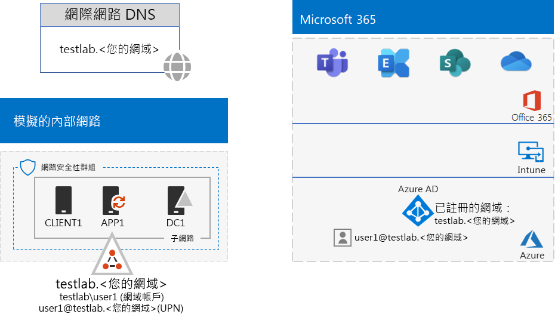
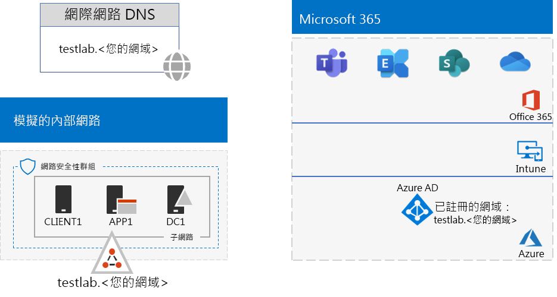

# <a name="password-hash-synchronization-for-your-microsoft-365-test-environment"></a><span data-ttu-id="a642f-103">適用於 Office 365 測試環境的密碼雜湊同步處理</span><span class="sxs-lookup"><span data-stu-id="a642f-103">Password hash synchronization for your Microsoft 365 test environment</span></span>

<span data-ttu-id="a642f-104">*此測試實驗室指南可用於 enterprise 和 Office 365 企業版測試環境的 Microsoft 365。*</span><span class="sxs-lookup"><span data-stu-id="a642f-104">*This Test Lab Guide can be used for both Microsoft 365 for enterprise and Office 365 Enterprise test environments.*</span></span>

<span data-ttu-id="a642f-105">許多組織使用 Azure AD Connect 和密碼雜湊同步處理，將其內部部署 Active Directory Domain Services (AD DS) 樹系中的帳戶集同步處理至 Microsoft 365 訂閱的 Azure AD 租用戶帳戶集。</span><span class="sxs-lookup"><span data-stu-id="a642f-105">Many organizations use Azure AD Connect and password hash synchronization to synchronize the set of accounts in their on-premises Active Directory Domain Services (AD DS) forest to the set of accounts in the Azure AD tenant of their Microsoft 365 subscription.</span></span> 

<span data-ttu-id="a642f-106">本文說明如何在 Microsoft 365 測試環境中新增密碼雜湊同步處理，這會產生下列設定：</span><span class="sxs-lookup"><span data-stu-id="a642f-106">This article describes how you can add password hash synchronization to your Microsoft 365 test environment, which results in this configuration:</span></span>
  

  
<span data-ttu-id="a642f-108">設定此測試環境包括三個階段：</span><span class="sxs-lookup"><span data-stu-id="a642f-108">Setting up this test environment involves three phases:</span></span>
- [<span data-ttu-id="a642f-109">階段 1：建立 Microsoft 365 模擬企業測試環境</span><span class="sxs-lookup"><span data-stu-id="a642f-109">Phase 1: Create the Microsoft 365 simulated enterprise test environment</span></span>](#phase-1-create-the-microsoft-365-simulated-enterprise-test-environment)
- [<span data-ttu-id="a642f-110">階段 2：建立及註冊 testlab 網域</span><span class="sxs-lookup"><span data-stu-id="a642f-110">Phase 2: Create and register the testlab domain</span></span>](#phase-2-create-and-register-the-testlab-domain)
- [<span data-ttu-id="a642f-111">階段 3：在 APP1 上安裝 Azure AD Connect</span><span class="sxs-lookup"><span data-stu-id="a642f-111">Phase 3: Install Azure AD Connect on APP1</span></span>](#phase-3-install-azure-ad-connect-on-app1)
    
> [!TIP]
> <span data-ttu-id="a642f-112">如需適用于企業測試實驗室指南堆疊的 Microsoft 365 中的所有文章的視覺對應，請移至[Microsoft 365 for enterprise test lab guide stack](../downloads/Microsoft365EnterpriseTLGStack.pdf)。</span><span class="sxs-lookup"><span data-stu-id="a642f-112">For a visual map to all the articles in the Microsoft 365 for enterprise Test Lab Guide stack, go to [Microsoft 365 for enterprise Test Lab Guide Stack](../downloads/Microsoft365EnterpriseTLGStack.pdf).</span></span>
  
## <a name="phase-1-create-the-microsoft-365-simulated-enterprise-test-environment"></a><span data-ttu-id="a642f-113">階段 1：建立 Microsoft 365 模擬企業測試環境</span><span class="sxs-lookup"><span data-stu-id="a642f-113">Phase 1: Create the Microsoft 365 simulated enterprise test environment</span></span>

<span data-ttu-id="a642f-114">依照[模擬企業基本設定的 Microsoft 365](simulated-ent-base-configuration-microsoft-365-enterprise.md)中的指示進行。</span><span class="sxs-lookup"><span data-stu-id="a642f-114">Follow the instructions in [simulated enterprise base configuration for Microsoft 365](simulated-ent-base-configuration-microsoft-365-enterprise.md).</span></span> <span data-ttu-id="a642f-115">您產生的設定如下所示：</span><span class="sxs-lookup"><span data-stu-id="a642f-115">Your resulting configuration looks like this:</span></span>
  

  
<span data-ttu-id="a642f-117">此組態包含：</span><span class="sxs-lookup"><span data-stu-id="a642f-117">This configuration consists of:</span></span>
  
- <span data-ttu-id="a642f-118">Microsoft 365 E5 試用版或付費訂閱。</span><span class="sxs-lookup"><span data-stu-id="a642f-118">A Microsoft 365 E5 trial or paid subscription.</span></span>
- <span data-ttu-id="a642f-119">簡化的組織內部網路連接至網際網路，由 Azure 虛擬網路中的 DC1、APP1 和 CLIENT1 虛擬機器所組成。</span><span class="sxs-lookup"><span data-stu-id="a642f-119">A simplified organization intranet connected to the internet, consisting of the DC1, APP1, and CLIENT1 virtual machines in an Azure virtual network.</span></span> <span data-ttu-id="a642f-120">DC1 是 testlab 的網域控制站。 <您的 *公用功能變數名稱*> AD DS 網域。</span><span class="sxs-lookup"><span data-stu-id="a642f-120">DC1 is a domain controller for the testlab.<*your public domain name*> AD DS domain.</span></span>

## <a name="phase-2-create-and-register-the-testlab-domain"></a><span data-ttu-id="a642f-121">階段 2：建立及註冊 testlab 網域</span><span class="sxs-lookup"><span data-stu-id="a642f-121">Phase 2: Create and register the testlab domain</span></span>

<span data-ttu-id="a642f-122">在這個階段中，新增公用 DNS 網域，然後將其新增至您的訂閱。</span><span class="sxs-lookup"><span data-stu-id="a642f-122">In this phase, add a public DNS domain, and then add it to your subscription.</span></span>

<span data-ttu-id="a642f-123">首先，請與您的公用 DNS 註冊提供者合作，以根據您目前的功能變數名稱建立新的公用 DNS 功能變數名稱，然後將其新增至您的訂閱。</span><span class="sxs-lookup"><span data-stu-id="a642f-123">First, work with your public DNS registration provider to create a new public DNS domain name that's based on your current domain name, and then add it to your subscription.</span></span> <span data-ttu-id="a642f-124">建議使用 name \**testlab <*您的公用網域\* >\*\*。</span><span class="sxs-lookup"><span data-stu-id="a642f-124">We recommend using the name **testlab.<*your public domain*>**.</span></span> <span data-ttu-id="a642f-125">例如，如果您的公用功能變數名稱是 **<span>contoso</span>.com**，請新增 public domain name： **<span>testlab</span>. contoso.com**。</span><span class="sxs-lookup"><span data-stu-id="a642f-125">For example, if your public domain name is **<span>contoso</span>.com**, add the public domain name: **<span>testlab</span>.contoso.com**.</span></span>
  
<span data-ttu-id="a642f-126">接下來，透過網域註冊程式，將 **<testlab *您的公用網域* >** 網域新增至 Microsoft 365 試用或付費訂閱。</span><span class="sxs-lookup"><span data-stu-id="a642f-126">Next, add the **testlab.<*your public domain*>** domain to your Microsoft 365 trial or paid subscription by going through the domain registration process.</span></span> <span data-ttu-id="a642f-127">這包含在 testlab 中新增額外的 DNS 記錄 **。 <*您的公用網域\* >*\* 網域。</span><span class="sxs-lookup"><span data-stu-id="a642f-127">This consists of adding additional DNS records to the **testlab.<*your public domain*>** domain.</span></span> <span data-ttu-id="a642f-128">如需詳細資訊，請參閱[Add a domain to Microsoft 365](../admin/setup/add-domain.md)。</span><span class="sxs-lookup"><span data-stu-id="a642f-128">For more information, see [Add a domain to Microsoft 365](../admin/setup/add-domain.md).</span></span>

<span data-ttu-id="a642f-129">您產生的設定如下所示：</span><span class="sxs-lookup"><span data-stu-id="a642f-129">Your resulting configuration looks like this:</span></span>
  

  
<span data-ttu-id="a642f-131">此組態包含：</span><span class="sxs-lookup"><span data-stu-id="a642f-131">This configuration consists of:</span></span>

- <span data-ttu-id="a642f-132">使用 DNS 網域 testlab Microsoft 365 E5 試用版或付費訂閱。 <*您的公用功能變數名稱*> 已註冊。</span><span class="sxs-lookup"><span data-stu-id="a642f-132">A Microsoft 365 E5 trial or paid subscription with the DNS domain testlab.<*your public domain name*> registered.</span></span>
- <span data-ttu-id="a642f-133">簡化的組織內部網路連接至網際網路，由 Azure 虛擬網路子網上的 DC1、APP1 和 CLIENT1 虛擬機器所組成。</span><span class="sxs-lookup"><span data-stu-id="a642f-133">A simplified organization intranet connected to the internet, consisting of the DC1, APP1, and CLIENT1 virtual machines on a subnet of an Azure virtual network.</span></span>

<span data-ttu-id="a642f-134">請注意，testlab <*您的公用功能變數名稱*> 現在如下：</span><span class="sxs-lookup"><span data-stu-id="a642f-134">Notice how the testlab.<*your public domain name*> is now:</span></span>

- <span data-ttu-id="a642f-135">由公用 DNS 記錄支援。</span><span class="sxs-lookup"><span data-stu-id="a642f-135">Supported by public DNS records.</span></span>
- <span data-ttu-id="a642f-136">已在您的 Microsoft 365 訂閱中註冊。</span><span class="sxs-lookup"><span data-stu-id="a642f-136">Registered in your Microsoft 365 subscriptions.</span></span>
- <span data-ttu-id="a642f-137">模擬內部網路上的 AD DS 網域。</span><span class="sxs-lookup"><span data-stu-id="a642f-137">The AD DS domain on your simulated intranet.</span></span>
     
## <a name="phase-3-install-azure-ad-connect-on-app1"></a><span data-ttu-id="a642f-138">階段 3：在 APP1 上安裝 Azure AD Connect</span><span class="sxs-lookup"><span data-stu-id="a642f-138">Phase 3: Install Azure AD Connect on APP1</span></span>

<span data-ttu-id="a642f-139">在這個階段中，請在 APP1 上安裝及設定 Azure AD 連線工具，然後驗證它是否運作正常。</span><span class="sxs-lookup"><span data-stu-id="a642f-139">In this phase, install and configure the Azure AD Connect tool on APP1, and then verify that it works.</span></span>
  
<span data-ttu-id="a642f-140">首先，在 APP1 上安裝及設定 Azure AD 連線。</span><span class="sxs-lookup"><span data-stu-id="a642f-140">First, install and configure Azure AD Connect on APP1.</span></span>

1. <span data-ttu-id="a642f-141">從 [Azure 入口網站](https://portal.azure.com)，以您的全域管理員帳戶登入，然後以 TESTLAB\\User1 帳戶連線到 APP1。</span><span class="sxs-lookup"><span data-stu-id="a642f-141">From the [Azure portal](https://portal.azure.com), sign in with your global administrator account, and then connect to APP1 with the TESTLAB\\User1 account.</span></span>
    
2. <span data-ttu-id="a642f-142">從 APP1 的桌面，開啟系統管理員層級 Windows PowerShell 命令提示字元，然後執行下列命令以停用 Internet Explorer 增強的安全性：</span><span class="sxs-lookup"><span data-stu-id="a642f-142">From the desktop of APP1, open an administrator-level Windows PowerShell command prompt, and then run these commands to disable Internet Explorer Enhanced Security:</span></span>
    
   ```powershell
   Set-ItemProperty -Path "HKLM:\SOFTWARE\Microsoft\Active Setup\Installed Components\{A509B1A7-37EF-4b3f-8CFC-4F3A74704073}" -Name "IsInstalled" -Value 0
   Set-ItemProperty -Path "HKLM:\SOFTWARE\Microsoft\Active Setup\Installed Components\{A509B1A8-37EF-4b3f-8CFC-4F3A74704073}" -Name "IsInstalled" -Value 0
   Stop-Process -Name Explorer -Force
   ```

3. <span data-ttu-id="a642f-143">從工作列中，選取 [ **Internet Explorer** ]，然後移至 [https://aka.ms/aadconnect](https://aka.ms/aadconnect) 。</span><span class="sxs-lookup"><span data-stu-id="a642f-143">From the taskbar, select **Internet Explorer** and go to [https://aka.ms/aadconnect](https://aka.ms/aadconnect).</span></span>
    
4. <span data-ttu-id="a642f-144">在 [Microsoft Azure Active Directory 連線] 頁面上，選取 [**下載**]，然後選取 [**執行**]。</span><span class="sxs-lookup"><span data-stu-id="a642f-144">On the Microsoft Azure Active Directory Connect page, select **Download**, and then select **Run**.</span></span>
    
5. <span data-ttu-id="a642f-145">在 [**歡迎使用 Azure AD 連線**] 頁面上，選取 [**我同意**]，然後選取 [**繼續**]。</span><span class="sxs-lookup"><span data-stu-id="a642f-145">On the **Welcome to Azure AD Connect** page, select **I agree**, and then select **Continue**.</span></span>
    
6. <span data-ttu-id="a642f-146">在 [ **Express 設定**] 頁面上，選取 [**使用快速設定**]。</span><span class="sxs-lookup"><span data-stu-id="a642f-146">On the **Express Settings** page, select **Use express settings**.</span></span>
    
7. <span data-ttu-id="a642f-147">在 [**連線至 Azure AD** ] 頁面上，在 [使用者名稱] 中輸入全域管理員帳戶名稱 **，** 在 [**密碼**] 中輸入其密碼，然後選取 **[下一步]**。</span><span class="sxs-lookup"><span data-stu-id="a642f-147">On the **Connect to Azure AD** page, enter your global administrator account name in **Username,** enter its password in **Password**, and then select **Next**.</span></span>
    
8. <span data-ttu-id="a642f-148">在 [**連線到 AD DS** ] 頁面上，輸入 [ **TESTLAB \\ User1** in **Username]，** 在 [**密碼**] 中輸入密碼，然後選取 **[下一步]**。</span><span class="sxs-lookup"><span data-stu-id="a642f-148">On the **Connect to AD DS** page, enter **TESTLAB\\User1** in **Username,** enter its password in **Password**, and then select **Next**.</span></span>
    
9. <span data-ttu-id="a642f-149">在 [ **準備設定** ] 頁面上，選取 [ **安裝**]。</span><span class="sxs-lookup"><span data-stu-id="a642f-149">On the **Ready to configure** page, select **Install**.</span></span>
    
10. <span data-ttu-id="a642f-150">在 [設定完成] 頁面上 **，選取 [\*\*\*\*結束**]。</span><span class="sxs-lookup"><span data-stu-id="a642f-150">On the **Configuration complete** page, select **Exit**.</span></span>
    
11. <span data-ttu-id="a642f-151">在 Internet Explorer 中，移至 Microsoft 365 系統管理中心 ([https://portal.microsoft.com](https://portal.microsoft.com))。</span><span class="sxs-lookup"><span data-stu-id="a642f-151">In Internet Explorer, go to the Microsoft 365 admin center ([https://portal.microsoft.com](https://portal.microsoft.com)).</span></span>
    
12. <span data-ttu-id="a642f-152">在左功能窗格中，選取 [ **使用者] >**[作用中的使用者]。</span><span class="sxs-lookup"><span data-stu-id="a642f-152">In the left navigation pane, select **Users > Active users**.</span></span>
    
    <span data-ttu-id="a642f-153">請注意名為 **User1** 的帳戶。</span><span class="sxs-lookup"><span data-stu-id="a642f-153">Note the account named **User1**.</span></span> <span data-ttu-id="a642f-154">此帳戶是來自 TESTLAB AD DS 網域，且經過證明目錄同步作業可以運作。</span><span class="sxs-lookup"><span data-stu-id="a642f-154">This account is from the TESTLAB AD DS domain and is proof that directory synchronization has worked.</span></span>
    
13. <span data-ttu-id="a642f-155">選取 **User1** 帳戶，然後選取 [ **授權和應用程式**]。</span><span class="sxs-lookup"><span data-stu-id="a642f-155">Select the **User1** account, and then select **Licenses and apps**.</span></span>
    
14. <span data-ttu-id="a642f-156">在 [**產品授權**] 中，選取您的位置 (必要時) 、停用 **Office 365 E5** 授權，然後啟用 **Microsoft 365 E5** 授權。</span><span class="sxs-lookup"><span data-stu-id="a642f-156">In **Product licenses**, select your location (if needed), disable the **Office 365 E5** license, and then enable the **Microsoft 365 E5** license.</span></span> 

15. <span data-ttu-id="a642f-157">選取頁面底部的 [ **儲存** ]，然後選取 [ **關閉**]。</span><span class="sxs-lookup"><span data-stu-id="a642f-157">Select **Save** at the bottom of the page, and then select **Close**.</span></span>
    
<span data-ttu-id="a642f-158">接下來，使用 user1@testlab 測試登入訂閱的功能 **。 <*您的網功能變數名稱稱\* >*\* 使用者名稱使用者名稱：</span><span class="sxs-lookup"><span data-stu-id="a642f-158">Next, test the ability to sign in to your subscription with the **user1@testlab.<*your domain name*>** user name of the User1 account:</span></span>

1. <span data-ttu-id="a642f-159">從 APP1 登出，然後再次登入，這次指定不同的帳戶。</span><span class="sxs-lookup"><span data-stu-id="a642f-159">From APP1, sign out, and then sign in again, this time specifying a different account.</span></span>

2. <span data-ttu-id="a642f-160">當系統提示您輸入使用者名稱和密碼時，請指定 **user1@testlab。 <*您的功能變數名稱\* >*\* 和 user1 密碼。</span><span class="sxs-lookup"><span data-stu-id="a642f-160">When prompted for a user name and password, specify **user1@testlab.<*your domain name*>** and the User1 password.</span></span> <span data-ttu-id="a642f-161">您應該可以用 User1 的身分成功登入。</span><span class="sxs-lookup"><span data-stu-id="a642f-161">You should successfully sign in as User1.</span></span>
 
<span data-ttu-id="a642f-162">請注意，User1 雖具有 TESTLAB AD DS 網域的網域管理員權限，但並不是全域管理員。</span><span class="sxs-lookup"><span data-stu-id="a642f-162">Notice that although User1 has domain administrator permissions for the TESTLAB AD DS domain, it is not a global administrator.</span></span> <span data-ttu-id="a642f-163">因此，您不會看到 [管理員] 圖示選項。</span><span class="sxs-lookup"><span data-stu-id="a642f-163">Therefore, you will not see the **Admin** icon as an option.</span></span> 

<span data-ttu-id="a642f-164">您產生的設定如下所示：</span><span class="sxs-lookup"><span data-stu-id="a642f-164">Your resulting configuration looks like this:</span></span>


<span data-ttu-id="a642f-166">此組態包含：</span><span class="sxs-lookup"><span data-stu-id="a642f-166">This configuration consists of:</span></span> 
  
- <span data-ttu-id="a642f-167">使用 DNS 網域 TESTLAB Microsoft 365 E5 或 Office 365 E5 試用版或付費訂閱。 <*您的功能變數名稱*> 已註冊。</span><span class="sxs-lookup"><span data-stu-id="a642f-167">Microsoft 365 E5 or Office 365 E5 trial or paid subscriptions with the DNS domain TESTLAB.<*your domain name*> registered.</span></span>
- <span data-ttu-id="a642f-168">簡化的組織內部網路連接至網際網路，由 Azure 虛擬網路子網上的 DC1、APP1 和 CLIENT1 虛擬機器所組成。</span><span class="sxs-lookup"><span data-stu-id="a642f-168">A simplified organization intranet connected to the internet, consisting of the DC1, APP1, and CLIENT1 virtual machines on a subnet of an Azure virtual network.</span></span> <span data-ttu-id="a642f-169">Azure ad 連線會在 APP1 上執行，定期將 TESTLAB AD DS 網域同步處理至 Microsoft 365 訂閱的 Azure AD 租使用者。</span><span class="sxs-lookup"><span data-stu-id="a642f-169">Azure AD Connect runs on APP1 to periodically synchronize the TESTLAB AD DS domain to the Azure AD tenant of your Microsoft 365 subscription.</span></span>
- <span data-ttu-id="a642f-170">TESTLAB AD DS 網域中的 User1 帳戶已經與 Azure AD 租用戶同步處理。</span><span class="sxs-lookup"><span data-stu-id="a642f-170">The User1 account in the TESTLAB  AD DS domain has been synchronized with the Azure AD tenant.</span></span>

## <a name="next-step"></a><span data-ttu-id="a642f-171">下一步</span><span class="sxs-lookup"><span data-stu-id="a642f-171">Next step</span></span>

<span data-ttu-id="a642f-172">瀏覽測試環境中的其他[身分識別](m365-enterprise-test-lab-guides.md#identity)功能。</span><span class="sxs-lookup"><span data-stu-id="a642f-172">Explore additional [identity](m365-enterprise-test-lab-guides.md#identity) features and capabilities in your test environment.</span></span>

## <a name="see-also"></a><span data-ttu-id="a642f-173">另請參閱</span><span class="sxs-lookup"><span data-stu-id="a642f-173">See also</span></span>

[<span data-ttu-id="a642f-174">Microsoft 365 企業版測試實驗室指南</span><span class="sxs-lookup"><span data-stu-id="a642f-174">Microsoft 365 for enterprise Test Lab Guides</span></span>](m365-enterprise-test-lab-guides.md)

[<span data-ttu-id="a642f-175">Microsoft 365 企業版概觀</span><span class="sxs-lookup"><span data-stu-id="a642f-175">Microsoft 365 for enterprise overview</span></span>](microsoft-365-overview.md)

[<span data-ttu-id="a642f-176">Microsoft 365 企業版文件</span><span class="sxs-lookup"><span data-stu-id="a642f-176">Microsoft 365 for enterprise documentation</span></span>](/microsoft-365-enterprise/)