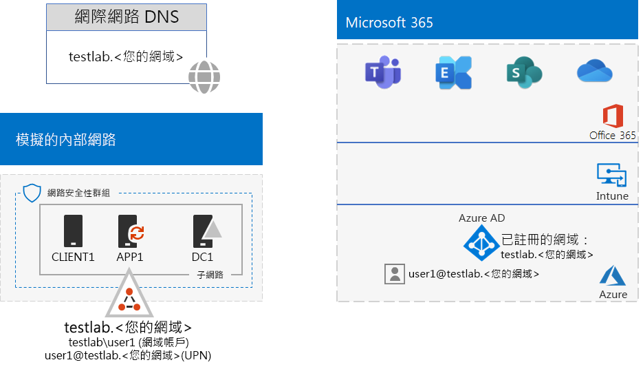

# <a name="identity-and-device-access-prerequisites-for-password-hash-synchronization-in-your-microsoft-365-test-environment"></a><span data-ttu-id="22060-103">身分識別與裝置存取 - 您的 Microsoft 365 測試環境中密碼雜湊同步處理的先決條件</span><span class="sxs-lookup"><span data-stu-id="22060-103">Identity and device access prerequisites for password hash synchronization in your Microsoft 365 test environment</span></span>

<span data-ttu-id="22060-104">*這個測試實驗室指南只能用於 Microsoft 365 企業版測試環境。*</span><span class="sxs-lookup"><span data-stu-id="22060-104">*This Test Lab Guide can only be used for Microsoft 365 Enterprise test environments.*</span></span>

<span data-ttu-id="22060-105">[身分識別與裝置存取組態](microsoft-365-policies-configurations.md)是一組組態和條件式存取原則，用來保護對與 Azure Active Directory (Azure AD) 整合之所有服務的存取，包括 Microsoft 365 企業版中的 Office 365 和 Enterprise Mobility + Security (EMS)。</span><span class="sxs-lookup"><span data-stu-id="22060-105">[Identity and device access configurations](microsoft-365-policies-configurations.md) are a set of configurations and conditional access policies to protect access to all services that are integrated with Azure Active Directory (Azure AD), including Office 365 and Enterprise Mobility + Security (EMS) in Microsoft 365 Enterprise.</span></span>

<span data-ttu-id="22060-106">本文說明如何設定符合[具有密碼雜湊同步處理的 Active Directory 先決條件組態](identity-access-prerequisites.md#prerequisites)需求、用於身分識別與裝置存取的 Microsoft 365 測試環境。</span><span class="sxs-lookup"><span data-stu-id="22060-106">This article describes how to configure a Microsoft 365 test environment that meets the requirements of the [Active Directory with password hash sync prerequisite configuration](identity-access-prerequisites.md#prerequisites) for identity and device access.</span></span>

<span data-ttu-id="22060-107">設定此測試環境有八個階段：</span><span class="sxs-lookup"><span data-stu-id="22060-107">There are eight phases to setting up this test environment:</span></span>

1.  <span data-ttu-id="22060-108">使用密碼雜湊同步處理測試環境建立模擬企業</span><span class="sxs-lookup"><span data-stu-id="22060-108">Create a simulated enterprise with password hash sync test environment</span></span>
2.  <span data-ttu-id="22060-109">設定 Azure AD 無縫單一登入</span><span class="sxs-lookup"><span data-stu-id="22060-109">Configure Azure AD seamless single sign-on</span></span>
3.  <span data-ttu-id="22060-110">設定具名位置</span><span class="sxs-lookup"><span data-stu-id="22060-110">Configure named locations</span></span>
4.  <span data-ttu-id="22060-111">設定密碼回寫</span><span class="sxs-lookup"><span data-stu-id="22060-111">Configure password writeback</span></span>
5.  <span data-ttu-id="22060-112">為所有使用者帳戶設定自助式密碼重設</span><span class="sxs-lookup"><span data-stu-id="22060-112">Configure self-service password reset for all user accounts</span></span>
6.  <span data-ttu-id="22060-113">為所有使用者帳戶設定多重要素驗證</span><span class="sxs-lookup"><span data-stu-id="22060-113">Configure multifactor authentication for all user accounts</span></span>
7.  <span data-ttu-id="22060-114">啟用 Azure AD Identity Protection</span><span class="sxs-lookup"><span data-stu-id="22060-114">Enable Azure AD Identity Protection</span></span>
8.  <span data-ttu-id="22060-115">為 Exchange Online 和商務用 Skype Online 啟用新式驗證</span><span class="sxs-lookup"><span data-stu-id="22060-115">Enable modern authentication for Exchange Online and Skype for Business Online</span></span>

## <a name="phase-1-build-out-your-simulated-enterprise-with-password-hash-sync-microsoft-365-test-environment"></a><span data-ttu-id="22060-116">階段 1：使用密碼雜湊同步處理 Microsoft 365 測試環境建立模擬企業</span><span class="sxs-lookup"><span data-stu-id="22060-116">Phase 1: Build out your simulated enterprise with password hash sync Microsoft 365 test environment</span></span>

<span data-ttu-id="22060-117">遵循[密碼雜湊同步處理](password-hash-sync-m365-ent-test-environment.md)中的指示。</span><span class="sxs-lookup"><span data-stu-id="22060-117">Follow the instructions in [Password hash synchronization](password-hash-sync-m365-ent-test-environment.md).</span></span>
<span data-ttu-id="22060-118">以下是所產生的組態。</span><span class="sxs-lookup"><span data-stu-id="22060-118">Here is the resulting configuration.</span></span>


 
## <a name="phase-2-configure-azure-ad-seamless-single-sign-on"></a><span data-ttu-id="22060-120">階段 2：設定 Azure AD 無縫單一登入</span><span class="sxs-lookup"><span data-stu-id="22060-120">Phase 2: Configure Azure AD seamless single sign-on</span></span>

<span data-ttu-id="22060-121">遵循[測試實驗室指南 Azure AD 無縫單一登入階段 2](single-sign-on-m365-ent-test-environment.md#phase-2-configure-azure-ad-connect-on-app1-for-azure-ad-seamless-sso) 中的指示。</span><span class="sxs-lookup"><span data-stu-id="22060-121">Follow the instructions in [Phase 2 of the Azure AD Seamless Single Sign-on Test Lab Guide](single-sign-on-m365-ent-test-environment.md#phase-2-configure-azure-ad-connect-on-app1-for-azure-ad-seamless-sso).</span></span>

## <a name="phase-3-configure-named-locations"></a><span data-ttu-id="22060-122">階段 3：設定具名位置</span><span class="sxs-lookup"><span data-stu-id="22060-122">Phase 3: Configure named locations</span></span>

<span data-ttu-id="22060-123">首先，判斷組織使用的公用 IP 位址或位址範圍。</span><span class="sxs-lookup"><span data-stu-id="22060-123">First, determine the public IP addresses or address ranges used by your organization.</span></span>

<span data-ttu-id="22060-124">接下來，遵循[在 Azure Active Directory 中設定具名位置](https://docs.microsoft.com/azure/active-directory/reports-monitoring/quickstart-configure-named-locations)中的指示，新增位址或位址範圍做為具名位置。</span><span class="sxs-lookup"><span data-stu-id="22060-124">Next, follow the instructions in [Configure named locations in Azure Active Directory](https://docs.microsoft.com/azure/active-directory/reports-monitoring/quickstart-configure-named-locations) to add the addresses or address ranges as named locations.</span></span> 

## <a name="phase-4-configure-password-writeback"></a><span data-ttu-id="22060-125">階段 4：設定密碼回寫</span><span class="sxs-lookup"><span data-stu-id="22060-125">Phase 4: Configure password writeback</span></span>

<span data-ttu-id="22060-126">遵循[測試實驗室指南密碼回寫階段 2](password-writeback-m365-ent-test-environment.md#phase-2-enable-password-writeback-for-the-testlab-ad-ds-domain) 中的指示。</span><span class="sxs-lookup"><span data-stu-id="22060-126">Follow the instructions in [Phase 2 of the password writeback Test Lab Guide](password-writeback-m365-ent-test-environment.md#phase-2-enable-password-writeback-for-the-testlab-ad-ds-domain).</span></span>

## <a name="phase-5-configure-self-service-password-reset"></a><span data-ttu-id="22060-127">階段 5：啟用自助式密碼重設</span><span class="sxs-lookup"><span data-stu-id="22060-127">Phase 5: Configure self-service password reset</span></span>

<span data-ttu-id="22060-128">遵循[測試實驗室指南密碼重設階段 3](password-reset-m365-ent-test-environment.md#phase-3-configure-and-test-password-reset) 中的指示。</span><span class="sxs-lookup"><span data-stu-id="22060-128">Follow the instructions in [Phase 3 of the password reset Test Lab Guide](password-reset-m365-ent-test-environment.md#phase-3-configure-and-test-password-reset).</span></span> 

<span data-ttu-id="22060-129">為特定 Azure AD 群組中的帳戶啟用重設密碼時，請將下列帳戶新增至**重設密碼**群組：</span><span class="sxs-lookup"><span data-stu-id="22060-129">When enabling password reset for the accounts in a specific Azure AD group, add these accounts to the **Password reset** group:</span></span>

- <span data-ttu-id="22060-130">使用者 2</span><span class="sxs-lookup"><span data-stu-id="22060-130">User 2</span></span>
- <span data-ttu-id="22060-131">使用者 3</span><span class="sxs-lookup"><span data-stu-id="22060-131">User 3</span></span>
- <span data-ttu-id="22060-132">使用者 4</span><span class="sxs-lookup"><span data-stu-id="22060-132">User 4</span></span>
- <span data-ttu-id="22060-133">使用者 5</span><span class="sxs-lookup"><span data-stu-id="22060-133">User 5</span></span>

<span data-ttu-id="22060-134">僅對使用者 2 帳戶測試密碼重設。</span><span class="sxs-lookup"><span data-stu-id="22060-134">Test password reset only for the User 2 account.</span></span>

## <a name="phase-6-configure-multi-factor-authentication"></a><span data-ttu-id="22060-135">階段 6：設定多重要素驗證</span><span class="sxs-lookup"><span data-stu-id="22060-135">Phase 6: Configure multi-factor authentication</span></span>

<span data-ttu-id="22060-136">針對下列使用者帳戶，遵循[測試實驗室指南多重要素驗證階段 2](multi-factor-authentication-microsoft-365-test-environment.md#phase-2-enable-and-test-multi-factor-authentication-for-the-user-2-account) 中的指示：</span><span class="sxs-lookup"><span data-stu-id="22060-136">Follow the instructions in [Phase 2 of the multi-factor authentication Test Lab Guide](multi-factor-authentication-microsoft-365-test-environment.md#phase-2-enable-and-test-multi-factor-authentication-for-the-user-2-account) for the following user accounts:</span></span>

- <span data-ttu-id="22060-137">使用者 2</span><span class="sxs-lookup"><span data-stu-id="22060-137">User 2</span></span>
- <span data-ttu-id="22060-138">使用者 3</span><span class="sxs-lookup"><span data-stu-id="22060-138">User 3</span></span>
- <span data-ttu-id="22060-139">使用者 4</span><span class="sxs-lookup"><span data-stu-id="22060-139">User 4</span></span>
- <span data-ttu-id="22060-140">使用者 5</span><span class="sxs-lookup"><span data-stu-id="22060-140">User 5</span></span>

<span data-ttu-id="22060-141">僅針對使用者 2 帳戶測試多重要素驗證。</span><span class="sxs-lookup"><span data-stu-id="22060-141">Test multi-factor authentication only for the User 2 account.</span></span>

## <a name="phase-7-enable-azure-ad-identity-protection"></a><span data-ttu-id="22060-142">階段 7：啟用 Azure AD Identity Protection</span><span class="sxs-lookup"><span data-stu-id="22060-142">Phase 7: Enable Azure AD Identity Protection</span></span>

<span data-ttu-id="22060-143">遵循[測試實驗室指南 Azure AD Identity Protection 階段 2](azure-ad-identity-protection-microsoft-365-test-environment.md#phase-2-use-azure-ad-identity-protection) 中的指示。</span><span class="sxs-lookup"><span data-stu-id="22060-143">Follow the instructions in [Phase 2 of the Azure AD Identity Protection Test Lab Guide](azure-ad-identity-protection-microsoft-365-test-environment.md#phase-2-use-azure-ad-identity-protection).</span></span> 

## <a name="phase-8-enable-modern-authentication-for-exchange-online-and-skype-for-business-online"></a><span data-ttu-id="22060-144">階段 8：為 Exchange Online 和商務用 Skype Online 啟用新式驗證</span><span class="sxs-lookup"><span data-stu-id="22060-144">Phase 8: Enable modern authentication for Exchange Online and Skype for Business Online</span></span>

<span data-ttu-id="22060-145">若為 Exchange Online，請遵循[這些指示](https://docs.microsoft.com/Exchange/clients-and-mobile-in-exchange-online/enable-or-disable-modern-authentication-in-exchange-online#enable-or-disable-modern-authentication-in-exchange-online-for-client-connections-in-outlook-2013-or-later)。</span><span class="sxs-lookup"><span data-stu-id="22060-145">For Exchange Online, follow [these instructions](https://docs.microsoft.com/Exchange/clients-and-mobile-in-exchange-online/enable-or-disable-modern-authentication-in-exchange-online#enable-or-disable-modern-authentication-in-exchange-online-for-client-connections-in-outlook-2013-or-later).</span></span> 

<span data-ttu-id="22060-146">若為商務用 Skype Online：</span><span class="sxs-lookup"><span data-stu-id="22060-146">For Skype for Business Online:</span></span>

1. <span data-ttu-id="22060-147">連線到[商務用 Skype Online](https://docs.microsoft.com/SkypeForBusiness/set-up-your-computer-for-windows-powershell/set-up-your-computer-for-windows-powershell)。</span><span class="sxs-lookup"><span data-stu-id="22060-147">Connect to [Skype for Business Online](https://docs.microsoft.com/SkypeForBusiness/set-up-your-computer-for-windows-powershell/set-up-your-computer-for-windows-powershell).</span></span>

2. <span data-ttu-id="22060-148">執行此命令。</span><span class="sxs-lookup"><span data-stu-id="22060-148">Run this command.</span></span>

  ```powershell
  Set-CsOAuthConfiguration -ClientAdalAuthOverride Allowed
  ```

3. <span data-ttu-id="22060-149">使用此命令以確認變更是否成功。</span><span class="sxs-lookup"><span data-stu-id="22060-149">Verify that the change was successful with this command.</span></span>

  ```powershell
  Get-CsOAuthConfiguration
  ```

<span data-ttu-id="22060-150">結果會是符合[具有密碼雜湊同步處理的 Active Directory 先決條件組態](identity-access-prerequisites.md#prerequisites)需求、用於身分識別與裝置存取的測試環境。</span><span class="sxs-lookup"><span data-stu-id="22060-150">The result is a test environment that meets the requirements of the [Active Directory with password hash sync prerequisite configuration](identity-access-prerequisites.md#prerequisites) for identity and device access.</span></span> 

## <a name="next-step"></a><span data-ttu-id="22060-151">下一步</span><span class="sxs-lookup"><span data-stu-id="22060-151">Next step</span></span>

<span data-ttu-id="22060-152">使用[一般身分識別與裝置存取原則](identity-access-policies.md)來設定根據先決條件建置的原則，並保護身分識別與裝置。</span><span class="sxs-lookup"><span data-stu-id="22060-152">Use [Common identity and device access policies](identity-access-policies.md) to configure the policies that build on the prerequisites and protect identities and devices.</span></span>

## <a name="see-also"></a><span data-ttu-id="22060-153">請參閱</span><span class="sxs-lookup"><span data-stu-id="22060-153">See also</span></span>

[<span data-ttu-id="22060-154">其他身分識別測試實驗室指南</span><span class="sxs-lookup"><span data-stu-id="22060-154">Additional identity Test Lab Guides</span></span>](m365-enterprise-test-lab-guides.md#identity)

[<span data-ttu-id="22060-155">階段 2：身分識別</span><span class="sxs-lookup"><span data-stu-id="22060-155">Phase 2: Identity</span></span>](identity-infrastructure.md)

[<span data-ttu-id="22060-156">Microsoft 365 企業版測試實驗室指南</span><span class="sxs-lookup"><span data-stu-id="22060-156">Microsoft 365 Enterprise Test Lab Guides</span></span>](m365-enterprise-test-lab-guides.md)

[<span data-ttu-id="22060-157">Microsoft 365 企業版部署</span><span class="sxs-lookup"><span data-stu-id="22060-157">Microsoft 365 Enterprise deployment</span></span>](deploy-microsoft-365-enterprise.md)

[<span data-ttu-id="22060-158">Microsoft 365 企業版文件</span><span class="sxs-lookup"><span data-stu-id="22060-158">Microsoft 365 Enterprise documentation</span></span>](https://docs.microsoft.com/microsoft-365-enterprise/)
