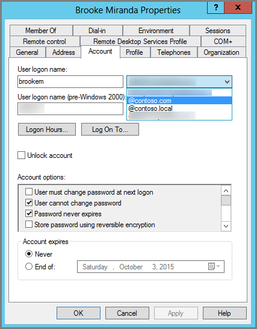

# <a name="prepare-a-non-routable-domain-for-directory-synchronization"></a>準備無法路由傳送的網域，以用於目錄同步處理

當您同步處理內部部署目錄與 Microsoft 365 時，您必須在 Azure Active Directory (Azure AD) 中有一個已驗證的網域。 只會同步處理與內部部署 Active Directory 網域服務 (AD DS) 網域相關聯 (Upn) 的使用者主體名稱。 不過，任何包含無法路由之網域的 UPN （如 "local" (範例： billa@contoso local) ）將同步處理至 onmicrosoft.com 域 (範例： billa@contoso.onmicrosoft.com) 。 

如果您目前在 AD DS 中為您的使用者帳戶使用 "local" 網域，建議您將其變更為使用已驗證的網域（例如 billa@contoso.com），以便與您的 Microsoft 365 網域正確同步。
  
## <a name="what-if-i-only-have-a-local-on-premises-domain"></a>如果我只有「內部」內部部署網域，該怎麼辦？

您可以使用 Azure AD Connect，將 AD DS 同步處理至您的 Microsoft 365 租使用者的 Azure AD 租使用者。 如需詳細資訊，請參閱 [將內部部署身分識別與 AZURE AD 整合](/azure/architecture/reference-architectures/identity/azure-ad)。
  
Azure AD Connect 會同步處理您的使用者的 UPN 和密碼，讓使用者可以使用內部部署所使用的相同認證來登入。 不過，Azure AD Connect 只會同步處理使用者至 Microsoft 365 所驗證的網域。 這表示網域也會由 Azure AD 驗證，因為 Microsoft 365 identity 是由 Azure AD 所管理。 換句話說，網域必須是有效的網際網路網域 (例如，.com、org、.net、. us) 。 如果內部 AD DS 只使用不可路由的網域 (例如 "local" ) ，這可能會比對您的 Microsoft 365 租使用者驗證的網域。 您可以在內部部署 AD DS 中變更您的主要網域，或是新增一或多個 UPN 尾碼，以修正此問題。
  
### <a name="change-your-primary-domain"></a>變更您的主要網域

將您的主要網域變更為您已在 Microsoft 365 中驗證的網域，例如，contoso.com。 每個具有網域 contoso 的使用者都會更新為 contoso.com。 不過，這是非常相關的程式，但下一節將說明更簡單的解決方案。
  
### <a name="add-upn-suffixes-and-update-your-users-to-them"></a>新增 UPN 尾碼並更新您的使用者

您可以在 AD DS 中註冊新的 UPN 尾碼或尾碼，以符合您在 Microsoft 365 中驗證的網域 (或) 網域，來解決「本機」問題。 在您註冊新的尾碼後，您可以更新使用者 Upn，將 "local" 取代為新的功能變數名稱，例如，讓使用者帳戶看起來像是 billa@contoso.com。
  
在您更新 Upn 以使用已驗證的網域之後，即可將您的內部部署 AD DS 與 Microsoft 365 進行同步處理。
  
#### <a name="step-1-add-the-new-upn-suffix"></a>步驟1：新增 UPN 尾碼 * *
  
1. 在 AD DS 網域控制站的 [伺服器管理員] 中，選擇 [ **工具**] [ \> **Active Directory 網域及信任**]。
    
    **或者，如果您沒有 Windows Server 2012**
    
    按 **Windows 鍵 + R** 以開啟 [ **執行** ] 對話方塊，然後在 [services.msc] 中輸入，然後選擇 **[確定]**。
    
    ![選擇 [Active Directory 網域及信任]。](../media/46b6e007-9741-44af-8517-6f682e0ac974.png)
  
2. 在 [ **Active Directory 網域及信任** ] 視窗中，以滑鼠右鍵按一下 [ **active Directory 網域及信任**]，然後選擇 [ **屬性**]。
    
    ![以滑鼠右鍵按一下 [Active Directory 網域及信任]，然後選擇 [屬性]。](../media/39d20812-ffb5-4ba9-8d7b-477377ac360d.png)
  
3. 在 [ **UPN 尾碼** ] 索引標籤的 [ **替代的 upn 尾碼** ] 方塊中，輸入新的 upn 尾碼或尾碼， **然後選擇 [新增]** \> ****。
    
    
  
    完成新增尾碼後，請選擇 **[確定]** 。 
    
 #### <a name="step-2-change-the-upn-suffix-for-existing-users"></a>步驟2：變更現有使用者的 UPN 尾碼
  
1. 在 AD DS 網域控制站的 [伺服器管理員] 中，選擇 [ **工具**] [ \> **Active Directory 使用者和電腦**]。
    
    **或者，如果您沒有 Windows Server 2012**
    
    按 **Windows 鍵 + R** 以開啟 [**執行**] 對話方塊，然後在 [dsa.msc] 中輸入，然後按一下 **[確定**]。
    
2. 選取使用者，以滑鼠右鍵按一下，然後選擇 [ **屬性**]。
    
3. 在 [ **帳戶** ] 索引標籤的 [UPN 尾碼] 下拉式清單中，選擇新的 UPN 尾碼，然後選擇 **[確定]**。
    
    
  
4. 針對每位使用者完成這些步驟。
    
   
### <a name="use-powershell-to-change-the-upn-suffix-for-all-of-your-users"></a>使用 PowerShell 變更所有使用者的 UPN 尾碼

如果您有許多使用者帳戶需要更新，使用 PowerShell 會比較容易。 下列範例使用 Cmdlet [microsoft.rtc.management.adconnect.schema.aduser](/previous-versions/windows/it-pro/windows-server-2008-R2-and-2008/ee617241(v=technet.10)) 及 [Set-microsoft.rtc.management.adconnect.schema.aduser](/previous-versions/windows/it-pro/windows-server-2008-R2-and-2008/ee617215(v=technet.10)) ，將所有 CONTOSO。在 AD DS 中的 contoso.com 的本機尾碼。 

例如，您可以執行下列 PowerShell 命令，將所有 contoso。本機尾碼更新為 contoso.com：
    
  ```powershell
  $LocalUsers = Get-ADUser -Filter "UserPrincipalName -like '*contoso.local'" -Properties userPrincipalName -ResultSetSize $null
  $LocalUsers | foreach {$newUpn = $_.UserPrincipalName.Replace("@contoso.local","@contoso.com"); $_ | Set-ADUser -UserPrincipalName $newUpn}
  ```

請參閱 [Active Directory Windows PowerShell 模組](/previous-versions/windows/it-pro/windows-server-2008-R2-and-2008/ee617195(v=technet.10)) ，以深入瞭解在 AD DS 中使用 Windows PowerShell。