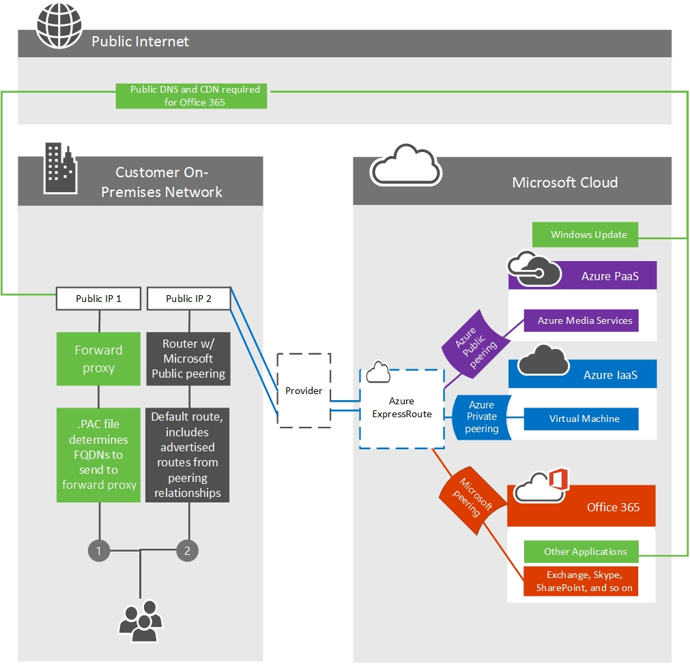

# 使用 Office 365 的 ExpressRoute 進行路由傳送Routing with ExpressRoute for Office 365

*本文適用於 Microsoft 365 企業版和 Office 365 企業版。**This article applies to both Microsoft 365 Enterprise and Office 365 Enterprise.*

若要使用 Azure ExpressRoute 正確瞭解使用 Office 365 的路由流量，您需要有牢固的核心[ExpressRoute 路由需求](/azure/expressroute/expressroute-routing)和[ExpressRoute 電路和路由網域](/azure/expressroute/expressroute-circuit-peerings)。To properly understand routing traffic to Office 365 using Azure ExpressRoute, you'll need a firm grasp of the core [ExpressRoute routing requirements](/azure/expressroute/expressroute-routing) and the [ExpressRoute circuits and routing domains](/azure/expressroute/expressroute-circuit-peerings). 這三個元件會將使用 Office 365 客戶的 ExpressRoute 基礎，展示出來。These lay out the fundamentals for using ExpressRoute that Office 365 customers will rely on.
  
您需要瞭解的上述文章中的一些重要專案包括：Some of the key items in the above articles that you'll need to understand include:
  
- ExpressRoute 電路不會對應至特定的實體基礎結構，但是會以 Microsoft 和對等提供者為基礎，在單一對等位置上建立邏輯連接。ExpressRoute circuits aren't mapped to specific physical infrastructure, but are a logical connection made at a single peering location by Microsoft and a peering provider on your behalf.

- ExpressRoute 電路與客戶 s 機碼之間有1:1 對應。There's a 1:1 mapping between an ExpressRoute circuit and a customer s-key.

- 每個電路都可以支援兩個獨立的對等關係 (Azure 私人對等關係，以及 Microsoft 對等) ;Office 365 需要 Microsoft 對等。Each circuit can support two independent peering relationships (Azure Private peering, and Microsoft peering); Office 365 requires Microsoft peering.

- 每個電路都有固定的頻寬，可在所有對等關係間共用。Each circuit has a fixed bandwidth that is shared across all peering relationships.

- 任何公開的 IPv4 位址及公開成 ExpressRoute 電路所用的號碼，都必須驗證為您所擁有，或由位址範圍的擁有者獨佔指派給您。Any public IPv4 addresses and public AS numbers that will be used for the ExpressRoute circuit must be validated as being owned by you, or assigned exclusively to you by the owner of the address range.

- 虛擬 ExpressRoute 電路是全域性冗余的，將遵循標準的 BGP 路由慣例。The virtual ExpressRoute circuits are redundant globally and will follow standard BGP routing practices. 這就是我們在主動/主動設定中對提供者每次出口的兩個實體電路的建議。This is why we recommend two physical circuits per egress to your provider in an active/active configuration.

如需支援服務、成本及設定詳細資訊的詳細資訊，請參閱 [FAQ 頁面](/azure/expressroute/expressroute-faqs) 。See the [FAQ page](/azure/expressroute/expressroute-faqs) for more information on services supported, costs, and configuration details. 如需提供 Microsoft 對等支援的連線提供者清單資訊，請參閱 [ExpressRoute 位置文章](/azure/expressroute/expressroute-locations) 。See the [ExpressRoute locations article](/azure/expressroute/expressroute-locations) for information on the list of connectivity providers offering Microsoft peering support. 我們也針對通道9上的 Office 365 訓練系列記錄了10部分的[Azure ExpressRoute](https://channel9.msdn.com/series/aer) ，以協助說明更徹底的概念。We've also recorded a 10-part [Azure ExpressRoute for Office 365 Training](https://channel9.msdn.com/series/aer) series on Channel 9 to help explain the concepts more thoroughly.
  
## 確保路由對稱性Ensuring route symmetry

在網際網路和 ExpressRoute 都可以存取 Office 365 前端伺服器。The Office 365 front-end servers are accessible on both the Internet and ExpressRoute. 當兩者皆供使用時，這些伺服器將優先使用 ExpressRoute 的環路路由回內部部署。These servers will prefer to route back to on-premises over ExpressRoute circuits when both are available. 因此，如果您的網路流量傾向于透過網際網路電路路由傳送，可能會有路由不對稱的可能性。Because of this, there is a possibility of route asymmetry if traffic from your network prefers to route over your Internet circuits. 非對稱路由是問題，因為執行狀態封包檢查的裝置可能會封鎖遵循與接下來輸出封包不同路徑的傳回流量。Asymmetrical routes are a problem because devices that perform stateful packet inspection can block return traffic that follows a different path than the outbound packets followed.
  
不論您是透過網際網路還是 ExpressRoute 發起 Office 365 的連線，來源都必須是可公開路由的位址。Regardless of whether you initiate a connection to Office 365 over the Internet or ExpressRoute, the source must be a publicly routable address. 與許多客戶直接搭配使用 Microsoft 時，具有可在客戶之間重複使用的私人位址。With many customers peering directly with Microsoft, having private addresses where duplication is possible between customers isn't feasible.
  
在下列情況下，將會啟動從 Office 365 到您的內部部署網路的通訊。The following are scenarios where communications from Office 365 to your on-premises network will be initiated. 為了簡化您的網路設計，我們建議透過網際網路路徑路由傳送。To simplify your network design, we recommend routing these over the Internet path.
  
- SMTP 服務，例如從 Exchange Online 租使用者傳送至內部部署主機或 SharePoint 線上郵件從 SharePoint 線上傳送至內部部署主機的郵件。SMTP services such as mail from an Exchange Online tenant to an on-premises host or SharePoint Online Mail sent from SharePoint Online to an on-premises host. 在 Microsoft 的網路中，SMTP 通訊協定的使用方式，與透過 ExpressRoute 線路共用的路由首碼及透過 ExpressRoute 公佈內部部署 SMTP 伺服器的情況相比，將會導致這些其他服務失敗。SMTP protocol is used more broadly within Microsoft's network than the route prefixes shared over ExpressRoute circuits and advertising on-premises SMTP servers over ExpressRoute will cause failures with these other services.

- 在密碼驗證期間用於登入的 ADFS。ADFS during password validation for signing in.

- [Exchange Server 混合式部署](/exchange/exchange-hybrid)。[Exchange Server Hybrid deployments](/exchange/exchange-hybrid).

- [SharePoint 同盟混合式搜尋](/SharePoint/hybrid/display-hybrid-federated-search-results-in-sharepoint-online)。[SharePoint federated hybrid search](/SharePoint/hybrid/display-hybrid-federated-search-results-in-sharepoint-online).

- [SharePoint 混合 BCS](/SharePoint/hybrid/deploy-a-business-connectivity-services-hybrid-solution)。[SharePoint hybrid BCS](/SharePoint/hybrid/deploy-a-business-connectivity-services-hybrid-solution).

- [商務用 Skype 混合](/skypeforbusiness/hybrid/plan-hybrid-connectivity?bc=%2fSkypeForBusiness%2fbreadcrumb%2ftoc.json&toc=%2fSkypeForBusiness%2ftoc.json)式和/或[商務用 Skype 同盟](/office365/servicedescriptions/skype-for-business-online-service-description/skype-for-business-online-features)。[Skype for Business hybrid](/skypeforbusiness/hybrid/plan-hybrid-connectivity?bc=%2fSkypeForBusiness%2fbreadcrumb%2ftoc.json&toc=%2fSkypeForBusiness%2ftoc.json) and/or [Skype for Business federation](/office365/servicedescriptions/skype-for-business-online-service-description/skype-for-business-online-features).

- [商務用 Skype Cloud Connector](/skypeforbusiness/skype-for-business-hybrid-solutions/plan-your-phone-system-cloud-pbx-solution/plan-skype-for-business-cloud-connector-edition)。[Skype for Business Cloud Connector](/skypeforbusiness/skype-for-business-hybrid-solutions/plan-your-phone-system-cloud-pbx-solution/plan-skype-for-business-cloud-connector-edition).

若要讓 Microsoft 路由回您的網路以取得這些雙向流量流量，您的內部部署裝置的 BGP 路由必須與 Microsoft 共用。For Microsoft to route back to your network for these bi-directional traffic flows, the BGP routes to your on-premises devices must be shared with Microsoft. 當您透過 ExpressRoute 通告路由首碼給 Microsoft 時，您應該遵循下列最佳作法：When you advertise route prefixes to Microsoft over ExpressRoute, you should follow these best practices:

1) 請勿將相同的公用 IP 位址路由前置詞通告給公用網際網路和 ExpressRoute。Do not advertise the same public IP Address route prefix to the public Internet and over ExpressRoute. 建議您對 Microsoft over ExpressRoute 的 IP BGP 路由首碼，來自根本不會通告網際網路的範圍。It is recommended that the IP BGP Route Prefix advertisements to Microsoft over ExpressRoute are from a range that is not advertised to the internet at all. 若由於可用的 IP 位址空間無法達到此目的，請務必要讓您在 ExpressRoute 上宣告更特定的範圍，而不是任何網際網路電路。If this is not possible to achieve due to the available IP Address space, then it is essential to ensure you advertise a more specific range over ExpressRoute than any internet circuits.

2) 針對每個 ExpressRoute 電路使用個別的 NAT IP 集區，並將其與網際網路電路分開。Use separate NAT IP pools per ExpressRoute circuit and separate to that of your internet circuits.

3) 請注意，任何通告給 Microsoft 的路由會從 Microsoft 網路中的任何伺服器吸引網路流量，而不只是透過 ExpressRoute 對您的網路公佈的路由。Be aware that any route advertised to Microsoft will attract network traffic from any server in Microsoft's network, not only those for which routes are advertised to your network over ExpressRoute. 僅限對路由案例定義及充分瞭解小組的伺服器的宣告路由。Only advertise routes to servers where routing scenarios are defined and well understood by your team. 在網路中每個多個 ExpressRoute 電路宣告個別的 IP 位址路由首碼。Advertise separate IP Address route prefixes at each of multiple ExpressRoute circuits from your network.
  
## 決定哪些應用程式和功能路由傳送 ExpressRouteDeciding which applications and features route over ExpressRoute

當您使用 Microsoft 對等路由網域設定對等關係，並經核准以進行適當存取時，您就可以透過 ExpressRoute 查看所有可用 PaaS 和 SaaS 服務。When you configure a peering relationship using the Microsoft peering routing domain and are approved for the appropriate access, you'll be able to see all PaaS and SaaS services available over ExpressRoute. 針對 ExpressRoute 所設計的 Office 365 服務，可使用[BGP 社區](./bgp-communities-in-expressroute.md)或[路由篩選器](/azure/expressroute/how-to-routefilter-portal)進行管理。The Office 365 services designed for ExpressRoute can be managed with [BGP communities](./bgp-communities-in-expressroute.md) or [route filters](/azure/expressroute/how-to-routefilter-portal).
  
其他應用程式（例如 Office 365 影片）是 Office 365 應用程式;不過，Office 365 影片是由三個不同的元件、入口網站、流式服務和內容傳遞網路組成。Other applications such as Office 365 Video, is an Office 365 application; however, Office 365 Video is comprised of three different components, the portal, the streaming service, and the content delivery network. 入口網站位於 SharePoint Online 內，資料流程服務存在於 Azure 媒體服務內，而內容傳遞網路位於 Azure CDN 內。The portal lives within SharePoint Online, the streaming service lives within Azure Media Services, and the content delivery network lives within the Azure CDN. 下表概述這些元件。The following table outlines these components.

|**元件****Component**|**基礎應用程式****Underlying application**|**包含在 SharePoint 線上 BGP Community 中？****Included in SharePoint Online BGP Community?**|**使用****Use**|
|:-----|:-----|:-----|:-----|
|Office 365影片入口網站Office 365 Video portal    |SharePoint OnlineSharePoint Online    |是Yes    |設定、上傳Configuration, upload    |
|Office 365影片傳送服務Office 365 Video streaming service    |Azure 媒體服務Azure Media Services    |否No    |流式處理服務，可供 CDN 中無法使用影片Streaming service, used in the event the video is unavailable from the CDN    |
|Office 365影片內容傳遞網路Office 365 Video content delivery network    |Azure CDNAzure CDN    |否No    |影片的主要來源下載/流式處理。Primary source of video download/streaming. [深入瞭解 Office 365 的視頻網路](https://support.office.com/article/Office-365-Video-networking-Frequently-Asked-Questions-FAQ-2bed67a1-4052-49ff-a4ce-b7e6530eb98e)。[Learn more about Office 365 video networking](https://support.office.com/article/Office-365-Video-networking-Frequently-Asked-Questions-FAQ-2bed67a1-4052-49ff-a4ce-b7e6530eb98e).    |

使用 Microsoft 對等每個可用的 Office 365 功能，都依應用程式類型和 FQDN 列在[Office 365 端點文章](https://support.office.com/article/Office-365-URLs-and-IP-address-ranges-8548a211-3fe7-47cb-abb1-355ea5aa88a2)中。Each of the Office 365 features that are available using Microsoft peering are listed in the [Office 365 endpoints article](https://support.office.com/article/Office-365-URLs-and-IP-address-ranges-8548a211-3fe7-47cb-abb1-355ea5aa88a2) by application type and FQDN. 使用資料表中 FQDN 的原因是讓客戶能夠使用 pac 檔案或其他 proxy 設定來管理流量，請參閱我們的指南，以管理範例 PAC 檔案的[Office 365 端點](./managing-office-365-endpoints.md)。The reason for using the FQDN in the tables is to allow customers to manage traffic using PAC files or other proxy configurations, see our guide to [managing Office 365 endpoints](./managing-office-365-endpoints.md) for example PAC files.
  
在某些情況下，我們使用的萬用字元網域中的一個或多個子 Fqdn 宣告的方式不同于高層級的萬用字元網域。In some situations we've used a wildcard domain where one or more sub-FQDNs are advertised differently than the higher-level wildcard domain. 當萬用字元代表一份很長的伺服器清單，而這些伺服器已宣告至 ExpressRoute 和網際網路，而小型的目的地子集只會通告給網際網路，或反過來，則通常會發生這種情況。This usually happens when the wildcard represents a long list of servers that are all advertised to ExpressRoute and the Internet, while a small subset of destinations is only advertised to the Internet, or the reverse. 請參閱下表以瞭解差異的位置。Refer to the tables below to understand where the differences are.
  
此表格顯示同時通告至網際網路和 Azure ExpressRoute 的萬用字元 Fqdn，以及僅通告至網際網路的子 Fqdn。This table displays the wildcard FQDNs that are advertised to both the internet and Azure ExpressRoute alongside the sub-FQDNs that are advertised only to the internet.

|**宣告為 ExpressRoute 和網際網路電路的萬用字元網域****Wildcard domain advertised to ExpressRoute and Internet circuits**|**僅將子 FQDN 宣告至網際網路電路****Sub-FQDN advertised to Internet circuits only**|
|:-----|:-----|
|\*。 microsoftonline.com\*.microsoftonline.com    |click.email.microsoftonline.comclick.email.microsoftonline.com    portal.microsoftonline.comportal.microsoftonline.com    provisioningapi.microsoftonline.comprovisioningapi.microsoftonline.com    adminwebservice.microsoftonline.comadminwebservice.microsoftonline.com    |
|\*。 officeapps.live.com\*.officeapps.live.com    |nexusRules.officeapps.live.comnexusRules.officeapps.live.com    nexus.officeapps.live.comnexus.officeapps.live.com    odc.officeapps.live.comodc.officeapps.live.com    odc.officeapps.live.comodc.officeapps.live.com    cdn.odc.officeapps.live.comcdn.odc.officeapps.live.com    ols.officeapps.live.comols.officeapps.live.com    ocsredir.officeapps.live.comocsredir.officeapps.live.com    ocws.officeapps.live.comocws.officeapps.live.com    ocsa.officeapps.live.comocsa.officeapps.live.com    |

通常，PAC 檔案的目的是為了將網路要求直接傳送至線路，將所有其他網路要求傳送至您 proxy 的 ExpressRoute。Usually PAC files are intended to send network requests to ExpressRoute advertised endpoints directly to the circuit and all other network requests to your proxy. 如果您正在設定 PAC 檔案，如下列所示，請依下列順序撰寫 PAC 檔案：If you're configuring a PAC file like this, compose your PAC file in the following order:
  
1. 在您的 PAC 檔案的頂端，包含上表中第二欄的子 Fqdn，將流量傳送給您的 proxy。Include the sub-FQDNs from column two in the above table at the top of your PAC file, sending the traffic towards your proxy. 我們已為您建立範例 PAC 檔案，供您用來[管理 Office 365 端點](./managing-office-365-endpoints.md)的文章。We've built a sample PAC file for you to use in our article on [managing Office 365 endpoints](./managing-office-365-endpoints.md).

2. 在 [本文](./urls-and-ip-address-ranges.md) 的第一節的下方，包含已標示 ExpressRoute 為「已宣告」的所有 fqdn，以直接將流量傳送至您的 ExpressRoute 電路。Include all FQDNs marked advertised to ExpressRoute in [this article](./urls-and-ip-address-ranges.md) below the first section, sending the traffic directly to your ExpressRoute circuit.

3. 將任何其他網路端點或下列兩個專案的規則，傳送給 proxy 的流量。Include any other network endpoints or rules below these two entries, sending the traffic towards your proxy.

此表格會顯示只通告到 Azure ExpressRoute 和網際網路電路的子 Fqdn 旁的網際網路線路的萬用字元網域。This table displays the wildcard domains that are advertised to Internet circuits only alongside the sub-FQDNs that are advertised to Azure ExpressRoute and Internet circuits. 在上述的 PAC 檔案中，下表的欄2中的 Fqdn 會列為已宣告所參照的連結中 ExpressRoute，這表示它們會包含在檔案中的第二個專案群組中。For your PAC file above, the FQDNs in column 2 in the below table are listed as being advertised to ExpressRoute in the link referenced, which means they would be included in the second group of entries in the file.

|**僅對網際網路線路宣告的萬用字元網域****Wildcard domain advertised to Internet circuits only**|**為 ExpressRoute 和網際網路電路宣告的子 FQDN****Sub-FQDN advertised to ExpressRoute and Internet circuits**|
|:-----|:-----|
|\*。 office.com\*.office.com    |\*。 outlook.office.com\*.outlook.office.com    home.office.comhome.office.com    outlook.office.comoutlook.office.com    portal.office.comportal.office.com    
www.office.comwww.office.com
    |
|\*。 office.net\*.office.net    |agent.office.netagent.office.net    |
|\*。 office365.com\*.office365.com    |outlook.office365.comoutlook.office365.com    smtp.office365.comsmtp.office365.com    |
|\*。 outlook.com\*.outlook.com    |\*。 protection.outlook.com\*.protection.outlook.com    \*。 mail.protection.outlook.com\*.mail.protection.outlook.com    \<tenant\>outlook.comautodiscover-\<tenant\>.outlook.com    |
|\*。 windows.net\*.windows.net    |login.windows.netlogin.windows.net    |

## 透過網際網路和 ExpressRoute 路由傳送 Office 365 流量Routing Office 365 traffic over the Internet and ExpressRoute

若要路由傳送至您所選擇的 Office 365 應用程式，您需要判斷重要因素的數目。To route to the Office 365 application of your choosing, you'll need to determine a number of key factors.
  
1. 應用程式所需的頻寬量。How much bandwidth the application will require. [抽樣現有使用狀況] 是在您的組織中決定這項功能的唯一可靠方法。Sampling existing usage is the only reliable method for determining this in your organization.

2. 您想要網路流量離開網路的 (s) 出局位置。What egress location(s) you want the network traffic to leave your network from. 您應該規劃將 Office 365 連線的網路延遲降至最低，因為這會影響效能。You should plan to minimize the network latency for connectivity to Office 365 as this will impact performance. 因為商務用 Skype 會使用即時語音和影片，所以特別容易受到不良網路延遲的影響。Because Skype for Business uses real-time voice and video, it is particularly susceptible to poor network latency.

3. 如果您想要所有或網路位置的子集使用 ExpressRoute。If you want all or a subset of your network locations to use ExpressRoute.

4. 您選擇的網路提供者提供 ExpressRoute 的位置。What locations your chosen network provider offers ExpressRoute from.

決定這些問題的答案後，您可以布建符合頻寬和位置需求的 ExpressRoute 電路。Once you determine the answers to these questions, you can provision an ExpressRoute circuit that meets the bandwidth and location needs. 如需詳細的網路規劃協助，請參閱《 [Office 365 網路調整手冊》](./network-planning-and-performance.md) ，以及[Microsoft 如何處理網路效能規劃的案例研究](https://aka.ms/tunemsit)。For more network planning assistance, refer to the [Office 365 network tuning guide](./network-planning-and-performance.md) and the [case study on how Microsoft handles network performance planning](https://aka.ms/tunemsit).
  
### 範例1：單一地理位置Example 1: Single geographic location
  
本範例是一個稱為 Trey Research 之虛構公司的案例，該公司具有單一地理位置。This example is a scenario for a fictitious company called Trey Research who has a single geographic location.
  
Trey research 上的員工只允許連線至網際網路上的服務和網站，安全性部門會明確允許公司網路和其 ISP 之間的輸出 proxy 對。Employees at Trey Research are only allowed to connect to the services and websites on the internet that the security department explicitly allows on the pair of outbound proxies that sit between the corporate network and their ISP.
  
Trey research 計畫使用 Azure ExpressRoute 進行 Office 365，並辨識某些流量（例如傳遞給內容傳遞網路的流量）將無法透過 Office 365 連線的 ExpressRoute 進行路由傳送。Trey Research plans to use Azure ExpressRoute for Office 365 and recognizes that some traffic such as traffic destined for content delivery networks won't be able to route over the ExpressRoute for Office 365 connection. 由於依預設，所有流量都已路由傳送到 proxy 裝置，所以這些要求會繼續像之前一樣運作。Since all traffic already routes to the proxy devices by default, these requests will continue to work as before. Trey Research 決定可以符合 Azure ExpressRoute 路由需求之後，就可以繼續建立電路、設定路由，以及將新的 ExpressRoute 電路連結至虛擬網路。After Trey Research determines they can meet the Azure ExpressRoute routing requirements, they proceed to create a circuit, configure routing, and linking the new ExpressRoute circuit to a virtual network. 基礎 Azure ExpressRoute 設定到位後，Trey research 會使用[我們發佈的 #2 PAC](./managing-office-365-endpoints.md)檔案，透過直接 ExpressRoute 為 Office 365 連線，透過客戶特有的資料路由傳送流量。Once the fundamental Azure ExpressRoute configuration is in place, Trey Research uses the [#2 PAC file we publish](./managing-office-365-endpoints.md)  to route traffic with customer-specific data over the direct ExpressRoute for Office 365 connections.
  
如下圖所示，Trey research 可以符合使用路由和輸出 proxy 設定變更的組合，在網際網路上路由 Office 365 流量的需求，以及透過 ExpressRoute 流量的子集。As shown in the following diagram, Trey Research is able to satisfy the requirement to route Office 365 traffic over the internet and a subset of traffic over ExpressRoute using a combination of routing and outbound proxy configuration changes.
  
1. 使用[#2 PAC](./managing-office-365-endpoints.md)檔案，我們會發佈這些檔案，以針對 Office 365 的 Azure ExpressRoute 使用不同的網際網路出局點路由傳送流量。Using the [#2 PAC file we publish](./managing-office-365-endpoints.md) to route traffic through a separate internet egress point for Azure ExpressRoute for Office 365.

2. 用戶端已設定為 Trey Research 之 proxy 的預設路由。Clients are configured with a default route towards Trey Research's proxies.

在此範例案例中，Trey Research 使用輸出 proxy 裝置。In this example scenario, Trey Research is using an outbound proxy device. 同樣地，未針對 Office 365 使用 Azure ExpressRoute 的客戶可能會想要使用此技術，根據檢查流量（目標為知名的高容量端點）的成本來路由流量。Similarly, customers who aren't using Azure ExpressRoute for Office 365 may want to use this technique to route traffic based on the cost of inspecting traffic destined for well-known high volume endpoints.
  
Exchange Online、SharePoint 線上及商務用 Skype 線上的最高磁片區 fqdn 如下：The highest volume FQDNs for Exchange Online, SharePoint Online, and Skype for Business Online are the following:
  

  
- outlook.office365.com、outlook.office.comoutlook.office365.com, outlook.office.com

- \<tenant-name\>。 sharepoint.com、 \<tenant-name\> -my.sharepoint.com、 \<tenant-name\> - \<app\> sharepoint.com\<tenant-name\>.sharepoint.com, \<tenant-name\>-my.sharepoint.com, \<tenant-name\>-\<app\>.sharepoint.com

- \*.Lync.com 和非 TCP 流量的 IP 範圍\*.Lync.com along with the IP ranges for non-TCP traffic

- \*broadcast.officeapps.live.com、 \* excel.officeapps.live.com、 \* onenote.officeapps.live.com、 \* powerpoint.officeapps.live.com、 \* view.officeapps.live.com、 \* visio.officeapps.live.com、 \* word-edit.officeapps.live.com、 \* word-view.officeapps.live.com、office.live.com\*broadcast.officeapps.live.com, \*excel.officeapps.live.com, \*onenote.officeapps.live.com, \*powerpoint.officeapps.live.com, \*view.officeapps.live.com, \*visio.officeapps.live.com, \*word-edit.officeapps.live.com, \*word-view.officeapps.live.com, office.live.com

深入瞭解如何[在 Windows 8 中部署及管理 proxy 設定](/archive/blogs/deploymentguys/windows-8-supporting-proxy-services-with-static-configurations-web-hosted-pac-files-and-domain-policy-configured-proxy)，[以確保 proxy 未節流 Office 365](https://blogs.technet.com/b/onthewire/archive/2014/03/28/ensuring-your-office-365-network-connection-isn-t-throttled-by-your-proxy.aspx)。Learn more about [deploying and managing proxy settings in Windows 8](/archive/blogs/deploymentguys/windows-8-supporting-proxy-services-with-static-configurations-web-hosted-pac-files-and-domain-policy-configured-proxy) and [ensuring Office 365 isn't throttled by your proxy](https://blogs.technet.com/b/onthewire/archive/2014/03/28/ensuring-your-office-365-network-connection-isn-t-throttled-by-your-proxy.aspx).
  
使用單一 ExpressRoute 電路時，Trey Research 沒有高可用性。With a single ExpressRoute circuit, there is no high availability for Trey Research. 在事件 Trey 為 ExpressRoute connectivity 服務的重複一對 edge 裝置失敗時，不會有其他 ExpressRoute 電路可供容錯移轉。In the event Trey's redundant pair of edge devices that are servicing the ExpressRoute connectivity fail, there is not an additional ExpressRoute circuit to failover to. 這會在 predicament 中將 Trey 調研視為容錯移轉至網際網路的情況，需要手動重新配置，而且在某些情況下也需要使用新的 IP 位址。This leaves Trey Research in a predicament as failing over to the internet will require manual reconfiguration and in some cases new IP addresses. 如果 Trey 想要新增高可用性，最簡單的解決方法是針對每個位置新增額外的 ExpressRoute 電路，並以主動/主動方式設定電路。If Trey wants to add high availability, the simplest solution is to add additional ExpressRoute circuits for each location and configure the circuits in an active/active manner.
  
## 具有多個位置之 Office 365 的路由 ExpressRouteRouting ExpressRoute for Office 365 with multiple locations

最後一種案例是針對更複雜的路由架構，在 ExpressRoute 上路由 Office 365 流量的基礎。The last scenario, routing Office 365 traffic over ExpressRoute is the foundation for even more complex routing architecture. 不論位置的數量、這些位置所在的洲數目、ExpressRoute 電路數目等等，都能將某些流量路由傳送到網際網路，而某些流量則必須透過 ExpressRoute。Regardless of the number of locations, number of continents where those locations exist, number of ExpressRoute circuits, and so on, being able to route some traffic to the Internet and some traffic over ExpressRoute will be required.
  
在多個地理位置有多個地點之客戶必須回答的其他問題包括：The additional questions that must be answered for customers with multiple locations in multiple geographies include:
  
1. 您是否需要在每個位置都要有 ExpressRoute 電路？Do you require an ExpressRoute circuit in every location? 如果您使用商務用 Skype 線上，或擔心 SharePoint 線上或 Exchange Online 的延遲敏感度，則每個位置都建議使用一對主動/主動 ExpressRoute 電路的重複。If you're using Skype for Business Online or are concerned with latency sensitivity for SharePoint Online or Exchange Online, a redundant pair of active/active ExpressRoute circuits is recommended in each location. 如需詳細資訊，請參閱商務用 Skype 媒體質量和網路連線指南。See the Skype for Business media quality and network connectivity guide for more details.

2. 如果在特定區域中無法使用 ExpressRoute 電路，Office 365 應如何路由傳送目的地的流量？If an ExpressRoute circuit isn't available in a particular region, how should Office 365 destined traffic be routed?

3. 在具有許多小型位置之網路的情況下，合併流量的慣用方法為何？What is the preferred method for consolidating traffic in the case of networks with many small locations?

每一項都有一個獨特的難題，需要您評估您自己的網路和 Microsoft 所提供的選項。Each of these presents a unique challenge that requires you to evaluate your own network and the options available from Microsoft.

|**考量事項****Consideration**|**要評估的網路元件****Network components to evaluate**|
|:-----|:-----|
|一個以上的地點的電路Circuits in more than one location    |我們建議至少以主動/主動方式設定兩個電路。We recommend a minimum of two circuits configured in an active/active manner.    必須比較成本、延遲及頻寬需求。Cost, latency, and bandwidth needs must be compared.    使用 BGP 路由成本、PAC 檔案及 NAT 來管理使用多個電路的路由傳送。Use BGP route cost, PAC files, and NAT to manage routing with multiple circuits.    |
|從不含 ExpressRoute 電路的位置路由Routing from locations without an ExpressRoute circuit    |我們建議您接近 Office 365 發起要求的人員的出局和 DNS 解析。We recommend egress and DNS resolution as close to the person initiating the request for Office 365.    DNS 轉送可用於允許遠端辦公室探索適當的端點。DNS forwarding can be used to allow remote offices to discover the appropriate endpoint.    遠端辦公室中的用戶端必須有可提供 ExpressRoute 電路存取權的路由。Clients in the remote office must have a route available that provides access to the ExpressRoute circuit.    |
|小型辦公室整合Small office consolidation    |您應該仔細比較可用的頻寬和資料使用量。Available bandwidth and data usage should be carefully compared.    |

> [!NOTE]
> 如果路由可供使用，不論實體位置為何，Microsoft 都會喜歡透過網際網路 ExpressRoute。Microsoft will prefer ExpressRoute over the internet if the route is available regardless of physical location.
  
每個考慮都必須考慮每個唯一的網路。Each of these considerations must be taken into account for each unique network. 以下為範例。Below is an example.
  
### 範例2：多地理位置Example 2: Multi-geographic locations
  
本範例是名為 Humongous 保險公司之虛構公司的案例，具有多個地理位置。This example is a scenario for a fictitious company called Humongous Insurance who has multiple geographic locations.
  
Humongous 保險業會以世界各地的辦事處為地理位置。Humongous Insurance is geographically dispersed with offices all over the world. 他們想要針對 Office 365 執行 Azure ExpressRoute，以在直接網路連線上保持大部分的 Office 365 流量。They want to implement Azure ExpressRoute for Office 365 to keep most their Office 365 traffic on direct network connections. Humongous 保險業也有兩個其他大陸的辦事處。Humongous Insurance also has offices on two additional continents. 在 ExpressRoute 不可行的遠端辦公室內員工，必須傳送回一或兩個主要設施，以使用 ExpressRoute connection。The employees in the remote office where ExpressRoute is not feasible will need to route back to one or both of the primary facilities to use an ExpressRoute connection.
  
指導原則是以盡可能快的速度，取得與 Microsoft 資料中心之間的 Office 365 目標流量。The guiding principle is to get Office 365 destined traffic to a Microsoft datacenter as quickly as possible. 在此範例中，Humongous 保險業必須決定其遠端辦公室是否應儘快透過網際網路傳送至 Microsoft 資料中心，或其遠端辦公室應路由傳送內部網路，以盡可能快地透過 ExpressRoute 連線取得 Microsoft 資料中心。In this example, Humongous Insurance must decide if their remote offices should route over the Internet to get to a Microsoft datacenter over any connection as quickly as possible or if their remote offices should route over an internal network to get to a Microsoft datacenter over an ExpressRoute connection as quickly as possible.
  
Microsoft 的資料中心、網路及應用程式架構是專門用來進行全域不同的通訊，並以盡可能最有效的方式服務。Microsoft's datacenters, networks, and application architecture are designed to take globally disparate communications and service them in the most efficient way possible. 這是世界上最大的網路之一。This is one of the largest networks in the world. 針對保留在客戶網路上的 Office 365 所做的要求將無法利用此架構。Requests destined for Office 365 that remain on customer networks longer than necessary won't be able to take advantage of this architecture.
  
在 Humongous 保險業的情況下，應視其要使用 ExpressRoute 的應用程式而定。In Humongous Insurance's situation, they should proceed depending on the applications they intend to use over ExpressRoute. 例如，如果他們是商務用 Skype 的線上客戶，或打算在連線至外部商務用 Skype 線上會議時使用 ExpressRoute 連線，則商務用 Skype 線上媒體質量和網路連線指南中建議的設計，是為第三個位置布建其他的 ExpressRoute 電路。For example, if they're a Skype for Business Online customer, or plan to use ExpressRoute connectivity when connecting to external Skype for Business Online meetings, the design recommended in the Skype for Business Online media quality and network connectivity guide is to provision an additional ExpressRoute circuit for the third location. 從網路的觀點來看，這可能會比較昂貴;不過，在傳送至 Microsoft datacenter 之前，將要求從一個大陸路由傳送到另一個大陸可能會導致商務用 Skype 線上會議和通訊時出現不良或無法使用的經驗。This may be more expensive from a networking perspective; however, routing requests from one continent to another before delivering to a Microsoft datacenter may cause a poor or unusable experience during Skype for Business Online meetings and communications.
  
如果 Humongous 保險業未使用或不打算以任何方式線上使用商務用 Skype，則路由 Office 365 目的地的網路流量為 ExpressRoute 連線的大陸可能是可行的，但可能會造成不必要的延遲或 TCP 擁塞。If Humongous Insurance isn't using or doesn't plan to use Skype for Business Online in any way, routing Office 365 destined network traffic back to a continent with an ExpressRoute connection may be feasible though may cause unnecessary latency or TCP congestion. 在這兩種情況下，建議將網際網路目的地的流量路由傳送至本機網站上的網際網路，以利用 Office 365 所依賴的內容傳遞網路。In both cases, routing Internet destined traffic to the Internet at the local site is recommended to take advantage of the content delivery networks that Office 365 relies on.
  

  
當 Humongous 保險業規劃多地理位置策略時，有許多事項會考慮到電路大小、電路數目、容錯移轉等方面。When Humongous Insurance is planning their multi-geography strategy, there are a number of things to consider around size of circuit, number of circuits, failover, and so on.
  
在單一位置上使用 ExpressRoute，使用多個地區嘗試使用電路時，Humongous 保險業想要確保從遠端辦公室 Office 365 的連線會傳送至最近總部的 Office 365 資料中心，且由總部位置接收。With ExpressRoute in a single location with multiple regions attempting to use the circuit, Humongous Insurance wants to ensure that connections to Office 365 from the remote office are sent to the Office 365 datacenter nearest headquarters and received by the headquarters location. 為做到這一點，Humongous 保險業會執行 DNS 轉寄，以減少對與總部網際網路出口點最接近的 Office 365 環境建立適當連線所需的往返行程和 DNS 查閱數目。To do this, Humongous Insurance implements DNS forwarding to reduce the number of round trips and DNS lookups required to establish the appropriate connection with the Office 365 environment closest to the headquarters internet egress point. 這會防止用戶端解析本機前端伺服器，並確保該人員所連接的 Front-End 伺服器都接近總部，而該總部與 Microsoft 的 Humongous 保險業對等。This prevents the client from resolving a local front-end server and ensures the Front-End server the person connects to be near the headquarters where Humongous Insurance is peering with Microsoft. 您也可以瞭解如何為 [功能變數名稱指派條件式轉寄站](/previous-versions/windows/it-pro/windows-server-2008-R2-and-2008/cc794735(v=ws.10))。You can also learn to [Assign a Conditional Forwarder for a Domain Name](/previous-versions/windows/it-pro/windows-server-2008-R2-and-2008/cc794735(v=ws.10)).
  
在此案例中，來自遠端辦公室的流量會解析北美的 Office 365 前端基礎結構，並根據 Office 365 應用程式的架構，使用 Office 365 連接至後端伺服器。In this scenario, traffic from the remote office would resolve the Office 365 front-end infrastructure in North America and use Office 365 to connect to the backend servers according to the architecture of the Office 365 application. 例如，Exchange Online 會終止北美的連線，而這些前端伺服器會連接到租使用者所在位置的後端信箱伺服器。For example, Exchange Online would terminate the connection in North America and those front-end servers would connect to the backend mailbox server wherever the tenant resided. 所有服務都有廣泛分散式的前門服務，由單播和任意播目的地組成。All services have a widely distributed front door service comprised of unicast and anycast destinations.
  
如果 Humongous 在多個大陸中有主要辦公室，建議每個地區至少要有兩個主動/主動電路，以降低敏感應用程式（如商務用 Skype 線上）的延遲。If Humongous has major offices in multiple continents, a minimum of two active/active circuits per region are recommended in order to reduce latency for sensitive applications such as Skype for Business Online. 如果所有辦公室都位於單一大陸，或是不是即時共同作業，具有合併或散佈的外撥的外接點是客戶特有的決策。If all offices are in a single continent, or is not using real-time collaboration, having a consolidated or distributed egress point is a customer-specific decision. 在有多個電路可供使用時，BGP 路由會確保容錯移轉是否應該無法使用任何單一線路。When multiple circuits are available, BGP routing will ensure failover should any single circuit become unavailable.
  
深入瞭解 [路由](/azure/expressroute/expressroute-config-samples-routing) 設定與的範例 [https://azure.microsoft.com/documentation/articles/expressroute-config-samples-nat/](/azure/expressroute/expressroute-config-samples-nat) 。Learn more about sample [routing configurations](/azure/expressroute/expressroute-config-samples-routing) and [https://azure.microsoft.com/documentation/articles/expressroute-config-samples-nat/](/azure/expressroute/expressroute-config-samples-nat).
  
## 使用 ExpressRoute 選擇路由Selective routing with ExpressRoute

由於各種原因，例如測試、向使用者的子集 ExpressRoute，所以可能需要選擇性地路由傳送 ExpressRoute。Selective routing with ExpressRoute may be needed for a variety of reasons, such as testing, rolling out ExpressRoute to a subset of users. 客戶可以使用各種工具，在 ExpressRoute 上選擇性地路由傳送 Office 365 網路流量：There are various tools customers can use to selectively route Office 365 network traffic over ExpressRoute:
  
1. **路由篩選/隔離**-允許 BGP 路由 Office 365 ExpressRoute 至子網或路由器的子集。**Route filtering/segregation** - allowing the BGP routes to Office 365 over ExpressRoute to a subset of your subnets or routers. 這會依客戶網路段或實體辦公室位置選擇路由。This selectively routes by customer network segment or physical office location. 這是 ExpressRoute Office 365 中的交錯式推廣，且已在您的 BGP 裝置上設定的常見情況。This is common for staggering rollout of ExpressRoute for Office 365 and is configured on your BGP devices.

2. **PAC files/URLs** -針對特定的 fqdn Office 365 目的地網路流量，以在特定路徑上路由。**PAC files/URLs** - directing Office 365 destined network traffic for specific FQDNs to route on a specific path. 這是由 [PAC 檔部署](./managing-office-365-endpoints.md)所識別的用戶端電腦選擇性路由。This selectively routes by client computer as identified by [PAC file deployment](./managing-office-365-endpoints.md).

3. **路由篩選**  - [路由篩選器](/azure/expressroute/how-to-routefilter-portal)是透過 Microsoft 對等權使用支援服務的子集的方式。**Route filtering** - [Route filters](/azure/expressroute/how-to-routefilter-portal) are a way to consume a subset of supported services through Microsoft peering.

4. 使用 [bgp 群組](./bgp-communities-in-expressroute.md)篩選的 **bgp** 群組篩選，可讓客戶決定 Office 365 哪些應用程式將會遍歷 ExpressRoute，進而會穿越網際網路。**BGP communities** - filtering based on [BGP community tags](./bgp-communities-in-expressroute.md) allows a customer to determine which Office 365 applications will traverse ExpressRoute and which will traverse the internet.

您可以使用下列短連結返回這裡：[https://aka.ms/erorouting]()Here's a short link you can use to come back: [https://aka.ms/erorouting]()
  
## 相關主題Related Topics

[評估 Office 365 網路連線能力Assessing Office 365 network connectivity](assessing-network-connectivity.md)
  
[Azure ExpressRoute for Office 365Azure ExpressRoute for Office 365](azure-expressroute.md)
  
[管理 ExpressRoute for Office 365 連線Managing ExpressRoute for Office 365 connectivity](managing-expressroute-for-connectivity.md)
  
[使用 ExpressRoute for Office 365 進行網路規劃Network planning with ExpressRoute for Office 365](network-planning-with-expressroute.md)
  
[實作 ExpressRoute for Office 365Implementing ExpressRoute for Office 365](implementing-expressroute.md)
  
[商務用 Skype Online 中的媒體品質和網路連線效能Media Quality and Network Connectivity Performance in Skype for Business Online](https://support.office.com/article/5fe3e01b-34cf-44e0-b897-b0b2a83f0917)
  
[針對商務用 Skype Online 最佳化您的網路Optimizing your network for Skype for Business Online](https://support.office.com/article/b363bdca-b00d-4150-96c3-ec7eab5a8a43)
  
[商務用 Skype Online 中的 ExpressRoute 與 QoSExpressRoute and QoS in Skype for Business Online](https://support.office.com/article/20c654da-30ee-4e4f-a764-8b7d8844431d)
  
[使用 ExpressRoute 的通話流程Call flow using ExpressRoute](https://support.office.com/article/413acb29-ad83-4393-9402-51d88e7561ab)
  
[在 Office 365 案例的 ExpressRoute 中使用 BGP 社區Using BGP communities in ExpressRoute for Office 365 scenarios](bgp-communities-in-expressroute.md)
  
[使用基準與效能歷程記錄進行 Office 365 效能調整Office 365 performance tuning using baselines and performance history](performance-tuning-using-baselines-and-history.md)
  
[Office 365 的效能疑難排解規劃Performance troubleshooting plan for Office 365](performance-troubleshooting-plan.md)
  
[Office 365 URL 與 IP 位址範圍Office 365 URLs and IP address ranges](https://support.office.com/article/8548a211-3fe7-47cb-abb1-355ea5aa88a2)
  
[Office 365 網路與效能調整Office 365 network and performance tuning](network-planning-and-performance.md)
