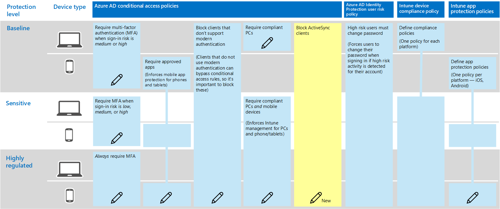

# 保護電子郵件的原則建議Policy recommendations for securing email

本文說明如何執行建議的身分識別和裝置存取原則，以保護支援新式驗證和條件式存取的組織電子郵件和電子郵件客戶程式。This article describes how to implement the recommended identity and device access policies to protect organizational email and email clients that support modern authentication and conditional access. 本指南是以[通用身分識別和裝置存取原則](identity-access-policies.md)為基礎，也包含一些額外的建議。This guidance builds on the [Common identity and device access policies](identity-access-policies.md) and also includes a few additional recommendations.

這些建議是以三種不同的安全性和保護層級為基礎，可以根據您的需求細微性來套用：**基準**、**機密**和**高管制**。These recommendations are based on three different tiers of security and protection that can be applied based on the granularity of your needs: **baseline**, **sensitive**, and **highly regulated**. 您可以深入了解這些安全性層，以及[建議的安全性原則和設定簡介](microsoft-365-policies-configurations.md)中這些建議中所參考的建議用戶端作業系統。You can learn more about these security tiers, and the recommended client operating systems, referenced by these recommendations in the [recommended security policies and configurations introduction](microsoft-365-policies-configurations.md).

這些建議要求您的使用者使用現代電子郵件客戶程式，包括行動裝置上的 Outlook iOS 和 Android。These recommendations require your users to use modern email clients, including Outlook for iOS and Android on mobile devices. 適用于 iOS 和 Android 的 Outlook 提供 Office 365 的最佳功能支援。Outlook for iOS and Android provide support for the best features of Office 365. 這些行動性 Outlook 應用程式也會使用支援行動使用的安全性功能，以及與其他 Microsoft cloud 安全性功能共同運作。These mobile Outlook apps are also architected with security capabilities that support mobile use and work together with other Microsoft cloud security capabilities. 如需詳細資訊，請參閱[Outlook for iOS 和 ANDROID 常見問題](https://docs.microsoft.com/exchange/clients-and-mobile-in-exchange-online/outlook-for-ios-and-android/outlook-for-ios-and-android-faq)。For more information, see [Outlook for iOS and Android FAQ](https://docs.microsoft.com/exchange/clients-and-mobile-in-exchange-online/outlook-for-ios-and-android/outlook-for-ios-and-android-faq).

## 更新常見原則以包含電子郵件Updating common policies to include email

下圖說明一般身分識別和裝置存取原則，並指出需要更新哪些原則以保護電子郵件。The following diagram illustrates the common identity and device access policies and indicates which policies need to be updated to protect email. 請注意，新增 Exchange Online 的新規則，以封鎖 ActiveSync 用戶端。Note the addition of a new rule for Exchange Online to block ActiveSync clients. 這會強制使用 Outlook mobile。This forces the use of Outlook mobile.

當您設定 Exchange Online 和 Outlook 時，如果您已在設定原則的範圍內包含 Exchange Online 和 Outlook，您只需要建立新原則來封鎖 ActiveSync 用戶端。If you included Exchange Online and Outlook in the scope of the policies when you set them up, you only need to create the new policy to block ActiveSync clients. 請查看下表所列的原則，並進行建議的新增，或確認是否已包含這些原則。Review the policies listed in the following table and either make the recommended additions, or confirm that these are already included. 每個規則都連結到[通用身分識別和裝置存取原則](identity-access-policies.md)文章中相關的設定指示。Each rule links to the associated configuration instructions in the [Common identity and device access policies](identity-access-policies.md) article.

|保護層級Protection level|原則Policies|詳細資訊More information|
|:---------------|:-------|:----------------|
|**Baseline****Baseline**|[當登入風險為*中*或*高*時，需要 MFARequire MFA when sign-in risk is *medium* or *high*](identity-access-policies.md#require-mfa-based-on-sign-in-risk)|在雲應用程式的指派中包含 Exchange OnlineInclude Exchange Online in the assignment of cloud apps|
|        |[封鎖不支援新式驗證的用戶端Block clients that don't support modern authentication](identity-access-policies.md#block-clients-that-dont-support-modern-authentication)|在雲應用程式的指派中包含 Exchange OnlineInclude Exchange Online in the assignment of cloud apps|
|        |[套用應用程式資料保護原則Apply APP data protection policies](identity-access-policies.md#apply-app-data-protection-policies)|請確定 Outlook 已包含在應用程式清單中。Be sure Outlook is included in the list of apps. 請務必更新每個平臺的原則（iOS、Android、Windows）Be sure to update the policy for each platform (iOS, Android, Windows)|
|        |[需要核准的應用程式和應用程式保護Require approved apps and APP protection](identity-access-policies.md#require-approved-apps-and-app-protection)|在雲端應用程式清單中包含 Exchange OnlineInclude Exchange Online in the list of cloud apps|
|        |[需要相容的電腦Require compliant PCs](identity-access-policies.md#require-compliant-pcs-but-not-compliant-phones-and-tablets)|在雲端 app 清單中包含 Exchange OnlineInclude Exchange Online in list of cloud apps|
|        |[封鎖 ActiveSync 用戶端Block ActiveSync clients](#block-activesync-clients)|新增此新原則Add this new policy| 
|**敏感性****Sensitive**|[當登入風險為*低*、*中*或*高*時，需要 MFARequire MFA when sign-in risk is *low*, *medium* or *high*](identity-access-policies.md#require-mfa-based-on-sign-in-risk)| 在雲應用程式的指派中包含 Exchange OnlineInclude Exchange Online in the assignment of cloud apps|
|         |[需要相容*的電腦和*行動裝置Require compliant PCs *and* mobile devices](identity-access-policies.md#require-compliant-pcs-and-mobile-devices)|在雲端應用程式清單中包含 Exchange OnlineInclude Exchange Online in the list of cloud apps|
|**高管制****Highly regulated**|[*永遠*需要 MFA*Always* require MFA](identity-access-policies.md#require-mfa-based-on-sign-in-risk)|在雲應用程式的指派中包含 Exchange OnlineInclude Exchange Online in the assignment of cloud apps|

## 封鎖 ActiveSync 用戶端Block ActiveSync clients

這個原則可防止 ActiveSync 用戶端略過其他條件式存取規則。This policy prevents ActiveSync clients from bypassing other conditional access rules. 規則設定只適用于 ActiveSync 用戶端。The rule configuration applies only to ActiveSync clients. 選取 [**[要求應用程式保護原則](https://docs.microsoft.com/azure/active-directory/conditional-access/concept-conditional-access-grant#require-app-protection-policy)**]，此原則會封鎖 ActiveSync 用戶端。By selecting **[Require app protection policy](https://docs.microsoft.com/azure/active-directory/conditional-access/concept-conditional-access-grant#require-app-protection-policy)**, this policy blocks ActiveSync clients. 若要瞭解如何建立此原則的詳細資料，請參閱[使用條件式存取之 cloud app access 的應用程式保護原則](https://docs.microsoft.com/azure/active-directory/conditional-access/app-protection-based-conditional-access)。Details on creating this policy can be found in [Require app protection policy for cloud app access with Conditional Access](https://docs.microsoft.com/azure/active-directory/conditional-access/app-protection-based-conditional-access).

1. 在第1種情形中，請遵循「步驟2：設定 Exchange ActiveSync Online 的 Azure AD 條件式存取原則」（EAS）」，其[案例1： Office 365 應用程式需要核准的應用程式與應用程式保護原則](https://docs.microsoft.com/azure/active-directory/conditional-access/app-protection-based-conditional-access#scenario-1-office-365-apps-require-approved-apps-with-app-protection-policies)，可防止 Exchange ActiveSync 用戶端利用基本驗證連線至 Exchange Online。Follow "Step 2: Configure an Azure AD Conditional Access policy for Exchange Online with ActiveSync (EAS)" in [Scenario 1: Office 365 apps require approved apps with app protection policies](https://docs.microsoft.com/azure/active-directory/conditional-access/app-protection-based-conditional-access#scenario-1-office-365-apps-require-approved-apps-with-app-protection-policies), which prevents Exchange ActiveSync clients leveraging basic authentication from connecting to Exchange Online.

## 設定 Office 365 郵件加密Setup Office 365 message encryption

透過新的 Office 365 郵件加密（OME）功能（可利用 Azure 資訊保護中的保護功能），您的組織可以輕鬆地與任何設備上的任何人共用受保護的電子郵件。With the new Office 365 Message Encryption (OME) capabilities, which leverage the protection features in Azure Information Protection, your organization can easily share protected email with anyone on any device. 使用者可以使用 Outlook.com、Gmail 及其他電子郵件服務，與其他 Office 365 組織及非 Office 365 客戶一起傳送及接收受保護的郵件。Users can send and receive protected messages with other Office 365 organizations as well as non-Office 365 customers using Outlook.com, Gmail, and other email services.

如需詳細資訊，請參閱[設定新的 Office 365 郵件加密功能](https://support.office.com/article/set-up-new-office-365-message-encryption-capabilities-7ff0c040-b25c-4378-9904-b1b50210d00e)。For more information, see [Set up new Office 365 Message Encryption capabilities](https://support.office.com/article/set-up-new-office-365-message-encryption-capabilities-7ff0c040-b25c-4378-9904-b1b50210d00e).

## 後續步驟Next steps

[了解保護 SharePoint 網站和檔案的原則建議Learn about policy recommendations for securing SharePoint Sites and files](sharepoint-file-access-policies.md)
