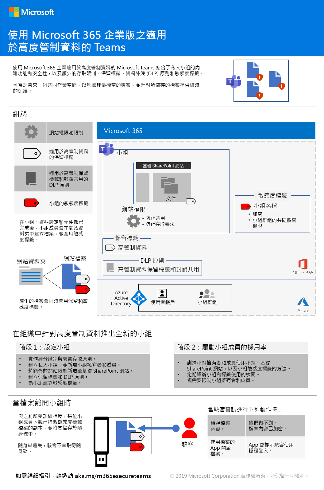
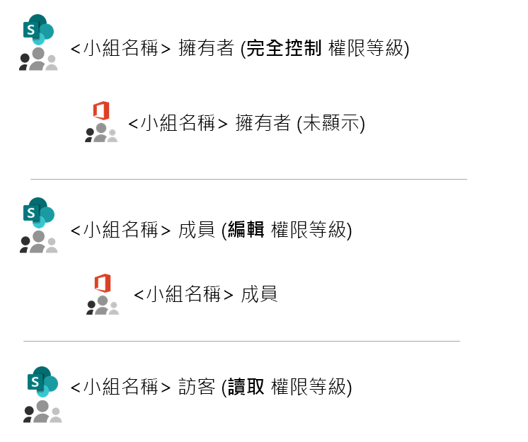
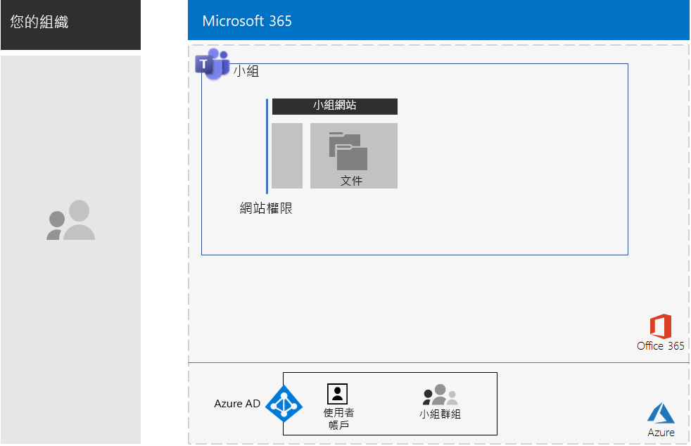
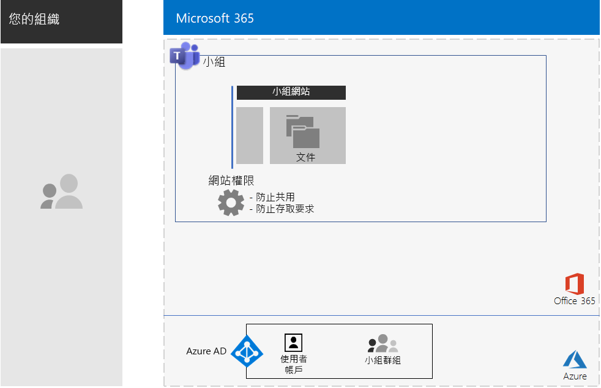
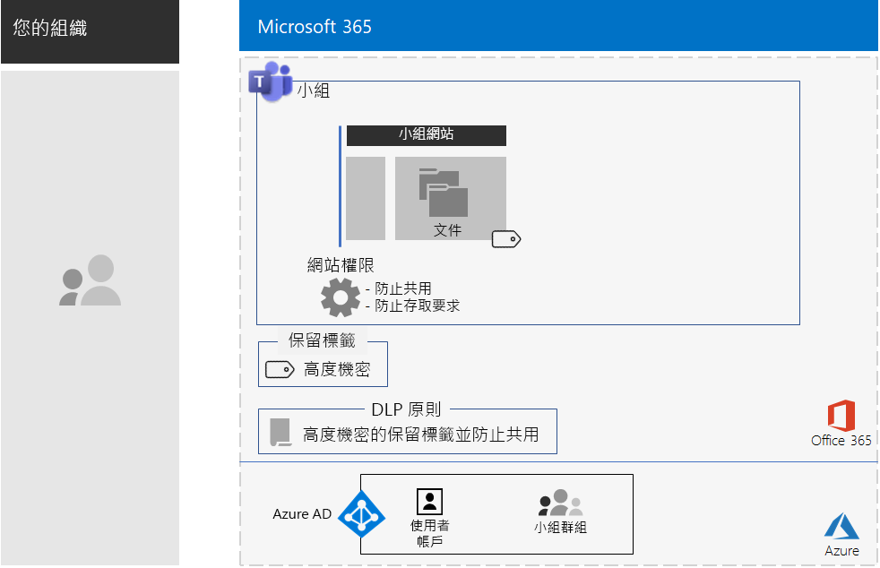
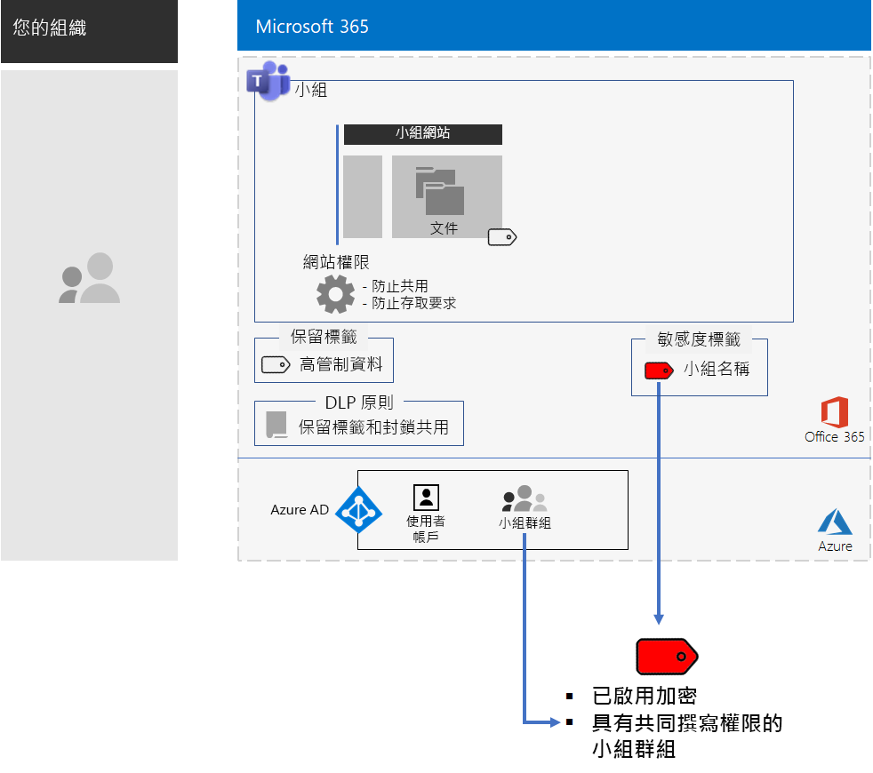
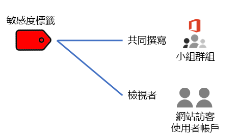

# 適用於高度管制資料的 Microsoft TeamsTeams for highly regulated data

本文提供在 Microsoft Teams 中設定私人小組的建議和步驟，讓您可以鎖定如聊天、會議和檔案等 Microsoft Teams 功能的存取權，僅供小組中 Office 365 群組的成員和擁有者使用。This article provides you with recommendations and steps to configure a private team in Microsoft Teams that locks down access to Teams features—such as chats, meetings, and files—to only members and owners of the Office 365 group for the team. 

除了 Office 365 群組基本的私用存取外，本文還說明如何針對儲存高度管制資料所需的額外安全性，設定基礎的私人 SharePoint 小組網站，此網站可透過小組頻道的 [檔案]\*\*\*\* 區段進行存取。Beyond the private access based on the Office 365 group, this article describes how to configure the underlying private SharePoint team site, which you can access from the **Files** section of a team channel, for the additional security needed to store highly regulated data. 在此 SharePoint 小組網站中，您可以對檔案、頁面、共用行事曆、工作、筆記本和清單進行儲存和共同作業。On this SharePoint team site, you can store and collaborate on files, pages, a shared calendar, tasks, a notebook, and lists.

>[!Note]
> [這裡](teams-sharepoint-online-sites-highly-regulated-data.md)提供使用 SharePoint 的類似案例。A similar scenario using Microsoft Teams is [here](teams-sharepoint-online-sites-highly-regulated-data.md).
>

針對高度管制資料，小組需要設定的元素有：The elements of configuration for a team for highly regulated data are:

- 私人小組，具有對應的 Office 365 群組，群組中有擁有者和成員使用者帳戶。A private team with a corresponding Office 365 group that has owner and member user accounts.
- 小組的基礎 SharePoint 網站需要的額外安全性有：Additional security on the underlying SharePoint site for the team that:
  - 避免網站成員將存取權授與其他使用者。Prevents members of the site from granting access to others.
  - 避免非網站成員要求網站的存取權。Prevents non-members of the site from requesting access to the site.
- 基礎 SharePoint 網站的 Office 365 保留標籤，可自動套用到網站上的新檔案，作為定義保留原則的預設方法。An Office 365 retention label for the underlying SharePoint site that is automatically applied to new files on the site as a default way to define retention policies.
- 資料外洩防護 (DLP) 原則，利用保留標籤封鎖使用者對組織外部共用或傳送檔案。A Data Loss Prevention (DLP) policy that uses the retention label and blocks users from sharing or sending files outside the organization.
- Office 365 敏感度標籤或高度管制標籤的子標籤，已啟用加密且對小組的 Office 365 群組具有共同撰寫權限。An Office 365 sensitivity label or a sublabel of a highly regulated label that has encryption enabled and Co-Author permissions for the Office 365 group of the team. 使用者可以從 Word、Excel 和 PowerPoint 的 [敏感度] 功能表列，將標籤或子標籤套用到儲存在小組中 [檔案]\*\*\*\* 區段的檔案。Users apply the label or sublabel to files stored in **Files** section of the team from the Sensitivity menu bar option in Word, Excel, and PowerPoint.

以下是使用敏感度標籤所產生的組態。Here is the resulting configuration with a sensitivity label.

 如需此案例的 1 頁式摘要，請參閱[適用於高度管制資料的 Teams 海報](./media/secure-teams-highly-regulated-data-scenario/TeamsHighlyRegulatedData.pdf)。For a 1-page summary of this scenario, see the [Teams for highly regulated data poster](./media/secure-teams-highly-regulated-data-scenario/TeamsHighlyRegulatedData.pdf).

您也可以用 [PDF](https://github.com/MicrosoftDocs/microsoft-365-docs/raw/public/microsoft-365/enterprise/media/secure-teams-highly-regulated-data-scenario/TeamsHighlyRegulatedData.pdf) 格式下載此海報，以及用 Letter、Legal 或 Tabloid (11 x 17) 格式列印此海報。You can also download this poster in [PDF](https://github.com/MicrosoftDocs/microsoft-365-docs/raw/public/microsoft-365/enterprise/media/secure-teams-highly-regulated-data-scenario/TeamsHighlyRegulatedData.pdf) or PowerPoint formats and print it in letter, legal, or tabloid (11 x 17) formats.

## 階段 1：針對高度管制資料設定小組Phase 1: Configure a team for highly regulated data

端對端的設定包括下列步驟：The end-to-end configuration consists of these steps:

1. 設定身分識別和裝置存取。Configure identity and device access.
2. 建立私人小組。Create a private team.
3. 設定基礎 SharePoint 網站的額外安全性。Configure the underlying SharePoint site for additional security.
4. 建立保留標籤和 DLP 原則。Create a retention label and DLP policy.
5. 建立標籤或高度管制標籤的子標籤。Create the label or sublabel of the highly regulated label.

### 步驟 1：設定身分識別和裝置存取Step 1: Configure identity and device access

若要保護小組及其基礎 SharePoint 網站的存取權，請確定您已設定[身分識別與裝置存取原則](https://docs.microsoft.com/microsoft-365/enterprise/identity-access-policies)和建議的 [SharePoint Online 存取原則](https://docs.microsoft.com/microsoft-365/enterprise/sharepoint-file-access-policies)。To protect access to the team and its underlying SharePoint site, ensure that you have configured [identity and device access policies](https://docs.microsoft.com/microsoft-365/enterprise/identity-access-policies) and the recommended [SharePoint Online access policies](https://docs.microsoft.com/microsoft-365/enterprise/sharepoint-file-access-policies).

### 步驟 2：建立私人小組Step 2: Create a private team

利用[以下指示](https://support.office.com/article/create-a-team-from-scratch-174adf5f-846b-4780-b765-de1a0a737e2b)建立私人小組。Use [these instructions](https://support.office.com/article/create-a-team-from-scratch-174adf5f-846b-4780-b765-de1a0a737e2b) to create a private team.

當您建立私人小組時，預設權限如下：When you create a private team, here are the default permissions:

- 小組的 Office 365 群組 (以下稱「小組群組」) 有群組擁有者和群組成員The Office 365 group for the team (the Team Group) has group owners and group members
- 針對小組的基礎 SharePoint 網站 (以下稱「小組網站」)：For the underlying SharePoint site for the team (the Team Site):
  - 網站集合系統管理員會設定為「小組群組」擁有者The Site Collection Administrators is configured for the Team Group owners
  - 針對「小組網站」：For the Team Site: 
    - 「小組網站」擁有者的 SharePoint 群組 (具有「完全控制」權限層級) 會設定為「小組群組」擁有者The Team Site Owners SharePoint group—with the Full Control permission level—is set to the Team Group owners
    - 「小組網站」成員的 SharePoint 群組 (具有「編輯」權限層級) 會設定為「小組群組」成員The Team Site Members SharePoint group—with the Edit permission level—is set to the Team Group members
    - 「小組網站」訪客的 SharePoint 群組 (具有「讀取」權限層級) 沒有群組或使用者帳戶The Team Site Visitors SharePoint group—with the Read permission level—has no groups or user accounts

以下是「小組網站」的預設權限。Here are the default permissions for the Team Site.

 
>[!Note]
>如果您檢視 \<小組名稱> 擁有者的 SharePoint 群組的「編輯」權限層級，系統不會顯示 \<小組名稱> 擁有者。If you view the \<team name> Owners SharePoint group for the Edit permission level, it does not display \<team name> Owners.
>

所產生的權限允許：The resulting permissions allow:

- 「小組群組」擁有者可以管理網站並對網站內容擁有完全控制的權限。Team Group owners to administer the site and have full control over the site contents.
- 「小組群組」成員可以建立和編輯網站上的檔案。Team Group members to create and edit files on the site. 

權限的維護與小組成員及擁有者的維護相同。Permissions maintenance is the same as team member and owner maintenance.

以下是目前所產生的組態。Here’s the resulting configuration so far.

 
### 步驟 3：設定基礎 SharePoint 網站的額外安全性Step 3: Configure the underlying SharePoint site for additional security

從「小組網站」設定這些權限設定。From the Team Site, configure these permission settings.

1. 在工具列中，按一下設定圖示，然後按一下 [網站權限]\*\*\*\*。In the tool bar, click the settings icon, and then click **Site permissions**.
2. 在 [網站權限]\*\*\*\* 窗格的 [共用設定]\*\*\*\* 之下，按一下 [變更共用設定]\*\*\*\*。In the **Site permissions** pane, under **Sharing Settings**, click **Change sharing settings**.
3. 在 [共用權限]\*\*\*\* 之下，選擇 [只有網站擁有者可以共用檔案、資料夾及網站]\*\*\*\*。Under **Sharing permissions**, choose **Only site owners can share files, folders, and the site**.
4. 關閉 [允許存取要求]\*\*\*\*，然後按一下 [儲存]\*\*\*\*。Turn off **Allow access requests**, and then click **Save**.

透過這些設定，「網站群組」成員要求「小組網站」存取權以與其他成員或非成員共用「小組網站」的功能將會停用。With these settings, the ability for Team Group members to share the Team Site with other members or for non-members to request access to the Team Site is disabled.

以下是目前所產生的組態。Here’s the resulting configuration so far.

 
### 步驟 4：建立保留標籤和 DLP 原則Step 4: Create a retention label and DLP policy

利用[以下指示](https://docs.microsoft.com/microsoft-365/compliance/protect-sharepoint-online-files-with-office-365-labels-and-dlp)：Use [these instructions](https://docs.microsoft.com/microsoft-365/compliance/protect-sharepoint-online-files-with-office-365-labels-and-dlp) to:

1. 建立和發佈高度管制資料的保留標籤 (如有需要的話)。Create and publish a retention label for highly regulated data (if needed).
2. 針對步驟 1 中建立的保留標籤設定「小組網站」。Configure the Team Site for the retention label created in step 1.
3. 使用在步驟 2 中建立的保留標籤建立高度管制資料的 DLP 原則，封鎖使用者對組織外部傳送檔案。Create a DLP policy for highly regulated data that uses the retention label created in step 2 and blocks users from sending files outside the organization. 您也可以 [DLP 原則範本](https://docs.microsoft.com/microsoft-365/compliance/data-loss-prevention-policies#dlp-policy-templates)為基礎，針對其他要求設定原則，例如健康和金融業法規的要求。You can also configure the policy for additional requirements, such as those for health and financial industry regulations, based on [DLP policy templates](https://docs.microsoft.com/microsoft-365/compliance/data-loss-prevention-policies#dlp-policy-templates).

以下是目前所產生的組態。Here’s the resulting configuration so far.

 
### 步驟 5：建立標籤或高度管制標籤的子標籤Step 5: Create the label or a sublabel of the highly regulated label

適用於高度管制資料的敏感度標籤可讓任何人套用至任何檔案，但是安全小組不同，安全小組需要自己的標籤或子標籤，使指派到的檔案都能：Unlike a sensitivity label for highly regulated data that anyone can apply to any file, a secure team needs its own label or sublabel so that assigned files:

- 受到加密，且加密會隨檔案移動。Are encrypted and the encryption travels with the file.
- 包含自訂權限，因此只有「小組群組」成員能夠開啟檔案。Contain custom permissions so that only members of the Team Group can open it.

若要針對儲存在「小組網站」中的檔案完成這項額外的安全性層級，您必須設定一個新的敏感度標籤，這個標籤不是自有標籤就是一般標籤的子標籤，適用於高度管制檔案。To accomplish this additional level of security for files stored in the Team Site, you must configure a new sensitivity label that is either its own label a sublabel of the general label for highly regulated files. 只有「小組群組」成員可以在標籤清單中看到這個標籤。Only Team Group members will see it in their list of labels.

當您需要少量標籤、可同時用於全域使用和個別的私人小組時，請使用敏感度標籤。Use a sensitivity label when you need a small number of labels for both global use and individual private teams. 當您有大量標籤或想要將私人小組的標籤整理到高度管制標籤之下時，請使用敏感度子標籤。Use a sensitivity sublabel when you have a large number of labels or want to organize labels for private teams under the highly regulated label.

[使用下列指示](https://docs.microsoft.com/microsoft-365/compliance/encryption-sensitivity-labels)設定包含下列設定的不同標籤或子標籤：[Use these instructions](https://docs.microsoft.com/microsoft-365/compliance/encryption-sensitivity-labels) to configure a separate label or a sublabel with the following settings:

- 標籤名稱包含有小組名稱The name of the label contains the name of the team
- 已啟用加密Encryption is enabled
- 「小組群組」具有共同撰寫權限The Team Group has Co-Author permissions

以下是新標籤所產生的組態。Here’s the resulting configuration with the new label.

以下是敏感度標籤和「小組群組」之間的關係。Here’s the relationship between the sensitivity label and the Team Group.

>[!Note]
>如果您將敏感度標籤或子標籤設定為使用者定義的權限或設定有到期日，您將無法從 Microsoft Teams 或 SharePoint 開啟檔案。If you configure the sensitivity label or sublabel for user-defined permissions or with an expiration date, you cannot open the file from Teams or SharePoint. 您必須使用 Office 應用程式。You must use an Office app.
>

### 自訂權限Custom permissions

您也可以針對「小組網站」設定自訂 SharePoint 網站權限和對應的敏感度標籤 (如有需要的話)。You can also configure custom SharePoint site permissions for the Team Site and, if needed, its corresponding sensitivity label. 以下列出兩個範例。Here are two examples.

#### 範例 1：委派 SharePoint 網站的系統管理Example 1: Delegating SharePoint site administration

如果小組擁有者沒有 SharePoint 系統管理經驗或是想要委派「小組網站」的系統管理，小組擁有者可以將 SharePoint 系統管理員的使用者帳戶新增至小組擁有者清單。If the team owner does not have SharePoint administration experience or wants to delegate administration of the Team Site, they could add the user account of a SharePoint administrator to the list of team owners. 但是接下來，SharePoint 系統管理員會擁有小組及其所有資源的完整存取權，並且能夠開啟已套用敏感度標籤的檔案。But then the SharePoint administrator would have full access to the team and all its resources and would be able to open a file with the sensitivity label applied. 

為防止這種過度授與權限的情況發生，請在網站的進階權限設定中，將 SharePoint 系統管理員的使用者帳戶新增至「小組網站」擁有者的 SharePoint 群組。To prevent this over-granting of privileges, add the user account of the SharePoint administrator to the Team Site Owners SharePoint group in the advanced permissions settings of the site. SharePoint 系統管理員可以管理網站，但是無法存取小組及其任何資源，或是無法開啟已指派敏感度標籤的檔案。The SharePoint administrator can administer the site but will not be able to access the team and any of its resources or open the files with the sensitivity label assigned.

#### 範例 2：允許唯讀存取已加標籤的檔案Example 2: Allowing view-only access to labeled files

如果有部分人員只需要查看「小組網站」中已加標籤的檔案內容，請將這些人員的個人使用者帳戶新增至：If some staff only need to view the contents of labeled files in the Team Site, add their individual user accounts to the:

- \<小組名稱> 訪客的 SharePoint 群組，這個群組依預設擁有「讀取」權限層級。\<team name> Visitors SharePoint group, which by default has the Read permission level. 
- 具有檢視者權限的敏感度標籤。The sensitivity label with the Viewer permissions.

以下是標籤上所產生的權限。Here are the resulting permissions on the label.

 
網站訪客將可以直接存取「小組網站」，並查看已套用子標籤的檔案內容。The site visitors will be able to access the Team Site directly and view the contents of files that have the sublabel applied. 但是，由於訪客不是「小組群組」成員，因此訪客無法存取小組或其任何資源。But because they are not members of the Team Group, they will not be able to access the team or any of its resources.

## 階段 2：對小組成員推動使用者採用Phase 2: Drive user adoption for team members

小組成立後，您就可以開始對小組成員推動採用此小組及其額外的安全性。With the team in place, it’s time to drive the adoption of this team and its additional security to team members.

### 步驟 1：訓練您的使用者Step 1: Train your users

「小組群組」成員可以存取小組及其所有資源，包括聊天、會議及其他應用程式。Members of the Team Group can access the team and all of its resources, including chats, meetings, and other apps. 使用頻道中 [檔案]\*\*\*\* 區段的檔案時，「小組群組」成員必須將敏感度標籤或子標籤指派給針對安全小組建立的檔案。When working with files from the **Files** section of a channel, members of the Team Group must assign the sensitivity label or sublabel to files created for the secure team. 請見以下範例。Here’s an example.

 
當標籤套用到受保護的檔案時。When the label gets applied to the file it is secured. 「小組群組」成員可以在 Microsoft Teams 中開啟，並即時進行共同作業。Members of the Team Group can open it in Teams and collaborate in real time. 檔案已加密，且包含有設定給「小組群組」成員的共同撰寫權限。It is encrypted and includes the Co-Author permissions set to the Team Group members. 如果檔案離開網站並轉寄給惡意使用者，這些使用者必須提供「小組群組」成員的使用者帳戶認證，才能開啟檔案並檢視其內容。If the file leaves the site and gets forwarded to a malicious user, they will have to supply credentials of a user account that is member of the Team Group to open the file and view its contents. 

訓練您的小組成員：Train your team members:

- 了解使用新的小組進行聊天、會議、檔案和「小組網站」上其他資源的重要性，以及高度管制資料外洩的後果，例如法律後果、法規罰款、勒索軟體或喪失競爭優勢。On the importance of using the new team for chats, meetings, files, and the other resources of the Team Site and the consequences of a highly regulated data leak, such as legal ramifications, regulatory fines, ransomware, or loss of competitive advantage.
- 如何存取小組。How to access the team.
- 如何在網站上建立新檔案，以及上傳儲存在本機的新檔案。How to create new files on the site and upload new files stored locally.
- DLP 原則如何封鎖他們免於在外部共用檔案。How the DLP policy blocks them from sharing files externally.
- 如何為檔案加上小組的自訂標籤或子標籤。How to label files with the custom label or sublabel for the team.
- 標籤或子標籤如何保護檔案，即使檔案從網站外洩。How the label or sublabel protects files even when they are leaked off the site.

此訓練應該包含實際操作練習，讓您的小組成員可以體驗這些功能及其結果。This training should include hands-on exercises so that your team members can experience these capabilities and their results.

### 步驟 2：舉辦定期的使用狀況檢閱和處理小組成員的意見反應Step 2: Conduct periodic reviews of usage and address team member feedback

在訓練後的幾週內：In the weeks after training:

- 快速處理小組成員的意見反應，並微調原則和設定。Quickly address team member feedback and fine tune polices and configurations.
- 分析小組的使用方式，並且與預期使用方式進行比較。Analyze usage for the team and compare it with usage expectations.
- 確認高度管制檔案已正確地標示自訂的敏感度標籤。Verify that highly regulated files have been properly labeled with the custom sensitivity label or sublabel.

  您可以在 SharePoint 檢視資料夾，然後透過 [新增欄]\*\*\*\* 的 [顯示/隱藏欄]\*\*\*\* 選項新增 [敏感度]\*\*\*\* 欄，查看哪些檔案有被指派標籤。You can see which files have a label assigned by viewing a folder in SharePoint and adding the **Sensitivity** column through the **Show/hide columns** option of **Add column**.

視需要重新訓練您的使用者。Retrain your users as needed.

## 另請參閱See also

[適用於高度管制資料的 SharePoint 網站SharePoint sites for highly regulated data](teams-sharepoint-online-sites-highly-regulated-data.md)

[Microsoft 365 企業版工作負載和案例Microsoft 365 Enterprise workloads and scenarios](deploy-workloads.md)

[Microsoft 365 生產力資源庫](https://aka.ms/productivitylibrary)https://aka.ms/productivitylibrary)[Microsoft 365 Productivity Library](https://aka.ms/productivitylibrary) (https://aka.ms/productivitylibrary)

[部署指南Deployment guide](deploy-microsoft-365-enterprise.md)
