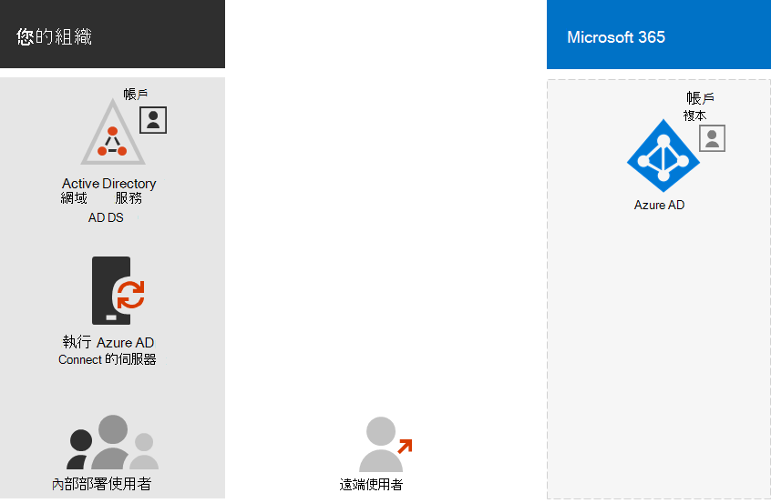

# 設定 Microsoft 365 的目錄同步處理

*本文適用於 Microsoft 365 企業版和 Office 365 企業版。*

Microsoft 365 會使用 Azure Active Directory (Azure AD) 租使用者來儲存和管理身分識別，以存取雲端架構資源的驗證和許可權。 

如果您有內部部署 Active Directory 網域服務 (AD ds) 網域或樹系中，您可以使用 Microsoft 365 訂閱的 Azure AD 租使用者來同步處理您的 ad ds 使用者帳戶、群組和連絡人。 這是 Microsoft 365 的混合式身分識別。 以下是其元件。

Azure AD 連線會在內部部署伺服器上執行，並與 Azure AD 租使用者同步處理 AD DS。 除了目錄同步處理之外，您還可以指定下列驗證選項：

- 密碼雜湊同步處理 (PHS) 

  Azure AD 會自行執行驗證。

- 傳遞驗證 (PTA)

  Azure AD 具有 AD DS 執行驗證。

- 同盟驗證

  Azure AD 是指向另一個身分識別提供者要求驗證的用戶端電腦。

如需詳細資訊，請參閱 [混合式識別碼](plan-for-directory-synchronization.md) 。
  
## 1. 檢查 Azure AD 連線的必要條件

您可以使用 Microsoft 365 訂閱取得免費的 Azure AD 訂閱。 當您設定目錄同步處理時，您會在其中一個內部部署伺服器上安裝 Azure AD 連線。
  
如需 Microsoft 365，您必須：
  
- 驗證您的內部部署網域。 Azure AD 連線嚮導會引導您完成此步驟。
- 取得 Microsoft 365 租使用者和 AD DS 之系統管理員帳戶的使用者名稱和密碼。

針對您在其上安裝 Azure AD 連線的內部部署伺服器，您需要：
  
|**伺服器作業系統**|**其他軟體**|
|:-----|:-----|
|Windows Server 2012R2 和更新版本 | -預設會安裝 PowerShell，不需要採取任何動作。    -透過 Windows 更新提供 Net 4.5.1 和更新版本。 請確認您已在 [控制台] 中安裝 Windows 伺服器的最新更新。 |
|Windows伺服器 2008 R2 Service Pack 1 (SP1) * * 或 Windows Server 2012 | -Windows Management Framework 4.0 提供 PowerShell 的最新版本。 在 [Microsoft 下載中心](https://go.microsoft.com/fwlink/p/?LinkId=717996)搜尋。    -您可以在 [Microsoft 下載中心](https://go.microsoft.com/fwlink/p/?LinkId=717996)取得 .net 4.5.1 和更新版本。 |
|Windows Server 2008 | -PowerShell 的最新支援版本可在[Microsoft 下載中心](https://go.microsoft.com/fwlink/p/?LinkId=717996)上找到 Windows Management Framework 3.0。    -您可以在 [Microsoft 下載中心](https://go.microsoft.com/fwlink/p/?LinkId=717996)取得 .net 4.5.1 和更新版本。 |

請參閱[Azure Active Directory 連線的必要條件](/azure/active-directory/hybrid/how-to-connect-install-prerequisites)，以取得硬體、軟體、帳戶與許可權需求的詳細資料、SSL 憑證需求，以及 Azure AD 連線的物件限制。
  
您也可以查看 Azure AD 連線[版本發行歷程記錄](/azure/active-directory/hybrid/reference-connect-version-history)，以查看每個版本中包含和修正的內容。

## 2. 安裝 Azure AD 連線和設定目錄同步處理

開始之前，請確定您已具備下列專案：

- 全域管理員 Microsoft 365 的使用者名稱和密碼
- AD DS 域管理員的使用者名稱和密碼
- 哪種驗證方法 (PHS、PTA、同盟) 
- 您是否要使用 [AZURE AD 無縫單一登入 (SSO) ](/azure/active-directory/hybrid/how-to-connect-sso)

遵循下列步驟：

1. 登入 Microsoft 365 系統 [管理中心](https://admin.microsoft.com) (https://admin.microsoft.com) 並選擇左側導覽中的 [**使用者**] [作用中 \> **使用者**]。
2. 在 [作用中 **使用者** ] 頁面上，選擇 [ **其他** (三個點) \> **目錄同步** 處理]。
  
3. 在 [ **Azure Active Directory 準備**] 頁面上，選取 [**移至下載中心] 以取得 Azure AD 連線工具** 連結開始。 
4. 請遵循[AZURE ad 連線和 AZURE ad 中連線健康情況安裝藍圖](/azure/active-directory/hybrid/how-to-connect-install-roadmap)中的步驟進行。

## 3. 完成網域的設定

當您管理 DNS 記錄以完成網域的設定時，請遵循下列步驟，[為 Microsoft 365 建立 dns 記錄](/office365/admin/get-help-with-domains/create-dns-records-at-any-dns-hosting-provider)。

## 下一步

[將授權指派給使用者帳戶](assign-licenses-to-user-accounts.md)