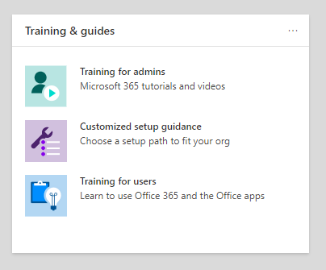

# Microsoft 365 和 Office 365 服務的設定指南Setup guides for Microsoft 365 and Office 365 services

Microsoft 365 和 Office 365 安裝指南為您提供規劃及部署租使用者、應用程式及服務的專門指導方針和資源。Microsoft 365 and Office 365 setup guides give you tailored guidance and resources for planning and deploying your tenant, apps, and services. 這些指南使用[Microsoft 365 FastTrack](https://www.microsoft.com/fasttrack/microsoft-365)上架專家在個別互動中共用的最佳作法來建立，而且可供 Microsoft 365 系統管理中心內的所有系統管理員使用。These guides are created using the same best practices that [Microsoft 365 FastTrack](https://www.microsoft.com/fasttrack/microsoft-365) onboarding specialists share in individual interactions, and they're available to all admins within the Microsoft 365 admin center. 其提供產品設定的資訊、啟用安全性功能、部署共同作業工具，並提供腳本以加速高級部署。They give information on product setup, enabling security features, deploying collaboration tools, and provide scripts to speed up advanced deployments.

## 如何在 Microsoft 365 系統管理中心中存取安裝指南How to access setup guides in the Microsoft 365 admin center

安裝指南可從 Microsoft 365 系統管理中心中的「[安裝指南](https://aka.ms/setupguidance)」頁面進行存取。The setup guides are accessible from the [Setup guidance](https://aka.ms/setupguidance) page in the Microsoft 365 admin center. 您可以追蹤進度的狀態，而且您可以隨時退回以完成指南。You can keep track of the status of your progress and you have the option to return at any time to complete a guide. 若要到達 **安裝指導** 頁面：To reach the **Setup guidance** page:

1. 在 [Microsoft 365 系統管理中心](https://admin.microsoft.com/)中，移至 **首頁**。In the [Microsoft 365 admin center](https://admin.microsoft.com/), go to the **Home** page.

2. 找到 **訓練 & 輔助** 卡。Find the **Training & guides** card.

   

3. 選取 [ **自訂安裝指導** 方針]。Select **Customized setup guidance**.

   

>[!NOTE]
>需要租使用者管理員許可權才能存取 Microsoft 365 系統管理中心。Tenant administrator permissions are required to access the Microsoft 365 admin center.

## 安裝指南在 Microsoft 365 系統管理中心中的運作方式為何？How do setup guides work in the Microsoft 365 admin center?

每個指南都會提供逐步指示、資源、文章，以及在需要時使用的腳本，以進行設定變更。Each guide provides you with step-by-step instructions, resources, articles, and when needed, scripts you can use to make configuration changes. 這些指南為您提供各種選擇，以反映小型和大型組織的特定需求。These guides provide you with choices that reflect the specific needs of both small and large organizations. 此外，指導方針也包含對新的和更有經驗之系統管理員的協助。Additionally, the guidance includes assistance for both new and more experienced admins.

您可以使用指南深入瞭解規劃階段期間、部署和部署期間的特定 Microsoft 365 和 Office 365 功能，或在您完成部署以修改設定之後重新執行這些功能。You can use the guides to learn more about specific Microsoft 365 and Office 365 features during the planning phase, during deployment and rollout, or to revisit them after you've completed a deployment to modify a setting.

## 初始設定輔助線Guides for initial setup

### 準備您的環境Prepare your environment

[[準備您的環境](https://aka.ms/prepareyourenvironment)] 指南可協助您準備組織的環境，以 Microsoft 365 和 Office 365 服務。The [Prepare your environment](https://aka.ms/prepareyourenvironment) guide helps you prepare your organization's environment for Microsoft 365 and Office 365 services. 不論您的目標為何，您必須完成一些工作，才能確保成功部署。Regardless of your goals, there are tasks you'll need to complete to ensure a successful deployment. 為了避免在準備您的環境時出現任何錯誤，您可以逐步說明如何連線您的網域、新增使用者、指派授權、設定 Exchange Online 的電子郵件，以及安裝或部署 Office 應用程式。To avoid any errors while preparing your environment, you're provided with step-by-step instructions to connect your domain, add users, assign licenses, set up email with Exchange Online, and install or deploy Office apps.

### 電子郵件安裝顧問Email setup advisor

「[電子郵件安裝顧問](https://aka.ms/office365setup)」為您提供為組織設定 Exchange Online 所需的逐步指引。The [Email setup advisor](https://aka.ms/office365setup) provides you with the step-by-step guidance needed for configuring Exchange Online for your organization. 這包括設定新的電子郵件帳戶、遷移電子郵件，以及設定電子郵件保護。This includes setting up new email accounts, migrating email, and configuring email protection. 若要成功設定電子郵件，請使用此顧問，並根據組織目前的郵件系統、要遷移的信箱數目，以及您想要管理使用者及其存取的方式，來接收建議的遷移方法。For a successful email set up, use this advisor and you'll receive the recommended migration method based on your organization's current mail system, the number of mailboxes being migrated, and how you want to manage users and their access.

### 遷移 Gmail 連絡人和行事曆專案Migrate Gmail contacts and calendar items

當您將 Gmail 使用者的信箱遷移至 Microsoft 365 時，系統會遷移電子郵件，但不會遷移「連絡人」和「行事曆」專案。When you migrate a Gmail user's mailbox to Microsoft 365, email messages are migrated, but contacts and calendar items are not. Gmail [連絡人] 和 [行事[曆顧問](https://aka.ms/gmailcontactscalendar)] 提供使用 Outlook .com、Outlook 用戶端或 PowerShell，將 import 和 export 方法匯入 google 連絡人和 Google calendar items Microsoft 365 的步驟。The [Gmail contacts and calendar advisor](https://aka.ms/gmailcontactscalendar) provides steps for importing Google contacts and Google calendar items to Microsoft 365 using import and export methods with Outlook.com, the Outlook client, or PowerShell.

### Microsoft 365 部署顧問Microsoft 365 deployment advisor

[Microsoft 365 部署顧問](https://aka.ms/microsoft365setupguide)會在設定生產力工具、安全性原則及裝置管理功能時，為您提供指導方針。The [Microsoft 365 deployment advisor](https://aka.ms/microsoft365setupguide) provides you with guidance when setting up productivity tools, security policies, and device management capabilities. 使用企業訂閱的 Microsoft 365 商務進階版或 Microsoft 365，您可以使用此顧問來設定和設定組織的裝置。With a Microsoft 365 Business Premium or Microsoft 365 for enterprise subscription, you can use this advisor to set up and configure your organization's devices.

您將會收到對資源的指導和存取權，讓您的雲端服務、更新裝置 Windows 10 支援的最新版本，以及將裝置加入 Azure Active Directory (Azure AD) ，全部位於一個集中位置。You'll receive guidance and access to resources to enable your cloud services, update devices to the latest supported version of Windows 10, and join devices to Azure Active Directory (Azure AD), all in one central location.

### 遠端工作安裝指南Remote work setup guide

「 [遠端工作」設定指南](https://aka.ms/remoteworksetup) 為組織提供的秘訣和資源所需，以確保您的使用者能夠遠端順利運作，您的資料是安全的，而且會保護使用者的認證。The [Remote work setup guide](https://aka.ms/remoteworksetup) provides organizations with the tips and resources needed to ensure your users can successfully work remotely, your data is secure, and users' credentials are safeguarded.

您會收到指導，可將遠端工作人員的裝置流量優化至雲端和組織網路的 Microsoft 365 資源，這會降低遠端存取 VPN 基礎結構的壓力。You'll receive guidance to optimize remote workers' device traffic to both Microsoft 365 resources in the cloud and your organization's network, which will reduce the strain on your remote access VPN infrastructure.

### Windows虛擬機器設定指南Windows Virtual Desktop setup guide

Windows虛擬機器是雲端中執行的綜合桌面和應用程式虛擬化服務。Windows Virtual Desktop is a comprehensive desktop and app virtualization service running in the cloud. 這是唯一的虛擬桌面基礎結構 (VDI) ，可提供簡化的管理、多重會話 Windows 10、Microsoft 365 Apps 的優化，以及支援遠端桌面服務 (RDS) 環境。It's the only virtual desktop infrastructure (VDI) that delivers simplified management, multi-session Windows 10, optimizations for Microsoft 365 Apps, and support for Remote Desktop Services (RDS) environments. 在幾分鐘內部署並調整您的 Windows 桌面和應用程式，並取得內建的安全性和合規性功能。Deploy and scale your Windows desktops and apps to Azure in minutes and get built-in security and compliance features.

《 [Windows 虛擬機器設定指南》](https://aka.ms/wvdsetupguide)提供系統管理員規劃資源及必要條件，以進行部署、安裝指導及其他資源。The [Windows Virtual Desktop setup guide](https://aka.ms/wvdsetupguide) provides administrators with planning resources and the prerequisites for deployment, setup guidance, and additional resources.

### Microsoft Edge 安裝指南Microsoft Edge setup guide

已從頭重新建立 Microsoft Edge，讓您成為世界一流的相容性和效能、您應享有的安全性和隱私權，以及專為您提供最佳網路的新功能。Microsoft Edge has been rebuilt from the ground up to bring you world-class compatibility and performance, the security and privacy you deserve, and new features designed to bring you the best of the web.

[Microsoft Edge 安裝指南](https://aka.ms/edgeadvisor)可協助您設定 Enterprise 網站探索，以查看您的組織中所存取的網站可能需要使用 IE 模式、複查及設定重要的安全性功能、設定隱私權原則及其他原則，以符合組織的需求，以及管理裝置上的 web access。The [Microsoft Edge setup guide](https://aka.ms/edgeadvisor) will help you configure Enterprise Site Discovery to see which sites accessed in your org might need to use IE mode, review and configure important security features, configure privacy policies and additional policies to meet your org's requirements, and manage web access on your devices. 您可以將 Microsoft Edge 下載至個別裝置，也可以使用 Configuration Manager 或 Microsoft Intune，向您示範如何在您的組織中部署多位使用者。You can download Microsoft Edge to individual devices, or we'll show you how to deploy to multiple users in your org with Configuration Manager or Microsoft Intune.

### Microsoft 搜尋安裝指南Microsoft Search setup guide

Microsoft 搜尋可協助您的組織找到其所需完成的工作。Microsoft Search helps your organization find what they need to complete what they're working on. 不論是搜尋人員、檔案、組織結構圖、網站或解答常見問題，您的組織都可以在其整個 workday 中使用 Microsoft 搜尋，以取得答案。Whether it's searching for people, files, org charts, sites, or answers to common questions, your org can use Microsoft Search throughout their workday to get answers.

[Microsoft 搜尋設定指南](https://aka.ms/MicrosoftSearchSetup)可協助您設定 Microsoft 搜尋是否要將其試驗給使用者群組，或將其推廣給組織中的每個人。您將指派搜尋系統管理員和搜尋編輯器，然後為您的使用者自訂搜尋經驗及其他選項，例如，將 Bing 副檔名新增至 Chrome，或將 Bing 設定為預設搜尋引擎。The [Microsoft Search setup guide](https://aka.ms/MicrosoftSearchSetup) helps you configure Microsoft Search whether you want to pilot it to a group of users or roll it out to everyone in your org. You'll assign Search admins and Search editors and then customize the search experience for your users with answers and additional options, like adding the Bing extension to Chrome or setting Bing as your default search engine.

### Intune Configuration Manager 共同管理安裝指南Intune Configuration Manager co-management setup guide

針對現有的 Configuration manager 用戶端裝置以及您的組織想要與 Microsoft Intune 和設定管理員共同管理的新網際網路裝置，使用[Intune Configuration Manager 共同管理安裝指南](https://aka.ms/comanagementsetup)。Use the [Intune Configuration Manager co-management setup guide](https://aka.ms/comanagementsetup) for existing Configuration Manager client devices and new internet-based devices that your org wants to co-manage with both Microsoft Intune and Configuration Manager. 這個共同管理部署指南可讓您管理 Windows 10 裝置，並將新功能新增至您組織的裝置，同時接收這兩種解決方案的優點。This co-management deployment guide allows you to manage Windows 10 devices and adds new functionality to your org's devices, while receiving the benefits of both solutions.

## 驗證和存取指南Guides for authentication and access

### Azure AD 安裝指南Azure AD setup guide

[AZURE AD 安裝指南](https://aka.ms/aadpguidance)提供資訊，以確保您的組織具備強大的安全性基礎。The [Azure AD setup guide](https://aka.ms/aadpguidance) provides information to ensure your organization has a strong security foundation. 在此指南中，您將會設定初始功能（如 Azure 角色型存取控制） (Azure RBAC) （適用于系統連線管理員的 azure RBAC）和 Azure AD 連線健康情況，這樣您就可以在自動同步處理期間監控混合式身分識別的健康情況。In this guide you’ll set up initial features, like Azure role-based access control (Azure RBAC) for admins, Azure AD Connect for your on-premises directory, and Azure AD Connect Health, so you can monitor your hybrid identity's health during automated syncs.

此外，它也包含啟用自助密碼重設、條件式存取和整合協力廠商登錄（包括選用的高級身分識別保護和使用者布建自動化）的重要資訊。It also includes essential information on enabling self-service password resets, conditional access and integrated third-party sign-on including optional advanced identity protection and user provisioning automation.

### 從您的組織目錄同步處理使用者Sync users from your org’s directory

[您的組織目錄中的同步處理使用者](https://aka.ms/directorysyncsetup)會引導您完成目錄同步處理的開啟。The [Sync users from your org’s directory wizard](https://aka.ms/directorysyncsetup) walks you through turning on directory synchronization. 這會將您的內部部署和雲端身分識別帶入一起，以方便存取和簡化管理。This brings your on-premises and cloud identities together for easier access and simplified management. 解除鎖定新功能，例如單一登入、自助服務選項、自動帳戶布建、條件式存取控制及符合性原則。Unlock new capabilities, like single sign-on, self-service options, automatic account provisioning, conditional access controls, and compliance policies. 這可確保您的使用者可以從任何位置存取所需的資源。This ensures that your users have access to the resources they need from anywhere.

### 規劃無密碼部署Plan your passwordless deployment

升級至替代登入方法，可讓使用者使用下列其中一個 passwordless 驗證方法，安全地存取其裝置：Upgrade to an alternative sign-in approach that allows users to access their devices securely with one of the following passwordless authentication methods:

- Windows Hello 企業版Windows Hello for Business
- Microsoft Authenticator 應用程式The Microsoft Authenticator app
- 安全性參數Security keys

使用 [ [規劃您的 passwordless 部署] 嚮導](https://aka.ms/passwordlesssetup) 來探索最佳的 passwordless 驗證方法，以使用和接收如何部署這些方法的指導方針。Use the [Plan your passwordless deployment wizard](https://aka.ms/passwordlesssetup) to discover the best passwordless authentication methods to use and receive guidance on how to deploy them.

### 規劃自助密碼重設 (SSPR) 部署Plan your self-service password reset (SSPR) deployment

讓使用者可以獨立變更或重設其密碼，如果其帳戶已鎖定，或忘記其密碼，而不需要與服務台工程師聯繫。Give users the ability to change or reset their password independently, if their account is locked, or they forget their password without the need to contact a helpdesk engineer.

使用 [ [規劃您的自助密碼重設部署] 嚮導](https://aka.ms/SSPRSetupGuide) 來接收相關文章，以及設定適當 Azure 入口網站選項的指示，以協助您在環境中部署 SSPR。Use the [Plan your self-service password reset deployment wizard](https://aka.ms/SSPRSetupGuide) to receive relevant articles and instructions for configuring the appropriate Azure portal options to help you deploy SSPR in your environment.

### Active Directory Federation Services (AD FS) 部署顧問Active Directory Federation Services (AD FS) deployment advisor

[AD FS 部署顧問](https://aka.ms/adfsguidance)為您提供部署內部部署 AD FS 基礎結構以驗證 Microsoft 365 和 Office 365 服務之使用者的逐步指引。The [AD FS deployment advisor](https://aka.ms/adfsguidance) provides you with step-by-step guidance on deploying an on-premises AD FS infrastructure that authenticates users for Microsoft 365 and Office 365 services. 透過本指南，您的組織可以查看 AD FS 元件和需求、取得及安裝部署所需的 SSL 憑證，以及安裝必要的 web 應用程式 proxy 伺服器。With this guide, your organization can review AD FS components and requirements, acquire and install SSL certificates that are necessary for deployment, and install a required web application proxy server.

## 安全性與合規性指南Guides for security and compliance

### Microsoft Intune 安裝指南Microsoft Intune setup guide

設定 Microsoft Intune 以管理組織中的裝置。Set up Microsoft Intune to manage devices in your organization. 若要完全控制公司裝置，您會使用 Intune 的行動裝置管理 (MDM) 功能。For full control of corporate devices, you’ll use Intune’s mobile device management (MDM) features. 若要在共用和個人裝置上管理組織的資料，您可以使用 Intune 的行動應用程式管理 (MAM) 功能。To manage your organization's data on shared and personal devices, you can use Intune’s mobile application management (MAM) features.

您可以使用《 [Microsoft Intune 安裝指南》](https://aka.ms/intunesetupguide)，設定裝置和應用程式相容性原則、指派應用程式保護原則，以及監視裝置和 app 保護狀態。With the [Microsoft Intune setup guide](https://aka.ms/intunesetupguide), you'll set up device and app compliance policies, assign app protection policies, and monitor the device and app protection status.

### Microsoft Defender for Endpoint advisorMicrosoft Defender for Endpoint advisor

[Microsoft Defender For Endpoint advisor](https://aka.ms/mdatpsetup)提供說明，可協助您的商業網路防止、偵測、調查和回應高級威脅。The [Microsoft Defender for Endpoint advisor](https://aka.ms/mdatpsetup) provides instructions that will help your enterprise network prevent, detect, investigate, and respond to advanced threats. 作出明智的組織弱點評估，並決定最佳的部署套件和設定方法。Make an informed assessment of your organization's vulnerability and decide which deployment package and configuration methods are best.

>[!NOTE]
>Microsoft Defender for Endpoint 需要 Microsoft 大量授權。A Microsoft Volume License is required for Microsoft Defender for Endpoint.

### Exchange Online Protection 安裝指南Exchange Online Protection setup guide

Microsoft Exchange OnlineProtection (EOP) 是雲端式電子郵件篩選服務，用以防範垃圾郵件和惡意程式碼，其功能可保護您的組織不會違反郵件原則。Microsoft Exchange Online Protection (EOP) is a cloud-based email filtering service for protection against spam and malware, with features to safeguard your organization from messaging policy violations.

使用[Exchange Online Protection 設定指南](https://aka.ms/EOPguidance)來設定 EOP，方法是選取三個部署案例中的哪一個部署案例 &mdash; 、混合式 (混合式內部部署和雲端) 信箱，或所有雲端信箱都 &mdash; 符合您的組織。Use the [Exchange Online Protection setup guide](https://aka.ms/EOPguidance) to set up EOP by selecting which of the three deployment scenarios&mdash;on-premises mailboxes, hybrid (mix of on-premises and cloud) mailboxes, or all cloud mailboxes&mdash;fits your organization. 此指南提供資訊和資源，用以設定及審閱使用者的授權、在 Microsoft 365 系統管理中心中指派許可權，以及在安全性 & 規範中心設定組織的反惡意程式碼和垃圾郵件原則。The guide provides information and resources to set up and review your user's licensing, assign permissions in the Microsoft 365 admin center, and configure your organization's anti-malware and spam policies in the Security & Compliance Center.

### 適用于 Office 365 advisor 的 Microsoft DefenderMicrosoft Defender for Office 365 advisor

[Microsoft Defender for Office 365 advisor](https://aka.ms/oatpsetup)會保護您的組織免受您環境可能透過電子郵件訊息、連結及協力廠商共同作業工具所遇到的惡意威脅。The [Microsoft Defender for Office 365 advisor](https://aka.ms/oatpsetup) safeguards your organization against malicious threats that your environment might encounter through email messages, links, and third-party collaboration tools. 本指南為您提供資源及資訊，可協助您準備及識別 Office 365 計畫的 Defender，以符合組織的需求。This guide provides you with the resources and information to help you prepare and identify the Defender for Office 365 plan to fit your organization's needs.

### Microsoft 資訊保護安裝指南Microsoft information protection setup guide

深入瞭解您可以套用至您的資訊保護原則的功能，讓您能夠確信機密資訊受到保護。Get an overview of the capabilities you can apply to your Information Protection strategy so you can be confident your sensitive information is protected. 使用四階段生命週期方法來探索、分類、保護和監視敏感資訊。Use a four-stage lifecycle approach in which you discover, classify, protect, and monitor sensitive information. [Microsoft 資訊保護設定指南](https://aka.ms/mipsetupguide)提供完成每個階段的指導。The [Microsoft information protection setup guide](https://aka.ms/mipsetupguide) provides guidance for completing each of these stages.

### Microsoft 資訊管理安裝指南Microsoft information governance setup guide

[Microsoft 資訊管理設定指南](https://aka.ms/migsetupguide)為您提供了設定及管理組織的控管策略所需的資訊，以確保您的資料根據您設定的特定生命週期指導方針進行分類和管理。The [Microsoft Information governance setup guide](https://aka.ms/migsetupguide) provides you with the information you'll need to set up and manage your organization's governance strategy, to ensure that your data is classified and managed according to the specific lifecycle guidelines you set. 透過本指南，您將會瞭解如何建立、自動套用或發佈標籤、標籤原則，以及要套用至組織的可重複使用內容及合規性記錄的保留原則。With this guide, you'll learn how to create, auto-apply, or publish labels, label policies, and retention policies that are applied to your organization's reusable content and compliance records. 您也可以使用大量案例的檔計畫，或手動套用至個別檔，以取得匯入 CSV 檔案的相關資訊。You'll also get information on importing CSV files with a file plan for bulk scenarios or for applying them manually to individual documents.

## 共同作業輔助線Guides for collaboration

### Microsoft 365 Apps 部署顧問Microsoft 365 Apps deployment advisor

[Microsoft 365 Apps 部署顧問](https://aka.ms/OPPquickstartguide)可協助您讓使用者的裝置執行最新版本的 Office 產品（如 Word、Excel、PowerPoint 及 OneNote）。The [Microsoft 365 Apps deployment advisor](https://aka.ms/OPPquickstartguide) helps you get your users' devices running the latest version of Office products like Word, Excel, PowerPoint, and OneNote. 您將取得各種部署方法的指導方針，這些方法包括簡易的自行安裝選項，以使用管理工具進行企業部署。You'll get guidance on the various deployment methods that include easy self-install options to enterprise deployments with management tools. 這些指示會協助您評估您的環境、找出特定的部署需求，並執行必要的支援工具，以確保成功安裝。The instructions will help you assess your environment, figure out your specific deployment requirements, and implement the necessary support tools to ensure a successful install.

### 行動裝置應用程式安裝指南Mobile apps setup guide

行動裝置[應用程式安裝指南](https://aka.ms/officeappguidance)提供在 Windows、iOS 和 Android 行動裝置上下載和安裝 Office 應用程式的指示。The [Mobile apps setup guide](https://aka.ms/officeappguidance) provides instructions for the download and installation of Office apps on your Windows, iOS, and Android mobile devices. 本指南為您提供逐步資訊，供您下載並安裝您的電話和平板電腦裝置上的 Microsoft 365 和 Office 365 應用程式。This guide provides you with step-by-step information to download and install Microsoft 365 and Office 365 apps on your phone and tablet devices.

### Microsoft Teams 安裝指南Microsoft Teams setup guide

《 [Microsoft Teams 安裝指南》](https://aka.ms/teamsguidance)為您的組織提供指導，用以設定小組工作區，其可主持即時交談，以進行小組和私人通訊的訊息、通話和音訊或影片會議。The [Microsoft Teams setup guide](https://aka.ms/teamsguidance) provides your organization with guidance to set up team workspaces that host real-time conversations through messaging, calls, and audio or video meetings for both team and private communication. 您將會收到使用網路 Planner 工具和 Teams 系統管理中心內的 Teams 顧問來判斷組織網路需求的指示。You'll receive the instructions for determining your organization's network requirements by using the Network Planner tool and the Teams advisor within the Teams admin center. 部署完成後，該指南將包含一些有用的資源，以協助您開始使用 Teams。Once your deployment is complete, the guide includes helpful resources to get started using Teams.

### SharePoint 安裝指南SharePoint setup guide

[SharePoint 安裝指南](https://aka.ms/spoguidance)可協助您設定 SharePoint 檔存放區和內容管理、建立網站、設定外部共用、遷移資料和設定高級設定，以及促進組織內的使用者接洽和通訊。The [SharePoint setup guide](https://aka.ms/spoguidance) helps you set up your SharePoint document storage and content management, create sites, configure external sharing, migrate data and configure advanced settings, and drive user engagement and communication within your organization. 您將遵循設定內容共用許可權原則、選擇遷移同步處理工具及啟用 SharePoint 環境安全性設定的步驟。You'll follow steps for configuring your content-sharing permission policies, choose your migration sync tools, as well as enable the security settings for your SharePoint environment.

### OneDrive 安裝指南OneDrive setup guide

使用[OneDrive 設定指南](https://aka.ms/ODfBquickstartguide)開始使用 OneDrive 檔案儲存、共用、共同作業及同步功能。Use the [OneDrive setup guide](https://aka.ms/ODfBquickstartguide) to get started with OneDrive file storage, sharing, collaboration, and syncing capabilities. OneDrive 提供一個集中位置，使用者可以在其中同步處理 Microsoft 365 Apps 檔案、設定外部共用、遷移使用者資料，以及設定高級安全性和裝置存取設定。OneDrive provides a central location where users can sync their Microsoft 365 Apps files, configure external sharing, migrate user data, and configure advanced security and device access settings. OneDrive 安裝指南可使用 OneDrive 訂閱或獨立 OneDrive 方案進行部署。The OneDrive setup guide can be deployed using a OneDrive subscription or a standalone OneDrive plan.

### Yammer 部署顧問Yammer deployment advisor

使用 Yammer 連線和接洽您的組織。Connect and engage across your organization with Yammer. [Yammer 部署顧問](https://aka.ms/yammerdeploymentguide)會透過新增網域、定義系統管理員及結合 Yammer 網路來準備 Yammer 網路。The [Yammer deployment advisor](https://aka.ms/yammerdeploymentguide) prepares your Yammer network by adding domains, defining admins, and combining Yammer networks. 您將取得部署 Yammer 的指導，然後自訂外觀、設定安全性和符合性，以及精煉設定。You'll get guidance to deploy Yammer and then customize the look, configure security and compliance, and refine the settings.

## 高級嚮導Advanced wizards

### 使用 Configuration Manager 就地升級In-place upgrade with Configuration Manager

將 Windows 7 及 Windows 8.1 裝置升級至最新版本的 Windows 10 時，請使用「[就地升級搭配 Configuration Manager 手冊](https://aka.ms/win10upgradedemo)」。Use the [In-place upgrade with Configuration Manager guide](https://aka.ms/win10upgradedemo) when upgrading Windows 7 and Windows 8.1 devices to the latest version of Windows 10. 您將使用所提供的腳本檢查必要條件，並自動設定就地升級。You'll use the script provided to check the prerequisites and automatically configure an in-place upgrade.

### 將 Office 部署給您的使用者Deploy Office to your users

使用 Office 部署工具，從雲端部署 Office 應用程式，以自訂安裝。Deploy Office apps from the cloud with the ability to customize your installation by using the Office Deployment Tool. [[部署 Office 至您的使用者] 指南](https://aka.ms/proplusodt)可協助您使用高級設定建立自訂的 Office 設定，或者您可以使用預先建立的建議配置。The [Deploy Office to your users guide](https://aka.ms/proplusodt) helps you create a customized Office configuration with advanced settings, or you can use a pre-built recommended configuration. 無論您的使用者是要個別或大量部署給使用者，此高級嚮導都會提供逐步指示，讓使用者具備為您的組織量身定制的 Office 安裝。Whether your users are conducting a self-install or you're deploying to your users individually or in bulk, this advanced wizard provides you with step-by-step instructions to give users an Office installation tailored to your organization.

### 將 Office 部署至遠端使用者Deploy Office to remote users

現在，以遠端方式工作是一種標準，使用者必須在未連接內部網路或使用自己的裝置時，接收組織的 Office 設定。Now that working remotely is the norm, users need to receive your organization's Office settings when they're not connected to your internal network or when using their own devices.

使用 [[部署 Office 至遠端使用者] 指南](https://aka.ms/officeremoteinstall)可建立自訂的 Office 安裝，然後傳送使用者產生 PowerShell 腳本，以無縫地以您的設定安裝 Office。Use the [Deploy Office to remote users guide](https://aka.ms/officeremoteinstall) to create a customized Office installation and then send users a generated PowerShell script that will seamlessly install Office with your configuration.

### 使用 Configuration Manager 部署和更新 Microsoft 365 AppsDeploy and update Microsoft 365 Apps with Configuration Manager

針對使用 configuration manager 的組織，您可以使用「 [configuration manager advisor 的 Deploy 和更新 Microsoft 365 Apps](https://aka.ms/oppinstall)來產生腳本，該腳本會以 FastTrack 工程師建議的最佳作法來設定 Microsoft 365 Apps 部署。For organizations using Configuration Manager, you can use the [Deploy and update Microsoft 365 Apps with Configuration Manager advisor](https://aka.ms/oppinstall) to generate a script that will automatically configure your Microsoft 365 Apps deployment using best practices recommended by FastTrack engineers. 使用此指南可建立您的部署群組、自訂您的 Office 應用程式和功能、設定動態或精益安裝，然後執行腳本以建立以您的部署為目標的應用程式、自動部署規則和裝置集合。Use this guide to build your deployment groups, customize your Office apps and features, configure dynamic or lean installations, and then run the script to create the applications, automatic deployment rules, and device collections you need to target your deployment.
