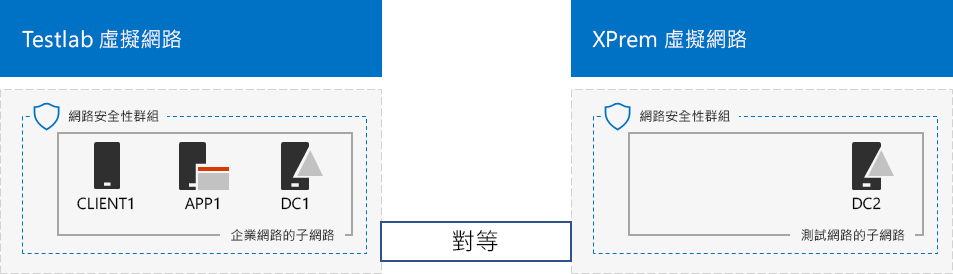
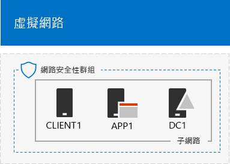

# <a name="simulated-cross-premises-virtual-network-in-a-microsoft-365-test-environment"></a>Microsoft 365 測試環境中模擬的跨單位部署虛擬網路

 **摘要：** 在 Microsoft Azure 中建立模擬的跨單位部署虛擬網路，以作為開發/測試環境。
  
本文逐步引導您建立模擬的混合式雲端環境，具有使用兩個 Azure 虛擬網路的 Microsoft Azure。以下是產生的組態配置。 
  

  
它模擬 Azure IaaS 混合式雲端生產環境，包括：
  
- 裝載在 Azure 虛擬網路 (TestLab 虛擬網路) 中模擬簡化的內部部署網路。
    
- 裝載在 Azure 中模擬的跨單位部署虛擬網路 (XPrem)。
    
- 兩個虛擬網路之間的 VNet 對等關係。
    
- 在 XPrem 虛擬網路中的第二個網域控制站。
    
這可作為基礎通用的起點，讓您可以： 
  
- 在模擬的 Azure IaaS 混合式雲端環境中開發和測試應用程式。
    
- 建立電腦的測試組態，一些在 TestLab 中虛擬網路、一些在 XPrem 虛擬網路中，以模擬混合式雲端的 IT 工作負載。
    
設定此開發/測試環境有三個主要階段︰
  
1. 設定 TestLab 虛擬網路。
    
2. 建立跨單位的虛擬網路
    
3. 設定 DC2。
    
> [!NOTE]
> 此組態需要付費的 Azure 訂用帳戶。 

您可以利用額外的[測試實驗室指南](m365-enterprise-test-lab-guides.md)或靠您自己，使用所產生的環境來測試 [Microsoft 365 企業版](https://www.microsoft.com/microsoft-365/enterprise)的功能。


> [!TIP]
> 按一下[這裡](media/m365-enterprise-test-lab-guides/Microsoft365EnterpriseTLGStack.pdf) (英文)，可查看 Microsoft 365 企業版測試實驗室指南堆疊中所有文章的視覺對應。

## <a name="phase-1-configure-the-testlab-virtual-network"></a>階段 1：設定 TestLab 虛擬網路

使用**模擬企業基底組態**中 [階段 1][](simulated-ent-base-configuration-microsoft-365-enterprise.md) 的說明，在名為 TestLab 的 Azure 虛擬網路中設定 DC1、APP1、CLIENT1 電腦。
  
這是您目前的組態。 
  

  
## <a name="phase-2-create-the-xprem-virtual-network"></a>階段 2：建立 XPrem 虛擬網路

在這個階段，要建立並設定新的 XPrem 虛擬網路，然後使用 VNet 對等將其連線至 TestLab 虛擬網路。
  
首先，在本機電腦上啟動 Azure PowerShell 提示字元。
  
> [!NOTE]
> 下列命令集會使用最新版的 Azure PowerShell。請參閱[開始使用 Azure PowerShell Cmdlet](https://docs.microsoft.com/powershell/azureps-cmdlets-docs/)。 
  
使用此命令登入您的 Azure 帳戶。
  
```powershell
Connect-AzAccount
```

使用此命令取得訂用帳戶名稱。
  
```powershell
Get-AzSubscription | Sort Name | Select Name
```

設定 Azure 訂用帳戶。以正確的名稱取代括號中的所有項目 (包括 \< 和 > 字元)。
  
```powershell
$subscrName="<subscription name>"
Select-AzSubscription -SubscriptionName $subscrName
```

接下來，建立 XPrem 虛擬網路，並使用這些命令以網路安全性群組保護它。
  
```powershell
$rgName="<name of the resource group that you used for your TestLab virtual network>"
$locName=(Get-AzResourceGroup -Name $rgName).Location
$Testnet=New-AzVirtualNetworkSubnetConfig -Name "Testnet" -AddressPrefix 192.168.0.0/24
New-AzVirtualNetwork -Name "XPrem" -ResourceGroupName $rgName -Location $locName -AddressPrefix 192.168.0.0/16 -Subnet $Testnet -DNSServer 10.0.0.4
$rule1=New-AzNetworkSecurityRuleConfig -Name "RDPTraffic" -Description "Allow RDP to all VMs on the subnet" -Access Allow -Protocol Tcp -Direction Inbound -Priority 100 -SourceAddressPrefix Internet -SourcePortRange * -DestinationAddressPrefix * -DestinationPortRange 3389
New-AzNetworkSecurityGroup -Name "Testnet" -ResourceGroupName $rgName -Location $locName -SecurityRules $rule1
$vnet=Get-AzVirtualNetwork -ResourceGroupName $rgName -Name XPrem
$nsg=Get-AzNetworkSecurityGroup -Name "Testnet" -ResourceGroupName $rgName
Set-AzVirtualNetworkSubnetConfig -VirtualNetwork $vnet -Name "Testnet" -AddressPrefix 192.168.0.0/24 -NetworkSecurityGroup $nsg
$vnet | Set-AzVirtualNetwork
```

接下來，使用這些命令在 TestLab 和 XPrem VNets 之間建立 VNet 對等關係。
  
```powershell
$rgName="<name of the resource group that you used for your TestLab virtual network>"
$vnet1=Get-AzVirtualNetwork -ResourceGroupName $rgName -Name TestLab
$vnet2=Get-AzVirtualNetwork -ResourceGroupName $rgName -Name XPrem
Add-AzVirtualNetworkPeering -Name TestLab2XPrem -VirtualNetwork $vnet1 -RemoteVirtualNetworkId $vnet2.Id
Add-AzVirtualNetworkPeering -Name XPrem2TestLab -VirtualNetwork $vnet2 -RemoteVirtualNetworkId $vnet1.Id
```

這是您目前的設定。 
  

  
## <a name="phase-3-configure-dc2"></a>階段 3：設定 DC2

在這個階段，要在 XPrem 虛擬網路中建立 DC2 虛擬機器，然後將它設定為複本網域控制站。
  
首先，為 DC2 建立虛擬機器。在本機電腦上的 Azure PowerShell 命令提示字元執行這些命令。
  
```powershell
$rgName="<your resource group name>"
$locName=(Get-AzResourceGroup -Name $rgName).Location
$vnet=Get-AzVirtualNetwork -Name XPrem -ResourceGroupName $rgName
$pip=New-AzPublicIpAddress -Name DC2-PIP -ResourceGroupName $rgName -Location $locName -AllocationMethod Dynamic
$nic=New-AzNetworkInterface -Name DC2-NIC -ResourceGroupName $rgName -Location $locName -SubnetId $vnet.Subnets[0].Id -PublicIpAddressId $pip.Id -PrivateIpAddress 192.168.0.4
$vm=New-AzVMConfig -VMName DC2 -VMSize Standard_A1
$cred=Get-Credential -Message "Type the name and password of the local administrator account for DC2."
$vm=Set-AzVMOperatingSystem -VM $vm -Windows -ComputerName DC2 -Credential $cred -ProvisionVMAgent -EnableAutoUpdate
$vm=Set-AzVMSourceImage -VM $vm -PublisherName MicrosoftWindowsServer -Offer WindowsServer -Skus 2016-Datacenter -Version "latest"
$vm=Add-AzVMNetworkInterface -VM $vm -Id $nic.Id
$vm=Set-AzVMOSDisk -VM $vm -Name "DC2-OS" -DiskSizeInGB 128 -CreateOption FromImage -StorageAccountType "Standard_LRS"
$diskConfig=New-AzDiskConfig -AccountType "Standard_LRS" -Location $locName -CreateOption Empty -DiskSizeGB 20
$dataDisk1=New-AzDisk -DiskName "DC2-DataDisk1" -Disk $diskConfig -ResourceGroupName $rgName
$vm=Add-AzVMDataDisk -VM $vm -Name "DC2-DataDisk1" -CreateOption Attach -ManagedDiskId $dataDisk1.Id -Lun 1
New-AzVM -ResourceGroupName $rgName -Location $locName -VM $vm
```

然後，使用本機系統管理員帳戶的名稱和密碼從 [Azure 入口網站](https://portal.azure.com)連線到 DC2 虛擬機器。
  
接下來，設定 Windows 防火牆規則以允許流量進行基本連線能力測試。在 DC2 上的系統管理員層級的 Windows PowerShell 命令提示字元中，執行下列命令。 
  
```powershell
Set-NetFirewallRule -DisplayName "File and Printer Sharing (Echo Request - ICMPv4-In)" -enabled True
ping dc1.corp.contoso.com
```

ping 命令應會得到來自 IP 位址 10.0.0.4 四次成功的回覆。這是對 VNet 對等關係流量的測試。 
  
接著，從 DC2 上的 PowerShell 命令提示字元，使用此命令將額外的資料磁碟新增為新的磁碟區 (磁碟機代號 F:)。
  
```powershell
Get-Disk | Where PartitionStyle -eq "RAW" | Initialize-Disk -PartitionStyle MBR -PassThru | New-Partition -AssignDriveLetter -UseMaximumSize | Format-Volume -FileSystem NTFS -NewFileSystemLabel "WSAD Data"
```

接著，將 DC2 設定為 corp.contoso.com 網域的複本網域控制站。從 DC2 上的 PowerShell 命令提示字元執行下列命令。
  
```powershell
Install-WindowsFeature AD-Domain-Services -IncludeManagementTools
Install-ADDSDomainController -Credential (Get-Credential CORP\User1) -DomainName "corp.contoso.com" -InstallDns:$true -DatabasePath "F:\NTDS" -LogPath "F:\Logs" -SysvolPath "F:\SYSVOL"
```

請注意，系統會提示您提供 CORP\\User1 的密碼和目錄服務復原模式 (DSRM) 的密碼，並重新啟動 DC2。 
  
既然 XPrem 虛擬網路有自己的 DNS 伺服器 (DC2)，您必須將 XPrem 虛擬網絡設定為使用此 DNS 伺服器。在本機電腦上使用 Azure PowerShell 命令提示字元執行下列命令。
  
```powershell
$vnet=Get-AzVirtualNetwork -ResourceGroupName $rgName -name "XPrem"
$vnet.DhcpOptions.DnsServers="192.168.0.4" 
Set-AzVirtualNetwork -VirtualNetwork $vnet
Restart-AzVM -ResourceGroupName $rgName -Name "DC2"
```

在本機電腦從 Azure 入口網站，使用 CORP\\User1 的憑證連線到 DC1。若要設定 CORP 網域以便讓電腦和使用者可使用其本機網域控制站進行驗證，在 DC1 上以系統管理員層級的 Windows PowerShell 命令提示字元執行下列命令。
  
```powershell
New-ADReplicationSite -Name "TestLab" 
New-ADReplicationSite -Name "XPrem"
New-ADReplicationSubnet -Name "10.0.0.0/8" -Site "TestLab"
New-ADReplicationSubnet -Name "192.168.0.0/16" -Site "XPrem"
```

這是您目前的設定。 
  

  
模擬的 Azure 混合式雲端環境已準備好進行測試。
  
您現在已準備好嘗試 [Microsoft 365 企業版](https://www.microsoft.com/microsoft-365/enterprise)的其他功能。
  
## <a name="next-steps"></a>後續步驟

探索這些額外的測試實驗室指南集合：
  
- [身分識別](m365-enterprise-test-lab-guides.md#identity)
- [行動裝置管理](m365-enterprise-test-lab-guides.md#mobile-device-management)
- [資訊保護](m365-enterprise-test-lab-guides.md#information-protection)

## <a name="see-also"></a>另請參閱

[Microsoft 365 企業版測試實驗室指南](m365-enterprise-test-lab-guides.md)

[部署 Microsoft 365 企業版](deploy-microsoft-365-enterprise.md)

[Microsoft 365 企業版文件](https://docs.microsoft.com/microsoft-365-enterprise/)
