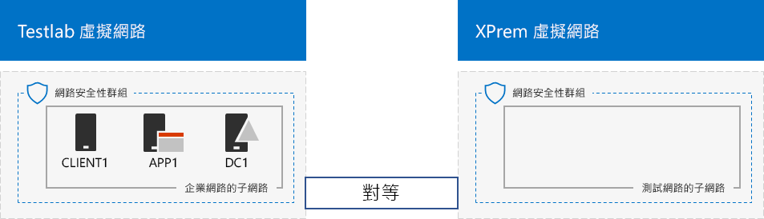

# <a name="simulated-cross-premises-virtual-network-in-a-microsoft-365-test-environment"></a><span data-ttu-id="25450-103">Microsoft 365 測試環境中模擬的跨單位部署虛擬網路</span><span class="sxs-lookup"><span data-stu-id="25450-103">Simulated cross-premises virtual network in a Microsoft 365 test environment</span></span>

<span data-ttu-id="25450-104">*此測試實驗室指南可用於 enterprise 和 Office 365 企業測試環境的 Microsoft 365。*</span><span class="sxs-lookup"><span data-stu-id="25450-104">*This Test Lab Guide can be used for both Microsoft 365 for enterprise and Office 365 Enterprise test environments.*</span></span>

<span data-ttu-id="25450-p101">本文逐步引導您建立模擬的混合式雲端環境，具有使用兩個 Azure 虛擬網路的 Microsoft Azure。以下是產生的組態配置。</span><span class="sxs-lookup"><span data-stu-id="25450-p101">This article steps you through creating a simulated hybrid cloud environment with Microsoft Azure using two Azure virtual networks. Here is the resulting configuration.</span></span> 
  

  
<span data-ttu-id="25450-108">它模擬 Azure IaaS 混合式雲端生產環境，包括：</span><span class="sxs-lookup"><span data-stu-id="25450-108">This simulates an Azure IaaS hybrid cloud production environment and consists of:</span></span>
  
- <span data-ttu-id="25450-109">裝載在 Azure 虛擬網路 (TestLab 虛擬網路) 中模擬簡化的內部部署網路。</span><span class="sxs-lookup"><span data-stu-id="25450-109">A simulated and simplified on-premises network hosted in an Azure virtual network (the TestLab virtual network).</span></span>
    
- <span data-ttu-id="25450-110">裝載在 Azure 中模擬的跨單位部署虛擬網路 (XPrem)。</span><span class="sxs-lookup"><span data-stu-id="25450-110">A simulated cross-premises virtual network hosted in Azure (XPrem).</span></span>
    
- <span data-ttu-id="25450-111">兩個虛擬網路之間的 VNet 對等關係。</span><span class="sxs-lookup"><span data-stu-id="25450-111">A VNet peering relationship between the two virtual networks.</span></span>
    
- <span data-ttu-id="25450-112">在 XPrem 虛擬網路中的第二個網域控制站。</span><span class="sxs-lookup"><span data-stu-id="25450-112">A secondary domain controller in the XPrem virtual network.</span></span>
    
<span data-ttu-id="25450-113">這可作為基礎通用的起點，讓您可以：</span><span class="sxs-lookup"><span data-stu-id="25450-113">This provides a basis and common starting point from which you can:</span></span> 
  
- <span data-ttu-id="25450-114">在模擬的 Azure IaaS 混合式雲端環境中開發和測試應用程式。</span><span class="sxs-lookup"><span data-stu-id="25450-114">Develop and test applications in a simulated Azure IaaS hybrid cloud environment.</span></span>
    
- <span data-ttu-id="25450-115">建立電腦的測試組態，一些在 TestLab 中虛擬網路、一些在 XPrem 虛擬網路中，以模擬混合式雲端的 IT 工作負載。</span><span class="sxs-lookup"><span data-stu-id="25450-115">Create test configurations of computers, some within the TestLab virtual network and some within the XPrem virtual network, to simulate hybrid cloud-based IT workloads.</span></span>
    
<span data-ttu-id="25450-116">設定此測試環境有三個主要階段︰</span><span class="sxs-lookup"><span data-stu-id="25450-116">There are three major phases to setting up this test environment:</span></span>
  
1. <span data-ttu-id="25450-117">設定 TestLab 虛擬網路。</span><span class="sxs-lookup"><span data-stu-id="25450-117">Configure the TestLab virtual network.</span></span>
    
2. <span data-ttu-id="25450-118">建立跨單位的虛擬網路</span><span class="sxs-lookup"><span data-stu-id="25450-118">Create the cross-premises virtual network.</span></span>
    
3. <span data-ttu-id="25450-119">設定 DC2。</span><span class="sxs-lookup"><span data-stu-id="25450-119">Configure DC2.</span></span>
    
> [!NOTE]
> <span data-ttu-id="25450-120">此組態需要付費的 Azure 訂用帳戶。</span><span class="sxs-lookup"><span data-stu-id="25450-120">This configuration requires a paid Azure subscription.</span></span> 

<span data-ttu-id="25450-121">您可以使用所產生的環境，利用其他[測試實驗室指南](m365-enterprise-test-lab-guides.md)或您自己的方式，測試[適用于 enterprise 的 Microsoft 365](https://www.microsoft.com/microsoft-365/enterprise)的功能。</span><span class="sxs-lookup"><span data-stu-id="25450-121">You can use the resulting environment to test the features and functionality of [Microsoft 365 for enterprise](https://www.microsoft.com/microsoft-365/enterprise) with additional [Test Lab Guides](m365-enterprise-test-lab-guides.md) or on your own.</span></span>


> [!TIP]
> <span data-ttu-id="25450-123">移至 [microsoft 365 for Enterprise Test Lab Guide 堆疊](../media/m365-enterprise-test-lab-guides/Microsoft365EnterpriseTLGStack.pdf) ，以顯示 microsoft 365 For Enterprise Test lab guide 堆疊中所有文章的視覺對應。</span><span class="sxs-lookup"><span data-stu-id="25450-123">Go to [Microsoft 365 for enterprise Test Lab Guide Stack](../media/m365-enterprise-test-lab-guides/Microsoft365EnterpriseTLGStack.pdf) for a visual map to all the articles in the Microsoft 365 for enterprise Test Lab Guide stack.</span></span>

## <a name="phase-1-configure-the-testlab-virtual-network"></a><span data-ttu-id="25450-124">階段 1：設定 TestLab 虛擬網路</span><span class="sxs-lookup"><span data-stu-id="25450-124">Phase 1: Configure the TestLab virtual network</span></span>

<span data-ttu-id="25450-125">使用**模擬企業基底組態**中 [階段 1][](simulated-ent-base-configuration-microsoft-365-enterprise.md) 的說明，在名為 TestLab 的 Azure 虛擬網路中設定 DC1、APP1、CLIENT1 電腦。</span><span class="sxs-lookup"><span data-stu-id="25450-125">Use the instructions in **Phase 1** of the [simulated enterprise base configuration](simulated-ent-base-configuration-microsoft-365-enterprise.md) to configure the DC1, APP1, and CLIENT1 computers in the Azure virtual network named TestLab.</span></span>
  
<span data-ttu-id="25450-126">這是您目前的組態。</span><span class="sxs-lookup"><span data-stu-id="25450-126">This is your current configuration.</span></span> 
  

  
## <a name="phase-2-create-the-xprem-virtual-network"></a><span data-ttu-id="25450-128">階段 2：建立 XPrem 虛擬網路</span><span class="sxs-lookup"><span data-stu-id="25450-128">Phase 2: Create the XPrem virtual network</span></span>

<span data-ttu-id="25450-129">在這個階段，要建立並設定新的 XPrem 虛擬網路，然後使用 VNet 對等將其連線至 TestLab 虛擬網路。</span><span class="sxs-lookup"><span data-stu-id="25450-129">In this phase, you create and configure the new XPrem virtual network and then connect it to the TestLab virtual network with VNet peering.</span></span>
  
<span data-ttu-id="25450-130">首先，在本機電腦上啟動 Azure PowerShell 提示字元。</span><span class="sxs-lookup"><span data-stu-id="25450-130">First, start an Azure PowerShell prompt on your local computer.</span></span>
  
> [!NOTE]
> <span data-ttu-id="25450-p102">下列命令集會使用最新版的 Azure PowerShell。請參閱[開始使用 Azure PowerShell Cmdlet](https://docs.microsoft.com/powershell/azureps-cmdlets-docs/)。</span><span class="sxs-lookup"><span data-stu-id="25450-p102">The following command sets use the latest version of Azure PowerShell. See [Get started with Azure PowerShell cmdlets](https://docs.microsoft.com/powershell/azureps-cmdlets-docs/).</span></span> 
  
<span data-ttu-id="25450-133">使用此命令登入您的 Azure 帳戶。</span><span class="sxs-lookup"><span data-stu-id="25450-133">Sign in to your Azure account with this command.</span></span>
  
```powershell
Connect-AzAccount
```

<span data-ttu-id="25450-134">使用此命令取得訂用帳戶名稱。</span><span class="sxs-lookup"><span data-stu-id="25450-134">Get your subscription name using this command.</span></span>
  
```powershell
Get-AzSubscription | Sort Name | Select Name
```

<span data-ttu-id="25450-p103">設定您的 Azure 訂閱帳戶。以正確的名稱取代括號中的所有項目，包括 \< and > 字元。</span><span class="sxs-lookup"><span data-stu-id="25450-p103">Set your Azure subscription. Replace everything within the quotes, including the \< and > characters, with the correct names.</span></span>
  
```powershell
$subscrName="<subscription name>"
Select-AzSubscription -SubscriptionName $subscrName
```

<span data-ttu-id="25450-137">接下來，建立 XPrem 虛擬網路，並使用這些命令以網路安全性群組保護它。</span><span class="sxs-lookup"><span data-stu-id="25450-137">Next, create the XPrem virtual network and protect it with a network security group with these commands.</span></span>
  
```powershell
$rgName="<name of the resource group that you used for your TestLab virtual network>"
$locName=(Get-AzResourceGroup -Name $rgName).Location
$Testnet=New-AzVirtualNetworkSubnetConfig -Name "Testnet" -AddressPrefix 192.168.0.0/24
New-AzVirtualNetwork -Name "XPrem" -ResourceGroupName $rgName -Location $locName -AddressPrefix 192.168.0.0/16 -Subnet $Testnet -DNSServer 10.0.0.4
$rule1=New-AzNetworkSecurityRuleConfig -Name "RDPTraffic" -Description "Allow RDP to all VMs on the subnet" -Access Allow -Protocol Tcp -Direction Inbound -Priority 100 -SourceAddressPrefix Internet -SourcePortRange * -DestinationAddressPrefix * -DestinationPortRange 3389
New-AzNetworkSecurityGroup -Name "Testnet" -ResourceGroupName $rgName -Location $locName -SecurityRules $rule1
$vnet=Get-AzVirtualNetwork -ResourceGroupName $rgName -Name XPrem
$nsg=Get-AzNetworkSecurityGroup -Name "Testnet" -ResourceGroupName $rgName
Set-AzVirtualNetworkSubnetConfig -VirtualNetwork $vnet -Name "Testnet" -AddressPrefix 192.168.0.0/24 -NetworkSecurityGroup $nsg
$vnet | Set-AzVirtualNetwork
```

<span data-ttu-id="25450-138">接下來，使用這些命令在 TestLab 和 XPrem VNets 之間建立 VNet 對等關係。</span><span class="sxs-lookup"><span data-stu-id="25450-138">Next, you create the VNet peering relationship between the TestLab and XPrem VNets with these commands.</span></span>
  
```powershell
$rgName="<name of the resource group that you used for your TestLab virtual network>"
$vnet1=Get-AzVirtualNetwork -ResourceGroupName $rgName -Name TestLab
$vnet2=Get-AzVirtualNetwork -ResourceGroupName $rgName -Name XPrem
Add-AzVirtualNetworkPeering -Name TestLab2XPrem -VirtualNetwork $vnet1 -RemoteVirtualNetworkId $vnet2.Id
Add-AzVirtualNetworkPeering -Name XPrem2TestLab -VirtualNetwork $vnet2 -RemoteVirtualNetworkId $vnet1.Id
```

<span data-ttu-id="25450-139">這是您目前的設定。</span><span class="sxs-lookup"><span data-stu-id="25450-139">This is your current configuration.</span></span> 
  

  
## <a name="phase-3-configure-dc2"></a><span data-ttu-id="25450-141">階段 3：設定 DC2</span><span class="sxs-lookup"><span data-stu-id="25450-141">Phase 3: Configure DC2</span></span>

<span data-ttu-id="25450-142">在這個階段，要在 XPrem 虛擬網路中建立 DC2 虛擬機器，然後將它設定為複本網域控制站。</span><span class="sxs-lookup"><span data-stu-id="25450-142">In this phase, you create the DC2 virtual machine in the XPrem virtual network and then configure it as a replica domain controller.</span></span>
  
<span data-ttu-id="25450-p104">首先，為 DC2 建立虛擬機器。在本機電腦上的 Azure PowerShell 命令提示字元執行這些命令。</span><span class="sxs-lookup"><span data-stu-id="25450-p104">First, create a virtual machine for DC2. Run these commands at the Azure PowerShell command prompt on your local computer.</span></span>
  
```powershell
$rgName="<your resource group name>"
$locName=(Get-AzResourceGroup -Name $rgName).Location
$vnet=Get-AzVirtualNetwork -Name XPrem -ResourceGroupName $rgName
$pip=New-AzPublicIpAddress -Name DC2-PIP -ResourceGroupName $rgName -Location $locName -AllocationMethod Dynamic
$nic=New-AzNetworkInterface -Name DC2-NIC -ResourceGroupName $rgName -Location $locName -SubnetId $vnet.Subnets[0].Id -PublicIpAddressId $pip.Id -PrivateIpAddress 192.168.0.4
$vm=New-AzVMConfig -VMName DC2 -VMSize Standard_A2_V2
$cred=Get-Credential -Message "Type the name and password of the local administrator account for DC2."
$vm=Set-AzVMOperatingSystem -VM $vm -Windows -ComputerName DC2 -Credential $cred -ProvisionVMAgent -EnableAutoUpdate
$vm=Set-AzVMSourceImage -VM $vm -PublisherName MicrosoftWindowsServer -Offer WindowsServer -Skus 2016-Datacenter -Version "latest"
$vm=Add-AzVMNetworkInterface -VM $vm -Id $nic.Id
$vm=Set-AzVMOSDisk -VM $vm -Name "DC2-OS" -DiskSizeInGB 128 -CreateOption FromImage -StorageAccountType "Standard_LRS"
$diskConfig=New-AzDiskConfig -AccountType "Standard_LRS" -Location $locName -CreateOption Empty -DiskSizeGB 20
$dataDisk1=New-AzDisk -DiskName "DC2-DataDisk1" -Disk $diskConfig -ResourceGroupName $rgName
$vm=Add-AzVMDataDisk -VM $vm -Name "DC2-DataDisk1" -CreateOption Attach -ManagedDiskId $dataDisk1.Id -Lun 1
New-AzVM -ResourceGroupName $rgName -Location $locName -VM $vm
```

<span data-ttu-id="25450-145">然後，使用本機系統管理員帳戶的名稱和密碼從 [Azure 入口網站](https://portal.azure.com)連線到 DC2 虛擬機器。</span><span class="sxs-lookup"><span data-stu-id="25450-145">Next, connect to the new DC2 virtual machine from the [Azure portal](https://portal.azure.com) using its local administrator account name and password.</span></span>
  
<span data-ttu-id="25450-p105">接下來，設定 Windows 防火牆規則以允許流量進行基本連線能力測試。在 DC2 上的系統管理員層級的 Windows PowerShell 命令提示字元中，執行下列命令。</span><span class="sxs-lookup"><span data-stu-id="25450-p105">Next, configure a Windows Firewall rule to allow traffic for basic connectivity testing. From an administrator-level Windows PowerShell command prompt on DC2, run these commands.</span></span> 
  
```powershell
Set-NetFirewallRule -DisplayName "File and Printer Sharing (Echo Request - ICMPv4-In)" -enabled True
ping dc1.corp.contoso.com
```

<span data-ttu-id="25450-p106">ping 命令應會得到來自 IP 位址 10.0.0.4 四次成功的回覆。這是對 VNet 對等關係流量的測試。</span><span class="sxs-lookup"><span data-stu-id="25450-p106">The ping command should result in four successful replies from IP address 10.0.0.4. This is a test of traffic across the VNet peering relationship.</span></span> 
  
<span data-ttu-id="25450-150">接著，從 DC2 上的 PowerShell 命令提示字元，使用此命令將額外的資料磁碟新增為新的磁碟區 (磁碟機代號 F:)。</span><span class="sxs-lookup"><span data-stu-id="25450-150">Next, add the extra data disk as a new volume with the drive letter F: with this command from the Windows PowerShell command prompt on DC2.</span></span>
  
```powershell
Get-Disk | Where PartitionStyle -eq "RAW" | Initialize-Disk -PartitionStyle MBR -PassThru | New-Partition -AssignDriveLetter -UseMaximumSize | Format-Volume -FileSystem NTFS -NewFileSystemLabel "WSAD Data"
```

<span data-ttu-id="25450-p107">接著，將 DC2 設定為 corp.contoso.com 網域的複本網域控制站。從 DC2 上的 PowerShell 命令提示字元執行下列命令。</span><span class="sxs-lookup"><span data-stu-id="25450-p107">Next, configure DC2 as a replica domain controller for the corp.contoso.com domain. Run these commands from the Windows PowerShell command prompt on DC2.</span></span>
  
```powershell
Install-WindowsFeature AD-Domain-Services -IncludeManagementTools
Install-ADDSDomainController -Credential (Get-Credential CORP\User1) -DomainName "corp.contoso.com" -InstallDns:$true -DatabasePath "F:\NTDS" -LogPath "F:\Logs" -SysvolPath "F:\SYSVOL"
```

<span data-ttu-id="25450-153">請注意，系統會提示您提供 CORP\\User1 的密碼和目錄服務復原模式 (DSRM) 的密碼，並重新啟動 DC2。</span><span class="sxs-lookup"><span data-stu-id="25450-153">Note that you are prompted to supply both the CORP\\User1 password and a Directory Services Restore Mode (DSRM) password, and to restart DC2.</span></span> 
  
<span data-ttu-id="25450-p108">既然 XPrem 虛擬網路有自己的 DNS 伺服器 (DC2)，您必須將 XPrem 虛擬網絡設定為使用此 DNS 伺服器。在本機電腦上使用 Azure PowerShell 命令提示字元執行下列命令。</span><span class="sxs-lookup"><span data-stu-id="25450-p108">Now that the XPrem virtual network has its own DNS server (DC2), you must configure the XPrem virtual network to use this DNS server. Run these commands from the Azure PowerShell command prompt on your local computer.</span></span>
  
```powershell
$vnet=Get-AzVirtualNetwork -ResourceGroupName $rgName -name "XPrem"
$vnet.DhcpOptions.DnsServers="192.168.0.4" 
Set-AzVirtualNetwork -VirtualNetwork $vnet
Restart-AzVM -ResourceGroupName $rgName -Name "DC2"
```

<span data-ttu-id="25450-p109">在本機電腦從 Azure 入口網站，使用 CORP\\User1 的憑證連線到 DC1。若要設定 CORP 網域以便讓電腦和使用者可使用其本機網域控制站進行驗證，在 DC1 上以系統管理員層級的 Windows PowerShell 命令提示字元執行下列命令。</span><span class="sxs-lookup"><span data-stu-id="25450-p109">From the Azure portal on your local computer, connect to DC1 with the CORP\\User1 credentials. To configure the CORP domain so that computers and users use their local domain controller for authentication, run these commands from an administrator-level Windows PowerShell command prompt on DC1.</span></span>
  
```powershell
New-ADReplicationSite -Name "TestLab" 
New-ADReplicationSite -Name "XPrem"
New-ADReplicationSubnet -Name "10.0.0.0/8" -Site "TestLab"
New-ADReplicationSubnet -Name "192.168.0.0/16" -Site "XPrem"
```

<span data-ttu-id="25450-158">這是您目前的設定。</span><span class="sxs-lookup"><span data-stu-id="25450-158">This is your current configuration.</span></span> 
  

  
<span data-ttu-id="25450-160">模擬的 Azure 混合式雲端環境已準備好進行測試。</span><span class="sxs-lookup"><span data-stu-id="25450-160">Your simulated Azure hybrid cloud environment is now ready for testing.</span></span>
  
<span data-ttu-id="25450-161">您現在已準備好嘗試使用 [Microsoft 365 for enterprise](https://www.microsoft.com/microsoft-365/enterprise)的其他功能。</span><span class="sxs-lookup"><span data-stu-id="25450-161">You are now ready to experiment with additional features of [Microsoft 365 for enterprise](https://www.microsoft.com/microsoft-365/enterprise).</span></span>
  
## <a name="next-steps"></a><span data-ttu-id="25450-162">後續步驟</span><span class="sxs-lookup"><span data-stu-id="25450-162">Next steps</span></span>

<span data-ttu-id="25450-163">探索這些額外的測試實驗室指南集合：</span><span class="sxs-lookup"><span data-stu-id="25450-163">Explore these additional sets of Test Lab Guides:</span></span>
  
- [<span data-ttu-id="25450-164">身分識別</span><span class="sxs-lookup"><span data-stu-id="25450-164">Identity</span></span>](m365-enterprise-test-lab-guides.md#identity)
- [<span data-ttu-id="25450-165">行動裝置管理</span><span class="sxs-lookup"><span data-stu-id="25450-165">Mobile device management</span></span>](m365-enterprise-test-lab-guides.md#mobile-device-management)
- [<span data-ttu-id="25450-166">資訊保護</span><span class="sxs-lookup"><span data-stu-id="25450-166">Information protection</span></span>](m365-enterprise-test-lab-guides.md#information-protection)

## <a name="see-also"></a><span data-ttu-id="25450-167">另請參閱</span><span class="sxs-lookup"><span data-stu-id="25450-167">See also</span></span>

[<span data-ttu-id="25450-168">Microsoft 365 企業版測試實驗室指南</span><span class="sxs-lookup"><span data-stu-id="25450-168">Microsoft 365 for enterprise Test Lab Guides</span></span>](m365-enterprise-test-lab-guides.md)

[<span data-ttu-id="25450-169">Microsoft 365 企業版概觀</span><span class="sxs-lookup"><span data-stu-id="25450-169">Microsoft 365 for enterprise overview</span></span>](microsoft-365-overview.md)

[<span data-ttu-id="25450-170">適用于企業的 Microsoft 365 檔</span><span class="sxs-lookup"><span data-stu-id="25450-170">Microsoft 365 for enterprise documentation</span></span>](https://docs.microsoft.com/microsoft-365-enterprise/)
