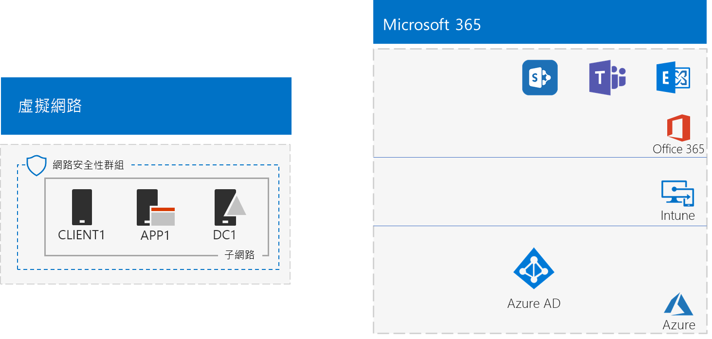
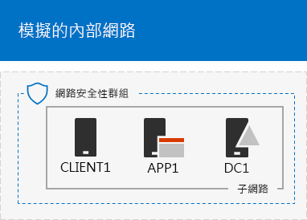
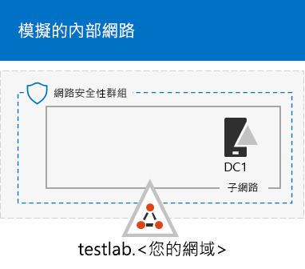
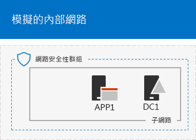

# <a name="the-simulated-enterprise-base-configuration"></a>模擬企業基本設定

本文提供逐步指示來為 Microsoft 365 企業版建立簡化的環境，其中包含：

- Office 365 E5 和 EMS E5 試用或永久訂閱。
- 簡化的組織內部網域與網際網路的連線，由 Azure 虛擬網路上的三部虛擬機器 (DC1、APP1 及 CLIENT1) 組成。
 


您可以利用額外的[測試實驗室指南](m365-enterprise-test-lab-guides.md)或靠您自己，使用所產生的環境來測試 [Microsoft 365 企業版](https://www.microsoft.com/microsoft-365/enterprise)的功能。


> [!TIP]
> 按一下[這裡](https://aka.ms/m365etlgstack)，可查看 Microsoft 365 企業版測試實驗室指南堆疊中所有文章的視覺對應。

## <a name="phase-1-create-a-simulated-intranet"></a>階段 1：建立模擬的內部網路

在這個階段，您可以在 Azure 基礎結構服務中建立模擬內部網路，其中包含 Windows Server Active Directory 網域控制站、應用程式伺服器和用戶端電腦。 

您可以在其他 [Microsoft 365 企業版測試實驗室指南](m365-enterprise-test-lab-guides.md)中使用這些電腦，以設定並示範混合式身分識別及其他功能。

### <a name="method-1-build-your-simulated-intranet-with-an-azure-resource-manager-template"></a>方法 1：使用 Azure Resource Manager 範本建立模擬內部網路

在這個方法中，您可以使用 Azure Resource Manager (ARM) 範本來建立模擬內部網路。ARM 範本包含建立 Azure 網路基礎結構、虛擬機器及其設定的所有指示。

部署範本之前，請先閱讀[範本讀我檔案頁面](https://github.com/maxskunkworks/TLG/tree/master/tlg-base-config_3-vm.m365-ems)並準備好下列資訊：

- 測試環境的公用 DNS 網域名稱 (testlab.\<您的公用網域>)。您必須在 [自訂部署]**** 面的 [網域名稱]**** 欄位中輸入此名稱。
- 虛擬機器公用 IP 位址 URL 上的 DNS 標籤前置詞。您必須在 [自訂部署]**** 頁面的 [DNS 標籤前置詞]**** 欄位中輸入此標籤。

閱讀指示之後，請在[範本讀我檔案頁面](https://github.com/maxskunkworks/TLG/tree/master/tlg-base-config_3-vm.m365-ems)上按一下 [部署至 Azure]**** 以開始使用。

>[!Note]
>ARM 範本所建立的模擬內部網路需要 Azure 付費訂用帳戶。
>

範本完成後，您的設定如下。



### <a name="method-2-build-your-simulated-intranet-with-azure-powershell"></a>方法 2：使用 Azure PowerShell 建立模擬內部網路

在這個方法中，您使用 Windows PowerShell 和 Azure PowerShell 模組建置網路基礎結構、虛擬機器及其設定。

如果您想要使用 PowerShell 獲得一次一個步驟建立 Azure 基礎結構元素的體驗，則使用此方法。然後，您可以自行定義 PowerShell 命令區塊，以便在 Azure 中部署其他虛擬機器。

#### <a name="step-1-create-dc1"></a>步驟 1：建立 DC1

在這個步驟，我們會建立 Azure 虛擬網路並新增 DC1 (這部虛擬機器是 Windows Server Active Directory (AD) 網域的網域控制站)。

首先，在本機電腦上啟動 Windows PowerShell 命令提示字元。
  
> [!NOTE]
> 下列命令集會使用最新版的 Azure PowerShell。請參閱[開始使用 Azure PowerShell Cmdlet](https://docs.microsoft.com/powershell/azureps-cmdlets-docs/)。 
  
使用下列命令登入您的 Azure 帳戶。
  
```
Login-AzureRMAccount
```

使用下列命令取得訂用帳戶名稱。
  
```
Get-AzureRMSubscription | Sort Name | Select Name
```

設定 Azure 訂用帳戶。以正確的名稱取代括號中的所有項目 (包括 < 和 > 字元)。
  
```
$subscr="<subscription name>"
Get-AzureRmSubscription -SubscriptionName $subscr | Select-AzureRmSubscription
```

接著，為您的模擬企業測試實驗室建立新的資源群組。若要判斷資源群組名稱是否是唯一的，可使用此命令來列出現有的資源群組。
  
```
Get-AzureRMResourceGroup | Sort ResourceGroupName | Select ResourceGroupName
```

使用這些命令建立新的資源群組。以正確的名稱取代引號內的所有項目 (包括 < 和 > 字元)。
  
```
$rgName="<resource group name>"
$locName="<location name, such as West US>"
New-AzureRMResourceGroup -Name $rgName -Location $locName
```

接下來，您會建立 TestLab 虛擬網路，該虛擬網路會裝載模擬企業環境的 Corpnet 子網路以及利用網路安全性群組來保護它。填入您的資源群組名稱，並且在本機電腦上的 PowerShell 命令提示字元執行這些命令。
  
```
$rgName="<name of your new resource group>"
$locName=(Get-AzureRmResourceGroup -Name $rgName).Location
$corpnetSubnet=New-AzureRMVirtualNetworkSubnetConfig -Name Corpnet -AddressPrefix 10.0.0.0/24
New-AzureRMVirtualNetwork -Name TestLab -ResourceGroupName $rgName -Location $locName -AddressPrefix 10.0.0.0/8 -Subnet $corpnetSubnet -DNSServer 10.0.0.4
$rule1=New-AzureRMNetworkSecurityRuleConfig -Name "RDPTraffic" -Description "Allow RDP to all VMs on the subnet" -Access Allow -Protocol Tcp -Direction Inbound -Priority 100 -SourceAddressPrefix Internet -SourcePortRange * -DestinationAddressPrefix * -DestinationPortRange 3389
New-AzureRMNetworkSecurityGroup -Name Corpnet -ResourceGroupName $rgName -Location $locName -SecurityRules $rule1
$vnet=Get-AzureRMVirtualNetwork -ResourceGroupName $rgName -Name TestLab
$nsg=Get-AzureRMNetworkSecurityGroup -Name Corpnet -ResourceGroupName $rgName
Set-AzureRMVirtualNetworkSubnetConfig -VirtualNetwork $vnet -Name Corpnet -AddressPrefix "10.0.0.0/24" -NetworkSecurityGroup $nsg
```

接下來，您會建立 DC1 虛擬機器，並將它設定為 **testlab.**\<您的公用網域> Windows Server AD 網域的網域控制站以及 TestLab 虛擬網路中虛擬機器的 DNS 伺服器。例如，如果您的公用網域名稱為 **<span>contoso</span>.com**，則 DC1 虛擬機器會成為 **<span>testlab</span>.contoso.com** 網域的網域控制站。
  
若要建立 DC1 的 Azure 虛擬機器，請填入您的資源群組，並在本機電腦上的 PowerShell 命令提示字元執行這些命令。
  
```
$rgName="<resource group name>"
$locName=(Get-AzureRmResourceGroup -Name $rgName).Location
$vnet=Get-AzureRMVirtualNetwork -Name TestLab -ResourceGroupName $rgName
$pip=New-AzureRMPublicIpAddress -Name DC1-PIP -ResourceGroupName $rgName -Location $locName -AllocationMethod Dynamic
$nic=New-AzureRMNetworkInterface -Name DC1-NIC -ResourceGroupName $rgName -Location $locName -SubnetId $vnet.Subnets[0].Id -PublicIpAddressId $pip.Id -PrivateIpAddress 10.0.0.4
$vm=New-AzureRMVMConfig -VMName DC1 -VMSize Standard_A1
$cred=Get-Credential -Message "Type the name and password of the local administrator account for DC1."
$vm=Set-AzureRMVMOperatingSystem -VM $vm -Windows -ComputerName DC1 -Credential $cred -ProvisionVMAgent -EnableAutoUpdate
$vm=Set-AzureRMVMSourceImage -VM $vm -PublisherName MicrosoftWindowsServer -Offer WindowsServer -Skus 2016-Datacenter -Version "latest"
$vm=Add-AzureRMVMNetworkInterface -VM $vm -Id $nic.Id
$vm=Set-AzureRmVMOSDisk -VM $vm -Name "DC1-OS" -DiskSizeInGB 128 -CreateOption FromImage -StorageAccountType "Standard_LRS"
$diskConfig=New-AzureRmDiskConfig -AccountType "Standard_LRS" -Location $locName -CreateOption Empty -DiskSizeGB 20
$dataDisk1=New-AzureRmDisk -DiskName "DC1-DataDisk1" -Disk $diskConfig -ResourceGroupName $rgName
$vm=Add-AzureRmVMDataDisk -VM $vm -Name "DC1-DataDisk1" -CreateOption Attach -ManagedDiskId $dataDisk1.Id -Lun 1
New-AzureRMVM -ResourceGroupName $rgName -Location $locName -VM $vm
```

系統會提示您輸入 DC1 上本機系統管理員帳戶的使用者名稱和密碼。使用強式密碼，並將名稱和密碼記錄於安全的位置。
  
接下來，連線到 DC1 虛擬機器。
  
1. 在 [Azure 入口網站](https://portal.azure.com)中，按一下 **[資源群組] >** [新的資源群組名稱] **> [DC1] > [連線]**。
    
2. 在開啟的窗格中，按一下 [下載 RDP 檔案]****。開啟所下載的 DC1.rdp 檔案，然後按一下 [連線]****。
    
3. 指定 DC1 本機系統管理員帳戶名稱：
    
   - 對於 Windows 7：
    
     在 [Windows 安全性]**** 對話方塊中，按一下 [使用其他帳戶]****。在 [使用者名稱]**** 中，輸入 **DC1\\**[本機系統管理員帳戶名稱]。
    
   - 對於 Windows 8 或 Windows 10：
    
     在 [Windows 安全性]**** 對話方塊中，按一下 [更多選項]****，然後按 [使用不同帳戶]****。在 [使用者名稱]**** 中，輸入 **DC1\\**[本機系統管理員帳戶名稱]。
    
4. 在 [密碼]**** 中，輸入本機系統管理員帳戶的密碼，然後按一下 [確定]****。
    
5. 出現提示時，按一下 [是]****。
    
接著，使用此命令在 DC1 上系統管理員層級 Windows PowerShell 命令提示字元將額外的資料磁碟新增為新的磁碟區 (磁碟機代號 F:)。
  
```
Get-Disk | Where PartitionStyle -eq "RAW" | Initialize-Disk -PartitionStyle MBR -PassThru | New-Partition -AssignDriveLetter -UseMaximumSize | Format-Volume -FileSystem NTFS -NewFileSystemLabel "WSAD Data"
```

接著，將 DC1 設定為 **testlab.**\<您的公用網域> 網域的網域控制站和 DNS 伺服器。指定您的公用網域名稱，移除 \< 和 > 字元，然後在 DC1 上的系統管理員層級 Windows PowerShell 命令提示字元執行下列命令。
  
```
$yourDomain="<your public domain>"
Install-WindowsFeature AD-Domain-Services -IncludeManagementTools
Install-ADDSForest -DomainName testlab.$yourDomain -DatabasePath "F:\NTDS" -SysvolPath "F:\SYSVOL" -LogPath "F:\Logs"
```
您必須指定安全模式的系統管理員密碼。將此密碼儲存在安全的位置。
  
請注意，這些命令可能需要數分鐘才能完成。
  
DC1 重新啟動後，重新連線到 DC1 虛擬機器。
  
1. 在 [Azure 入口網站](https://portal.azure.com)中，按一下 **[資源群組] >** [您的資源群組名稱] **> [DC1] > [連線]**。
    
2. 執行所下載的 DC1.rdp 檔案，然後按一下 [連線]****。
    
3. 在 [Windows 安全性]**** 中，按一下 [使用其他帳戶]****。在 [使用者名稱]**** 中，輸入 **TESTLAB\\**[本機系統管理員帳戶名稱]。
    
4. 在 [密碼]**** 中，輸入本機系統管理員帳戶的密碼，然後按一下 [確定]****。
    
5. 出現提示時，按一下 [是]****。
    
接下來，建立 Active Directory 中的使用者帳戶，可在登入 TESTLAB 網域成員電腦時使用。在系統管理員層級 Windows PowerShell 命令提示字元執行此命令。
  
```
New-ADUser -SamAccountName User1 -AccountPassword (read-host "Set user password" -assecurestring) -name "User1" -enabled $true -PasswordNeverExpires $true -ChangePasswordAtLogon $false
```

請注意，此命令會提示您提供 User1 帳戶密碼。由於這個帳戶將會用於所有 TESTLAB 網域成員電腦的遠端桌面連線，請選擇強式密碼。記錄 User1 帳戶密碼，並將它儲存在安全的位置。
  
接下來，將新的 User1 帳戶設定為網域、企業和結構描述管理員。在系統管理員層級 Windows PowerShell 命令提示字元執行此命令。
  
```
$yourDomain="<your public domain>"
$domainName = "testlab"+$yourDomain
$userName="user1@" + $domainName
$userSID=(New-Object System.Security.Principal.NTAccount($userName)).Translate([System.Security.Principal.SecurityIdentifier]).Value
$groupNames=@("Domain Admins","Enterprise Admins","Schema Admins")
ForEach ($name in $groupNames) {Add-ADPrincipalGroupMembership -Identity $userSID -MemberOf (Get-ADGroup -Identity $name).SID.Value}
```

關閉 DC1 的遠端桌面工作階段，然後使用 TESTLAB\\User1 帳戶重新連線。
  
接下來，若要允許 Ping 工具的流量，請在系統管理員層級 Windows PowerShell 命令提示字元執行此命令。
  
```
Set-NetFirewallRule -DisplayName "File and Printer Sharing (Echo Request - ICMPv4-In)" -enabled True
```

這是您目前的設定。
  

  
#### <a name="step-2-configure-app1"></a>步驟 2：設定 APP1

在這個步驟，您會建立及設定 APP1，這是一開始提供 Web 和檔案共用服務的應用程式伺服器。

若要建立 APP1 的 Azure 虛擬機器，請填入您的資源群組，並在本機電腦上的命令提示字元執行這些命令。
  
```
$rgName="<resource group name>"
$locName=(Get-AzureRmResourceGroup -Name $rgName).Location
$vnet=Get-AzureRMVirtualNetwork -Name TestLab -ResourceGroupName $rgName
$pip=New-AzureRMPublicIpAddress -Name APP1-PIP -ResourceGroupName $rgName -Location $locName -AllocationMethod Dynamic
$nic=New-AzureRMNetworkInterface -Name APP1-NIC -ResourceGroupName $rgName -Location $locName -SubnetId $vnet.Subnets[0].Id -PublicIpAddressId $pip.Id
$vm=New-AzureRMVMConfig -VMName APP1 -VMSize Standard_A1
$cred=Get-Credential -Message "Type the name and password of the local administrator account for APP1."
$vm=Set-AzureRMVMOperatingSystem -VM $vm -Windows -ComputerName APP1 -Credential $cred -ProvisionVMAgent -EnableAutoUpdate
$vm=Set-AzureRMVMSourceImage -VM $vm -PublisherName MicrosoftWindowsServer -Offer WindowsServer -Skus 2016-Datacenter -Version "latest"
$vm=Add-AzureRMVMNetworkInterface -VM $vm -Id $nic.Id
$vm=Set-AzureRmVMOSDisk -VM $vm -Name "APP1-OS" -DiskSizeInGB 128 -CreateOption FromImage -StorageAccountType "Standard_LRS"
New-AzureRMVM -ResourceGroupName $rgName -Location $locName -VM $vm
```

接下來，使用 APP1 本機系統管理員帳戶名稱和密碼連線到 APP1 虛擬機器，然後開啟 Windows PowerShell 命令提示字元。
  
若要檢查 APP1 和 DC1 之間的名稱解析和網路通訊，請執行 **ping dc1.testlab.**\<您的公用網域名稱> 命令，並確認有四個回覆。
  
接下來在 Windows PowerShell 命令提示字元使用以下命令將 CLIENT1 虛擬機器加入 TESTLAB 網域。
  
```
$yourDomain="<your public domain name>"
Add-Computer -DomainName ("testlab" + $yourDomain)
Restart-Computer
```

請注意，您必須在執行 **Add-Computer** 命令之後，提供 TESTLAB\\User1 網域帳戶認證。
  
APP1 重新啟動之後，使用 TESTLAB\\User1 帳戶連線至 APP1，然後開啟系統管理員層級 Windows PowerShell 命令提示字元。
  
接下來，在 APP1 上的系統管理員層級 Windows PowerShell 命令提示字元中使用此命令讓 APP1 成為 Web 伺服器。
  
```
Install-WindowsFeature Web-WebServer -IncludeManagementTools
```

接下來，使用這些 PowerShell 命令在 APP1 上的資料夾內建立共用資料夾及文字檔。
  
```
New-Item -path c:\files -type directory
Write-Output "This is a shared file." | out-file c:\files\example.txt
New-SmbShare -name files -path c:\files -changeaccess TESTLAB\User1
```

這是您目前的設定。
  

  
#### <a name="step-3-configure-client1"></a>步驟 3：設定 CLIENT1

在這個步驟中，建立及設定 CLIENT1，其可在內部網路上作為一般的膝上型電腦、平板電腦或桌上型電腦。

> [!NOTE]  
> 下列命令集可建立執行 Windows Server 2016 資料中心的 CLIENT1，其適用於所有類型的 Azure 訂閱。如果您有以 Visual Studio 為基礎的 Azure 訂閱，則可以使用 [Azure 入口網站](https://portal.azure.com)建立執行 Windows 10 的 CLIENT1。 
  
若要建立 CLIENT1 的 Azure 虛擬機器，請填入您的資源群組，並在本機電腦上的命令提示字元執行這些命令。
  
```
$rgName="<resource group name>"
$locName=(Get-AzureRmResourceGroup -Name $rgName).Location
$vnet=Get-AzureRMVirtualNetwork -Name TestLab -ResourceGroupName $rgName
$pip=New-AzureRMPublicIpAddress -Name CLIENT1-PIP -ResourceGroupName $rgName -Location $locName -AllocationMethod Dynamic
$nic=New-AzureRMNetworkInterface -Name CLIENT1-NIC -ResourceGroupName $rgName -Location $locName -SubnetId $vnet.Subnets[0].Id -PublicIpAddressId $pip.Id
$vm=New-AzureRMVMConfig -VMName CLIENT1 -VMSize Standard_A1
$cred=Get-Credential -Message "Type the name and password of the local administrator account for CLIENT1."
$vm=Set-AzureRMVMOperatingSystem -VM $vm -Windows -ComputerName CLIENT1 -Credential $cred -ProvisionVMAgent -EnableAutoUpdate
$vm=Set-AzureRMVMSourceImage -VM $vm -PublisherName MicrosoftWindowsServer -Offer WindowsServer -Skus 2016-Datacenter -Version "latest"
$vm=Add-AzureRMVMNetworkInterface -VM $vm -Id $nic.Id
$vm=Set-AzureRmVMOSDisk -VM $vm -Name "CLIENT1-OS" -DiskSizeInGB 128 -CreateOption FromImage -StorageAccountType "Standard_LRS"
New-AzureRMVM -ResourceGroupName $rgName -Location $locName -VM $vm
```

接下來，使用 CLIENT1 本機系統管理員帳戶名稱和密碼連線到 CLIENT1 虛擬機器，然後開啟系統管理員層級 Windows PowerShell 命令提示字元。
  
若要檢查 CLIENT1 和 DC1 之間的名稱解析和網路通訊，請在 Windows PowerShell 命令提示字元執行 **ping dc1.testlab.**\<您的公用網域名稱> 命令，並確認有四個回覆。
  
接下來在 Windows PowerShell 命令提示字元使用以下命令將 CLIENT1 虛擬機器加入 TESTLAB 網域。
  
```
$yourDomain="<your public domain name>"
Add-Computer -DomainName ("testlab" + $yourDomain)
Restart-Computer
```

請注意，您必須在執行 **Add-Computer** 命令之後，提供 TESTLAB\\User1 網域帳戶認證。
  
CLIENT1 重新啟動之後，使用 TESTLAB\\User1 帳戶名稱和密碼連線至 CLIENT1，然後開啟系統管理員層級 Windows PowerShell 命令提示字元。
  
接下來，確認您可以從 CLIENT1 存取 APP1 上的 Web 及檔案共用資源。
  
1. 在 [伺服器管理員] 的樹狀窗格中，按一下 [本機伺服器]****。
    
2. 在 [CLIENT1 的屬性]**** 中，按一下 [IE 增強式安全性設定]**** 旁邊的 [開啟]****。
    
3. 在 [Internet Explorer 增強式安全性設定]**** 中，為 [管理員]**** 和 [使用者]**** 按一下 [關閉]****，然後按 [確定]****。
    
4. 從 [開始] 畫面，按一下 [Internet Explorer]****，然後按 [確定]****。
    
5. 在網址列中，輸入 **http<span>://</span>app1.testab.**\<您的公用網域名稱>**/**，然後按 ENTER 鍵。您應該會看到 APP1 的預設網際網路資訊服務網頁。
    
6. 在桌面工作列中，按一下 [檔案總管] 圖示。
    
7. 在網址列中，輸入 **\\\\app1\\檔案**，然後按 ENTER 鍵。您應該會看到資料夾視窗中的檔案共用資料夾內容。
    
8. 在 [檔案]**** 共用資料夾視窗中，按兩下 **Example.txt** 檔案。您應該會看到 Example.txt 檔案的內容。
    
9. 關閉 **example.txt - 記事本**以及 [檔案]**** 共用資料夾視窗。
    
這是您目前的設定。
  


## <a name="phase-2-create-your-office-365-e5-and-ems-e5-subscriptions"></a>階段 2：建立您的 Office 365 E5 和 EMS E5 訂閱

在這個階段，您會建立新的 Office 365 E5 和 EMS E5 訂閱，這些訂閱會使用新的一般 Azure AD 租用戶，其與您的生產訂閱不同分隔。您可使用兩種方式執行此作業：

- 使用 Office 365 E5 和 EMS E5 的試用訂閱。 

  Office 365 E5 試用訂閱為期 30 天，也可以輕鬆地擴充到 60 天。EMS E5 試用訂閱為期 90 天。試用訂閱到期時，您必須將它們轉換成付費訂閱，或建立新的試用訂閱。建立新的試用訂閱，表示您會捨棄您的組態 (可能包含複雜的案例)。  
- 使用具有少量授權的不同 Microsoft 365 Enterprise 生產訂閱。

  這會產生額外的成本，但可確保您有運作中的測試環境可嘗試不會過期的功能、組態和案例。您可以長期使用相同的測試環境進行概念性驗證、同儕示範和管理，以及應用程式開發和測試。這是建議的方法。

### <a name="use-trial-subscriptions"></a>使用試用訂閱

如果您必須使用試用訂閱，請遵循 [Office 365 開發/測試環境](https://docs.microsoft.com/office365/enterprise/office-365-dev-test-environment)階段 2 和階段 3 中的步驟進行。
  
接著，註冊 EMS E5 試用訂閱，並將它新增至與 Office 365 E5 訂閱相同的組織。
  
首先，請新增 EMS E5 試用訂閱，並指派 EMS 授權給您的全域管理員帳戶。
  
1. 請使用網際網路瀏覽器的私用執行個體，並使用全域管理員帳戶認證登入 Office 365 入口網站。如需說明，請參閱[在何處登入 Office 365](https://support.office.com/Article/Where-to-sign-in-to-Office-365-e9eb7d51-5430-4929-91ab-6157c5a050b4)。
    
2. 按一下 [管理]**** 磚。
    
3. 在瀏覽器的 [Office 系統管理中心]**** 索引標籤上，按一下左導覽中的 [計費] > [購買服務]****。
    
4. 在 [購買服務]**** 頁面上，尋找 **Enterprise Mobility + Security E5** 項目。將滑鼠指標停留在上面，並且按一下 [開始免費試用]****。
    
5. 在 [確認訂單]**** 頁面上，按一下 [立即試用]****。
    
6. 在 [訂單收據]**** 頁面上，按一下 [繼續]****。
    
7. 在瀏覽器的 [Office 365 系統管理中心]**** 索引標籤上，按一下左導覽中的 [使用者] > [作用中使用者]****。
    
8. 按一下您的全域系統管理員帳戶，然後按一下 [產品授權]**** 的 [編輯]****。
    
9. 在 [產品授權]**** 窗格中，將 [**Enterprise Mobility + Security E5**] 的產品授權設為 [開啟]****，按一下 [儲存]****，然後按兩次 [關閉]****。
    
> [!NOTE]
>  針對永久測試環境，建立具有少數授權的新永久訂閱。 
  
接下來，請為所有其他帳戶 (使用者 2、使用者 3、使用者 4 和使用者 5) 重複先前程序的步驟 8 和 9。
  
### <a name="results"></a>結果

測試環境現在擁有：
  
- Office 365 E5 Enterprise 和 EMS E5 試用訂閱會與您的使用者帳戶清單共用相同的 Azure AD 租用戶。
- 已啟用所有適用的使用者帳戶 (僅全域管理員或全部五個使用者帳戶) 以使用 Office 365 E5 和 EMS E5。
    
這是您的最終設定。
  

  
您現在已準備好嘗試 [Microsoft 365 企業版](https://www.microsoft.com/microsoft-365/enterprise)的其他功能。
  
## <a name="next-steps"></a>後續步驟

探索這些額外的測試實驗室指南集合：
  
- [身分識別](m365-enterprise-test-lab-guides.md#identity)
- [行動裝置管理](m365-enterprise-test-lab-guides.md#mobile-device-management)
- [資訊保護](m365-enterprise-test-lab-guides.md#information-protection)

## <a name="see-also"></a>另請參閱

[Microsoft 365 企業版測試實驗室指南](m365-enterprise-test-lab-guides.md)

[部署 Microsoft 365 企業版](deploy-microsoft-365-enterprise.md)

[Microsoft 365 企業版文件](https://docs.microsoft.com/microsoft-365-enterprise/)
