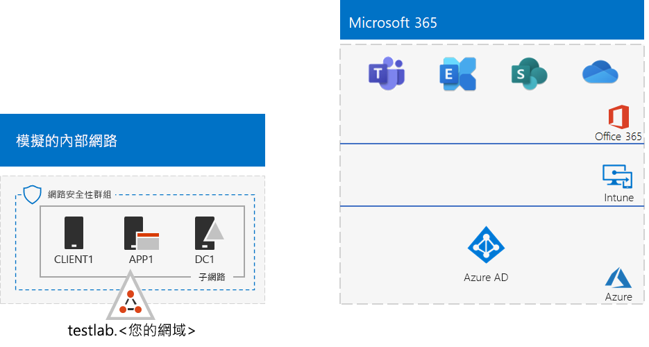
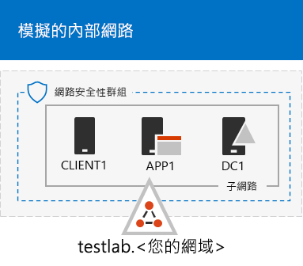
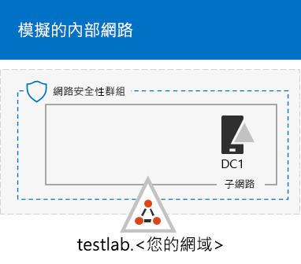
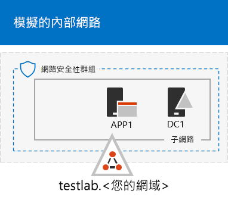

# <a name="the-simulated-enterprise-base-configuration"></a>模擬企業基本設定

*此測試實驗室指南可用於 enterprise 和 Office 365 企業版測試環境的 Microsoft 365。*

本文說明如何為適用于 enterprise 的 Microsoft 365 建立簡化的環境，其中包括：

- Microsoft 365 E5 試用版或付費訂閱。
- 簡化的組織內部網路連接至網際網路，由 Azure 虛擬網路上的三個虛擬機器所組成 (DC1、APP1 和 CLIENT1) 。
 


建立簡化的測試環境包括兩個階段：
- [階段 1：建立模擬的內部網路](#phase-1-create-a-simulated-intranet)
- [階段 2：建立您的 Microsoft 365 E5 訂閱](#phase-2-create-your-microsoft-365-e5-subscription)

您可以使用所產生的環境，利用其他[測試實驗室指南](m365-enterprise-test-lab-guides.md)或您自己的方式來測試[enterprise 的 Microsoft 365](https://www.microsoft.com/microsoft-365/enterprise)功能和功能。


> [!TIP]
> 如需適用于企業測試實驗室指南堆疊的 Microsoft 365 中的所有文章的視覺對應，請移至[Microsoft 365 for enterprise test lab guide stack](../downloads/Microsoft365EnterpriseTLGStack.pdf)。

## <a name="phase-1-create-a-simulated-intranet"></a>階段 1：建立模擬的內部網路

在此階段中，請在 Azure 基礎結構服務中建立模擬的內部網路，其中包含 Active Directory 網域服務 (AD DS) 網域控制站、應用程式伺服器及用戶端電腦。

您可以使用這些電腦做[為企業測試實驗室指南的其他 Microsoft 365](m365-enterprise-test-lab-guides.md) ，以設定並示範混合式身分識別和其他功能。

### <a name="method-1-build-your-simulated-intranet-with-an-azure-resource-manager-template"></a>方法 1：使用 Azure Resource Manager 範本建立模擬內部網路

在此方法中，您可以使用 Azure 資源管理員範本來組建模擬的內部網路。 Azure 資源管理員範本包含建立 Azure 網路基礎結構、虛擬機器及其設定的所有指示。

部署範本之前，請先閱讀 [範本的自述頁面](https://github.com/maxskunkworks/TLG/tree/master/tlg-base-config_3-vm.m365-ems) ，並準備好下列資訊：

- 測試環境的公用 DNS 功能變數名稱 (testlab。 \<*your public domain*>) 。 您會在 [**自訂部署**] 頁面的 [**功能變數名稱**] 欄位中輸入此名稱。
- 虛擬機器公用 IP 位址 URL 上的 DNS 標籤前置詞。您必須在 **[自訂部署]** 頁面的 **[Dns 標籤前置詞]** 欄位中輸入此標籤。

在您閱讀指示之後，請選取 [[範本 README] 頁面](https://github.com/maxskunkworks/TLG/tree/master/tlg-base-config_3-vm.m365-ems)上的 [**部署到 Azure** ] 以開始使用。

>[!Note]
>Azure 資源管理員範本所建立的模擬內部網路需要付費的 Azure 訂閱。

範本完成後，您的設定會如下所示：



### <a name="method-2-build-your-simulated-intranet-with-azure-powershell"></a>方法 2：使用 Azure PowerShell 建立模擬內部網路

在這個方法中，您使用 Windows PowerShell 和 Azure PowerShell 模組建置網路基礎結構、虛擬機器及其設定。

如果您想要使用 PowerShell 獲得一次一個步驟建立 Azure 基礎結構元素的體驗，則使用此方法。然後，您可以自行定義 PowerShell 命令區塊，以便在 Azure 中部署其他虛擬機器。

#### <a name="step-1-create-dc1"></a>步驟 1：建立 DC1

在這個步驟中，您會建立 Azure 虛擬網路並新增 DC1，這是 AD DS 網域的網域控制站的虛擬機器。

首先，在本機電腦上啟動 Windows PowerShell 命令提示字元。
  
> [!NOTE]
> 下列命令集會使用最新版的 Azure PowerShell。請參閱[開始使用 Azure PowerShell Cmdlet](/powershell/azureps-cmdlets-docs/)。 
  
使用下列命令登入您的 Azure 帳戶。
  
```powershell
Connect-AzAccount
```

使用下列命令取得訂用帳戶名稱。
  
```powershell
Get-AzSubscription | Sort Name | Select Name
```

設定 Azure 訂用帳戶。 以正確的名稱取代引號內的所有專案，包括角括弧 ( "<" 和 ">" ) 。
  
```powershell
$subscr="<subscription name>"
Get-AzSubscription -SubscriptionName $subscr | Select-AzSubscription
```

接著，為您的模擬企業測試實驗室建立新的資源群組。若要判斷資源群組名稱是否是唯一的，可使用此命令來列出現有的資源群組。
  
```powershell
Get-AzResourceGroup | Sort ResourceGroupName | Select ResourceGroupName
```

使用這些命令建立新的資源群組。 以正確的名稱取代引號內的所有專案（包括角括弧）。
  
```powershell
$rgName="<resource group name>"
$locName="<location name, such as West US>"
New-AzResourceGroup -Name $rgName -Location $locName
```

接下來，建立會主控模擬企業環境之公司網路子網的 TestLab 虛擬網路，並以網路安全性群組來保護它。 填入您的資源群組名稱，並在本機電腦的 PowerShell 命令提示字元執行這些命令。
  
```powershell
$rgName="<name of your new resource group>"
$locName=(Get-AzResourceGroup -Name $rgName).Location
$corpnetSubnet=New-AzVirtualNetworkSubnetConfig -Name Corpnet -AddressPrefix 10.0.0.0/24
New-AzVirtualNetwork -Name TestLab -ResourceGroupName $rgName -Location $locName -AddressPrefix 10.0.0.0/8 -Subnet $corpnetSubnet -DNSServer 10.0.0.4
$rule1=New-AzNetworkSecurityRuleConfig -Name "RDPTraffic" -Description "Allow RDP to all VMs on the subnet" -Access Allow -Protocol Tcp -Direction Inbound -Priority 100 -SourceAddressPrefix Internet -SourcePortRange * -DestinationAddressPrefix * -DestinationPortRange 3389
New-AzNetworkSecurityGroup -Name Corpnet -ResourceGroupName $rgName -Location $locName -SecurityRules $rule1
$vnet=Get-AzVirtualNetwork -ResourceGroupName $rgName -Name TestLab
$nsg=Get-AzNetworkSecurityGroup -Name Corpnet -ResourceGroupName $rgName
Set-AzVirtualNetworkSubnetConfig -VirtualNetwork $vnet -Name Corpnet -AddressPrefix "10.0.0.0/24" -NetworkSecurityGroup $nsg
$vnet | Set-AzVirtualNetwork
```

接下來，您要建立 DC1 虛擬機器，並將它設定為 **testlab**\<your public domain>的網域控制站。 AD DS 網域和 TestLab 虛擬網路虛擬機器的 DNS 伺服器。 例如，若您的公用網域名稱為 **<span>contoso</span>.com**，則 DC1 虛擬機器會是 **<span>testlab</span>.contoso.com** 網域的網域控制站。
  
若要建立 DC1 的 Azure 虛擬機器，請填入您的資源群組，並在本機電腦上的 PowerShell 命令提示字元執行這些命令。
  
```powershell
$rgName="<resource group name>"
$locName=(Get-AzResourceGroup -Name $rgName).Location
$vnet=Get-AzVirtualNetwork -Name TestLab -ResourceGroupName $rgName
$pip=New-AzPublicIpAddress -Name DC1-PIP -ResourceGroupName $rgName -Location $locName -AllocationMethod Dynamic
$nic=New-AzNetworkInterface -Name DC1-NIC -ResourceGroupName $rgName -Location $locName -SubnetId $vnet.Subnets[0].Id -PublicIpAddressId $pip.Id -PrivateIpAddress 10.0.0.4
$vm=New-AzVMConfig -VMName DC1 -VMSize Standard_A2_V2
$cred=Get-Credential -Message "Type the name and password of the local administrator account for DC1."
$vm=Set-AzVMOperatingSystem -VM $vm -Windows -ComputerName DC1 -Credential $cred -ProvisionVMAgent -EnableAutoUpdate
$vm=Set-AzVMSourceImage -VM $vm -PublisherName MicrosoftWindowsServer -Offer WindowsServer -Skus 2016-Datacenter -Version "latest"
$vm=Add-AzVMNetworkInterface -VM $vm -Id $nic.Id
$vm=Set-AzVMOSDisk -VM $vm -Name "DC1-OS" -DiskSizeInGB 128 -CreateOption FromImage
$diskConfig=New-AzDiskConfig -AccountType "Standard_LRS" -Location $locName -CreateOption Empty -DiskSizeGB 20
$dataDisk1=New-AzDisk -DiskName "DC1-DataDisk1" -Disk $diskConfig -ResourceGroupName $rgName
$vm=Add-AzVMDataDisk -VM $vm -Name "DC1-DataDisk1" -CreateOption Attach -ManagedDiskId $dataDisk1.Id -Lun 1
New-AzVM -ResourceGroupName $rgName -Location $locName -VM $vm
```

系統會提示您輸入 DC1 上本機系統管理員帳戶的使用者名稱和密碼。使用強式密碼，並將名稱和密碼記錄於安全的位置。
  
接下來，連接至 DC1 虛擬機器：
  
1. 在 [Azure 入口網站](https://portal.azure.com)中，選取 [**資源群組**] > <**_新資源群組的名稱_，*> > _* DC1**[  >  **連線**]。
    
2. 在 [開啟] 窗格中，選取 [ **下載 RDP 檔**]。 開啟所下載的 DC1.rdp 檔案，然後選取 [**連線**]。
    
3. 指定 DC1 本機系統管理員帳戶名稱：
    
   - 對於 Windows 7：
    
     在 [ **Windows 安全性**] 對話方塊中，選取 [**使用另一個帳戶**]。 在 [**使用者名稱**] 中，輸入 **DC1 \\** < *本機系統管理員帳戶名稱*>。
    
   - 對於 Windows 8 或 Windows 10：
    
     在 [ **Windows 安全性**] 對話方塊中，選取 [**更多選項**]，然後選取 [**使用另一個帳戶**]。 在 [**使用者名稱**] 中，輸入 **DC1 \\** < *本機系統管理員帳戶名稱*>。
    
4. 在 [ **密碼**] 中，輸入本機系統管理員帳戶的密碼，然後選取 **[確定]**。
    
5. 出現提示時，請選取 **[是]**。
    
接著，使用此命令在 DC1 上系統管理員層級 Windows PowerShell 命令提示字元將額外的資料磁碟新增為新的磁碟區 (磁碟機代號 F:)。
  
```powershell
Get-Disk | Where PartitionStyle -eq "RAW" | Initialize-Disk -PartitionStyle MBR -PassThru | New-Partition -AssignDriveLetter -UseMaximumSize | Format-Volume -FileSystem NTFS -NewFileSystemLabel "WSAD Data"
```

接下來，將 DC1 設定為網域控制站，並將 DNS 伺服器設定為 **testlab。**\<*your public domain*> 網域。 指定您的公用功能變數名稱、移除角括弧，然後在 DC1 上的系統管理員層級 Windows PowerShell 命令提示字元執行這些命令。
  
```powershell
$yourDomain="<your public domain>"
Install-WindowsFeature AD-Domain-Services -IncludeManagementTools
Install-ADDSForest -DomainName testlab.$yourDomain -DatabasePath "F:\NTDS" -SysvolPath "F:\SYSVOL" -LogPath "F:\Logs"
```
您必須指定安全模式的系統管理員密碼。將此密碼儲存在安全的位置。
  
請注意，這些命令可能需要數分鐘才能完成。
  
DC1 重新啟動後，重新連線到 DC1 虛擬機器。
  
1. 在 [Azure 入口網站](https://portal.azure.com)中，選取 [**資源** 群組 > <*您的資源群組名稱*> > **DC1**  >  **連線**]。
    
2. 執行已下載的 DC1.rdp 檔案，然後選取 [**連線**]。
    
3. 在 **Windows 安全性** 中，選取 [**使用另一個帳戶**]。 在 [**使用者名稱**] 中，輸入 **TESTLAB \\** < 的 *本機系統管理員帳戶名稱*>。
    
4. 在 [ **密碼** ] 方塊中，輸入本機系統管理員帳戶的密碼，然後選取 **[確定]**。
    
5. 出現提示時，請選取 **[是]**。
    
接下來，在 Active Directory 中建立登入 TESTLAB 網域成員電腦時所使用的使用者帳戶。 在系統管理員層級 Windows PowerShell 命令提示字元執行此命令。
  
```powershell
New-ADUser -SamAccountName User1 -AccountPassword (read-host "Set user password" -assecurestring) -name "User1" -enabled $true -PasswordNeverExpires $true -ChangePasswordAtLogon $false
```

請注意，此命令會提示您提供 User1 帳戶密碼。 此帳戶將用於所有 TESTLAB 網域成員電腦的遠端桌面連線，因此請選擇強式密碼。 記錄 User1 帳戶密碼，並將其儲存在安全的位置。
  
接下來，將新的 User1 帳戶設定為網域、企業和結構描述管理員。在系統管理員層級 Windows PowerShell 命令提示字元執行此命令。
  
```powershell
$yourDomain="<your public domain>"
$domainName = "testlab."+$yourDomain
$userName="user1@" + $domainName
$userSID=(New-Object System.Security.Principal.NTAccount($userName)).Translate([System.Security.Principal.SecurityIdentifier]).Value
$groupNames=@("Domain Admins","Enterprise Admins","Schema Admins")
ForEach ($name in $groupNames) {Add-ADPrincipalGroupMembership -Identity $userSID -MemberOf (Get-ADGroup -Identity $name).SID.Value}
```

關閉 DC1 的遠端桌面工作階段，然後使用 TESTLAB\\User1 帳戶重新連線。
  
接下來，若要允許 Ping 工具的流量，請在系統管理員層級 Windows PowerShell 命令提示字元執行此命令。
  
```powershell
Set-NetFirewallRule -DisplayName "File and Printer Sharing (Echo Request - ICMPv4-In)" -enabled True
```

您目前的設定如下所示：
  

  
#### <a name="step-2-configure-app1"></a>步驟 2：設定 APP1

在這個步驟，您會建立及設定 APP1，這是一開始提供 Web 和檔案共用服務的應用程式伺服器。

若要建立 APP1 的 Azure 虛擬機器，請填入您的資源群組，並在本機電腦上的命令提示字元執行這些命令。
  
```powershell
$rgName="<resource group name>"
$locName=(Get-AzResourceGroup -Name $rgName).Location
$vnet=Get-AzVirtualNetwork -Name TestLab -ResourceGroupName $rgName
$pip=New-AzPublicIpAddress -Name APP1-PIP -ResourceGroupName $rgName -Location $locName -AllocationMethod Dynamic
$nic=New-AzNetworkInterface -Name APP1-NIC -ResourceGroupName $rgName -Location $locName -SubnetId $vnet.Subnets[0].Id -PublicIpAddressId $pip.Id
$vm=New-AzVMConfig -VMName APP1 -VMSize Standard_A2_V2
$cred=Get-Credential -Message "Type the name and password of the local administrator account for APP1."
$vm=Set-AzVMOperatingSystem -VM $vm -Windows -ComputerName APP1 -Credential $cred -ProvisionVMAgent -EnableAutoUpdate
$vm=Set-AzVMSourceImage -VM $vm -PublisherName MicrosoftWindowsServer -Offer WindowsServer -Skus 2016-Datacenter -Version "latest"
$vm=Add-AzVMNetworkInterface -VM $vm -Id $nic.Id
$vm=Set-AzVMOSDisk -VM $vm -Name "APP1-OS" -DiskSizeInGB 128 -CreateOption FromImage
New-AzVM -ResourceGroupName $rgName -Location $locName -VM $vm
```

接下來，使用 APP1 本機系統管理員帳戶名稱和密碼連線到 APP1 虛擬機器，然後開啟 Windows PowerShell 命令提示字元。
  
若要檢查 APP1 和 DC1 之間的名稱解析和網路通訊，請執行 **ping DC1.testlab。**\<*your public domain name*> 命令，並確認有四個回復。
  
接下來在 Windows PowerShell 命令提示字元使用以下命令將 APP1 虛擬機器加入 TESTLAB 網域。
  
```powershell
$yourDomain="<your public domain name>"
Add-Computer -DomainName ("testlab." + $yourDomain)
Restart-Computer
```

請注意，在您執行 **Add-Computer** 命令之後，您必須提供 TESTLAB \\ User1 網域帳號憑證。
  
APP1 重新啟動之後，使用 TESTLAB\\User1 帳戶連線至 APP1，然後開啟系統管理員層級 Windows PowerShell 命令提示字元。
  
接下來，在 APP1 上的系統管理員層級 Windows PowerShell 命令提示字元中使用此命令讓 APP1 成為 Web 伺服器。
  
```powershell
Install-WindowsFeature Web-WebServer -IncludeManagementTools
```

接下來，使用這些 PowerShell 命令在 APP1 上的資料夾內建立共用資料夾及文字檔。
  
```powershell
New-Item -path c:\files -type directory
Write-Output "This is a shared file." | out-file c:\files\example.txt
New-SmbShare -name files -path c:\files -changeaccess TESTLAB\User1
```

您目前的設定如下所示：
  

  
#### <a name="step-3-configure-client1"></a>步驟 3：設定 CLIENT1

在這個步驟中，建立及設定 CLIENT1，其可在內部網路上作為一般的膝上型電腦、平板電腦或桌上型電腦。

> [!NOTE]  
> 下列命令集可建立執行 Windows Server 2016 資料中心的 CLIENT1，其適用於所有類型的 Azure 訂閱。如果您有以 Visual Studio 為基礎的 Azure 訂閱，則可以使用 [Azure 入口網站](https://portal.azure.com)建立執行 Windows 10 的 CLIENT1。
  
若要建立 CLIENT1 的 Azure 虛擬機器，請填入您的資源群組的名稱，並在本機電腦上的命令提示字元中執行這些命令。
  
```powershell
$rgName="<resource group name>"
$locName=(Get-AzResourceGroup -Name $rgName).Location
$vnet=Get-AzVirtualNetwork -Name TestLab -ResourceGroupName $rgName
$pip=New-AzPublicIpAddress -Name CLIENT1-PIP -ResourceGroupName $rgName -Location $locName -AllocationMethod Dynamic
$nic=New-AzNetworkInterface -Name CLIENT1-NIC -ResourceGroupName $rgName -Location $locName -SubnetId $vnet.Subnets[0].Id -PublicIpAddressId $pip.Id
$vm=New-AzVMConfig -VMName CLIENT1 -VMSize Standard_A2_V2
$cred=Get-Credential -Message "Type the name and password of the local administrator account for CLIENT1."
$vm=Set-AzVMOperatingSystem -VM $vm -Windows -ComputerName CLIENT1 -Credential $cred -ProvisionVMAgent -EnableAutoUpdate
$vm=Set-AzVMSourceImage -VM $vm -PublisherName MicrosoftWindowsServer -Offer WindowsServer -Skus 2016-Datacenter -Version "latest"
$vm=Add-AzVMNetworkInterface -VM $vm -Id $nic.Id
$vm=Set-AzVMOSDisk -VM $vm -Name "CLIENT1-OS" -DiskSizeInGB 128 -CreateOption FromImage
New-AzVM -ResourceGroupName $rgName -Location $locName -VM $vm
```

接下來，使用 CLIENT1 本機系統管理員帳戶名稱和密碼連線到 CLIENT1 虛擬機器，然後開啟系統管理員層級 Windows PowerShell 命令提示字元。
  
若要檢 CLIENT1 和 DC1 之間的名稱解析和網路通訊，請執行 **ping DC1.testlab。**\<*your public domain name*> 命令 Windows PowerShell 命令提示字元，並確認有四個回復。
  
接下來在 Windows PowerShell 命令提示字元使用以下命令將 CLIENT1 虛擬機器加入 TESTLAB 網域。
  
```powershell
$yourDomain="<your public domain name>"
Add-Computer -DomainName ("testlab." + $yourDomain)
Restart-Computer
```

請注意，您必須在執行 **Add-Computer** 命令之後，提供 TESTLAB\\User1 網域帳戶認證。
  
CLIENT1 重新啟動之後，使用 TESTLAB\\User1 帳戶名稱和密碼連線至 CLIENT1，然後開啟系統管理員層級 Windows PowerShell 命令提示字元。
  
接下來，確認您可以從 CLIENT1 存取 APP1 上的 Web 及檔案共用資源。
  
1. 在 [伺服器管理員] 的樹狀窗格中，選取 [ **本機伺服器**]。
    
2. 在 [ **CLIENT1 的屬性**] 中，選取 [ **IE 增強式安全性** 設定] 旁的 [**開啟**]。
    
3. 在 **Internet Explorer 增強式安全性** 設定中，為系統 **管理員** 和 **使用者** 選取 [**關閉**]，然後選取 **[確定]**。
    
4. 從 [開始] 畫面中，選取 [ **Internet Explorer**]，然後選取 **[確定]**。
    
5. 在 [位址] 列中，輸入 [ **HTTP：<span>//</span>app1] testab。** \<*your public domain name*> **/** ，然後按 **enter**。 您應該會看到 APP1 的預設網際網路資訊服務網頁。
    
6. 在桌面工作列上，選取 [檔案瀏覽器] 圖示。
    
7. 在位址列中，輸入 **\\ \\ app1 \\ Files**，然後按 **enter** 鍵。 您應該會看到資料夾視窗中的 [檔案] 共用資料夾的內容。
    
8. 在 [檔案] 共用資料夾視窗中，按兩下 **Example.txt** 檔案。您應該會看到 Example.txt 檔案的內容。
    
9. 關閉 **example.txt - 記事本** 以及 [檔案] 共用資料夾視窗。
    
您目前的設定如下所示：
  


## <a name="phase-2-create-your-microsoft-365-e5-subscription"></a>階段 2：建立您的 Microsoft 365 E5 訂閱

您可以在這個階段建立新的 Microsoft 365 E5 訂閱，其使用全新的 Azure AD 租用戶，亦即與您生產訂用帳戶不同。有兩種方法可完成：

- 使用 Microsoft 365 E5 的試用版訂閱。

  Microsoft 365 E5 試用版訂閱期限是 30 天，也可以輕鬆地延長到 60 天。試用版訂閱到期時，您必須將它轉換為付費訂閱，或建立新的試用版訂閱。建立新的試用版訂閱表示您將失去之前的設定，這可能會留下複雜的情況。  

- 使用具少數授權數的不同 Microsoft 365 E5 生產訂用帳戶。

  這是額外成本，但可確保您的測試環境未到期;在此情況下，您可以嘗試功能、設定及案例。 您可以針對概念證明、對等與管理的示範，以及應用程式開發和測試，使用長期的相同測試環境。 這是建議的方法。

### <a name="sign-up-for-an-office-365-e5-trial-subscription"></a>註冊 Office 365 E5 試用訂閱

從 Azure 入口網站，使用 CORP\User1 帳戶連接至 CLIENT1。

若要建立新的 Office 365 E5 試用訂閱，請執行輕量型基本組態測試實驗室指南的[階段 1](lightweight-base-configuration-microsoft-365-enterprise.md#phase-1-create-your-microsoft-365-e5-subscription) 中的指示。

若要設定您的新 Office 365 E5 試用訂閱，請執行輕量型基本組態測試實驗室指南的[階段 2](lightweight-base-configuration-microsoft-365-enterprise.md#phase-2-configure-your-office-365-trial-subscription) 中的指示。

#### <a name="using-an-office-365-e5-test-environment"></a>使用 Office 365 E5 測試環境

如果您只需要 Office 365 測試環境，您不需要閱讀本文的其餘部分。

如需同時適用 Microsoft 365 和 Office 365 的其他測試實驗室指南，請參閱[Microsoft 365 for enterprise Test lab 指南](m365-enterprise-test-lab-guides.md)。

### <a name="add-a-microsoft-365-e5-trial-subscription"></a>新增 Microsoft 365 E5 試用版訂閱

若要新增 Microsoft 365 E5 試用訂閱並設定您的使用者帳戶擁有授權，請執行輕量基本設定測試實驗室指南的[階段 3](lightweight-base-configuration-microsoft-365-enterprise.md#phase-3-add-a-microsoft-365-e5-trial-subscription)中的指示。

  
## <a name="results"></a>結果

測試環境現在擁有：
  
- Microsoft 365 E5 試用版訂閱。
- 您的所有適用使用者帳戶皆可使用 Microsoft 365 E5。
- 模擬且簡化的內部網路。
    
您的最後設定如下所示：
  

  
您現在已準備好嘗試使用[enterprise 的 Microsoft 365](https://www.microsoft.com/microsoft-365/enterprise)的其他功能。
  
## <a name="next-steps"></a>後續步驟

探索這些額外的測試實驗室指南集合：
  
- [身分識別](m365-enterprise-test-lab-guides.md#identity)
- [行動裝置管理](m365-enterprise-test-lab-guides.md#mobile-device-management)
- [資訊保護](m365-enterprise-test-lab-guides.md#information-protection)

## <a name="see-also"></a>另請參閱

[Microsoft 365 企業版測試實驗室指南](m365-enterprise-test-lab-guides.md)

[Microsoft 365 企業版概觀](microsoft-365-overview.md)

[Microsoft 365 企業版文件](/microsoft-365-enterprise/)