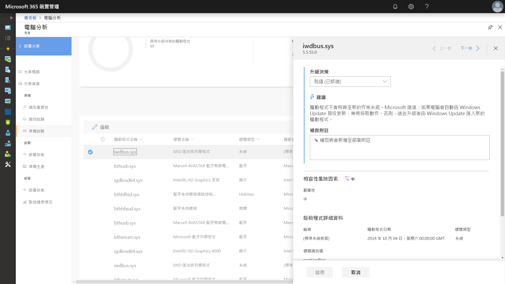
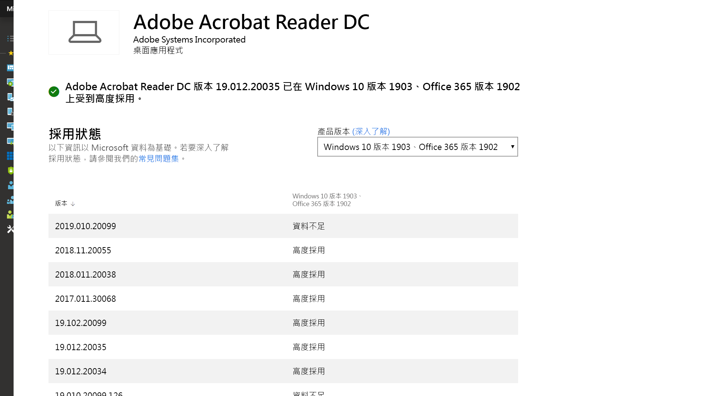

# 步驟 1：裝置和應用程式整備Step 1: Device and App Readiness

<table>
<thead>
<td></td>
<td>
<strong>步驟 1：裝置和應用程式整備</strong><strong>Step 1: Device and App Readiness</strong>

從清查您的裝置和應用程式開始您的桌面部署專案，設定前進的優先順序，測試優先的應用程式和裝置，然後針對需要進行修復以準備部署。Begin your desktop deployment project with an inventory of your devices and apps, prioritize what you need to move forward, test prioritized apps and devices, then remediate what’s needed to get ready for deployment.
</td>
<td></td>
</thead>
</table>

>[!NOTE]
>裝置和應用程式整備是我們所建議部署程序轉輪中的第一個步驟，方法是涵蓋應用程式與硬體相容性的整體層面。Device and App Readiness is the first step in our recommended deployment process wheel by covering the holistic aspects of application and hardware compatibility. 若要查看完整的桌面部署程序，請瀏覽[桌面部署中心](https://aka.ms/HowToShift)。To see the full desktop deployment process, visit the [Desktop Deployment Center](https://aka.ms/HowToShift).
>

在過去，升級使用者桌面的主要障礙是應用程式和硬體相容性。在您規劃要移轉至 Windows 10 和 Microsoft 365 Apps 企業版方面有一個好消息，就是近 10 年內撰寫的任何應用程式都能在 Windows 10 上執行，貴組織在回溯到 Office 2010 的 Office 版本上所使用的任何 COM 增益集和 VBA 巨集，都能持續在最新版本的 Office 上運作，不需要修改。In the past, a major hurdle to upgrading the users’ desktops is application and hardware compatibility. The good news as you plan your shift to Windows 10 and Microsoft 365 Apps for enterprise, is just about any application written in the last 10 years will run on Windows 10, and any COM add-ins and VBA macros your organization used on versions of Office dating back to Office 2010, will continue to work on the latest versions of Office, without modification.

也就是說，根據貴組織的大小和年份，確認應用程式和硬體的相容性很可能還是建議的 8 階段部署程序中的基本初始步驟。That said, depending on the size and age of your organization, verifying application and hardware compatibility is likely still an essential initial step in our recommended 8-phase deployment process.

我們會在本文中引導您進行第一個階段 - 裝置和應用程式整備 - 使用 Microsoft 整備評估工具，其中包括電腦分析，這是一個可透過您的 Windows 授權取得的智慧型雲端式解決方案。In this article we take you through that first phase – Device and App Readiness – using Microsoft readiness assessment tools including the Desktop Analytics, an intelligent cloud-based solution available with your Windows license.

## Windows 10 相容性掃描Windows 10 Compatibility Scan

部署 Windows 10 之前，Microsoft 建議您檢查執行 Windows 7 或 8/8.1 的現有裝置整備度。Before deploying Windows 10 Microsoft recommends checking the readiness of your existing devices running Windows 7 or 8/8.1. Windows 10 安裝媒體支援可供 setup.exe 執行升級的命令列參數，但只會檢查相容性，而不會實際執行升級。Windows 10 installation media supports a command line switch for the setup.exe to run the upgrade but only check for compatibility, not actually perform the upgrade. ScanOnly 可當作指令碼批次檔案執行或可整合至 Microsoft Endpoint Configuration Manager 工作序列 (包括直接從網路執行 ScanOnly 的功能)，讓 Windows 10 安裝媒體不會向下串流至本機裝置。ScanOnly can be run as a scripted batch file or integrated into a Microsoft Endpoint Configuration Manager task sequence, including the ability to run the ScanOnly directly from the network so the Windows 10 installation media isn't streamed down to the local device. ScanOnly 完成時，系統會經由 Setup.EXE 所產生記錄檔中的傳回碼來傳回結果。When ScanOnly completes the results are returned via return codes in log files generated by Setup.EXE.   

以無訊息方式完成相容性掃描的範例 ScanOnly 命令列，看起來如下所示：A sample ScanOnly command line that completes the compatibility scan silently would look like the below:

    Setup.EXE /Auto Upgrade /Quiet /NoReboot /Compat ScanOnly

如需 ScanOnly 和其他 Windows 安裝程式命令參數的詳細資訊，請檢閱 [Windows 安裝程式命令列選項](https://aka.ms/setupswitches)。For more information on ScanOnly and other Windows setup command switches please review the [Windows Setup Command-line Options](https://aka.ms/setupswitches).

## 建議的工具：電腦分析Recommended Tool: Desktop Analytics

電腦分析是我們建議使用的工具，其提供比傳統桌面管理系統還要多的優點。Desktop Analytics offers many advantages over traditional desktop management systems and is our recommended tool. 這項工具無代理程式，可引導您使用透過升級數億台消費者電腦所蒐集的應用程式和驅動程式相容性資訊。It is agentless and guides you through what needs to be done making use of application and driver compatibility information gathered through the upgrade of hundreds of millions of consumer PCs. 此資訊提供給您詳細的評估、找出可能封鎖升級的相容性問題，並輔以 Microsoft 已知建議修正程式的連結。This information gives you a detailed assessment, identifying compatibility issues that might block your upgrade, supported with links to suggested fixes known to Microsoft.

若要設定電腦分析，您必須先設定 Azure 訂閱，並為其包含 Azure Log Analytics 工作區。To set up Desktop Analytics you’ll first need to set up an Azure subscription and include an Azure Log Analytics workspace to that. 執行電腦分析服務後，您可以接著透過群組原則設定，註冊任何連上網際網路的 Windows 7 SP1 或更新裝置，就是這麼簡單。Once you have the Desktop Analytics service running, you can then enroll any Internet-connected Windows 7 SP1 or newer device via Group Policy settings - it’s that simple. 不需要部署代理程式，電腦分析的視覺化工作流程就會引導您從試驗到生產部署。There are no agents to deploy, and Desktop Analytics’ visual workflow guides you from pilot to production deployment. 如有需要，您可以將資料從電腦分析匯出至 Microsoft Endpoint Configuration Manager (最新分支) 之類的軟體部署工具、直接匯出至目標電腦，並且在資料準備好進行部署時建置集合。If you wish, you can export data from Desktop Analytics to software deployment tools such as Microsoft Endpoint Configuration Manager (Current Branch), to target PCs directly and build collections as they become ready for deployment.

如果您目前尚未針對環境設定電腦分析，或是想要註冊試用，請移至「電腦分析」頁面 (https://www.aka.ms/desktopanalytics)) 並開始使用。If you don’t currently have Desktop Analytics set up for your environment or would like to sign up for a trial, go the Desktop Analytics page](https://www.aka.ms/desktopanalytics) and get started.

## 裝置和應用程式整備程序Device and App Readiness Process

裝置和應用程式整備包含四個步驟：1.Device and App Readiness is comprised of four steps: 1. 清查，2.Inventory, 2. 設定優先順序，3.Prioritize, 3. 測試，4.Test, 4. 修復。Remediate. 讓我們依序查看每個步驟。Let’s look at each of these in turn.

### 1\.1\. 清查Inventory

電腦分析使用無代理程式的程序，來清查整個桌面資產的電腦和應用程式。Desktop Analytics uses an agent-less process to inventory the computers and applications across your desktop estate. 它也會提供經常造訪網際網路網站、應用程式和內部網路位置，以協助您稍後進行相容性測試。It also provides reports on highly visited Internet sites, apps, and Intranet locations to help you with compatibility testing later.

### 2\.2\. 設定優先順序Prioritize

清查之後，電腦分析會協助您識別貴組織中最常使用的應用程式和硬體，並設定優先順序，以及盡可能減少需部署的電腦數量時可以著重的地方。With inventory taken, Desktop Analytics helps you to identify and prioritize the most common apps and hardware used in your organization, as well as what to focus on to unblock as many PCs as possible for deployment.

同時提供指引，協助您評估在下一個步驟「測試」期間解決問題時所需的更新。It also provides guidance to help you assess the updates necessary to resolve issues during the next step: testing.

### 3\.3\. 測試Testing

您會發現大部分已清查的應用程式、驅動程式和增益集都以現狀運作。You will find that most of the applications, drivers, and add-ins inventoried will work as-is. 針對電腦分析評估為有問題的項目，它為您提供已知資訊，包括在哪裡尋找版本更新來解決相容性問題。For items Desktop Analytics assesses to have issues, it provides you with known information including where to find version updates to resolve compatibility problems. 並非將時間和資源都耗費在解決非關鍵、鬆散部署應用程式和舊版裝置中的複雜問題，您可以選擇與使用者合作來淘汰及取代這些項目。Rather than devoting time and resource resolving complex issues in non-critical, sparsely deployed applications and older devices, you may choose instead to work with users to retire and replace these items.

您也可以使用電腦分析來評估以瀏覽器為基礎的相容性問題，識別出仍在使用 ActiveX 控制項、瀏覽器協助程式物件、VBScript 或 Microsoft Edge 瀏覽器不支援的其他傳統技術的使用者所存取的網站和 Web 應用程式。You can use Desktop Analytics to assess browser-based compatibility issues too, identifying websites and web apps accessed by users still using ActiveX controls, Browser Helper Objects, VBScript, or other legacy technology not supported by the Microsoft Edge browser. 您的使用者仍必須對這些網站使用 Internet Explorer 11，而您可以使用 Enterprise Mode Site List Manager 將網站新增到[企業模式網站清單](https://docs.microsoft.com/microsoft-edge/deploy/emie-to-improve-compatibility)。Your users will still need to use Internet Explorer 11 for these sites, and you can add them to the [Enterprise Mode site list](https://docs.microsoft.com/microsoft-edge/deploy/emie-to-improve-compatibility), using the Enterprise Mode Site List Manager.

此外，為了協助您移至 Microsoft 365 Apps 企業版，您可能想要使用[適用於 Office 的整備工具組](https://docs.microsoft.com/deployoffice/readiness-toolkit-application-compatibility-microsoft-365-apps)，測試您的增益集與 Microsoft Visual Basic for Applications (VBA) 巨集的相容性。Additionally, to assist in your move to Microsoft 365 Apps for enterprise, you may wish to make use of the [Readiness Toolkit for Office](https://docs.microsoft.com/deployoffice/readiness-toolkit-application-compatibility-microsoft-365-apps) to test the compatibility of your add-ins and Microsoft Visual Basic for Applications (VBA) macros.

### 4\. 修復4\. Remediation

裝置和應用程式整備的最後一個階段是「修復」。The final phase of device and app readiness is to ‘remediate’. 您在這裡想要收集必要的軟體或驅動程式套件，您要在部署程序中，使用這些項目來取代或更新舊版。Here you’ll want to collect the required software or driver packages; you are going to use these to supersede or update older versions as part of the deployment process.

執行問題修復清單時，您會發現越來越多電腦變成「準備好進行部署」。這表示驅動程式和電腦上的應用程式都已記錄為與您目標部署的 Windows 10 版本相容。As you work through the list remediating issues, you’ll see that more and more PCs become “Ready for Deployment”. This means that both the drivers and apps on the PCs are noted as compatible with the version of Windows 10 you are targeting for deployment.

### 適用於設定應用程式優先順序的 Configuration Manager 軟體清查Configuration Manager Software Inventory for Application Prioritization

使用雲端式分析解決方案進行裝置和應用程式整備時，Configuration Manager 軟體清查是替代方法。Configuration Manager software inventory is an alternative to using cloud-based analytics solutions for device and app readiness. 您可以使用安裝計數並深入了解特定電腦，以協助設定相容性測試和驗證的優先順序，並透過套件將應用程式套件設定為與 Windows 10 相容。You can use installation counts and drill into specific computers to help prioritize compatibility testing and validation and set application packages as compatible with Windows 10 via package settings. 雖然此選項並未提供比較已知相容性資訊與 Microsoft 分析服務的功能，但可成為有效的解決方法，其以一小組已排定優先順序的應用程式為目標進行手動測試。While this option does not offer the ability to compare known compatibility information with Microsoft’s analytics services, it can be an effective solution to target a smaller set of prioritized apps for manual testing. 

如需詳細資訊，請參閱 [Configuration Manager 中的軟體清查簡介](https://docs.microsoft.com/mem/configmgr/core/clients/manage/inventory/introduction-to-software-inventory) (英文)，以及 [Configuration Manager 中的套件和程式](https://docs.microsoft.com/mem/configmgr/apps/deploy-use/packages-and-programs) (英文) 中應用程式套件的設定平台需求。For more information, see [Introduction to software inventory in Configuration Manager](https://docs.microsoft.com/mem/configmgr/core/clients/manage/inventory/introduction-to-software-inventory) and setting platform requirements in application packages in [Packages and programs in Configuration Manager](https://docs.microsoft.com/mem/configmgr/apps/deploy-use/packages-and-programs).

## 應用程式保證App Assure

協助達到 Windows 10 和 Microsoft 365 Apps 企業版應用程式相容性的另一個工具是透過 FastTrack Center 提供的[應用程式保證](https://aka.ms/appassure)程式。Another tool to help with Windows 10 and Microsoft 365 Apps for enterprise app compatibility is the [App Assure](https://aka.ms/appassure) program available through the FastTrack Center. 在有效應用程式發生問題時，透過「應用程式保證」，Microsoft 工程師可以與您合作 (不另行收費)，協助修復應用程式不相容性問題。In the event of valid application issues, a Microsoft engineer with work with you at no additional cost through App Assure to help remediate the application incompatibility.

## 繼續使用診斷資料工具Continued Use of Diagnostic Data Tools

桌面分析並不只是一種可協助您移至 Windows 10 和 Microsoft 365 Apps 企業版的工具。Desktop Analytics isn’t just a tool to help you shift to Windows 10 and Microsoft 365 Apps for enterprise. 一旦您讓電腦執行 Windows 10 和 Office 365，就可以使用它來協助維護部署及管理半年功能更新，讓您保持在最新版本。Once you have desktops running on Windows 10 and Office 365 you can use it to help maintain your deployment and manage semi-annual Feature Updates so that you can stay current.

## 下一步Next Step 

## [步驟 2：目錄和網路整備Step 2: Directory and Network Readiness](https://aka.ms/mdd2)
