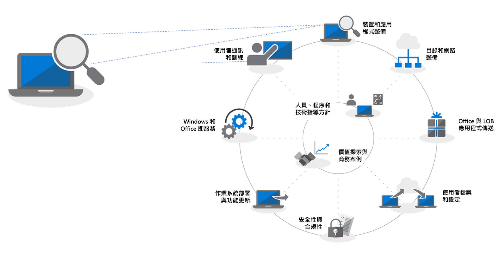
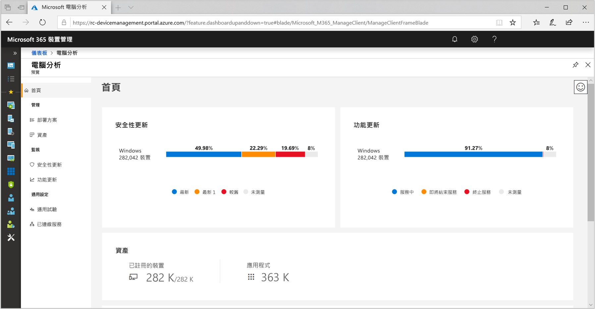
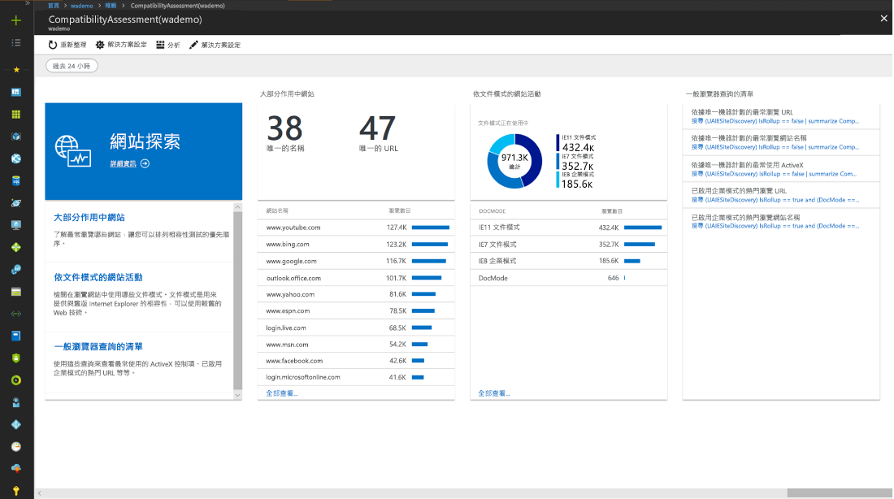
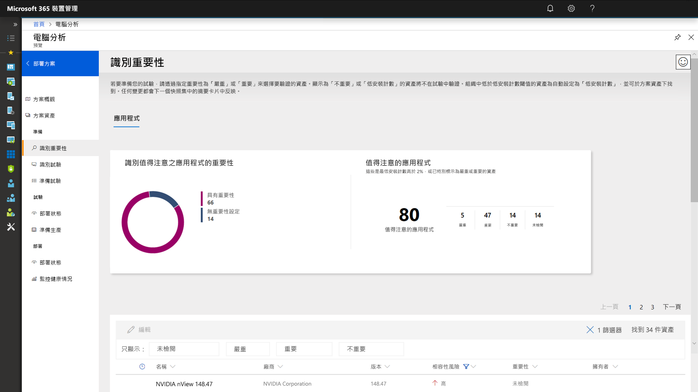
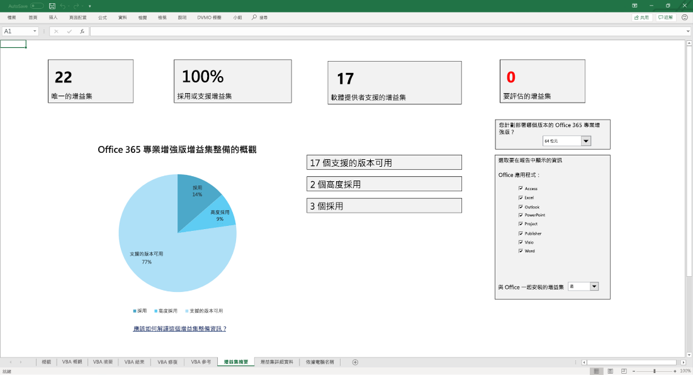
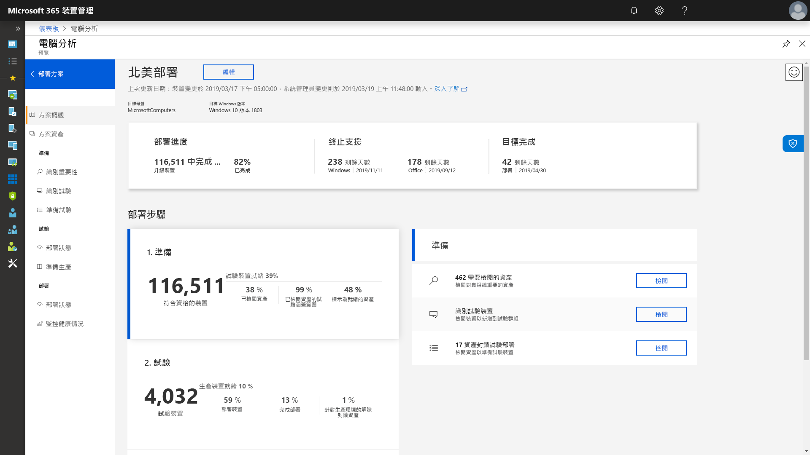

# 步驟 1：裝置和應用程式整備

<table>
<thead>
<td></td>
<td>
<strong>步驟 1：裝置和應用程式整備</strong>

從清查您的裝置和應用程式開始您的桌面部署專案，設定前進的優先順序，測試優先的應用程式和裝置，然後針對需要進行修復以準備部署。
</td>
<td></td>
</thead>
</table>

>[!NOTE]
>裝置和應用程式整備是我們所建議部署程序轉輪中的第一個步驟，方法是涵蓋應用程式與硬體相容性的整體層面。 若要查看完整的桌面部署程序，請瀏覽[桌面部署中心](https://aka.ms/HowToShift)。
>

在過去，升級使用者桌面的主要障礙是應用程式和硬體相容性。在您規劃要移轉至 Windows 10 和 Office 365 專業增強版方面有一個好消息，就是近 10 年內撰寫的任何應用程式都能在 Windows 10 上執行，貴組織在回溯到 Office 2010 的 Office 版本上所使用的任何 COM 增益集和 VBA 巨集，都能持續在最新版本的 Office 上運作，不需要修改。

也就是說，根據貴組織的大小和年份，確認應用程式和硬體的相容性很可能還是建議的 8 階段部署程序中的基本初始步驟。

我們會在本文中引導您進行第一個階段 – 裝置和應用程式整備 – 使用 Microsoft 整備評估工具 (包括新的 Windows Analytics 更新整備小幫手工具)，這是一個可透過您的 Windows 授權使用的智慧型雲端式解決方案。

## Windows 10 相容性掃描

部署 Windows 10 之前，Microsoft 建議您檢查執行 Windows 7 或 8/8.1 的現有裝置整備度。 Windows 10 安裝媒體支援可供 setup.exe 執行升級的命令列參數，但只會檢查相容性，而不會實際執行升級。 ScanOnly 可當作指令碼批次檔案執行或可整合至 System Center Configuration Manager 工作序列 (包括直接從網路執行 ScanOnly 的功能)，讓 Windows 10 安裝媒體不會向下串流至本機裝置。 ScanOnly 完成時，系統會經由 Setup.EXE 所產生記錄檔中的傳回碼來傳回結果。   

以無訊息方式完成相容性掃描的範例 ScanOnly 命令列，看起來如下所示：

    Setup.EXE /Auto Upgrade /Quiet /NoReboot /Compat ScanOnly

如需 ScanOnly 和其他 Windows 安裝程式命令參數的詳細資訊，請檢閱 [Windows 安裝程式命令列選項](https://aka.ms/setupswitches)。

## 建議的工具：Windows Analytics Upgrade Readiness

Windows Analytics 更新整備小幫手是我們建議使用的工具，其提供比傳統桌面管理系統還要多的優點。 這項工具無代理程式，可引導您使用透過升級數億台消費者電腦所蒐集的應用程式和驅動程式相容性資訊。 此資訊提供給您詳細的評估、找出可能封鎖升級的相容性問題，並輔以 Microsoft 已知建議修正程式的連結。

若要設定 Windows Analytics 更新整備小幫手，您必須先設定 Azure 訂用帳戶並包含其 Azure 記錄分析工作區。 執行 Windows Analytics 更新整備小幫手服務後，您可以接著透過群組原則設定，註冊任何連上網際網路的 Windows 7 SP1 或更新裝置 - 就是這麼簡單。 沒有要部署的代理程式，而 Windows Analytics 更新整備小幫手的視覺化工作流程會引導您進行試驗以至生產部署。 如有需要，您可以將資料從 Windows Analytics 更新整備小幫手匯出至 System Center Configuration Manager 之類的軟體部署工具、直接匯出至目標電腦，並且在資料準備好進行部署時建立集合。

如果您目前尚未針對環境設定 Windows Analytics，或是想要註冊試用，請移至 [Windows Analytics 頁面](http://www.aka.ms/windowsanalytics)並開始使用。

## 裝置和應用程式整備程序

裝置和應用程式整備包含四個步驟：1. 清查，2. 設定優先順序，3. 測試，4. 修復。 讓我們依序查看每個步驟。

### 1\. 清查

Windows Analytics 更新整備小幫手服務會使用無代理程式的程序，來清查整個桌面的電腦、應用程式和 Office 增益集。

它也會提供經常造訪網際網路網站、應用程式和內部網路位置，以協助您稍後進行相容性測試。

### 2\. 設定優先順序

清查之後，Windows Analytics 更新整備小幫手會協助您識別貴組織中最常使用的應用程式和硬體並設定優先順序，以及盡可能解除鎖定多部電腦以進行部署時要注意哪些地方，

同時提供指引，協助您評估在下一個步驟「測試」期間解決問題時所需的更新。

### 3\. 測試

您會發現大部分已清查的應用程式、驅動程式和增益集都以現狀運作。 針對 Windows Analytics 更新整備小幫手評估為有問題的項目，它為您提供已知資訊，包括在哪裡尋找版本更新來解決相容性問題。 並非將時間和資源都耗費在解決非關鍵、鬆散部署應用程式和舊版裝置中的複雜問題，您可以選擇與使用者合作來淘汰及取代這些項目。

您也可以使用 Windows Analytics Upgrade Readiness 來評估瀏覽器型相容性問題，識別使用者存取的網站和 Web 應用程式中，仍然使用 ActiveX 控制項、瀏覽器協助程式物件、VBScript 或 Microsoft Edge 瀏覽器已不再支援的舊版技術的項目。您的使用者針對這些網站仍然需要使用 Internet Explorer 11，而您可以使用 Enterprise Mode Site List Manager，將它們新增至[企業模式網站清單](https://docs.microsoft.com/zh-TW/microsoft-edge/deploy/emie-to-improve-compatibility) (機器翻譯)。

此外，為了協助您移至 Office 365 專業增強版，您可能想要使用[適用於 Office 的整備工具組](https://docs.microsoft.com/zh-TW/deployoffice/use-the-readiness-toolkit-to-assess-application-compatibility-for-office-365-pro)，測試您的增益集與 Microsoft Visual Basic for Applications (VBA) 巨集的相容性。

### 4\. 修復

裝置和應用程式整備的最後一個階段是「修復」。 您在這裡想要收集必要的軟體或驅動程式套件，您要在部署程序中，使用這些項目來取代或更新舊版。

執行問題修復清單時，您會發現越來越多電腦變成「準備好進行部署」。這表示驅動程式和電腦上的應用程式都已記錄為與您目標部署的 Windows 10 版本相容。

### 適用於設定應用程式優先順序的 Configuration Manager 軟體清查

使用雲端式分析解決方案進行裝置和應用程式整備時，Configuration Manager 軟體清查是替代方法。 您可以使用安裝計數並深入了解特定電腦，以協助設定相容性測試和驗證的優先順序，並透過套件將應用程式套件設定為與 Windows 10 相容。 雖然此選項並未提供比較已知相容性資訊與 Microsoft 分析服務的功能，但可成為有效的解決方法，其以一小組已排定優先順序的應用程式為目標進行手動測試。 

如需詳細資訊，請參閱 [System Center Configuration Manager 中的軟體清查簡介](https://docs.microsoft.com/zh-TW/sccm/core/clients/manage/inventory/introduction-to-software-inventory)，以及 [System Center Configuration Manager 中的套件和程式](https://docs.microsoft.com/zh-TW/sccm/apps/deploy-use/packages-and-programs)中應用程式套件的設定平台需求。

## 電腦 App 保證

協助達到 Windows 10 和 Office 365 專業增強版應用程式相容性的另一個工具是透過 FastTrack Center 提供的[電腦 App 保證](https://aka.ms/desktopappassure)程式。 在有效應用程式發生問題時，Microsoft 工程師可以透過「電腦 App 保證」免費與您合作，協助修復應用程式不相容性問題。

## 繼續使用診斷資料工具

Windows Analytics Upgrade Readiness 不只是協助您移轉至 Windows 10 和 Office 365 專業增強版的工具。一旦您讓桌面在 Windows 10 和 Office 365 上執行，就可以使用它來協助維護部署及管理半年功能更新，讓您保持在最新版本。

## 下一步 

## [步驟 2：目錄和網路整備](https://aka.ms/mdd2)