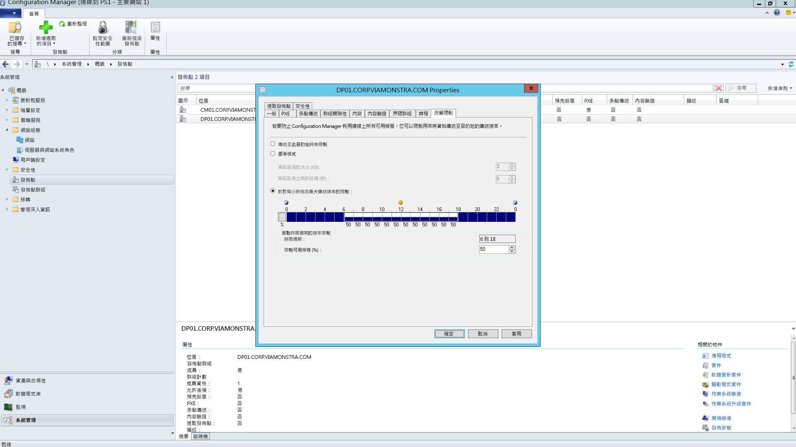
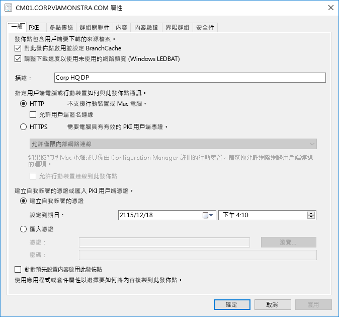
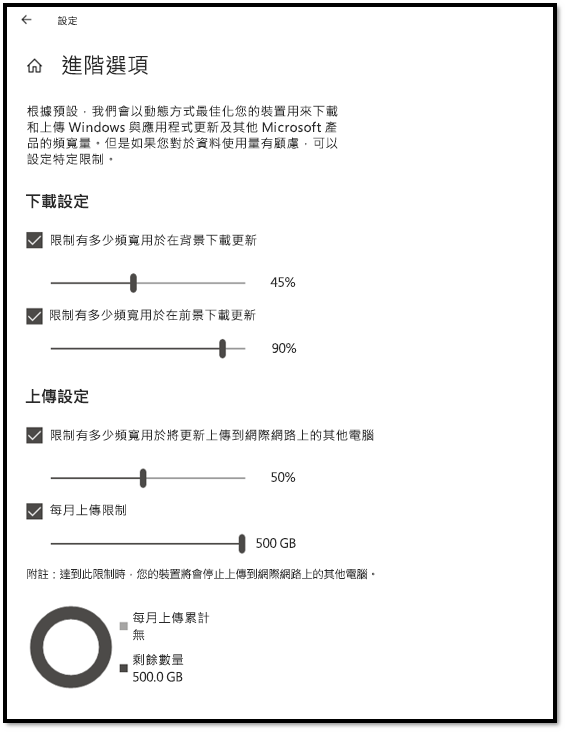
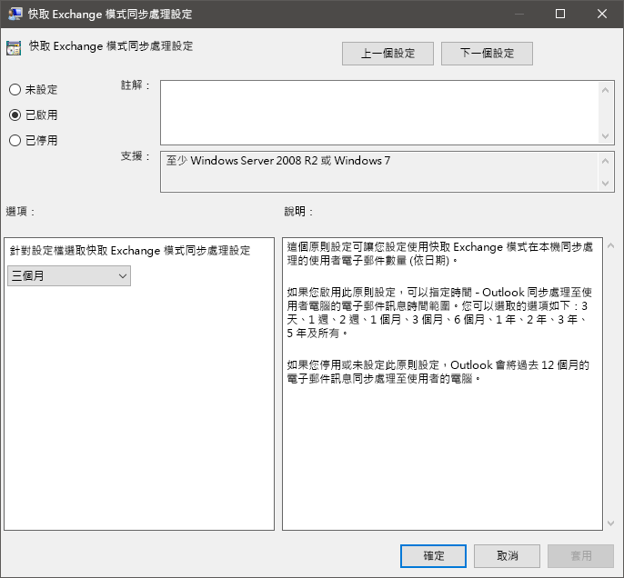
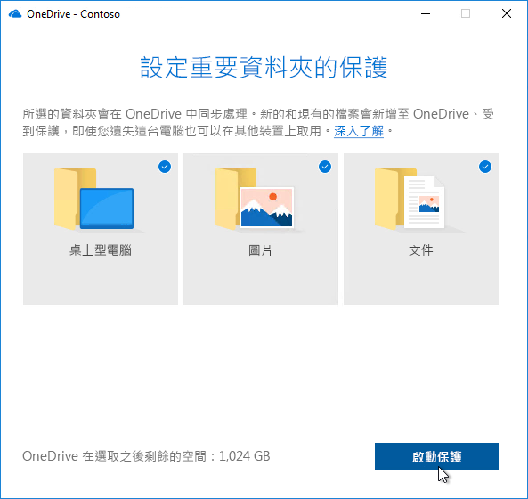

# 步驟 2：目錄和網路整備Step 2: Directory and Network Readiness

確保您的目錄及網路已設定並準備好支援轉變至 Windows 10 及 Microsoft 365 Apps 企業版。這項作業需要 Azure Active Directory 服務就位可供使用者使用，且您的網路必須具備容量可在電腦升級時處理其一般流量和可能的大量資料移動，且會還原使用者的檔案、設定和應用程式。Ensure your directory and the network are configured and ready to support to your shift to Windows 10 and Microsoft 365 Apps for enterprise. This will require Azure Active Directory Services to be in place for users, and your network must have the capacity to handle both its regular traffic and the movement of potentially vast amounts of data as PCs are upgraded, and users’ files, settings and applications are restored.

<table>
<thead>
<td></td>
<td>
<strong>步驟 2：目錄和網路整備</strong><strong>Step 2: Directory and Network Readiness</strong>

在 Microsoft 365 Apps 企業版中的雲端連線服務及新的部署選項 (例如 Windows Autopilot) 需要 Azure Active Directory。將 Windows 映像、應用程式、驅動程式和相關檔案移到電腦時，您的網路和連線能力也是需規劃的重要區域。了解新的工具和部署選項如何減少並簡化網路流量。Cloud connected services in Microsoft 365 Apps for enterprise and new deployment options like Windows Autopilot require Azure Active Directory. Your network and connectivity are also important areas to plan when moving Windows images, apps, drivers and related files to your PCs. Learn how new tools and deployment options reduce and streamline network traffic.
</td>
<td></td>
</thead>
</table>

>[!NOTE]
>目錄和網路整備是我們所建議部署程序轉輪中的第二個步驟，主要著重於 Azure Active Directory 及網路最佳化。Directory and Network Readiness is the second step in our recommended deployment process wheel focusing on Azure Active Directory and optimizing the network. 若要查看完整的桌面部署程序，請瀏覽[桌面部署中心](https://aka.ms/HowToShift)。To see the full desktop deployment process, visit the [Desktop Deployment Center](https://aka.ms/HowToShift).
>

目錄和網路整備是確保順利部署作業系統和桌面的基礎。如同使用任何自動化部署，務必確保可以存取您的檔案共用，且您的網路必須能夠支援傳送大型檔案，可能傳送至一次數百或甚至數千部電腦。Directory and Network readiness is fundamental to ensuring a smooth OS and desktop deployment. As with any automated deployment, it is important to ensure your file shares can be reached, and your network will need to be able to support the transfer of very large files, possibly to hundreds or even thousands of PCs at a time.

在轉變為 Windows 10 及 Microsoft 365 Apps 企業版時，您現在還需要確認已使用 Azure Active Directory 設定雲端身分識別。這不但是您啟動 Microsoft 365 Apps 企業版的關鍵，也可讓您充分利用現代化佈建解決方案，例如 Windows Autopilot。With your shift to Windows 10 and Microsoft 365 Apps for enterprise you also now need to make sure that cloud-based identity is set up with Azure Active Directory. This is key not only to activating Microsoft 365 Apps for enterprise, it also allows you to take advantage of modern provisioning solutions like Windows Autopilot.

在本文中，我們將探索工具和選項，為您準備目錄服務，及使用者與裝置權限，準備好部署 Windows 10 及 Microsoft 365 Apps 企業版。In this article we’ll explore the tools and options to prepare your directory services, and user and device permissions, ready for deployment to Windows 10 and Microsoft 365 Apps for enterprise.

## 新增 Azure Active DirectoryAdding Azure Active Directory

如果貴組織已使用 Office 365、Exchange Online、Microsoft Intune 或其他 Microsoft 線上服務，好消息是，您已經在使用 Azure Active Directory。If your organization already uses Office 365, Exchange Online, Microsoft Intune, or other Microsoft Online services, the good news is you are already using Azure Active Directory. 如果是，您只需要確認您目標桌面部署的使用者是在 Azure Active Directory 中，並已指派授權。If you are, you just need to ensure that the users you are targeting for desktop deployment are in your Azure Active Directory and that licenses have been assigned.

如果您目前未使用 Azure Active Directory，則有[許多資源](https://docs.microsoft.com/azure/active-directory/)可協助您進行設定。If you are not currently using Azure Active Directory, there are [numerous resources](https://docs.microsoft.com/azure/active-directory/) to help you set it up. 您也可能符合透過 Microsoft FastTrack 提供的個人化協助資格 (授權的一部分)。You may well qualify for personalized assistance via Microsoft FastTrack, as part of your license. 您可以在[這裡](https://fasttrack.microsoft.com)進一步了解 Microsoft FastTrack。You can check out more about Microsoft FastTrack [here](https://fasttrack.microsoft.com).

一旦 Azure Active Directory 就位後，您的使用者可以登入並啟用其 Microsoft 365 Apps 企業版應用程式，且您可以使用 Microsoft Intune 或 Windows Autopilot 部署，以自動化部署應用程式和原則。Once you have Azure Active Directory in place, your users can sign in to and activate their Microsoft 365 Apps for enterprise apps, and you can use Microsoft Intune or Windows Autopilot deployment for automated deployment of apps and policy.

## 網路整備Network Readiness

規劃部署時，您必須考慮頻寬需求。You must consider bandwidth requirements when planning your deployments. 部署中有三個主要元件會影響您的網路 – 電腦映像處理、軟體更新及使用者個人化。There are three main components in a deployment that will have an impact on your network – PC imaging, software updates, and user personalization. 這可能表示每部電腦在初始移轉時超過 20 GB，而每部電腦每個月通常需要 1 GB (含) 以上來保持最新狀態。Between them, this can mean in excess of 20 GB per PC for the initial migration, and often 1 GB or more per month per PC to stay up-to-date.

首先，瀏覽這三個主要元件的需求：Let’s start by exploring the requirements of each of these three main components:

### 電腦影像PC Imaging

對於沒有自訂的 Windows 映像，您通常應該規劃每部電腦 3 GB，而對於具有應用程式的自訂映像，您可能需要允許 6 GB 或更多。For Windows Images with no customization you should plan typically for 3GB per PC, while for customized images with apps you may need to allow 6GB, or more. 您可能也需要考慮驅動程式套件，這些套件可能為每部電腦數百個 MB (有時高達 1 GB)。You may also need to consider Driver packages; these can be a few hundred megabytes per PC, sometimes up to 1GB.

### 軟體更新Software Updates

您必須規劃軟體更新的網路頻寬。You’ll need to plan network bandwidth for software updates. Windows 10 和 Microsoft 365 Apps 企業版應用程式會使用每月和每半年提供更新的新服務模型。Windows 10 and Microsoft 365 Apps for enterprise use a new servicing model delivering monthly and semi-annual updates. 如果是初次使用這個模式，您可以在[這裡](https://docs.microsoft.com/windows/deployment/update/waas-overview)深入了解其運作方式。If you are new to this model, you can learn more about how this works [here](https://docs.microsoft.com/windows/deployment/update/waas-overview).

新維護模型包含每年兩次適用於 Windows 的功能更新、Office 半年企業通道更新，以及高品質的每月更新。功能更新的大小通常是 2 到 4 GB，而 Office 半年通道更新的每個更新為 300-400 MB。接著有每月高品質更新。這範圍可能會從數百 MB 至 1 GB 以上。這是因為每月更新是累計的，因此這些會隨著每個 Windows 10 版本的服務存留時間而變大。不過，有些工具可協助您減少必須透過網路傳遞來實作更新的資料量。以下我們將深入討論這個部分。The new servicing model includes Feature Updates for Windows twice a year, Office Semi-Annual Enterprise Channel Updates, and monthly Quality Updates. Feature Updates are typically 2 – 4GB in size, and Office Semi-Annual Enterprise Channel updates are 300 – 400 MB per update. Then there are the monthly Quality Updates. These may range from a few hundred megabytes to over a gigabyte. This is because monthly updates are cumulative, so these increase in size over the servicing lifetime for each Windows 10 version. That said, there are tools that can help reduce the amount of data that must pass over the network to implement updates. We will cover this in more detail below.

### 使用者個人化User Personalization

第三個需考量的元件是使用者個人化。您在此必須規劃網路頻寬，以配合還原使用者檔案、其設定，以及其應用程式，作為電腦重新整理或取代程序的一部分。這些項目全部通常超過每部電腦 20 GB；對於某些使用者，這些可能會超過 100 GB。The third component to consider is user personalization. Here you need to plan network bandwidth to accommodate the restoring of user files, their settings, and their applications as part of the PC refresh or replacement process. Together, these items often exceed 20 GB per PC; for some users these may exceed 100 GB.

## 限制頻寬Limiting Bandwidth

限制網路上部署相關流量影響的其中一個方法是使用用戶端上的 BITS 設定 (背景智慧型傳輸服務) 進行節流。BITS 會使用適當的位元速率 (ABR) 來調整可供部署用途的頻寬；可在用戶端使用群組原則進行設定。One way to limit the impact of deployment-related traffic on the network is to throttle it using the BITS (Background Intelligent Transfer Service) setting on clients. BITS uses an Adaptive Bit Rate (ABR) to adjust bandwidth available for deployment purposes; it can be configured on clients using Group Policy.

[關於 BITS](https://docs.microsoft.com/windows/desktop/bits/about-bits) (英文)[About BITS](https://docs.microsoft.com/windows/desktop/bits/about-bits)

如果您使用 Microsoft Endpoint Configuration Manager (最新分支)，也可以設定啟用 BITS 的發佈點，或啟用搭配 WDS 的多點傳送。If you use Microsoft Endpoint Configuration Manager (Current Branch), you can also configure BITS-enabled Distribution Points or enable multicast with WDS.

特定流量的節流表示正常的網路流量受電腦下載更新和應用程式的影響較小。但是分割出特定百分比的頻寬給這些工作可協助確保產能不會受 Windows 或 Office 部署的影響，且程序會視需要繼續執行，當使用者在部署執行時鎖定其電腦的情況下，可能會降低部署相關的中斷時間。Throttling specific traffic means that normal network traffic is less impacted by PCs downloading updates and applications. But carving out a certain percentage of bandwidth for these tasks helps ensure productivity isn’t impacted by Windows or Office deployment and processes continue to run as needed, it can worsen deployment-related downtime, with users locked out of their PCs while a deployment runs.

幸好，有些新工具可讓您更輕鬆地管理大規模電腦部署的網路影響，包括 LEDBAT 最佳化頻寬使用，以及將部署網路流量從網路中央移開並移出到周邊網路的對等 (P2P) 選項Fortunately, there are new tools to make it easier for you to manage the network impact of a large-scale desktop deployment, including LEDBAT to optimize use of available bandwidth, and peer-to-peer (P2P) options to move deployment traffic away from the center of the network and out to the perimeter

## 清除頻寬Scavenging Bandwidth

Windows Server 2019 與 Microsoft Endpoint Configuration Manager (最新分支) 支援的低額外延遲背景傳輸 (LEDBAT) 是針對最佳化 Windows 用戶端的網路流量所設計。Low Extra Delay Background Transport (LEDBAT), supported in Windows Server 2019 and Microsoft Endpoint Configuration Manager (Current Branch), is designed to optimize network traffic to Windows clients.

[Windows Server 2019 的前 10 大網路功能：\#9 LEDBAT – 延遲最佳化背景傳輸](https://blogs.technet.microsoft.com/networking/2018/07/25/ledbat/) (英文)[Top 10 Networking Features in Windows Server 2019: \#9 LEDBAT – Latency Optimized Background Transport](https://blogs.technet.microsoft.com/networking/2018/07/25/ledbat/)

不像傳統節流，LEDBAT 可以使用所有可用的網路頻寬作為背景工作，當其他流量要求時立即傳送頻寬。不同於 BITS 沒有任何延遲；所有項目皆為自動化 – 不需要任何手動調整或排程，且所有項目都在伺服器端設定。這可以提供大量的效能提升。Unlike traditional throttling, LEDBAT can use all available network bandwidth as a background task, instantly yielding bandwidth when other traffic requests it. Unlike BITS there is no delay; everything is automated – no manual tuning or scheduling required, and everything is setup server side. This affords potentially massive performance gains.

## 對等選項Peer-to-Peer options

越來越多對等選項用於 Windows 10 移轉中，針對電腦映像、軟體更新和使用者個人化。在首次部署 Windows 10 之後，它們對於促進組建對組建升級也很有用。我們在此將介紹幾個範例說明將 Windows 10 與 Office 相關流量移出網路中央、減少傳統節流方法的需求，以及允許電腦尋找其在本機網路同儕中所需的更新檔案，而不是從發佈點或網際網路進行下載。Peer-to-Peer options are increasingly being used in Windows 10 migrations, for PC imaging, software updates and user personalization. They are also valuable in facilitating build-to-build upgrades after your initial Windows 10 deployment. Here we will cover several examples to help move Windows 10 and Office-related traffic away from the center of the network, reducing the need for classic throttling approaches, and allowing PCs to find the update files they need on peers in their local network rather than downloading them from a distribution point or the internet.

**BranchCache** 可協助您在分散式環境中下載內容而不會使網路飽和。它有兩個選項：託管快取模式，這可讓您使用本機伺服器來快取內容，以及分散式快取模式 (Configuration Manager 中支援的模式)，可讓用戶端與其他人員共用已下載的內容。**BranchCache** can help you download content in distributed environments without saturating the network. It comes in two options: Hosted Cache Mode, which lets you use local servers to cache content, and Distributed Cache Mode (a mode supported in Configuration Manager), which lets clients share already downloaded content with each other.

Configuration Manager 支援的**對等快取**用戶端也可利用對等快取。**Peer Cache** Clients supported by Configuration Manager can also make use of Peer Cache. 這允許可在網路上可靠使用的電腦裝載內容散發的來源。This allows PCs that are reliably available on the network to host source for content distribution. 您不想對您所有的電腦啟用此功能 – 只鎖定以具有可靠網路連線的裝置 (例如桌上型、迷你機箱或直立式電腦) 作為主機。You won’t want to enable this all of your PCs – only target devices with reliable network connections as hosts (e.g. desktop, mini-tower, or tower PCs). 對等快取甚至適用於在設定期間於 Windows PE 階段中執行的部署工作。Peer Cache can even work for deployment tasks running in Windows PE phases during setup.

附註：BranchCache 和對等快取互補，而且可以在同一個環境中共同作業。Note: BranchCache and Peer Cache are complementary and can work together in the same environment.

[BranchCache 與對等快取](https://blogs.technet.microsoft.com/swisspfe/2018/01/25/branch-cache-vs-peer-cache/) (英文)[BranchCache vs. Peer Cache](https://blogs.technet.microsoft.com/swisspfe/2018/01/25/branch-cache-vs-peer-cache/)

**傳遞最佳化** 傳遞最佳化是另一種對等式快取技術，可為部署提供網路型控制項。**Delivery Optimization** Delivery Optimization is another peer-to-peer caching technology, providing network-based controls for deployments. Windows 10 傳遞最佳化可更新內建 UWP 應用程式時，也可安裝來自 Microsoft Store 的應用程式，以及使用 Express Updates 進行軟體更新。Windows 10 Delivery Optimization to update built-in UWP apps, also to install applications from the Microsoft Store, and for software updates using Express Updates. 早期的 Windows 10 版本中已提供此功能，不過最近才與 Microsoft Endpoint Configuration Manager (最新分支) 整合。It has been available since early versions of Windows 10, though it has only recently integrated with Microsoft Endpoint Configuration Manager (Current Branch). 從 Windows 10 版本 1803 起，新的設定選項讓您現在可以針對背景更新和前景作業 (例如從 Store 安裝應用程式) 獨立設定頻寬限制。Since Windows 10 version 1803 new configuration options mean you can now independently set bandwidth limits for background updates and foreground jobs such as an app install from the Store. Windows 傳遞最佳化目前也在用戶端更新期間支援 Microsoft 365 Apps 企業版，您可在所有支援的用戶端更新管道取得。Windows Delivery Optimization now also supports Microsoft 365 Apps for enterprise during client updates, available in all supported client update channels. 我們即將在用戶端初始安裝期間支援 Windows 傳遞最佳化，敬請期待。Support for Windows Delivery Optimization during client initial installation will be coming soon.  

**Microsoft 365 Apps 企業版的其他考量****Additional Considerations for Microsoft 365 Apps for enterprise**

除了運用傳遞最佳化，以下三個項目會因 Microsoft 365 Apps 企業版部署而有助於減少網路負載。In addition to leveraging Delivery Optimization, here are three items that will help reduce your network load due to Microsoft 365 Apps for enterprise deployments.

**二進位差異壓縮** 從最新版本的 Microsoft 365 Apps 企業版更新至下一個版本時，Microsoft 365 Apps 企業版會使用二進位差異壓縮來減少軟體更新所耗用的頻寬。透過只從兩個先前版本放入二進位層級變更，可將累積更新的每月成長影響降到最低。這有可能會每部電腦每個月儲存數百 MB 的資料。但若要使用這項功能，您無法略過版本。如果您這麼做，必須先下載完整的累積更新。**Binary Delta Compression** Microsoft 365 Apps for enterprise uses Binary Delta Compression to reduce bandwidth consumed by software updates when updating from the most recent release of Microsoft 365 Apps for enterprise to the next release. By only pulling the binary level changes from the previous release, the impact from month-over-month growth of cumulative updates is minimized. This has the potential of saving several hundred megabytes of data, per PC, each month. In order to use this capability though, you cannot skip releases. If you do, then the full cumulative update must be downloaded.

[下載 Microsoft 365 應用程式的更新Downloading Updates for Microsoft 365 Apps](https://docs.microsoft.com/deployoffice/overview-update-process-microsoft-365-apps#download-the-updates-for-microsoft-365-apps)

**Outlook 資料檔** Outlook 通常會設定為在本機快取使用者的整個信箱，以供離線使用。**Outlook Data Files** Outlook is often configured to cache users’ entire mailbox locally for use offline. 在任何 Windows 部署中，除了就地升級以外，使用者的 Outlook 資料檔都需要在升級後自行重建。In any Windows deployment, except an in-place upgrade, that requires the users’ Outlook Data Files to rebuild themselves after the upgrade. 這是自動化程序，但是 Outlook 信箱限制通常設為最多 100 GB，而在本機重新快取所有使用者的整個信箱表示有大量資料轉送。This is an automated process, but with Outlook mailbox limits typically set to up to 100GB, re-caching the entire mailbox locally for all users means a lot of data transfer. 若要減少網路負載，您可考慮使用群組原則來降低「要離線保留的郵件」設定。To reduce the network load you may want to consider using Group Policy to reduce the “Mail to keep offline” setting. 在 Microsoft 365 Apps 企業版或 Office 2016 中，Outlook 的預設值會設為 12 個月。In Microsoft 365 Apps for enterprise or Office 2016 the default value for Outlook is set to 12 months. 若要降低網路影響，請考慮將離線快取設定為最近 1 到 6 個月。In order to reduce network impact consider setting the offline cache to last between 1 to 6 months. 變更此設定並不會影響線上信箱的大小，仍可透過 Outlook 在線上搜尋整個信箱。Changing this setting does not affect the size of the online mailbox, and the entire mailbox can still be searched via Outlook when online.

**隨選 OneDrive 檔案和已知資料夾移動** OneDrive 是在雲端中同步處理和保護電腦和其他裝置中使用者檔案的絕佳方式。**OneDrive Files on Demand and Known Folder Move** OneDrive is a great way to synchronize and protect user files from PCs and other devices in the cloud. 您可以利用「已知資料夾移動」，強制從使用者的 [桌面]、[文件] 和 [圖片] 資料夾進行檔案同步至 OneDrive，以便在登入新的裝置或重新安裝映像的電腦時取得這些檔案。With Known Folder Move, you can enforce file sync from a user’s Desktop, Documents, and Pictures folders to OneDrive making those files available when signing into a new device a or reimaged PC. 不過，由於保留在 [桌面]、[文件] 和 [圖片] 位置的檔案大小和數目，您會打算推出在您的電腦上啟用和強制執行 OneDrive 的原則。Remember though, due to the sheer size and number of files kept in Desktop, Documents, and Pictures locations, you’ll want to be planful with the rollout of policies enabling and enforcing OneDrive on your PCs. 其中一個選項是使用群組原則網路控制項來節流 OneDrive 同步服務所用的頻寬。One option is to use Group Policy Network controls to throttle bandwidth used by the OneDrive sync service.

[設定已知的資料夾移動](https://techcommunity.microsoft.com/t5/Microsoft-OneDrive-Blog/Migrate-Your-Files-to-OneDrive-Easily-with-Known-Folder-Move/ba-p/207076) (英文)[Setup Known Folder Move](https://techcommunity.microsoft.com/t5/Microsoft-OneDrive-Blog/Migrate-Your-Files-to-OneDrive-Easily-with-Known-Folder-Move/ba-p/207076)

[隨需 OneDrive 檔案](https://www.microsoft.com/microsoft-365/blog/2017/05/11/introducing-onedrive-files-on-demand-and-additional-features-making-it-easier-to-access-and-share-files/) (英文)[OneDrive Files on Demand](https://www.microsoft.com/microsoft-365/blog/2017/05/11/introducing-onedrive-files-on-demand-and-additional-features-making-it-easier-to-access-and-share-files/)

如果您還沒推行 OneDrive，從 Windows 7 轉移到 Windows 10 是啟用 OneDrive 且緊密整合 Microsoft 365 Apps 企業版的完美機會。If you haven’t already rolled out OneDrive, the shift from Windows 7 to Windows 10 is a perfect opportunity to enable OneDrive and it integrates seamlessly Microsoft 365 Apps for enterprise. 請考慮在進行您的應用程式和裝置整備工作時，開始這項推行。Consider starting this roll-out while working through your app and device readiness. 在您開始透過網路移動 Windows 映像及部署應用程式之前，這會為檔案同步提供領先優勢。This will give file sync a head start before you start moving Windows images and deploying apps over your network.

## 下一步Next Step 

## [步驟 3：Office 和 LOB 應用程式傳遞Step 3: Office and LOB App Delivery](https://aka.ms/mdd3)

## 上一步：Previous Step:

## [步驟 1：裝置和應用程式整備Step 1: Device and App Readiness](https://aka.ms/mdd1)

## 意見反應Feedback

我們非常歡迎您的想法。請選擇您想要提供的類型：We'd love to hear your thoughts. Choose the type you'd like to provide:

產品的意見反應登入以提供文件意見反應Product feedback Sign in to give documentation feedback

新的意見反應系統建置於 GitHub 問題。請在我們的部落格文章了解這項變更。Our new feedback system is built on GitHub Issues. Read about this change in our blog post.
