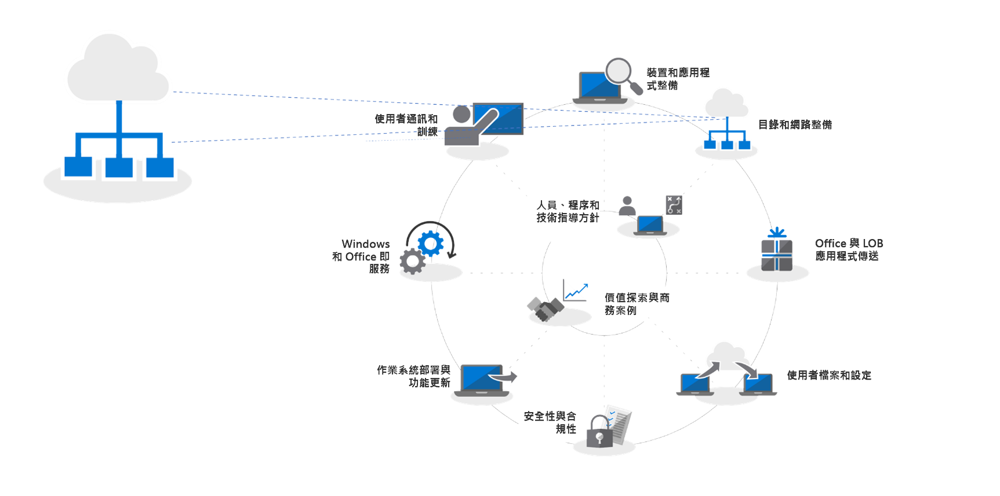
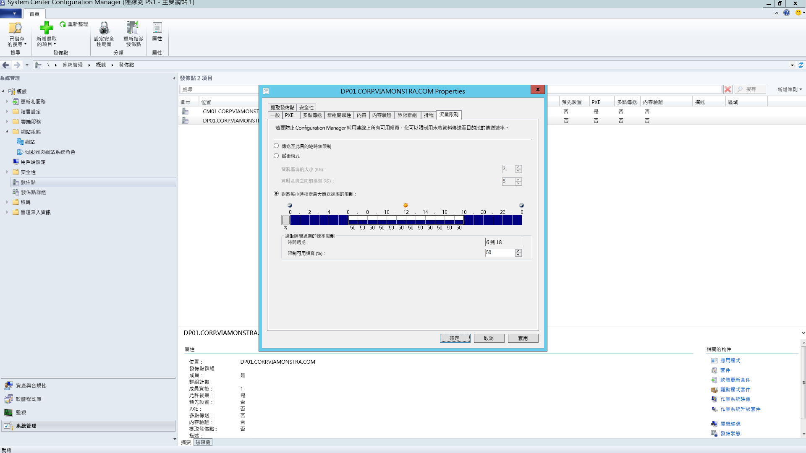
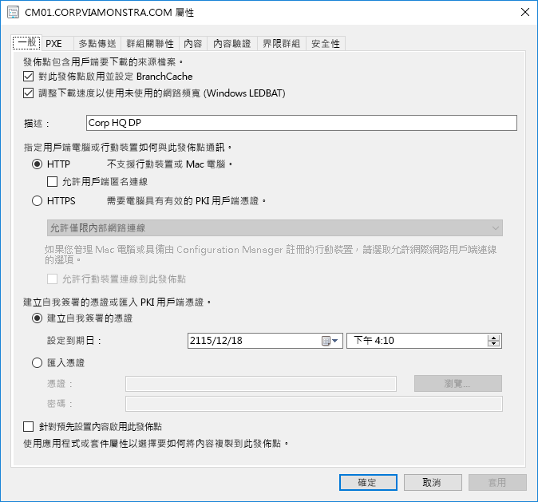
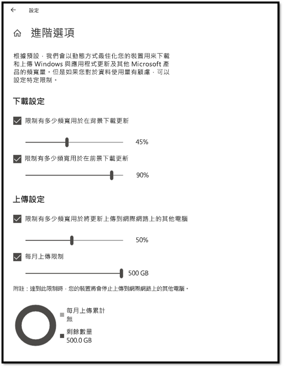
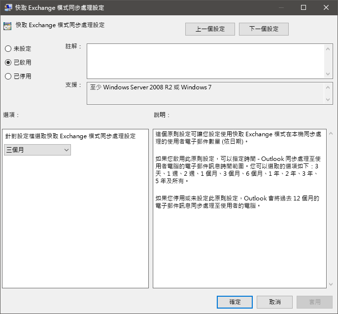
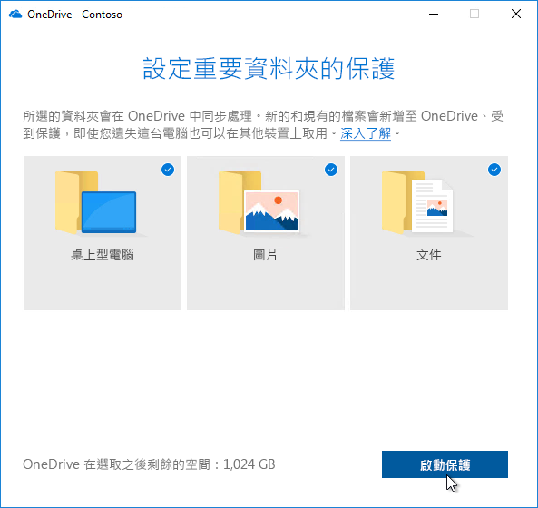

# 步驟 2：目錄和網路整備

確保您的目錄及網路已設定並準備好支援轉變至 Windows 10 及 Office 365 專業增強版。這項作業需要 Azure Active Directory 服務就位可供使用者使用，且您的網路必須具備容量可在電腦升級時處理其一般流量和可能的大量資料移動，且會還原使用者的檔案、設定和應用程式。

<table>
<thead>
<td></td>
<td>
<strong>步驟 2：目錄和網路整備</strong>

在 Office 365 專業增強版中的雲端連線服務及新的部署選項 (例如 Windows Autopilot) 需要 Azure Active Directory。將 Windows 映像、應用程式、驅動程式和相關檔案移到電腦時，您的網路和連線能力也是需規劃的重要區域。了解新的工具和部署選項如何減少並簡化網路流量。
</td>
<td></td>
</thead>
</table>

>[!NOTE]
>目錄和網路整備是我們所建議部署程序轉輪中的第二個步驟，主要著重於 Azure Active Directory 及網路最佳化。若要查看完整的桌面部署程序，請瀏覽[現代化電腦的部署中心](https://aka.ms/HowToShift) (英文)。
>

目錄和網路整備是確保順利部署作業系統和桌面的基礎。如同使用任何自動化部署，務必確保可以存取您的檔案共用，且您的網路必須能夠支援傳送大型檔案，可能傳送至一次數百或甚至數千部電腦。

在轉變為 Windows 10 及 Office 365 專業增強版時，您現在還需要確認已使用 Azure Active Directory 設定雲端身分識別。這不但是您啟動 Office 365 專業增強版的關鍵，也可讓您充分利用現代化佈建解決方案，例如 Windows Autopilot。

在本文中，我們將探索工具和選項，為您準備目錄服務，及使用者與裝置權限，準備好部署 Windows 10 及 Office 365 專業增強版。

## 新增 Azure Active Directory

如果貴組織已使用 Office 365、Exchange Online、Microsoft Intune 或其他 Microsoft 線上服務，好消息是，您已經在使用 Azure Active Directory。如果是，您只需要確認您目標桌面部署的使用者是在 Azure Active Directory 中，並已指派授權。

如果您目前沒有使用 Azure Active Directory，[許多資源](https://docs.microsoft.com/zh-TW/azure/active-directory/)可協助您設定。您也可能符合資格透過 Microsoft FastTrack 取得專人協助，這屬於 Office 365 授權的一部分。您可以在[這裡](https://fasttrack.microsoft.com) (英文) 查看更多有關 Microsoft Fastrack 的資訊。

一旦 Azure Active Directory 就位後，您的使用者可以登入並啟用其 Office 365 專業增強版應用程式，且您可以使用 Microsoft Intune 或 Windows Autopilot 部署，以自動化部署應用程式和原則。

## 網路整備

規劃部署時，您必須考慮頻寬需求。在部署中有三個主要元件將會影響網路 - 電腦影像；軟體更新；使用者個人化。在這些當中，這可能表示初始移轉時每部電腦超過 20 GB，以及通常每個月每部電腦 1 GB 或更多來保持最新版本。

首先，瀏覽這三個主要元件的需求：

### 電腦影像

下列圖表可協助您根據影像的大小進行規劃。對於沒有自訂的 Windows 映像，您應該規劃通常為每部電腦 3 GB，而對於包含應用程式的自訂影像，您能需要允許 6 GB 或更多。您可能也需要考慮驅動程式套件；這些可能是每部電腦幾百 MB，有時高達 1 GB。

### 軟體更新

您必須計劃軟體更新的網路頻寬。Windows 10 和 Office 365 專業增強版使用新的維護模型，提供每月及半年更新。如果您是第一次使用這個模式，可以在[這裡](https://docs.microsoft.com/zh-TW/windows/deployment/update/waas-overview) (英文) 深入了解如何進行此作業。

新維護模型包含每年兩次適用於 Windows 的功能更新、Office 半年通道更新，以及高品質的每月更新。功能更新的大小通常是 2 到 4 GB，而 Office 半年通道更新的每個更新為 300-400 MB。接著有每月高品質更新。這範圍可能會從數百 MB 至 1 GB 以上。這是因為每月更新是累計的，因此這些會隨著每個 Windows 10 版本的服務存留時間而變大。不過，有些工具可協助您減少必須透過網路傳遞來實作更新的資料量。以下我們將深入討論這個部分。

### 使用者個人化

第三個需考量的元件是使用者個人化。您在此必須規劃網路頻寬，以配合還原使用者檔案、其設定，以及其應用程式，作為電腦重新整理或取代程序的一部分。這些項目全部通常超過每部電腦 20 GB；對於某些使用者，這些可能會超過 100 GB。

## **限制頻寬**

限制網路上部署相關流量影響的其中一個方法是使用用戶端上的 BITS 設定 (背景智慧型傳輸服務) 進行節流。BITS 會使用適當的位元速率 (ABR) 來調整可供部署用途的頻寬；可在用戶端使用群組原則進行設定。

[關於 BITS](https://docs.microsoft.com/zh-TW/windows/desktop/bits/about-bits) (英文)

如果您使用 System Center Configuration Manager，也可以設定啟用 BITS 的發佈點，或啟用搭配 WDS 的多點傳送。

特定流量的節流表示正常的網路流量受電腦下載更新和應用程式的影響較小。但是分割出特定百分比的頻寬給這些工作可協助確保產能不會受 Windows 或 Office 部署的影響，且程序會視需要繼續執行，當使用者在部署執行時鎖定其電腦的情況下，可能會降低部署相關的中斷時間。

幸好，有些新工具可讓您更輕鬆地管理大規模電腦部署的網路影響，包括 LEDBAT 最佳化頻寬使用，以及將部署網路流量從網路中央移開並移出到周邊網路的對等 (P2P) 選項

## **清除頻寬**

Windows Server 2019 與 System Center Configuration Manager 1806 版支援的低額外延遲背景傳輸 (LEDBAT) 是針對最佳化 Windows 用戶端的網路流量所設計。

[Windows Server 2019 的前 10 大網路功能：\#9 LEDBAT – 延遲最佳化背景傳輸](https://blogs.technet.microsoft.com/networking/2018/07/25/ledbat/) (英文)

不像傳統節流，LEDBAT 可以使用所有可用的網路頻寬作為背景工作，當其他流量要求時立即傳送頻寬。不同於 BITS 沒有任何延遲；所有項目皆為自動化 – 不需要任何手動調整或排程，且所有項目都在伺服器端設定。這可以提供大量的效能提升。

## **對等選項**

越來越多對等選項用於 Windows 10 移轉中，針對電腦映像、軟體更新和使用者個人化。在首次部署 Windows 10 之後，它們對於促進組建對組建升級也很有用。我們在此將介紹幾個範例說明將 Windows 10 與 Office 相關流量移出網路中央、減少傳統節流方法的需求，以及允許電腦尋找其在本機網路同儕中所需的更新檔案，而不是從發佈點或網際網路進行下載。

**BranchCache** 可協助您在分散式環境中下載內容而不會使網路飽和。它有兩個選項：託管快取模式，這可讓您使用本機伺服器來快取內容，以及分散式快取模式 (System Center Configuration Manager 中支援的模式)，可讓用戶端與其他人員共用已下載的內容。

**對等快取**系統管理中心設定支援的用戶端也可以使用對等快取。這樣可以允許網路上可靠的可用電腦主控內容發佈的來源。您不需要在所有電腦上啟用這個 – 只需將目標設定可靠的網路連線作為主機 (例如桌上型電腦、迷你立式或塔台電腦)。對等快取甚至可適用於設定期間在 Windows PE 階段中執行的部署工作。

附註：BranchCache 和對等快取互補，而且可以在同一個環境中共同作業。

[BranchCache 與對等快取](https://blogs.technet.microsoft.com/swisspfe/2018/01/25/branch-cache-vs-peer-cache/) (英文)

**傳遞最佳化**傳遞最佳化是另一個對等快取技術，提供 Windows 部署的網路型控制項。Windows 10 傳遞最佳化以更新內建 UWP 應用程式，還能夠安裝來自 Microsoft Store 的應用程式，以及使用快速更新進行軟體更新。從舊版 Windows 10 就已提供，不過最近才與 System Center Configuration Manager 整合。自 Windows 10 1803 版起新的設定選項表示您現在可以個別設定頻寬限制以進行背景更新和前景工作，例如 Microsoft Store 中的應用程式更新。

**Office 365 專業增強版的額外考量**

以下三個項目將會因 Office 365 專業增強版部署而減少網路負載。

**二進位差異壓縮** 從最新版本的 Office 365 專業增強版更新至下一個版本時，Office 365 專業增強版會使用二進位差異壓縮來減少軟體更新所耗用的頻寬。透過只從兩個先前版本放入二進位層級變更，可將累積更新的每月成長影響降到最低。這有可能會每部電腦每個月儲存數百 MB 的資料。但若要使用這項功能，您無法略過版本。如果您這麼做，必須先下載完整的累積更新。

[下載 Office 365 的更新](https://docs.microsoft.com/zh-TW/deployoffice/overview-of-the-update-process-for-office-365-proplus#download-the-updates-for-office-365-proplus) (英文)

**Outlook 資料檔** Outlook 通常會設定為在本機快取使用者的整個信箱以供離線使用。在任何 Windows 部署中，除了就地升級，需要使用者的 Outlook 資料檔以在升級之後重建自行。這是自動化的程序，但 Outlook 通常會設定為最多 100 GB 的信箱限制，在本機上重新快取所有使用者的整個信箱表示大量的資料傳輸。若要減少網路負擔，可能需要考慮使用群組原則來減少「要離線保留的郵件」設定。在 Office 365 專業增強版或 Outlook 2016 的 Outlook 中預設值設為 12 個月。請考慮將離線快取設定為持續介於 1 到 6 個月。變更此設定不會影響線上信箱的大小，且在線上時仍可以透過 Outlook 搜尋整個信箱。

**隨需 OneDrive 檔案和已知資料夾移動** OneDrive 是從電腦和雲端中其他裝置同步處理及保護使用者檔案的絕佳方式。您可以強制執行從使用者的桌面、文件和圖片資料夾將檔案同步到 OneDrive，讓這些檔案在登入新的裝置或重新建立映像的電腦時可供使用。不過，請記住，由於保持桌面、文件和圖片位置中保留的真正檔案大小和數目，您需要展示您電腦上啟用及強制執行 OneDrive 的原則。其中一個選項是使用群組原則網路控制項來節流 OneDrive 同步處理服務所使用的頻寬。

[設定已知的資料夾移動](https://techcommunity.microsoft.com/t5/Microsoft-OneDrive-Blog/Migrate-Your-Files-to-OneDrive-Easily-with-Known-Folder-Move/ba-p/207076) (英文)

[隨需 OneDrive 檔案](https://www.microsoft.com/zh-TW/microsoft-365/blog/2017/05/11/introducing-onedrive-files-on-demand-and-additional-features-making-it-easier-to-access-and-share-files/) (英文)

如果您尚未推出 OneDrive，從 Windows 7 移轉到 Windows 10 是啟用 OneDrive 的絕佳機會，且完美整合 Office 365 專業增強版。在執行您的應用程式和裝置整備時，請考慮啟動此推出。這會在您開始移動 Windows 映像並透過網路部署應用程式之前，讓檔案同步處理搶先開始。

## 下一步 

## [步驟 3：Office 和 LOB 應用程式傳遞](https://aka.ms/mdd3)

## 上一步：

## [步驟 1：裝置和應用程式整備](https://aka.ms/mdd1) (英文)

## 意見反應

我們非常歡迎您的想法。請選擇您想要提供的類型：

產品的意見反應登入以提供文件意見反應

新的意見反應系統建置於 GitHub 問題。請在我們的部落格文章了解這項變更。
