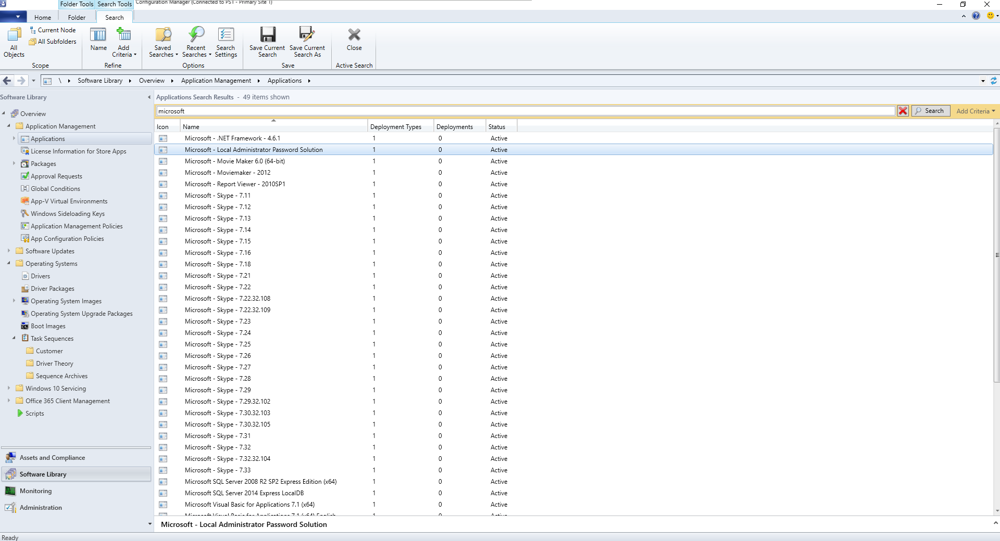
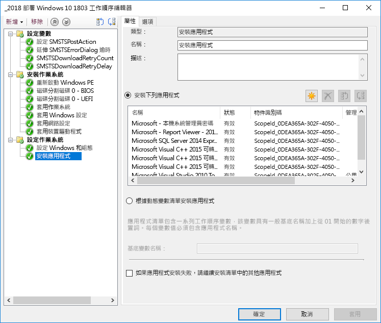
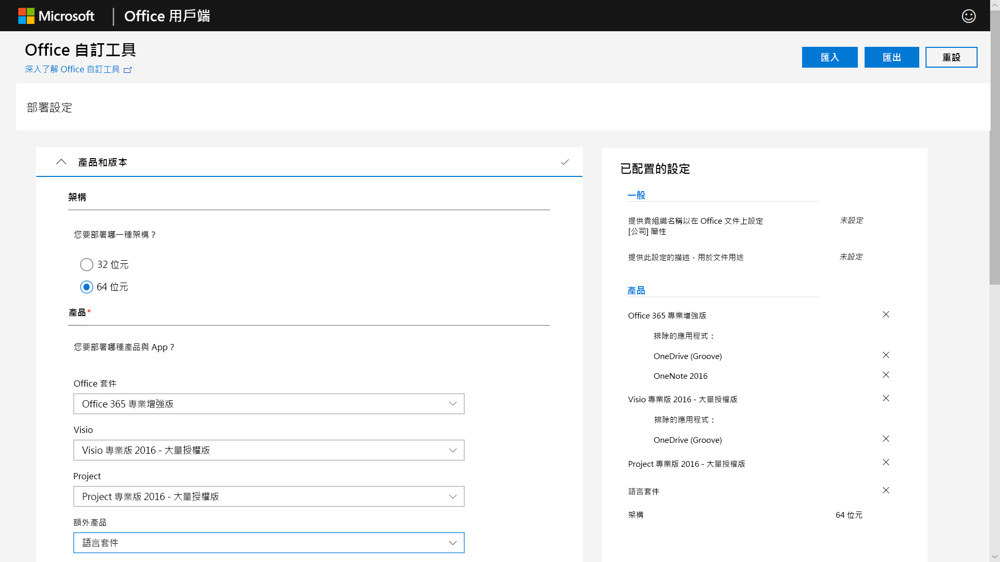
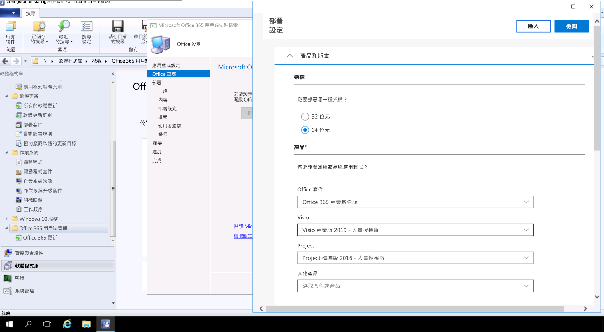

# 步驟 3：Office 和 LOB 應用程式傳遞

<table>
<thead>
<td></td>
<td>
<strong>步驟 3：Office 和 LOB 應用程式傳遞</strong>

請確定您的應用程式已封裝並且準備好進行自動化安裝。了解隨選即用封裝與 Microsoft 365 Apps 企業版如何提供您設定、傳遞及將 Office 應用程式保持在最新狀態的新選項。
</td>
<td></td>
</thead>
</table>

>[!NOTE]
>Office 和 LOB 應用程式傳遞是我們所建議部署程序轉輪中的第三個步驟，涵蓋安裝及管理 Office 及 LOB 的多個選項。 若要成功進行部署，請勿略過前兩個步驟。  若要查看完整的桌面部署程序，請瀏覽[桌面部署中心](https://aka.ms/HowToShift)。
>

現在您已準備好提供 Office 和企業營運應用程式。有許多方法可以使用，包括一些有趣的新選項。 雖然有些應用程式僅提供 32 位元或 64 位元的編譯版本，但其他應用程式 (例如 Microsoft 365 Apps 企業版) 同時提供 32 位元和 64 位元的原生編譯程式碼，而您將進行的最大決策就是要部署哪個版本。 若要利用新裝置上的其他計算能力和 RAM，Microsoft 建議使用沒有 32 位元相依性的 64 位元版本。 若要判定您可能遭遇的任何增益集或檔案相關相容性挑戰，建議先重新瀏覽「步驟 1 裝置和應用程式整備」，再繼續執行。

如果沒有任何問題，建議您將所有應用程式部署為 64 位元版本，包括 Microsoft Office。64 位元原生編譯應用程式可提供最佳效能，是承受未來考驗的最佳選擇。

在 Windows 上安裝應用程式有許多方法與模型，讓我們來看看您的傳遞選項。

[Windows 10 應用程式管理](https://docs.microsoft.com/windows/application-management/)

## MSI 型部署

針對企業營運應用程式，您可能使用 MSI 型套件或可執行檔，並將應用程式安裝為 OS 部署工作順序的一部分。 Windows 10 仍會繼續使用這些套件。

Microsoft Endpoint Configuration Manager 和 Microsoft Intune 等軟體部署工具也經過最佳化以提供 MSI 封裝的應用程式。在 Windows 10 上驗證應用程式之後，即可將 Microsoft Endpoint Configuration Manager (最新分支) 用於應用程式傳遞。如果使用 Microsoft Intune 的公司入口網站，您可以延伸選擇，將獲得 IT 批准組織可用的應用程式包含最新的應用程式，且使用者可自行選取所需項目。

## 電腦影像

另一個常見的應用程式傳遞方法是電腦映像處理。 在此情況下，應用程式會透過工作序列或手動方式安裝於樣本電腦，然後會擷取已預先安裝必要應用程式的系統映像。 在佈建新電腦時，建立及擷取映像的方式可節省時間，但請記得映像內的作業系統和應用程式很快就會過時。 Windows 10 和 Microsoft 365 Apps 企業版的累積更新模型可協助解決這個問題，但不會完全排除。 這也是我們為何建議精簡映像方式的原因，您的應用程式會在部署階段從映像外部進行安裝。

如果您想在映像中包含 Microsoft 365 Apps 企業版，請記住，這會使用使用者型啟用，而無法由系統管理員預先啟用。使用 Office 部署工具在您進行映像處理的裝置上預先安裝 Office，並跳過使用者登入。 部署映像後，使用者可以使用其認證登入並啟動 Microsoft 365 Apps 企業版。

[建立安裝作業系統的工作順序](https://docs.microsoft.com/mem/configmgr/osd/deploy-use/create-a-task-sequence-to-install-an-operating-system)

[將 Microsoft 365 應用程式當作作業系統映像的一部分來部署](https://docs.microsoft.com/deployoffice/deploy-microsoft-365-apps-operating-system-image)

## Office 隨選即用 

Microsoft 365 Apps 企業版使用隨選即用來安裝，隨選即用取代了 Windows 即將推出的 Office 2019 每個版本中的 MSI 型封裝。 它會帶來許多好處，包括更快速的安裝、更快且更有效率的更新以及更簡潔的解除安裝。 

透過「隨選即用」提供的程式會在您電腦上的虛擬應用程式環境中執行，因此會與其他應用程式共存而沒有衝突。如同 MSI 型套件，這些程式也會佔用大約一半的磁碟空間。 Office 應用程式是透過 [Office 部署工具](https://www.microsoft.com/download/details.aspx?id=49117)提供和管理，該工具是下載、設定及自訂 Office 應用程式所需的 Office 安裝程式引擎。 Office 部署工具會讀取 XML 組態檔，該檔案會提供有關如何設定及自訂 Office 安裝的中繼資料指示。

Microsoft 建議使用 [Office 自訂工具](https://config.office.com/)來自訂您的部署設定，以及建立您的 XML 組態檔。 您可以透過 Office 自訂工具，設定所要安裝的應用程式和語言、應用程式的更新方式、應用程式喜好設定，以及安裝體驗設定。

如果您使用 Configuration Manager，您仍然可以使用它來廣泛部署 Microsoft 365 Apps 企業版。Configuration Manager (最新分支) 擁有更新的 Office 自訂工具的原生支援，隨選即用在安裝時間的套件自訂，以及安裝後軟體更新管理的原生支援。

[Microsoft 365 應用程式部署指南](https://docs.microsoft.com/deployoffice/deployment-guide-microsoft-365-apps)

[升級至 Microsoft 365 應用程式時，移除現有的 Office MSI 版本](https://docs.microsoft.com/deployoffice/upgrade-from-msi-version)

[使用 Configuration Manager 管理 Microsoft 365 Apps 企業版](https://docs.microsoft.com/mem/configmgr/sum/deploy-use/manage-office-365-proplus-updates)

[使用 Microsoft Intune 將 Office 365 應用程式指派給 Windows 10 裝置](https://docs.microsoft.com/intune/apps-add-office365)

## 瀏覽器型應用程式

有幾個項目需考慮，以確認您的瀏覽器型應用程式可以繼續正常運作。如果您有特定的網站和應用程式與 Microsoft Edge 有相容性問題，您可以使用企業模式網站清單，以便使用 Internet Explorer 11 時網站會自動開啟。

此外，如果您知道您的內部網路網站使用 Microsoft Edge 無法正常運作，則可以設定所有內部網路網站自動使用 Internet Explorer 11 開啟。此程序會使用 XML 檔案來控制 IE11 是否用於每個網站，並使用群組原則來強制執行設定。

[什麼是企業模式](https://docs.microsoft.com/internet-explorer/ie11-deploy-guide/what-is-enterprise-mode#what-is-enterprise-mode)

到目前為止，我們探討了數種知名的部署方法。 但還有兩種應用程式部署的新方法您可能可以考慮。

## 商務用 Microsoft Store 

商務用 Microsoft Store 提供了彈性的方法，可大規模探索、取得、管理免費與付費應用程式，以及將其散發到 Windows 10 裝置。 身為 IT 系統管理員，您可以將所選的 Microsoft Store 應用程式，連同您的自訂應用程式發佈到自己的私人存放區，同時指派並視需要重複使用授權。 您的使用者只會被引導至這個存放區，所以只能尋找和安裝已核准的應用程式。

Microsoft Store 應用程式可原生內建為 UWP 應用程式，或者您可以使用 Desktop Bridge 為 Store 重新封裝現有的應用程式，並新增適用於 Windows 10 的新式體驗。除了您用來推出 Windows 10 體驗的程式碼，應用程式會維持不變，並繼續以完全信任使用者模式執行。

## MSIX 容器化

新的應用程式封裝選項為 MSIX。 MSIX 使用 Windows 提供的容器化技術，一起呈現隨選即用、UWP 和 MSI 封裝的最佳外觀。 使用工具，將現有安裝程式 (例如 EXE、MSI、APPV 和 APPX) 直接遷移至 MSIX，我們發現 MSIX 容器化為現今使用的許多安裝技術提供了統一路徑。 MSIX 支援已包含在目前的 Windows 版本中：任何執行 Windows 10 RS5 或更新版本的裝置均包含安裝及執行 MSIX 封裝應用程式所需的一切。 Windows 10 會動態整合它所收到的 MSIX 容器，同時將應用程式與作業系統分開。

容器化表示可以完全解除安裝和移除套件，與現在許多可能會在系統上留下項目的 MSI 和 EXE 型套件不同。這也表示您只需要標準使用者認證即可安裝應用程式，而不需要擁有系統管理員認證才能安裝 MSIX 容器。MSIX 容器的更新也更有效率。更新發行時，使用區塊層級差異表示只會套用新的二進位檔，減少更新承載，可耗用較少的網路頻寬更快速地進行部署。

您可以透過 [MSIX 技術社群網站](https://techcommunity.microsoft.com/t5/MSIX/ct-p/MSIX)找到更多 MSIX 相關資訊

## 下一步

## [步驟 4：使用者檔案和設定](https://aka.ms/mdd4) (英文)

## 上一步

## [步驟 2：目錄和網路整備](https://aka.ms/mdd2) 
